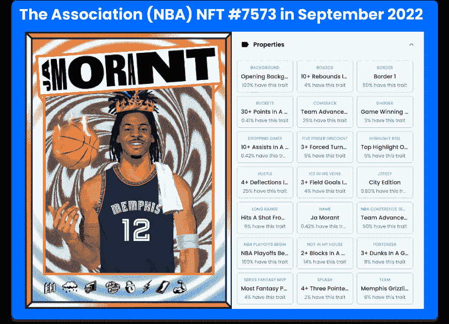
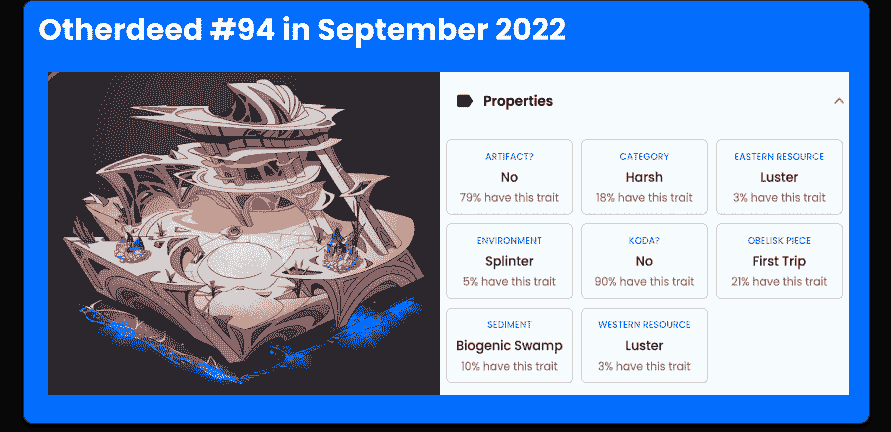
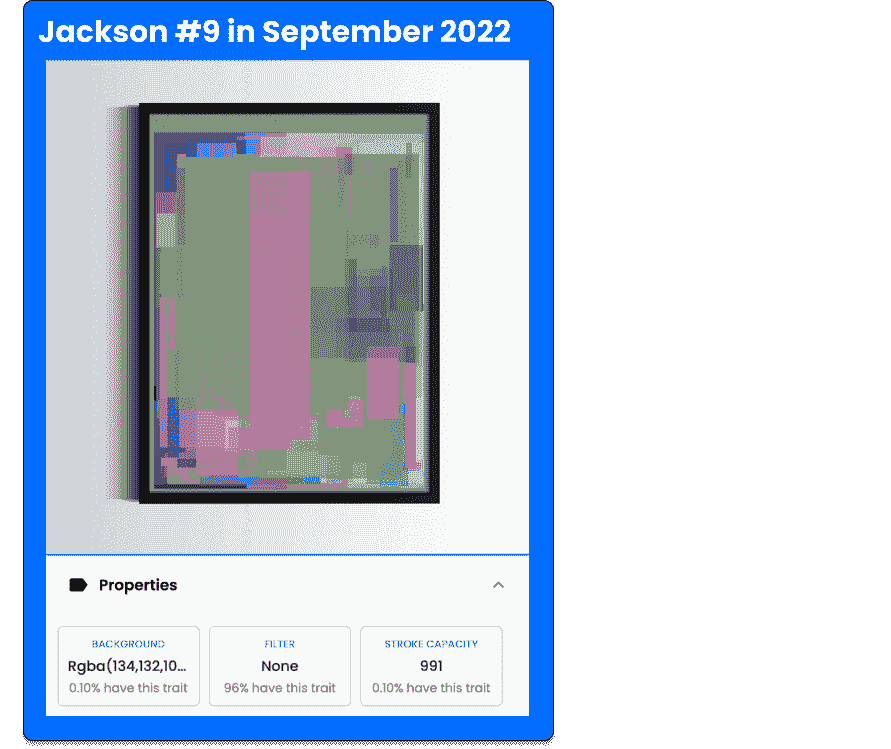

# 什么是动态 NFT，它如何随时间变化

> 原文：<https://web.archive.org/web/https://dappradar.com/blog/what-is-a-dynamic-nft>

## 我们与非功能性测试互动的方式在不断发展，非功能性测试也是如此

你可能听说过 NFTs 和名人在数字资产上的百万投资。但是您知道吗，NFT 不一定是静态的，也可以随着时间的推移而变化。迎接充满活力的 NFT，准备好迎接惊喜吧。在本文中，我们将引导您了解不可替代令牌的激动人心的世界，以及该行业的未来如何随着这些演进的令牌而改变。让我们开始吧！

## 目录

*   什么是动态 NFT 或 dNFT？
*   [动态 NFT 是如何工作的？](https://web.archive.org/web/20220930013748/https://dappradar.com/blog/what-is-a-dynamic-nft/#How-do-dynamic-NFTs-work?)
*   [最著名的动态 NFT 有哪些？](https://web.archive.org/web/20220930013748/https://dappradar.com/blog/what-is-a-dynamic-nft/#What-are-the-most-famous-dynamic-NFTs?)
*   哪里可以买到动感 NFT？
*   [购买 dNFTs 前的提示](https://web.archive.org/web/20220930013748/https://dappradar.com/blog/what-is-a-dynamic-nft/#Tips-before-buying-a-dynamic-NFT)
*   动态非功能性测试比静态非功能性测试更有价值吗？
*   动态 NFTs:NFT 空间的未来？
*   [我如何跟踪我的 NFT？](https://web.archive.org/web/20220930013748/https://dappradar.com/blog/what-is-a-dynamic-nft/#How-can-I-track-my-NFTs?)
*   [用 DappRadar 继续学习 NFTs】](https://web.archive.org/web/20220930013748/https://dappradar.com/blog/what-is-a-dynamic-nft/#Keep-learning-about-NFTs-with-DappRadar)

## 什么是动态 NFT，或 dNFT？

由于 NFT 空间不断变化，通常很难跟上最重要的趋势。然而，动态 NFTs 是你不应该错过了解的东西。

动态 NFT，顾名思义，是指一种根据触发其智能合约的特定环境而变化的 NFT。

他们也经常被称为*【活生生的 NFTs】*，可以因为一个特殊的事件或真实世界的发生而改变他们的特征，也可以看到他们的价值和需求的转移。

### 哪些动态 NFT 是*不是*

对于一个动态的 NFT，它不一定是一个移动的图片，如 GIF 或视频。当然，gif 和视频可以是 NFT，但它们也可以是静态的 NFT。

为了保持动态，NFT 需要从一点到另一点改变其状态。这种变化发生在 NFT 的元数据中，也可以通过其外观显示出来。

[<picture></picture>](https://web.archive.org/web/20220930013748/https://dappradar.com/blog/what-are-non-fungible-tokens-nfts)[<picture></picture>](https://web.archive.org/web/20220930013748/https://dappradar.com/nft/marketplaces)[<picture></picture>](https://web.archive.org/web/20220930013748/https://dappradar.com/nft/sales)

## 动态 NFTs 是如何工作的？

您可能知道，NFT 被称为[不可替代令牌](https://web.archive.org/web/20220930013748/https://dappradar.com/blog/what-are-non-fungible-tokens-nfts)，因为它们存储在一个区块链上，并且它们的历史不能被擦除。然而，这并不意味着它们的元数据必须是静态的。

从技术上来说，动态 NFT 实际上是半可替换的令牌——或 ERC-1155 令牌，不同于传统的静态 ERC-721 NFT。

根据官方以太坊网站的说法，它们拥有与改进的 ERC-20 和 ERC-721 令牌标准相同的功能。换句话说，两全其美。

一旦 dNFT 收到智能合约中的指令并对其进行确认，它将在令牌的元数据中显示预定的更改。

## 最著名的动态 NFT 有哪些？

动态 NFTs 可以在不同的 Web3 领域中以不同的方式应用。了解下面一些已经成为体育、游戏和艺术趋势的 dNFTs 的最佳例子。

### 体育领域的 dNFTs 协会

使用动态 NFT 的一个最实用的方法是将它们与现实世界中发生的事情联系起来，比如体育运动中发生的事情。体育 NFT 对行业来说并不新鲜，自 2021 年的 [NBA Top Shot](https://web.archive.org/web/20220930013748/https://dappradar.com/flow/collectibles/nba-topshot) 系列以来，它们一直受到社区的好评。

体育界的一些动态 NFT 集合正在根据 NFT 上代表的球员在比赛中的表现来改变他们的代币属性。

2022 年 4 月，NBA 推出了一系列基于以太坊的新动态 NFT，名为 [The Association](https://web.archive.org/web/20220930013748/https://dappradar.com/hub/nft-explorer/collection/the-association-nft-nba) 。

[<picture></picture>](https://web.archive.org/web/20220930013748/https://dappradar.com/hub/nft-explorer/collection/the-association-nft-nba)

> ***“推出一周后，该协会产生了超过 1300 万美元的交易量，是交易量第 14 大的收藏。(……)这些数字与发布后同时期的 NBA Top Shot 相比要高得多。作为参考，NBA Top Shot 用了 4 个月的时间达到 100 万美元的销售额，用了 6 个月的时间超过 1300 万美元。***
> 
> [Boris Rebo at DappRadar Report](https://web.archive.org/web/20220930013748/https://dappradar.com/blog/new-dapps-report-the-association-following-in-the-footsteps-of-nba-top-shot)

这些 dNFTs 根据球员和球队在球场上的表现而改变外观(和价值)。虽然 NBA 以前的收藏将 NFT 的讨论带到了世界各地的电视节目和晚宴上，但该协会仍有更多要征服的——也许还有更多要添加到社区中。

### 游戏中的 dNFTs:其他契约和 NFT

使用 NFTs 的另一种流行方式是在元宇宙虚拟世界和区块链游戏中，比如《彼岸元宇宙》。

被无聊猿游艇俱乐部 NFT 收藏的创造者理想化，这个虚拟世界包含 100，000 个被称为 T2 其他事迹的陆地 NFT。你猜对了，它们是动态 NFT。

[<picture></picture>](https://web.archive.org/web/20220930013748/https://dappradar.com/hub/nft-explorer/collection/otherdeed-for-otherside)

这意味着，一旦你拥有这块土地并在上面玩耍，你就可以在智能契约中改变它的特性。

你在游戏中开发的土地越多，你的其他行为就变得越有价值——这是动态 NFT 应用到游戏中的一个美丽例子。

### 艺术 dNFTs: JacksonNFT

非常受欢迎，但在那之前有点停滞不前，艺术 NFTs 也开始用这种创新技术开发项目。 [JacksonNFT 系列](https://web.archive.org/web/20220930013748/https://dappradar.com/hub/nft-explorer/collection/jackson-on-chain-nft)就是这种情况。

[<picture></picture>](https://web.archive.org/web/20220930013748/https://dappradar.com/hub/nft-explorer/collection/jackson-on-chain-nft)

> JacksonNFT 是独一无二的，因为每当有人铸造一个新的，他们就给所有其他的添加一个新的笔触。当所有 1000 枚代币铸造完成时，它将代表一件真正的合作艺术品。“
> 
> [Lawrence Rogers, the artist behind JacksonNFT](https://web.archive.org/web/20220930013748/https://dappradar.com/blog/jacksonnft-creator-on-generative-art-and-dynamic-collaboration)

该系列在 2022 年 7 月推出后几分钟内就销售一空，可能会成为引领动态和生成性 NFTs 潮流的首批产品之一。

## 哪里可以买到动感 NFT？

就像常规的静态 NFT 一样，你可以在[市场](https://web.archive.org/web/20220930013748/https://dappradar.com/nft/marketplaces)购买动态 NFT，比如 [OpenSea](https://web.archive.org/web/20220930013748/https://dappradar.com/blog/what-is-opensea-and-how-to-use-it-the-beginners-guide) ，或者在项目的官方网站上购买。

这个过程与购买静态 NFT 完全一样。例如，你可以在拍卖中出价，并支付一定数量的加密货币。确认购买后，您将能够在您的钱包中找到新款 NFT。

您可以使用 [DappRadar NFT 浏览器](https://web.archive.org/web/20220930013748/https://dappradar.com/hub/nft-explorer)来检查您的特定 dNFT 的任何更改，只要它在以太坊区块链上。

## 购买动态 NFT 前的提示

虽然 NFT 项目可能看起来都令人兴奋，你迫不及待地想成为这一运动的一部分，但在购买任何 NFT 之前，有几件事你应该做。以下是购买动态 NFT 前的一些提示:

*   使用[达普拉达 NFT 工具](https://web.archive.org/web/20220930013748/https://dappradar.com/nft)自行研究项目；
*   看看他们的官网，Twitter，和 Discord
*   看看 NFT 如何随时间变化，是否值得等待变化；
*   阅读我们的文章[识破 NFT 骗局的六种方法](https://web.archive.org/web/20220930013748/https://dappradar.com/blog/how-to-spot-an-nft-scam)。

## 动态 NFT 比静态 NFT 更有价值吗？

这取决于非理性因素。NFT 的价值随着 NFT 市场的公众兴趣、项目的声誉、背后的艺术家和团队等等而变化。

然而，对于动态 NFTs，还增加了一个额外的因素，那就是改变自身的能力——这可能是好的，也可能是坏的，取决于人们如何看待这种改变。

例如，如果一个体育 dNFT 变得更有价值，因为这个球员在这个赛季表现很好，那太好了！但是如果你的 dNFT 上表现的玩家不突出，你的资产可能价值停滞。

在与游戏相关的动态 NFT 上，如果对社区更有吸引力，您还可以看到您的代币价值增加。

只有时间才能证明动态非功能性交易是否比静态非功能性交易更有价值。

## 动态 NFTs:NFT 空间的未来？

NFT 空间相当年轻，仍有很大的获胜空间。正如你可以在最新的 DappRadar 行业报告中读到的那样，NFT dapps 是 2022 年这个神秘的冬天中表现最好的一些公司。

> ***随着 NFT 的发展和用例的出现，在 2021 年主导市场的猜测中，NFT 将在下一轮牛市中发挥重要作用，这是毫无疑问的。***
> 
> [Sara Gherghellas, Blockchain Analyst at DappRadar](https://web.archive.org/web/20220930013748/https://dappradar.com/blog/dappradar-blockchain-industry-report-august-2022)

虽然 Web3 的一些最大的品牌正在押注于动态 NFT 的集合，但我们看到了行业趋势的自信转变——这当然值得密切关注。

*   **您可能也喜欢阅读:** [什么是蓝筹股 NFT 集合&如何找到它们](https://web.archive.org/web/20220930013748/https://dappradar.com/blog/what-are-blue-chip-nft-collections)

## 我如何跟踪我的 NFT？

既然你已经意识到动态 NFTs 和这个领域是如何发展的，你也应该密切关注你自己的投资。

您可以使用 [DappRadar 投资组合跟踪器](https://web.archive.org/web/20220930013748/https://dappradar.com/hub/wallet/eth/)来监督和管理您的 NFT 投资组合——它们如何随着时间的推移而增值或贬值，甚至它们在自己的收藏中的优势。

如果你还在寻找一个项目，dappar Dar NFT 收藏探索者会给你的研究带来新的曙光。观看下面的视频，直观地探索该工具及其提供的所有功能。

[https://web.archive.org/web/20220930013748if_/https://www.youtube.com/embed/fkEaXYLOW-s?feature=oembed](https://web.archive.org/web/20220930013748if_/https://www.youtube.com/embed/fkEaXYLOW-s?feature=oembed)

别忘了，为了快速、客观地了解 NFT 市场的最新情况，请访问 [DappRadar NFT 概览](https://web.archive.org/web/20220930013748/https://dappradar.com/nft)。在那里，你会找到顶级 NFT 收藏品的排名，最昂贵的 NFT 销售和市场。

也就是说，你可以分析新的和成功的 NFT。

## 用 DappRadar 继续学习 NFTs

虽然大多数 NFT 收藏仍然是由静态的非功能表组成，但这种情况在未来可能会改变。

我们在 DappRadar 的团队不断在 NFTs、Web3 和元宇宙上发布有价值的内容。如果你想成为这个领域的一部分，那么你一定要[看看我们的博客](https://web.archive.org/web/20220930013748/https://dappradar.com/blog/)来继续你的学习之路。

请务必订阅我们的时事通讯，并在 [Twitter](https://web.archive.org/web/20220930013748/https://twitter.com/DappRadar) 上关注 DappRadar，成为第一个获得最新新闻和教程的人。在 [Discord](https://web.archive.org/web/20220930013748/https://discord.com/invite/4ybbssrHkm) 上加入我们的社区，参与我们的讨论。

***以上不构成投资建议。此处给出的信息仅供参考。请尽职调查并自行研究。***

 NewsletterUnsubscribe at any time. [T&Cs](https://web.archive.org/web/20220930013748/https://dappradar.com/terms) and [Privacy Policy](https://web.archive.org/web/20220930013748/https://dappradar.com/privacy-policy)