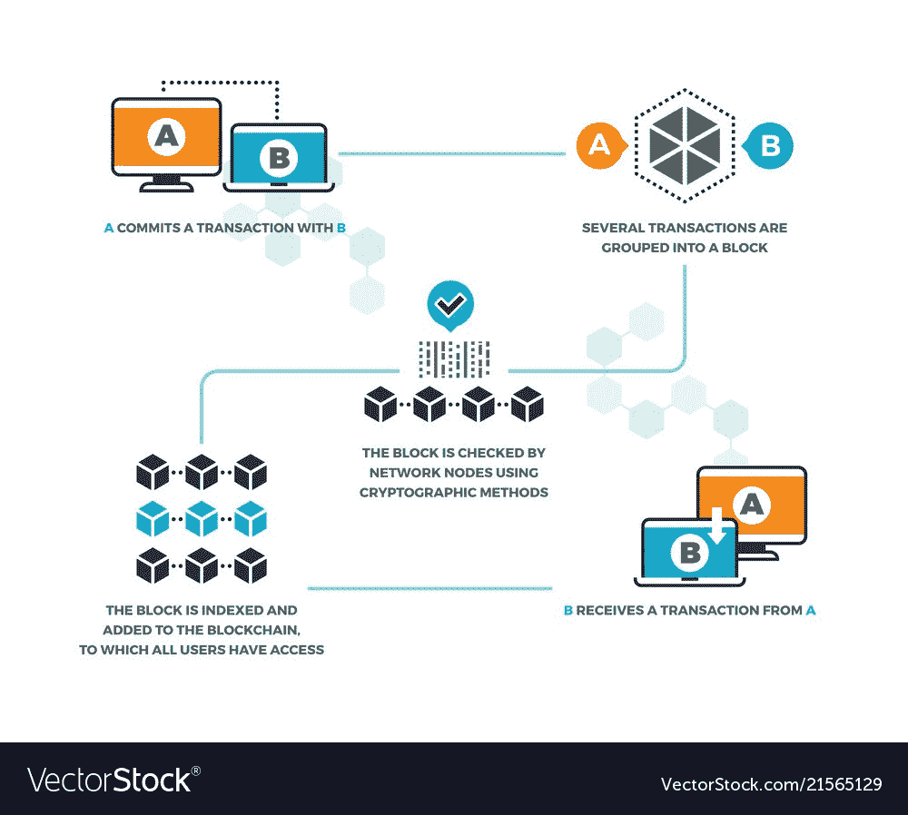
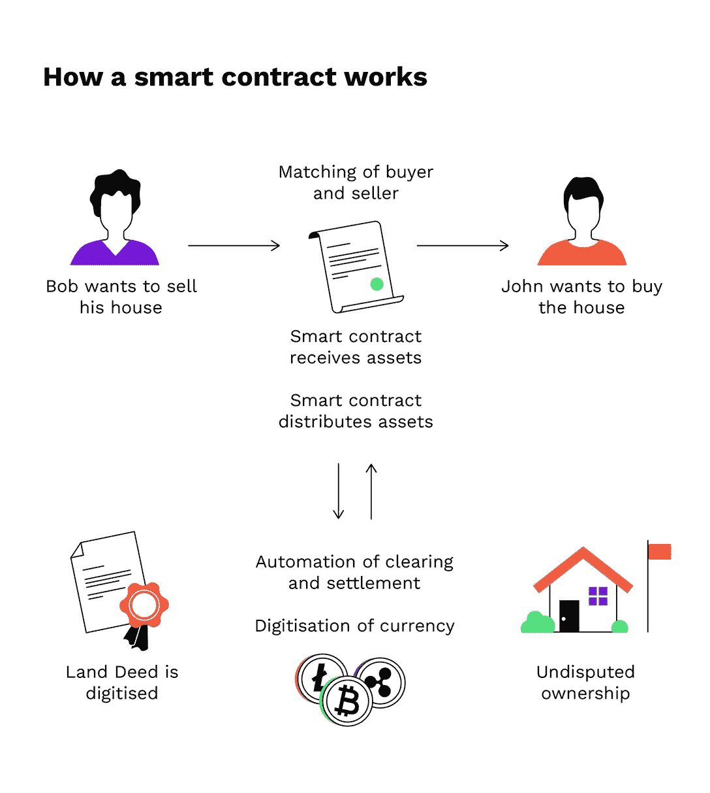

# 什么是智能合同？初学者指南

> 原文：<https://web.archive.org/web/https://dappradar.com/blog/what-is-a-smart-contract>

## 了解有关 dapp 生态系统构建模块的更多信息

如果你是去中心化应用和区块链空间的新手，你一定听过很多次“智能合同”这个词。但是什么是智能合同呢？在这本初学者指南中，我们将用通俗易懂的语言解释你需要知道的关于智能合约的一切。所以，让我们开始吧！

## 什么是智能合同？

智能合同是一种存储在[区块链](https://web.archive.org/web/20220819015023/https://dappradar.com/blog/what-is-a-blockchain-dappradars-ultimate-guide)上的数字合同，或者换句话说，是一种旨在以数字方式促进、验证或执行合同谈判或履行的计算机协议。

这意味着它允许没有第三方的可信交易。

这是智能合约的教科书定义，从根本上解释了它们存在的方式和原因。让我们更深入地了解这项技术，它有可能在未来几年让律师失业。

### 理解区块链的重要性

为了理解智能合约，我们必须首先理解它们背后的技术。

区块链是一种分散的分布式分类账，用于记录跨多台计算机的交易，因此，如果不更改所有后续块，记录就不能被追溯更改。这实质上意味着这是一种安全透明的记录数据的方式，不会受到操纵或篡改。

区块链技术的出现最令人兴奋的事情之一就是它是一个分散的系统，存在于所有被许可的各方之间。没有必要付钱给中间人来进行简单的操作。

诚然，[区块链](https://web.archive.org/web/20220819015023/https://dappradar.com/rankings)有他们的问题，但不可否认，它们比传统系统更快、更便宜、更安全，这就是[银行和政府越来越多地转向它们的原因。](https://web.archive.org/web/20220819015023/https://www.coindesk.com/inside-chinas-plan-to-power-global-blockchain-adoption)

### 维塔利克有什么要说的？

对于那些不熟悉的人来说，Vitalik Buterin 是以太坊项目的创始人和领导者。智能合约首次成为现实的区块链，也是绝大多数 dapp 活动发生的地方。

Vitalik Buterin **在 DC 区块链峰会上解释智能合约**时说；

***“在智能合约方法中，资产或货币被转移到程序中，程序运行该代码。在某些情况下，它会自动验证一个条件，并自动确定资产是应该归一个人所有还是归另一个人所有，或者是应该立即退还给发送资产的人，还是两者兼而有之。”***

同时，去中心化的分类帐也存储和复制文档，这赋予了它一定的安全性和不变性。

好吧，维塔利克，那是什么意思？

## 智能合约是如何工作的？现实世界的例子

假设你租房子。该操作可以通过区块链以加密货币如比特币或以太坊支付来执行。

你会得到一张虚拟合同中的收据；然后，卖家会给你一个数字输入密钥，你需要在指定的日期之前收到它。

如果钥匙没有按时送到，区块链将会退款。如果卖家在租赁日期之前发送了密钥，则该功能保持不变，当日期到来时，费用和密钥将分别发放给你和卖家。

该系统基于“如果-那么”的前提，由数百人观察，所以你可以期待一个完美的交付。如果我给你钥匙，我肯定会得到报酬。如果你在以太坊发送了一定的金额，你就会收到密钥。

在该时间之后，该文档被自动取消，并且由于所有参与者被同时警告，所以任何一方都不能在另一方不知道的情况下干扰该代码。

您可以将智能合约用于各种情况，从金融衍生品到保险费、违约、财产法、信用执行、金融服务、法律程序和众筹协议。

## 智能合同的 7 大优势

智能合约为用户提供了许多优势，并促进了权力转移，使用户不再依赖“可信”的中间人，从而避免了与使用它们相关的费用。以下是一些明显的优势:

### 1.速度

手动处理文档非常耗时。智能合同使用代码来自动执行任务，可以在各种各样的日常业务流程中节省时间。

### 2.储蓄

智能合同可以为您省钱，因为它们消除了对中介的需求。例如，你必须付钱给公证人来见证你的交易。或者付钱给律师准备房子或汽车的销售文件。

### 3.信任

你的文件在共享账本上加密了。有人不可能说他们丢了。

### 4.自治

你是达成协议的人。没有必要依赖经纪人、律师或其他中介来确认。此外，这也消除了任何被第三方操纵的危险。因为执行是由网络自动管理的，而不是由一个或多个可能有偏见的个人管理的。

### 5.支持

想象一下，如果你的银行失去了你的储蓄账户。在区块链上，您的文档会被多次复制，并且可以轻松恢复。

### 6.安全

密码术是一种用于网站加密的复杂而可靠的安全形式。简而言之，它可以保证你的文件安全。

### 7.准确(性)

自动化合同不仅更快更便宜，而且避免了手动填写大量表格带来的错误。

[<picture></picture>](https://web.archive.org/web/20220819015023/https://dappradar.com/rankings)[<picture></picture>](https://web.archive.org/web/20220819015023/https://dappradar.com/hub/wallet)[<picture></picture>](https://web.archive.org/web/20220819015023/https://dappradar.com/hub/swap)

## 智能合同是如何使用的？

对于任何新技术来说，实现日常流程的采用和集成都是非常重要的。一些行业已经迅速利用了智能合同带来的好处。让我们来看看几个领先的主要行业。

### 不动产

使用智能合约的主要好处之一是消除了中间商，这意味着你可以保留更多的钱。

通常情况下，如果你想把你的房子租给别人，你需要支付中间人，如房地产经纪人或广告网站。最重要的是，为了奢侈地知道租房者正在付款，房东需要付钱给某人来确认交易是否发生。这些被称为管理费。

分类账降低了你的成本。你所要做的就是通过加密货币支付，并在账本上对你的合同进行编码。每个人都看到了，你就完成了自动履行。经纪人、房地产经纪人、放债人以及任何与房地产业相关的人都可以获利。

### 健康

个人健康记录可以用私钥进行编码并保存在区块链上，该私钥只允许特定的个人访问。

例如，手术收据可以存储在区块链上，并自动发送给保险提供商作为交货证明。

数字账本可以用于更一般的医疗保健管理，例如监督药物、测试结果和管理医疗保健用品。

有趣的是，一旦网络连接得足够好，印度北部一个村庄的医生就有可能从你在纽约的私人医生那里获取你的个人病史文件。不再有医疗卡，不再有困惑。高效的医疗保障。

### 音乐产业

音乐行业和周围的创意服务长期以来一直在努力准确和公平地分配通过联合创意项目积累的财富。许多乐队因围绕金钱和权利的纠纷而解散。

使用智能合同，艺术家可以确保他们提前制定出他们的工作条款，并确保支付，因为这个过程将是自主和自动的。

此外，智能合同可以使购买和使用许可和版权保护的声音更加容易，因为可以存在一个中央数据库，允许用户简单地找到他们想要的样本或声音，并直接向艺术家支付使用费。

### 供应链管理

供应链往往因依赖纸质系统而变慢，在纸质系统中，实际的书面文件必须经过许多人的批准。这增加了损失、欺诈和不准确的风险，导致库存损失。

区块链通过向供应链上的所有各方提供安全、可访问的数字版本，并自动化任务和支付，消除了这一点。

另一个进步是产品的可追溯性。智能合同是不可篡改的，因此目的地和起点位置将保持真实。简单来说，一份聪明的合同可以确保声称来自巴西有机农场的牛排确实是这样的。

这是一个迅速采用该技术的领域，因为整体效率优势显而易见。

## 智能合约的缺点

智能合约远非完美，重要的是要注意，在其存在的这个阶段，区块链上执行的许多操作都可以被视为 Beta 测试。

主要的问题出现在代码上。如果虫子进来了怎么办？政府和金融机构如何对这些合同进行监管和征税？

回想一下之前关于买房的例子。如果卖家发送了错误的代码，或者，正如律师比尔·马里诺指出的那样，正确的代码被发送了，但房子在租赁日期到来之前被宣告无效，会发生什么？

如果这是传统的合同，我可以在法庭上废除它，但区块链是一个不同的情况。合同仍然有效。

智能合约大规模采用之前的挑战清单仍然很长，但有无数早期采用者和开发者正在努力创造全球合约运营的未来。

## 跟着 DappRadar 继续学习

获得高质量的信息对于在这个令人兴奋的去中心化的世界中寻找机会至关重要。现在你知道什么是智能合同了，你可以更有信心地继续在 [DappRadar](https://web.archive.org/web/20220819015023/https://dappradar.com/) 探索最好的分散化应用。

[https://web.archive.org/web/20220819015023if_/https://www.youtube.com/embed/HSVvtpxWNWs?feature=oembed](https://web.archive.org/web/20220819015023if_/https://www.youtube.com/embed/HSVvtpxWNWs?feature=oembed)

如果你想获得最新的新闻和了解更多关于 Web3 的信息，请关注 DappRadar [博客](https://web.archive.org/web/20220819015023/https://dappradar.com/blog/)、[推特](https://web.archive.org/web/20220819015023/https://twitter.com/dappradar)账号和 [YouTube](https://web.archive.org/web/20220819015023/https://www.youtube.com/c/DappRadar) 频道。

 NewsletterUnsubscribe at any time. [T&Cs](https://web.archive.org/web/20220819015023/https://dappradar.com/terms) and [Privacy Policy](https://web.archive.org/web/20220819015023/https://dappradar.com/privacy-policy)