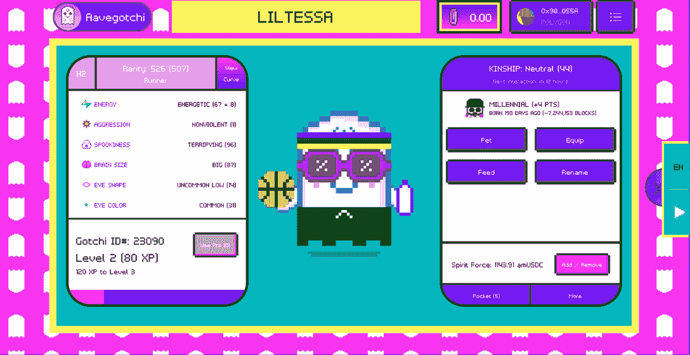
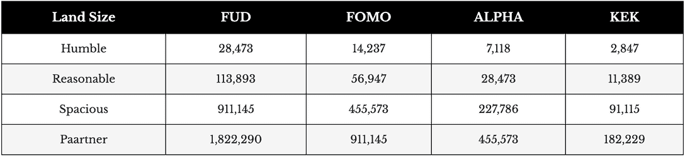
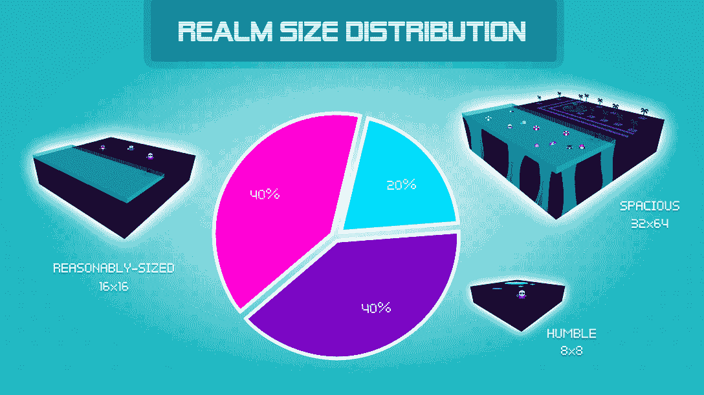

# 什么是 Aavegotchi？

> 原文：<https://web.archive.org/web/https://dappradar.com/blog/what-is-aavegotchi>

## 幽灵般的 NFT 有他们自己的虚拟世界，提供大量的奖励

**Aavegotchi 经常坐在** [**DappRadar 的 Polgyon 游戏排名**](https://web.archive.org/web/20220811231405/https://dappradar.com/rankings/protocol/polygon/category/games) **页面的顶部，有两个很好的理由:它非常有趣，非常容易上瘾。最初的 NFT 和 GameFi 项目已经发展成为一个完整的数字生态系统。但是了解这个游戏是一回事。现在你可以找到什么是 Aavegotchi，以及你需要什么来开始。**

**内容**

*   ***[什么是 Aavegtochi？](https://web.archive.org/web/20220811231405/https://dappradar.com/blog/what-is-aavegotchi/#what-is)***
*   ***[Aavegotchi 建在什么区块链上？](https://web.archive.org/web/20220811231405/https://dappradar.com/blog/what-is-aavegotchi/#what-blockchain)***
*   ***[Aavegotchi 怎么玩？](https://web.archive.org/web/20220811231405/https://dappradar.com/blog/what-is-aavegotchi/#how-play)***
*   ***[什么是 Aavegotchi？](https://web.archive.org/web/20220811231405/https://dappradar.com/blog/what-is-aavegotchi/#what-gotchi)***
*   ***[有没有游戏内代币？](https://web.archive.org/web/20220811231405/https://dappradar.com/blog/what-is-aavegotchi/#game-tokens)***
*   ***[什么是 Gotchiverse？](https://web.archive.org/web/20220811231405/https://dappradar.com/blog/what-is-aavegotchi/#what-verse)***
*   ***[什么是境界包裹？](https://web.archive.org/web/20220811231405/https://dappradar.com/blog/what-is-aavegotchi/#what-realm)***
*   ***[有没有可以买到境界的集市？](https://web.archive.org/web/20220811231405/https://dappradar.com/blog/what-is-aavegotchi/#marketplace-realm)***
*   ***[Aavegotchi 是个好投资吗？](https://web.archive.org/web/20220811231405/https://dappradar.com/blog/what-is-aavegotchi/#good-investment)***
*   ***[可以把 GHST 换成法币吗？](https://web.archive.org/web/20220811231405/https://dappradar.com/blog/what-is-aavegotchi/#swap-fiat)***
*   ***[有用链接](https://web.archive.org/web/20220811231405/https://dappradar.com/blog/what-is-aavegotchi/#useful-links)***

像大多数 web3 平台一样，Aavegotchi 受到了 2022 年低迷的影响。尽管如此，每个月仍有成千上万的用户在玩这款游戏。交易者继续每周购买价值数十万美元的 GHST 代币和游戏内资产。

今天加入可能是[参与的最佳时机](https://web.archive.org/web/20220811231405/https://dappradar.com/blog/how-to-buy-the-dip)。但是在你开始花钱之前，知道你在做什么是很重要的。

## 什么是 Aavegotchi？

Aavegotchi 是 NFT 的一个收藏项目，已经发展到包含分散融资(DeFi)、资产赌注、土地所有权和区块链博彩的元素。新加坡游戏开发公司 Pixelcraft Studios 于 2020 年 9 月推出了 Aavegotchi。

最初作为 GameFi NFT 项目引入，Aavegotchi 已经发展成为一个完整的生态系统，用户可以在这里玩游戏，赚取奖励，并使用他们的土地。

Pixelcraft 工作室在 2022 年 3 月推出了一个租赁项目,并在其路线图中计划推出一个移动原生应用。

“Aave”来自芬兰语单词“ghost”,“got chi”来自 20 世纪 90 年代流行的电子宠物电子鸡。

## Aavegotchi 建立在什么样的区块链之上？

Aavegotchi 最初是建立在以太坊区块链。这意味着像素化鬼 NFT 符合 ERC-721 标准。

2021 年末，Pixelcraft 工作室将其业务转移到多边形网络。这意味着它仍然与以太坊虚拟机(EVM)兼容，交易仍然在第 1 层以太坊网络上结算。

另一方面，日常的“商业”活动都是在 Polygon 上进行的。这个网络比以太坊目前的形式更快、更便宜、更可持续。Aavegotchi 迁移到 Polygon 使得它的用户体验好了很多。

Polygon 是建立在以太坊上的第二层网络，用户可以轻松地将他们的资产从一个网络转移到另一个网络。

## Aavegotchi 怎么玩？

Aavegotchi 游戏包含一个名为 Gotchiverse 的 2D 地图。玩家可以在这个空间移动，寻找隐藏的奖励。

还有一个战斗模式，玩家可以在 Aarena 中一决雌雄。只有拥有足够灵力的用户才能互相战斗。随着游戏走向未来，有计划引入更多的游戏功能。

到目前为止，这就是 Pixelcraft 引入 Aavegotchi 虚拟世界的所有游戏功能。

## 什么是 Aavegotchi？

Aavegotchis 是整个生态系统中的主要角色。它们是玩家进入游戏的入场券，是每个人参与生态系统的媒介。没有 Aavegotchi，你仍然可以在 Gotchiverse 中玩，要么作为一个访问者，要么使用一个租来的虚拟角色。但是某些活动，比如稀有农场，需要用户持有自己的 Aavegotchi。

也被称为 Gotchis，这些 NFT 是幽灵般的生物，需要持续的照顾。每 12 个小时“抚摸”你的 Gotchi 会增加你和鬼魂的亲密度。这就提高了你的炼金术通灵水平，也就是玩家每天都能得到 Gotchus 炼金术的津贴。

给你的 Aavegotchi 装备可以增加它的稀有性，从而增加你在稀有农业事件中的机会。

The main screen where you control your Aavegotchi

通过他们的 Gotchi，玩家可以在地图上旅行并收集奖励。这被称为 [Playdrop](https://web.archive.org/web/20220811231405/https://dappradar.com/blog/aavegotchi-rewards-real-fans-by-replacing-airdrops-with-playdrops) ，是 Pixelcraft 工作室用来让玩家参与平台的一种策略。

## 有游戏内代币吗？

有许多与 Aavegotchi 相关的标记。用户可以直接将 GHST 兑换成法定货币。对于其他货币，持有者需要先将它们兑换成 GHST，然后才能将它们变成现实世界的现金:

### 幽灵

GHST 是游戏中的主要货币。玩家需要 GHST 来购买 Gotchiverse 里面的任何东西。无论是门户网站、可穿戴设备、消耗品还是收藏品，你都需要这个令牌来完成。

你也可以用你的 GHST 来赚取收益，然后用它来投票。

### 弗勒斯

当赌注者锁定他们的 GHST 代币时，他们获得每日弗伦斯币。用户可以用 FRENS 代币购买彩票。

### FUD

总共供应 1000 亿 FOMO 币。作为最流行的代币，FUD 也是最不值钱的。这么说，确实有些价值。

它可以用来购买游戏中的资产。并且它可以与其他令牌相结合来创建有用的项目。

### FOMO

总共供应 500 亿 FOMO 币。FOMO 是 Aavegotchi 中第二常见的令牌。与其他 Gotchiverse 元素一样，用户可以花费 FOMO 来创建建筑物。

### 希腊字母的第一个字母

总共有 250 亿个阿尔法代币。玩家需要花费比 FOMO 和 FUD 更少的阿尔法来建造建筑。

### KEK

总共有 10，000，000，000 枚 KEK 代币，这使得它成为最稀有的 Gotchiverse 元素。

FOMO、KEK、阿尔法和 FUD 合在一起被称为 [Gotchus Alchemica](https://web.archive.org/web/20220811231405/https://wiki.aavegotchi.com/en/gotchus-alchemica) ，是构成 Gotchiverse 的四种元素。持有这些代币的人可以将它们组合在一起制作装置和艺术品，如瓷砖。

用户也可以使用四个 Gotchus 炼金术士令牌中的一个来购买 Gotchiverse 内的土地。以下是您购买一些数字财产所需的每件物品的数量。

Different purchase prices for land in Aavegotchi

Pixelcraft 工作室开发了一个支撑 Aavegotchi 货币的 tokenomics 指南。

## 什么是 Gotchiverse？

Gotchiverse 是一个生态系统，所有的 Aavegotchi 行为都发生在其中。Gotchiverse 由三个主要领域组成，它们是:

### 城堡

这是哥特人在哥特里的家园。一个特殊的力场环绕着城堡来阻挡敌人的舔食者。除了极少数情况，玩家不能在城堡内建造建筑。

### 网格

这个格子位于城堡外面，玩家可以在这里建造自己的土地。但是舔食者也潜伏在整个网格中。

Aarena 位于网格内。这是有足够精神力量的哥特人可以互相战斗的地方。

### 超越

Beyond 目前已锁定。但是当它开放的时候，更多的土地将会变得可用。

[https://web.archive.org/web/20220811231405if_/https://www.youtube.com/embed/9Zil5_M6OWs?feature=oembed](https://web.archive.org/web/20220811231405if_/https://www.youtube.com/embed/9Zil5_M6OWs?feature=oembed)

DappRadar meets Aavegotchi

## 什么是领域包裹？

领域地块是用户可以在 Aavegotchi 内作为 NFT 购买的土地。它们有三种不同的尺寸，每种的价格都不同:

### 谦逊的

这些是 8×8 像素，包含少量的 Gotchus 炼金术元素。用户可以在这些领地上建造小型建筑。

### 尺寸合理

这些是 16×16 像素，包含中等数量的 Gotchus 炼金术元素。用户可以在这些地块上建造中型建筑。

### 广阔的

这些地块是 32×64 像素，用户可以在这里建造巨大的建筑物。宽敞的地块也包含大量的游戏内代币存款。

玩家可以购买相邻的土地，然后将它们组合起来，创建大型庄园。从这里，他们可以开始建立他们的 Aavegotchi 帝国。

随着游戏的成熟和更多功能的加入，大土地所有者有可能会在更广泛的游戏中建立自己的生态系统。

The distribution of REALM sizes with Aavegotchi

## 有我能购买 REALM 的市场吗？

你可以访问 [Aavegotchi 市场](https://web.archive.org/web/20220811231405/https://app.aavegotchi.com/baazaar/aavegotchis?sort=latest)购买 REALM。在那里，您还可以购买:

*   aavegotchis–这些是游戏中的 NFT。
*   门户——在特殊时期，你可以用它们来产生新的 Aavegotchis。
*   装置——在领域包裹上建造的特殊结构。
*   瓷砖-可应用于领域包裹，以达到美观的目的。
*   装备——你可以给你的 NFT 增加装备来增加它的稀有性。
*   彩票——这些彩票给持有者赢得奖品的机会。

Aavegotchi 有自己的本地市场，叫做 Aavegotchi baazaar。他们在 2021 年 2 月推出了这种货币，并使 GHST 成为唯一可行的货币。

由于它建立在多边形网络上，交易时间快，费用低。

## Aavegotchi 是一个好的投资吗？

Aavegotchi 并不以提供极高的收益率来回报你的 GHST 而闻名。

所以不要指望 5 倍或 10 倍的回报。

不提供高回报的另一面是，Aavegotchi 缓慢发布游戏内代币意味着经济得到了可持续的管理。在今年崩溃之前，一些代币在 2021 年的炒作周期中爆炸。

另一方面，GHST 没有从历史高点下跌 85%至 95%，这可能是其经济稳定的结果。

购买一辆 Aavegtochi NFT 可能也是一项不错的投资。随着熊市的到来，游戏中幽灵角色的价格已经下降。10 个月前,【Gotchi 卖出的最贵的一款[达到了 176，960 美元。](https://web.archive.org/web/20220811231405/https://dappradar.com/polygon/games/aavegotchi)

现在，随着 ETH 价格的下降，你可以花 600 多美元买到一台 Gotchi。如果 web3 世界复苏，Aavegotchi 保持其在社区中最受欢迎的地位，这些价格可能会开始看起来像便宜货。

这款游戏还有一个租赁系统，玩家可以借出他们的格奇狗，并分享租赁者的利润。

## 我能把 GHST 换成法定货币吗？

是的，你可以。GHST 在 2021 年 11 月 25 日达到 3.08 美元的历史高点。自那以后，它跟随了所有其他加密货币的总体下行趋势。

你可以自己找出 GHST 目前的身价是多少。您也可以使用我们的代币浏览器工具将 GHST 代币换成[自动](https://web.archive.org/web/20220811231405/https://dappradar.com/hub/token/polygon/MATIC)。一旦你这样做了，你就可以把它换成法定货币。

或者，你可以将你的 GHST 直接转移到 GHST 上市的集中交易所。然后你可以把它卖掉换成法定货币。

## 有用的链接

[前往 Aavegotchi 网站](https://web.archive.org/web/20220811231405/https://dappradar.com/deeplink/5824)

[Aavegotchi 链上数据](https://web.archive.org/web/20220811231405/https://dappradar.com/polygon/games/aavegotchi)

[Aavegotchi 市场](https://web.archive.org/web/20220811231405/https://app.aavegotchi.com/baazaar/aavegotchis)

[DappRadar 的 Aavegotchi 文章](https://web.archive.org/web/20220811231405/https://dappradar.com/blog/search/?q=aavegotchi)

[Aavegotchi 的租赁计划](https://web.archive.org/web/20220811231405/https://dappradar.com/blog/how-aavegotchis-gotchi-lending-takes-the-scholarship-model-to-the-next-level/)

[Aavegotchi 的 Gotchiverse farming 发布](https://web.archive.org/web/20220811231405/https://dappradar.com/blog/aavegotchis-gotchiverse-farming-release/)