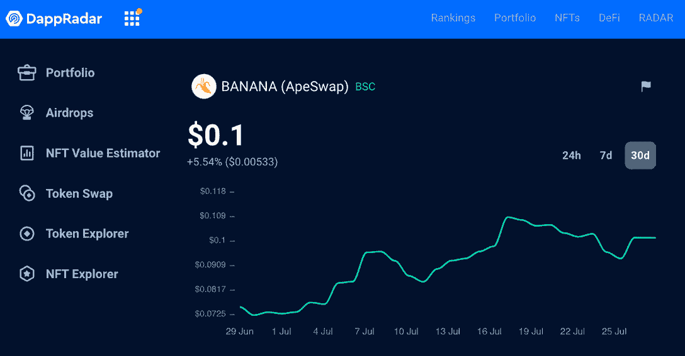
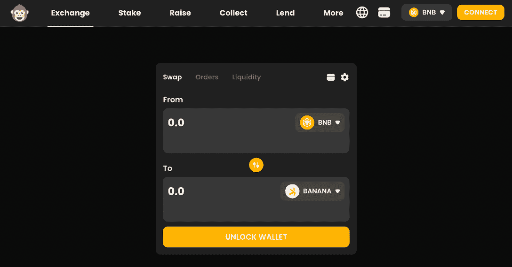

# ApeSwap 是什么？你需要知道的就是这些

> 原文：<https://web.archive.org/web/https://dappradar.com/blog/what-is-apeswap-token-swaps-on-bsc>

## 了解更多关于将迪菲猴子送上月球的平台

在分散化金融创新和强大且积极参与的用户社区之间，ApeSwap 是当前的多链平台。**什么是 ApeSwap？**我如何在那里交换、下注或出售代币？可持续的流动性挖掘呢？本文将回答这些以及其他许多关于 ApeSwap 的常见问题。请继续阅读！

## ApeSwap 是什么？

[ApeSwap](https://web.archive.org/web/20221206163711/https://dappradar.com/polygon/defi/apeswap) 是一个自动做市商(AMM)，收益农业，以及 BNB 链，多边形和以太坊的赌注平台。

正如 [DappRadar 排名](https://web.archive.org/web/20221206163711/https://dappradar.com/rankings/protocol/polygon/category/defi)所证实的那样，该交易所于 2021 年推出，已经成为领先的分散化交易所，为[分散化金融(DeFi)](https://web.archive.org/web/20221206163711/https://dappradar.com/blog/decentralized-finance-defi-dappradars-ultimate-guide) 带来了创新。

DeFi 平台由 ApeSwap 分散自治组织( [DAO](https://web.archive.org/web/20221206163711/https://dappradar.com/blog/what-is-a-dao-how-does-it-work) )监管，确保机构群体有权决定项目的未来。

有趣的是，这个应用程序实际上是从 [PancakeSwap](https://web.archive.org/web/20221206163711/https://dappradar.com/blog/what-is-pancakeswap-and-how-to-use-it) 派生出来的，并且保留了大部分相同的可用性。

### ApeSwap 是如何工作的？

作为一个 DeFi 平台，ApeSwap 让任何人都可以参与由区块链技术支持的金融交易。

尽管 ApeSwap 最初是建立在 BNB 链(T1)上，但现在它也与 T2 多边形(T3)和以太坊网络整合在一起。这样，用户可以从安全性、速度和低交易费用中获益。

因此，对于较小的散户投资者和希望参与 DeFi solutions 的公众而言，ApeSwap 是一个更可行的选择。

## ApeSwap 的原生令牌是什么？

ApeSwap 生态系统中有两个本地令牌$BANANA 和$GNANA。它们都是建立在 [BNB 链](https://web.archive.org/web/20221206163711/https://dappradar.com/blog/what-is-bnb-chain-and-how-does-it-work)上，但是有着非常不同的功能互补。

### $香蕉代币

作为 ApeSwap 的主要原生实用令牌， [$BANANA](https://web.archive.org/web/20221206163711/https://dappradar.com/blog/apeswap-banana-token) 在该平台上有多种用途，以激励流动性。正如你已经知道的，它允许用户赌注，池，并赚取更多的 APY 高达 600%的香蕉代币。

Track $BANANA with the [DappRadar Token Explorer](https://web.archive.org/web/20221206163711/https://dappradar.com/hub/token/bsc/BANANA)

$BANANA token 可以在 ApeSwap 上购买，但你也可以使用 [DappRadar 的 Token Swap](https://web.archive.org/web/20221206163711/https://dappradar.com/hub/swap/bsc/BNB/BANANA) 进入。

### $GNANA 令牌

至于$GNANA 令牌，也称为金香蕉，它是 ApeSwap 的治理令牌。它是为平台最忠诚的社区成员设计的，这些成员有资格参与治理。此外，$GNANA 持有人还可以从被动耕作和专属泳池中获益。

获得$GNANA 的唯一方法是在 ApeSwap 上用$BANANA 购买。

## 我可以用 ApeSwap 做什么？

ApeSwap 不仅仅是交易加密货币。DeFi 平台为用户提供了多种投资方式。看看你能在下面的 ApeSwap 上做些什么。

### 在 ApeSwap 上交换代币

顾名思义，交换是 ApeSwap 的主要功能。DEX 支持 BNB 链、多边形和以太坊上的各种代币。

通过这种方式，您可以轻松地将一种加密货币转换为另一种加密货币，而不必通过集中交易所。

核心优惠是交换，允许用户进行代币交换，并赚取$香蕉。与所有交易所一样，需要考虑费用。

在 BNB，BNB 链上的每一次代币交换都有 0.3%的交换费，0.05%的交换费将进入开发者钱包。剩下的归社区。

### ApeSwap 上的借贷

ApeSwap Lending Network 使您能够与平台上的其他用户出借和借用加密资产。这是获得对您的数字资产的兴趣的好方法。

### 在 apeswap 上挨饿

ApeSwap 的另一个功能是赌注。这意味着您可以锁定您的$BANANA 或$GNANA 代币，以换取合作伙伴项目的奖励。

例如，您可以将您的$BANANA 和$GNANA 代币放入赌注池，从合作项目中获得奖励。

### 加入 ApeSwap 上的初始 Ape 产品

首次公开募股(IAO)是一种筹资方法，用于推出新的代币并为这些代币带来流动性。通过参加 IAOs，您可以参与 ApeSwap 平台上正在启动的激动人心的新加密项目。

一般来说，你需要美元香蕉 BNB 流动性提供者(LP)代币才能参与 IAO。本质上，用户是在用 LP 来换取即将推出的令牌。

在 IAO，该项目获得了 BNB 奖，ApeSwap 烧掉了价值 100 美元的香蕉.要参加 IAO 并了解即将到来的活动，请访问[ApeSwap.Finance/IAO](https://web.archive.org/web/20221206163711/https://apeswap.finance/iao)。

ApeSwap 利用了一种被称为“溢出”的方法，用户可以根据自己的意愿订阅 IAO。你投入的越多，你得到的就越多，你会得到任何没有花掉的东西。

### 为 ApeSwap 提供流动性

作为 AMM，ApeSwap 还允许您为指数增加流动性。当您向[流动性池](https://web.archive.org/web/20221206163711/https://dappradar.com/blog/what-is-liquidity-pool-and-liquidity-provider)贡献一对代币时，您将获得一个流动性提供商(LP)代币作为回报。

在您的钱包中持有 LP 代币使您能够参与使用该流动性组合的每笔交易的交易费用。这就是所谓的流动性挖掘。

此外，您可以在 ApeSwap 的产量农场或最大化器中下注 LP 代币，以赚取 BANANA。

#### ApeSwap 的可持续流动性挖掘& DappRadar

DappRadar 在 ApeSwap 于 2022 年 7 月启动的全新项目中发挥了重要作用。[可持续流动性开采](https://web.archive.org/web/20221206163711/https://ape-swap.medium.com/dappradar-enters-apeswaps-sustainable-liquidity-mining-program-94feee4070e2)项目，顾名思义，引入了第一种可持续获取流动性的方式。

怎么会？通过允许用户出售他们的 LP 代币来换取 ApeSwap 的国库券。

> ⛏可持续流动性开采的未来从现在开始！
> 
> 加入 [@DappRadar](https://web.archive.org/web/20221206163711/https://twitter.com/DappRadar?ref_src=twsrc%5Etfw) 的旅程，实现 100%协议自有流动性🔥
> 
> 🚜世界协调时 22:00 农场&泳池直播
> 🌴国库券星期五发行
> ⏬阅读下面的全部内容[https://t.co/LaOA8Izh6e](https://web.archive.org/web/20221206163711/https://t.co/LaOA8Izh6e)
> 
> — ApeSwap (@ape_swap) [July 6, 2022](https://web.archive.org/web/20221206163711/https://twitter.com/ape_swap/status/1544742804286570497?ref_src=twsrc%5Etfw)

此外，ApeSwap 对社区和用户的参与非常开放。所有用户都被邀请贡献他们想在交易平台上看到的想法和东西。

## 通过 DappRadar 继续了解 ApeSwap

DappRadar 为拥有 ApeSwap 作为合作伙伴而感到自豪，并很高兴继续跟踪其发展并尽可能多地分享关于该平台的知识。现在您知道 ApeSwap 是什么以及如何利用它了。

如果你想继续了解更多关于 DeFi 项目和令人兴奋的 Web3 世界的信息，请关注我们的[博客](https://web.archive.org/web/20221206163711/https://dappradar.com/blog/)、 [YouTube](https://web.archive.org/web/20221206163711/https://www.youtube.com/c/DappRadar) 频道和 [Twitter](https://web.archive.org/web/20221206163711/https://twitter.com/dappradar) 。

***以上不构成投资建议。此处给出的信息仅供参考。请行使尽职调查，做你的研究。***

 NewsletterUnsubscribe at any time. [T&Cs](https://web.archive.org/web/20221206163711/https://dappradar.com/terms) and [Privacy Policy](https://web.archive.org/web/20221206163711/https://dappradar.com/privacy-policy)