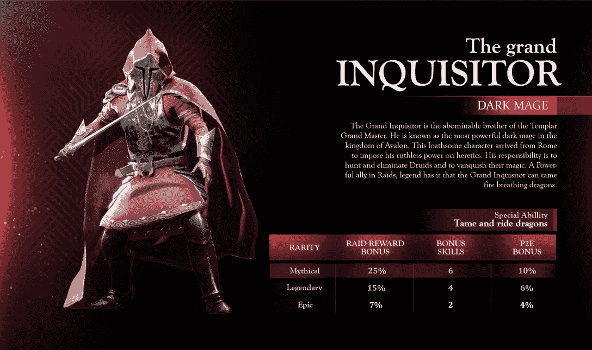

# 如何玩和赢:阿瓦隆

> 原文：<https://web.archive.org/web/https://dappradar.com/blog/what-is-avalon-game>

## RPG 幻想开放世界，玩家可以在其中进行突袭、战斗和赚钱

Avalon Alpha 已经向黄金通行证持有者开放，所以现在是时候看看这个游戏并找出玩它的最佳方式了。在这个拥有复杂知识和传奇人物的幻想世界里，你穿越亚瑟王世界，进行突袭，建立行会网络和拥有土地。

**内容**

*   *[什么是阿瓦隆？](https://web.archive.org/web/20230123215922/https://dappradar.com/blog/what-is-avalon-game/#what-is)*
*   *[游戏如何入门](https://web.archive.org/web/20230123215922/https://dappradar.com/blog/what-is-avalon-game/#get-started)*
*   *[如何玩赢阿瓦隆](https://web.archive.org/web/20230123215922/https://dappradar.com/blog/what-is-avalon-game/#play-and-win)*
    *   *[作为游戏玩家的阿瓦隆](https://web.archive.org/web/20230123215922/https://dappradar.com/blog/what-is-avalon-game/#gamer)*
    *   *[阿瓦隆为工薪族](https://web.archive.org/web/20230123215922/https://dappradar.com/blog/what-is-avalon-game/#earner)*
*   *[是什么让阿瓦隆具有创新性？](https://web.archive.org/web/20230123215922/https://dappradar.com/blog/what-is-avalon-game/#what-innovative)*
    *   *[土地和建筑物](https://web.archive.org/web/20230123215922/https://dappradar.com/blog/what-is-avalon-game/#land-buildings)*
    *   *[NFTs](https://web.archive.org/web/20230123215922/https://dappradar.com/blog/what-is-avalon-game/#nfts)*
    *   *[玩赚](https://web.archive.org/web/20230123215922/https://dappradar.com/blog/what-is-avalon-game/#playing-earning)*

*   *[阿瓦隆路线图上有什么？](https://web.archive.org/web/20230123215922/https://dappradar.com/blog/what-is-avalon-game/#avalon-roadmap)*
*   *[有用链接](https://web.archive.org/web/20230123215922/https://dappradar.com/blog/what-is-avalon-game/#useful-links)*

与所有区块链游戏一样，阿瓦隆有多个层面。你可以把游戏当成一个直板游戏来玩，只是为了好玩而享受。或者，你可以走赚钱的路线，包括专注于土地所有权、数字资产交易以及寻找买卖代币的最佳时机。

[https://web.archive.org/web/20230123215922if_/https://www.youtube.com/embed/UnMyvXuEY2I?feature=oembed](https://web.archive.org/web/20230123215922if_/https://www.youtube.com/embed/UnMyvXuEY2I?feature=oembed)

Avalon gameplay teaser

[Explore Avalon Data](https://web.archive.org/web/20230123215922/https://dappradar.com/polygon/games/avalon-the-game)

## 什么是阿瓦隆？

阿瓦隆是由达努游戏公司开发的一款总部位于区块链的幻想 MMORPG，它结合了《刺客信条》等游戏的元素和命运的团队建设精神。阿瓦隆以风格化的手工绘制环境为特色，由艺术家们创造，他们花了数年时间来完善世界的复杂细节。

在阿瓦隆，玩家可以探索一个分散的世界，并使用他们的数字资产与其他玩家互动。他们可以赚取，交易和使用 NFT 在游戏中前进，并解锁新功能。

这个游戏是建立在以太坊上的，但是可以在以下区块链买到:

*   多边形
*   蜡
*   BNB 链

Avalon 是使用虚幻引擎 5 开发的，允许未来在 PlayStation 5 等游戏机上推出的可能性。

## 如何在游戏中入门

1.  获得一个 Web3 钱包并加载到 MATIC 上

MATIC，多边形区块链的代币，是购买游戏内物品和 NFT 的必备。

2.  获得金、银或绿宝石通行证

将这些珠宝通行证中的一个放入你的 Web3 钱包中，以便你可以连接到游戏。

3.  去阿瓦隆不和谐

游戏访问下载链接发布在游戏的 Discord 服务器上。你不能玩一个完整版本的游戏，但这个阿瓦隆阿尔法测试是下一个最好的事情。

**一旦整个游戏启动…**

要在游戏中前进，玩家必须从最低级开始排列他们的角色或建筑。一些角色可以作为 NFT 购买，而另一些角色则免费提供给有游戏通行证的玩家使用。这些免费角色一旦升级就不能再出售。

玩家可以通过完成任务或发展任务来解锁王国的新领域。例如，为了提高他们锻造建筑的等级，铁匠必须向其他玩家出售一定数量的盔甲。

## 如何玩并赢得阿瓦隆

### 作为游戏玩家的阿瓦隆

阿瓦隆的每个玩家都是从底层做起的。游戏的目的是排列你的角色和建筑，以在游戏中前进。

**任务**

大多数任务都是单人模式的。升级、资源分配和低级别的可收集的 NFT 是提供的一些奖励。但是回报是有限的，你需要为之努力。

你可以用你的头像参加每周和每月的突袭，获得有趣的奖励和大量的奖金，就像下面看到的神话中的大检察官，将会是最赚钱的资产。

The Grand Inquisitor

免费玩游戏的玩家可以参与日常任务，并赚取有限的代币。但是要赢得真正的大奖，你需要用你自己的资源和时间来购买游戏。

**突袭**

在阿瓦隆，突袭是获得奖励和进步的一种非常有利可图的方式。你需要五到六名玩家组成的队伍进行突袭。突袭只对拥有 NFT 角色的最熟练、装备精良的玩家有效。

为了参与突袭并获得游戏中的奖励，如 NFTs、资源、MATIC 或蜡令牌，您需要建立一个强大的团队来击败敌人。

### 作为赚钱者的阿瓦隆

**获得土地**

在阿瓦隆不玩游戏而赚取利润的主要方法是建立你的财产。正如我们将在下面看到的，土地以多种方式产生价值。阿瓦隆有一个广泛的税收系统，确保当人们在他们的财产内采取行动时，令牌和奖励到达地主手中。

**买卖游戏内 NFT**

要成为阿瓦隆的正式玩家，你需要一个 NFT 角色。所以它们是热门产品，如果游戏成长并变得更受欢迎，对它们的需求会更多。

也可以卖龙蛋 NFTs。这些稀有物品很难得到，给玩家一条属于自己的龙。你可以在任务中得到一个，然后在公开市场上交易。

此外，你可以买卖土地获利。因此，如果你有一处位置绝佳的房产，或许值得以合适的价格出售。

## 是什么让阿瓦隆具有创新性？

### 土地和建筑物

在游戏中，土地可以以多种不同的方式产生价值，例如通过一个征税系统，该系统从发生在那里的所有交易中创造代币。

城堡和城镇可能会发展成为公会的中心和众多玩家的热门目的地，创造大量的价值和活动。阿瓦隆和你的土地上的玩家越多，它的价值就越会随着时间的推移而增加。

阿瓦隆有许多类型的建筑和物业:

*   小屋、家园和农场
*   寺庙和村庄
*   城堡和王国
*   海港
*   门户网站
*   厩
*   伪造
*   风车

### WindowsNT 文件系统（NTFileSystem 的缩写）

在阿瓦隆有两个主要的 NFT，大检察官和圣殿骑士团团长。

**大检察官**

大检察官在阿瓦隆王国是一个邪恶的角色。他是圣殿骑士大师的弟弟，被认为是王国里最强大的黑暗法师。他来自罗马，意图将他的权力强加给那些被认为是异教徒的人。

他的主要任务是猎杀和消灭德鲁伊及其魔法。尽管是一个邪恶的角色，大检察官在多人突袭中是一个强大的盟友。根据传说，他甚至有驯服喷火龙的能力。

The Grand Inquisitor’s powers

**圣殿骑士团团长**

圣殿骑士团团长在阿瓦隆王国是一个强大而开明的角色。他是大检察官的兄弟，也是唯一能够使用重型武器和表演魔法的骑士。

他和一群圣堂武士从葡萄牙来到阿瓦隆，加强该地区的防御，并调查德鲁伊的行踪。他被认为是多人突袭中非常有价值的盟友。根据传说，他甚至可以驯服和驾驭会喷冰的龙。

The Templar Grand Master’s powers

### 玩和赚

阿瓦隆是一款允许玩家通过各种方式赚取 AVL 代币的游戏。获得 AVL 代币的一种方法是拥有游戏中的土地并征收销售税。

在这一制度中，税率为 10%，3%归阿瓦隆国库，4%付给当地地主，3%付给城堡地主(岛王)。地主和国王也可以建立免税区来促进当地经济。

另一种赚取 AVL 代币的方法是完成游戏内的任务或参与多人突袭。这些活动可以为玩家赢得 AVL 代币或稀有的 NFT。

最后，玩家可以通过拥有和交易制造和接待建筑中的物品来获得 AVL 代币。这些建筑也允许玩家制造稀有的非战斗单位。

值得注意的是，王国经济的细节和详细的土地税系统将在白皮书的未来版本中进行描述。此外，土地和建筑物有收入和稀有程度，10 是最高的，1 是最低的。

Taxation explained

### 免费游戏奖学金

该游戏将不会有传统的免费游戏选项，而是为没有足够财力的玩家提供奖学金计划。这项计划将允许玩家从 NFT 所有者那里“租赁”资产，并与他们分享利润。

每栋 NFT 大楼都可以选择包括八个学者账户，大楼所有者可以为资源收集设置自己的收入分成比例。为建筑主人收集资源的矿工不能被交易或升级。

## 阿瓦隆路线图上有什么？

Avalon 的路线图非常广泛，并将持续到 2024 年，届时锦标赛、CEX 代币上市、移动应用和 Oculus VR 室内版都表明该游戏的开发者对未来有着宏伟的计划。

对于 2023 年，仍然有很多令人兴奋的事情。一些亮点包括:

*   Oculus VR 内饰演示
*   不可变 X 和 Hedera 链集成
*   第一王国土地出售
*   每周突袭测试
*   第一次王国发行

所有这些都将得到一份全面详细的白皮书的支持，该白皮书将提供更多关于如何实现所有这些目标的信息。从外表上看，似乎阿瓦隆的创造者们正在以所有正确的方式发展这款游戏。

## 有用的链接

*   [阿瓦隆链上数据](https://web.archive.org/web/20230123215922/https://dappradar.com/polygon/games/avalon-the-game)
*   [探索更多区块链游戏](https://web.archive.org/web/20230123215922/https://dappradar.com/rankings/category/games)
*   [游戏信息](https://web.archive.org/web/20230123215922/https://dappradar.com/topic/games)
*   [达普拉达 NFT 概述](https://web.archive.org/web/20230123215922/https://dappradar.com/nft)

## 随身携带您的 Web3 之旅

使用 DappRadar 移动应用程序，再也不会错过 Web3。查看最受欢迎的 dapps 的性能，并关注您投资组合中的 NFT。您在 DappRadar 上的帐户会与我们的移动应用程序同步，这样您很快就可以选择实时接收提醒。

[Download the DappRadar app now](https://web.archive.org/web/20230123215922/https://dappradar.app.link/blog)[<picture></picture>](https://web.archive.org/web/20230123215922/https://play.google.com/store/apps/details?id=com.portfolio.dappradar)