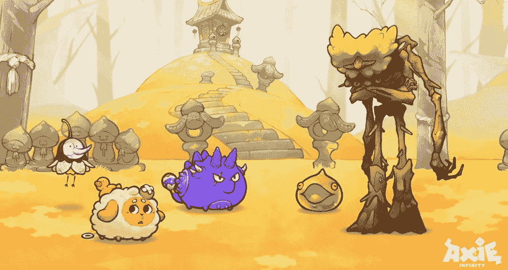
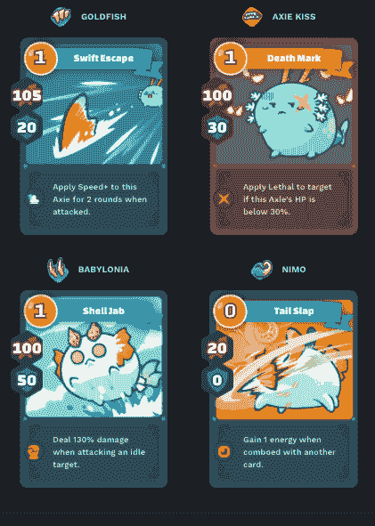
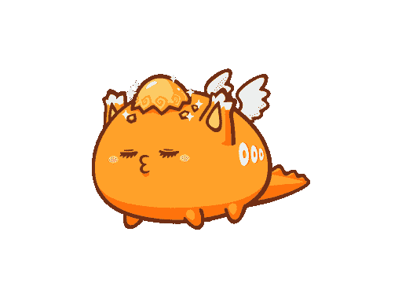

# 什么是 Axie Infinity，它是如何工作的？

> 原文：<https://web.archive.org/web/https://dappradar.com/blog/what-is-axie-infinity-and-how-does-it-work>

## 2021 年，越南的“游戏赚钱”大受欢迎，成为头条新闻

对于任何对 web3 感兴趣的人来说，Axie Infinity 是一个有分量的名字。它在 2021 年一举成名，当时成千上万的人开始靠它全职谋生。很多人都见过可爱的 NFT 小角色，有些人会知道这个游戏包含战斗。但是什么是 Axie Infinity，它是如何工作的？玩游戏是找出答案的最好方法。但是从我们的综合指南开始是有意义的。

**内容**

*   ***[什么是 Axie 无穷大？](https://web.archive.org/web/20221128055438/https://dappradar.com/blog/what-is-axie-infinity-and-how-does-it-work/#what-is)***
*   ***[谁创造了这个游戏？](https://web.archive.org/web/20221128055438/https://dappradar.com/blog/what-is-axie-infinity-and-how-does-it-work/#who-created)***
*   ***[怎么玩 Axie Infinity？](https://web.archive.org/web/20221128055438/https://dappradar.com/blog/what-is-axie-infinity-and-how-does-it-work/#how-play)***
*   ***[什么是浪人网络？](https://web.archive.org/web/20221128055438/https://dappradar.com/blog/what-is-axie-infinity-and-how-does-it-work/#ronin-network)***
*   ***[Axie Infinity 有两个游戏内代币](https://web.archive.org/web/20221128055438/https://dappradar.com/blog/what-is-axie-infinity-and-how-does-it-work/#game-tokens)***
*   ***[打一场要多少钱？](https://web.archive.org/web/20221128055438/https://dappradar.com/blog/what-is-axie-infinity-and-how-does-it-work/#cost-play)***
*   ***[什么是轴？](https://web.archive.org/web/20221128055438/https://dappradar.com/blog/what-is-axie-infinity-and-how-does-it-work/#what-are-axies)***
*   ***[如何赚钱玩 Axie 无穷大](https://web.archive.org/web/20221128055438/https://dappradar.com/blog/what-is-axie-infinity-and-how-does-it-work/#make-money)***
*   ***[游戏内经济可持续吗？](https://web.archive.org/web/20221128055438/https://dappradar.com/blog/what-is-axie-infinity-and-how-does-it-work/#economy-sustainable)***
*   ***[在无限轴上有陆地吗？](https://web.archive.org/web/20221128055438/https://dappradar.com/blog/what-is-axie-infinity-and-how-does-it-work/#axie-land)***
*   ***[Sky Mavis 对 Axie Infinity 的未来有什么规划？](https://web.archive.org/web/20221128055438/https://dappradar.com/blog/what-is-axie-infinity-and-how-does-it-work/#future-plans)***
*   ***[有用链接](https://web.archive.org/web/20221128055438/https://dappradar.com/blog/what-is-axie-infinity-and-how-does-it-work/#useful-links)***

## 什么是 Axie Infinity？

Axie Infinity 是一款从玩到赚的区块链游戏，用户可以培育和战斗他们的 NFT 角色。它在 2021 年成为一大热门，因为世界各地的人们都玩它来赚取宜居的收入。

Axie Infinity 开始于一个简单的竞技场类型的格式。玩家可以互相战斗，或者在越来越难的阶段与电脑战斗。这款游戏中的生物名为 Axies，基于任天堂复古经典的神奇宝贝。

它经常位于或接近 DappRadar 游戏排名页面的顶端，每天吸引成千上万的用户。除此之外，每周还有数千万美元通过 Axie Infinity 智能合约进行交易。

无论你使用哪种标准，Axie Infinity 都是区块链博彩业无可争议的巨头。

## 谁创造了这个游戏？

Sky Mavis 是 Axie Infinity 背后的公司。这是一家越南公司，由联合创始人兼首席执行官 Nguyen Thanh Trung 领导。

这家视频游戏开发商成立于 2017 年，其创始团队意识到了区块链技术的潜力。在投资 CryptoKitties 后，Trung 发现“玩赚”游戏可以为用户带来真正的好处。

Sky Mavis 在 2021 年的估值为 30 亿美元，获得了 1.52 亿美元的融资。从那以后，这款游戏及其生态系统经历了一段艰难时期(以后会有更多)。今天，这家公司的价值可能会低得多，但它仍然是区块链领域的巨头。

Sky Mavis 得到了风险投资公司 Animoca Brands 的支持，该公司还支持其他 web3 平台，如 T2、沙盒和 T4 的 REVV Racing。

## Axie Infinity 怎么玩？

就目前情况来看，Axie Infinity 是一款非常简单的游戏。你让你的三个 Axie 角色去和另外三个 Axie 战斗。

这可以是竞技场模式，玩家对玩家的现场战斗，对抗世界上其他地方的人。

或者你可以在冒险模式下与电脑对抗。在冒险模式中，你通过越来越难的关卡，与非 Axie 敌人战斗。

The creatures on the right are non-Axie enemies

你和你的对手轮流对对方造成伤害。你能造成的伤害取决于你的 Axie 能力的强度或类型。所有这些信息都被概括在一张卡片上，就像神奇宝贝卡片显示神奇宝贝的特征一样。

Axie Infinity cards showing fight traits

你只有一定的能量，这意味着你在回合中可以进行的攻击次数是有限的。最成功的玩家在战术上利用他们的能量给对手造成最大的伤害。

当你的对手攻击你的时候，如果你的 Axie 具备这种特性，它就能够防御或转移攻击。但是防御攻击需要消耗能量，所以并不总是值得去做。有时候，为了赢得战斗，牺牲一个 Axie 是必要的。

Sky Mavis 于 2022 年 4 月推出 Axie Infinity: Origin。除了重新制作的奖励结构和更新的图形，游戏的大部分内容保持不变。

[https://web.archive.org/web/20221128055438if_/https://www.youtube.com/embed/X2z_YIeettE?start=27&feature=oembed](https://web.archive.org/web/20221128055438if_/https://www.youtube.com/embed/X2z_YIeettE?start=27&feature=oembed)

Axie Infinity: Origin gameplay trailer

## 什么是浪人网？

Sky Mavis 于 2021 年 2 月创建了浪人网络。这是一个以太坊侧链，它的引入是为了让 Sky Mavis 对它的整个生态系统有更多的控制。

与 Axie Infinity 完全保留在以太坊上相比，Ronin 为用户提供了更便宜的交易费用和更快的确认时间。除了这些好处之外，拥有侧链意味着 Sky Mavis 可以将汽油费再投资到游戏中。

该网络专为游戏而构建，这意味着它可以托管的不仅仅是 Axie Infinity。随着时间的推移，Sky Mavis 可以开发更多的游戏，并将它们放在 sidechain 上。然后，如果它愿意，它可以邀请外部开发者在 Ronin 上开发自己的游戏。

## Axie Infinity 有两个游戏内代币

### AXS

AXS 代表轴无限碎片，它是让轴无限宇宙转动的象征。它作为一个治理令牌，这意味着持有者可以用它来投票决定游戏如何发展。他们拥有的 AXS 越多，他们的投票权就越多。

AXS [的持有者也可以用令牌](https://web.archive.org/web/20221128055438/https://dappradar.com/blog/axs-staking-gives-axie-infinity-user-activity-a-boost)作为奖励。用户可以去 [AXS 赌注仪表板](https://web.archive.org/web/20221128055438/https://stake.axieinfinity.com/)找到赌注的代币数量，目前估计的 APR 和 AXS 价格。它也有每天发放多少代币作为奖励和当前流通供应量的信息。

DappRadar 的 [Token Explorer](https://web.archive.org/web/20221128055438/https://dappradar.com/hub/token/eth/AXS?from=0xbb0e17ef65f82ab018d8edd776e8dd940327b28b) 有大量关于 AXS 的信息。我们还提供代币交换设施，以便交易者可以在[以太坊](https://web.archive.org/web/20221128055438/https://dappradar.com/hub/tokens/ethereum/all/1)、 [BNB 链](https://web.archive.org/web/20221128055438/https://dappradar.com/hub/tokens/bsc/all/1)和[多边形](https://web.archive.org/web/20221128055438/https://dappradar.com/hub/tokens/polygon/all/1)上交换他们的硬币。

AXS 在 2021 年 11 月 6 日达到历史最高点。自那以后，它跟随大多数其他加密货币呈下降趋势，现在已经远离峰值。它能否重新达到这些水平取决于 Sky Mavis 如何将游戏向前推进。

### SLP

光滑的爱情药水是一个游戏中的令牌，有一个非常特殊的功能。玩家使用 SLP 培育新的 Axie NFTs。

这是一种 ERC-20 代币，可以在各种集中和分散的交易所进行交换和购买。大多数玩家更喜欢通过在战斗中击败对手来获得它。

它在 2021 年 7 月 31 日创下历史新高，达到 0.399 美元。与 AXS 相似，它已经从顶峰跌落。你可以通过访问一个象征性的价格网站来看看价格下降了多少。

SLP 的价格在 Axie Infinity 社区中引起了争议。2021 年，当游戏玩家靠赚取和出售 SLP 谋生时，Axie Infinity 因成为 web3 再分配力量的代言人而出名。

由于 SLP 的价格上涨依赖于不断增长的用户群，Axie Infinity 的受欢迎程度下降导致了令牌价格的相应下降。以游戏为生的玩家们，大多数来自东南亚，再也不能像以前那样通过玩游戏赚钱了。

## 玩一次要多少钱？

玩家需要三个 Axie NFTs 才能开始玩 Axie Infinity。目前最便宜的售价为 3 美元，参与其中大约需要 9 美元。

此前，当这款游戏最受欢迎时，参赛费用超过 1000 美元。交易过最贵的 Axie 是 Angel，当时转手 300 ETH。

Angel: the most expensive Axie ever traded

要想知道开始玩 Axie Infinity 要花多少钱，最好的方法是[去逛逛市场](https://web.archive.org/web/20221128055438/https://marketplace.axieinfinity.com/axie/?auctionTypes=Sale&game=origin)，找到三个你喜欢的 Axie。它们的价格就是你需要支付的价格。

## 什么是轴？

尽管游戏的美学受到了神奇宝贝的启发，但游戏中的 NFT 角色实际上是基于墨西哥步行鱼 Axolotls。

它们是按照 ERC-721 标准制造的，这意味着它们是[不可替代的令牌(NFT)](https://web.archive.org/web/20221128055438/https://dappradar.com/blog/what-are-non-fungible-tokens-nfts)。一旦有人买了 Axie，他们就拥有了它。

轴是整个游戏的关键和入场券。在过去的 18 个月里，它们的价值一直在波动。他们目前正经历一个低潮期，价格非常实惠

## 如何玩 Axie Infinity 赚钱

这是一个很难回答的问题，因为从 Axie Infinity 获得巨大收入潜力的日子似乎已经成为过去。这并不是说他们不能再来了，但就目前的情况来看，玩 Axie Infinity 要赚到钱还需要很长很长的时间。

不过，这款游戏还有其他赚钱的方式。您可以下注[土地](https://web.archive.org/web/20221128055438/https://marketplace.axieinfinity.com/land/)并因此获得奖励。我们有一篇[关于 Axie Infinity](https://web.archive.org/web/20221128055438/https://dappradar.com/blog/axie-infinity-land-staking-is-live) 的文章。

正如我们之前看到的，你可以用 AXS 代币来赚取健康的年度回报。这是一个很好的被动收入的例子，你只需锁定你的钱，看着回报滚滚而来。

你也可以冒险投机 AXS 的价格。如果你认为它很有可能在未来几个月或几年内升值，你可以现在就买一些，等待它升值。如果有，可以卖掉获利。请记住，这是一个有风险的策略，DappRadar 不建议这样做。

## 游戏内经济可持续吗？

遗憾的是，到目前为止，答案是否定的。Axie Infinity 的盈利，甚至维持稳定的价格水平，都依赖于不断涌入的新玩家。不幸的是，当这些新玩家枯竭时，价格大幅下跌。

这是因为 Axie Infinity 的经济依赖于三种资产:SLP、AXS 和 Axies。Sky Mavis 不断推出前者，而玩家则不断培育后者。这类似于中央银行不断印更多的钱给更多的人，同时给这些人自己的印刷机和无限的墨水。

The Verge 有一篇很好的文章,讲述了 Sky Mavis 如何没有为可持续经济做好计划，并在市场逆转时付出了代价。

更糟糕的是，2022 年 3 月，Sky Mavis [遭受了 6 亿美元的黑客攻击](https://web.archive.org/web/20221128055438/https://dappradar.com/blog/axie-infinity-activity-plummets-after-600-million-ronin-exploit)。黑客接管了控制网络决策的投票节点，并从系统中获取了创纪录数量的 USDC 和 ETH。

以太坊主网的浪人桥于 2022 年 6 月重新上线，Sky Mavis 已经基本偿还了用户被盗的资金。但是这种利用并不是没有代价的，无论是名誉上还是财政上。

## Axie Infinity 有陆地吗？

Axie Infinity 的首次土地出售发生在 2019 年。从那以后，对于那些持有它的人来说，就没有太多的用处了。它以 NFTs 的形式出现，按成本顺序有五种类型:

*   萨凡纳
*   森林
*   北极区
*   神秘的
*   起源

7 月，Axie Infinity 推出了面向持有人的土地标桩。赌注者可以获得 AXS 代币作为锁定资产的奖励。

## Sky Mavis 对 Axie Infinity 的未来有什么规划？

首先，Sky Mavis 需要修复其不稳定的经济。[公司在 2022 年 2 月对此做出了改变](https://web.archive.org/web/20221128055438/https://dappradar.com/blog/axie-lunar-event-ending-february-20th)，但需要在游戏内资产价格变得不那么波动之前完成。

更多的独立开发者将开始为 Axie Infinity 生态系统做出贡献。[建设者计划](https://web.archive.org/web/20221128055438/https://dappradar.com/blog/axie-infinity-welcomes-members-in-new-builders-program)于 2022 年 1 月启动。5 月，Sky Mavis 为 12 个项目开了绿灯，目标是为该平台创建多样化和有趣的游戏。

目标似乎是通过开发真正有趣的游戏来扩大 Axie Infinity 的产品，人们会因为赚钱以外的原因而想玩这些游戏。

K 项目也在进行中，K 代表王国。尽管略显神秘，但 Project K 背后的想法是将现有的 Axie Infinity 平台变成一个更具互动性的数字生态系统。

我们可以由此推断，Sky Mavis 计划在其当前平台上创建一个虚拟世界，他们希望这个虚拟世界将成为元宇宙的重要组成部分。

## 有用的链接

[转到 Axie Infinity dapp](https://web.archive.org/web/20221128055438/https://dappradar.com/deeplink/9495)

[DappRadar 针对 Axie Infinity 的单个 dapp 页面](https://web.archive.org/web/20221128055438/https://dappradar.com/multichain/games/axie-infinity)

[DappRadar 的 Axie Infinity 文章](https://web.archive.org/web/20221128055438/https://dappradar.com/blog/search/?q=axie%20infinity)

[AXS 价格](https://web.archive.org/web/20221128055438/https://dappradar.com/hub/token/eth/AXS?from=0xbb0e17ef65f82ab018d8edd776e8dd940327b28b)

[Axie Infinity 浪人黑](https://web.archive.org/web/20221128055438/https://dappradar.com/blog/axie-infinity-activity-plummets-after-600-million-ronin-exploit)

谁实施了 Axie Infinity 黑客攻击？