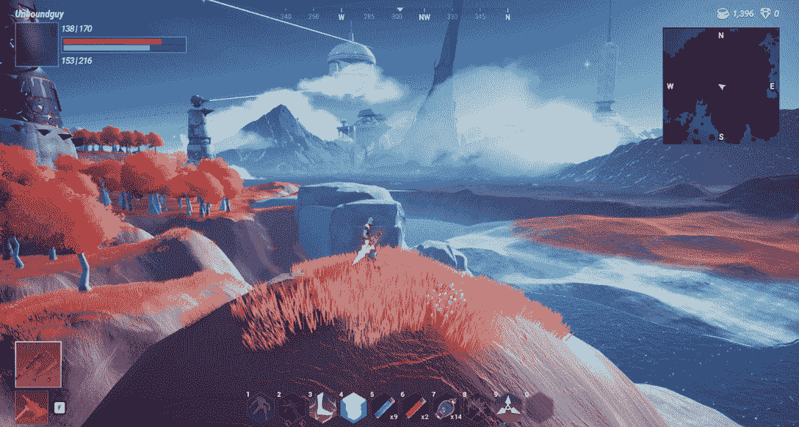
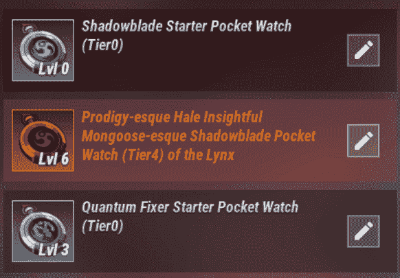
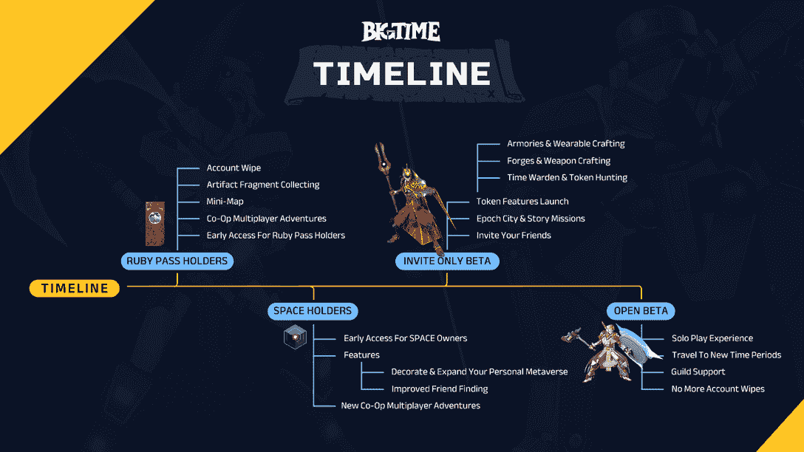

# 什么是大时代，你怎么玩它？

> 原文：<https://web.archive.org/web/https://dappradar.com/blog/what-is-big-time-and-how-can-you-play-it>

## 该游戏结合了有趣和动态的游戏与美丽的图形。

Big Time 是一款 MMORPG，目前处于早期开发阶段，由一个在所有主要游戏巨头工作过的资深团队开发。这款游戏将于 2023 年在全球发行，但已经引起了内容创作者和游戏社区的极大兴趣。

本文由 Nicola Fraccaroli 和[unbounded](https://web.archive.org/web/20220925232414/http://www.unboundnation.io/)撰写。

**关键要点**

*   一个免费游戏，有一个有远见的路线图，没有支付动态。
*   该游戏旨在结合有趣和动态的游戏，美丽的图形，具有挑战性的冒险，以及创新的方面，如时间线和个人元诗句。游戏性第一是口头禅。
*   游戏的几个方面还有待开发和实现，包括令牌组学，但我们知道大时代的令牌将只对活跃的玩家开放，而不是分发给外部演员，而且不会有任何 ICO 或 IDO。这种方法本身就代表着 Web3 游戏向前迈进了一大步。

[https://web.archive.org/web/20220925232414if_/https://www.youtube.com/embed/GjwSoLdYaDM?start=5123&feature=oembed](https://web.archive.org/web/20220925232414if_/https://www.youtube.com/embed/GjwSoLdYaDM?start=5123&feature=oembed)

DappRadar Big Time Livestream

快速动作游戏，一个甜美和充满活力的世界，挑战但有益的地下城，时间旅行，职业多样性，和免费玩。作为长期的 RPG 粉丝，我们可能已经在其他数百万玩家的游戏中看到过这些功能。

但是将这些元素与潜在的无限故事情节和玩家拥有的经济结合起来，模糊了虚拟和现实世界之间的界限，你会意识到《大好时光》将能够提供更多的东西。这是一种前所未有的体验，能够将传统 RPG 元素与可能成为下一代游戏基准的功能和愿景相融合。

我们有幸与职业玩家 Yong 一起玩了游戏的早期版本，这是我们在当前开发状态下的游戏评论。请注意，游戏体验的主要变化可能会在未来几周和几个月内实现，更多的功能将被添加。

## 什么是大时代？

Source:  [f2pg.com](https://web.archive.org/web/20220925232414/http://www.f2pg.com/)

Big Time 是一个开放世界的多人 ARPG，玩家将扮演被召唤到宇宙尽头对抗历史崩溃的时间旅行者。他们会遇到成群结队的暴民，从恐龙到机器人，这取决于他们将在哪个时间线上。

这款游戏目前由 Big Time Studios 开发，该公司拥有游戏领域最有经验的团队之一，包括来自 Epic Games、Rockstar、Riot、Activision、暴雪、分散地等公司的资深人士。

自 2022 年 Alpha 发布以来，它能够吸引许多游戏玩家的眼球，并且在没有重大营销活动的情况下增长。为什么？大时代不是一个常见的 RPG 标题。在其他好处中，它允许玩家通过独特的化妆品收藏品来赚钱，这些收藏品可以在虚拟世界中找到，并可以在现实世界中进行交易。而不破坏游戏体验，也不包括任何支付赢的机制。

如今，这款游戏已经可以提前进入，但它已经可以指望 100 万+的预注册和 40 万+成员的 Discord 社区，以及来自 Brycent、Buffessor 和 Gen Z star Zachary Alexander Rice 等流媒体的主要功能。

有了这些前提，我们会说:好吧，通宵我们来了。我们绝对没有对我们的游戏失望——零食堆到了骨头里。

## 世界-无人的天空美

Source: [Unboundnation.io](https://web.archive.org/web/20220925232414/https://www.unboundnation.io/)

很难评估大时代地图的大小，但我们可以通过漫步在起始区域来判断，开放的可玩世界将是巨大的，甚至不考虑地下城，你将在那里度过你的大部分时间。

## 多大的时间被划分

目前，大时间宇宙可以分为五个区域，每个区域都有自己的自然“主题”和难度:

*   沙沙森林和无人区——适合初学者，简易地下城和启动装备(1-20 级)。
*   荒地——中级区域，有挑战性的地下城和像样的空投(20-40 级)
*   冰雪荒原和冰雪城堡——最佳空投，非常激烈的战斗(40+级)

周围的环境很美，明亮的颜色，锐利的元素设计，流畅的动作，很难选择一个位置来拍摄最好的截图，即使是在较低的分辨率下。

无论是在红色的森林、冰冷的洞穴还是在城市中心，每个角落都有其独特的美。一个很好的方面是，尽管处于早期开发阶段，但几乎所有可玩的领域都已经被探索过了，不会被卡住或遇到错误。

这款游戏不仅允许你在野外漫游，而且在一定程度上你会得到一个叫做时间机器的装置，也就是所谓的个人口袋元宇宙(PPM)。

正如大时代所说

> 这个设备是玩家通往自己世界的门户。你可以把时间机器想象成一个和朋友出去玩或者展示你的收藏品和战利品的起点。

在我们的早期游戏中，我们没有机会探索我们的时间机器，但它听起来像是一个非常有前途的功能，特别是当与可交易收藏品的制作相关联时，我们将在本文的后面解释。

| **初学者资源** [完整大时代初学者指南](https://web.archive.org/web/20220925232414/https://www.youtube.com/watch?v=YFIZ1MSNIXw) 大时代战斗教程 |

## 上课-在时间中跳跃，就像没有明天一样

Source: Big Time

每个玩家从四个可用职业中选择一个职业开始游戏，每个职业都有自己的技能树:

1.  时间战士。坦克能够激怒敌人，站立并造成高伤害。最值得推荐的起始职业之一，因为它有很高的生存能力，即使是在单人游戏中。
2.  时空守护者。魔法职业，能够造成大范围的远程伤害和虚弱的敌人。超时空术士可能是最好的单人职业，因为射程远，装备精良的时间战士是第二好的职业。
3.  暗影之刃。盗贼潜行并造成高近距离伤害。
4.  量子固定器。治疗者，强化盟友并佩戴盾牌抵抗伤害。一旦你过了初始等级，量子修复者就不能持续伤害了。

你需要创造不同的角色来尝试和享受每一个课程吗？绝对不会。一个神奇的工具是怀表，它可以根据每个玩家的偏好或需要无限扩展游戏性。

这种设备可以作为 drops 获得，玩家可以在游戏过程中的任何时候佩戴它来改变“时间线”和切换职业，而无需繁琐的重新加载或重新扫描。前一分钟你是一把暗影之剑，下一分钟你就可以成为量子修复者或者任何职业，在完全相同的位置。

Source: Unbound

你会在游戏中发现大量的怀表，每一款都有自己的特色。但是要小心，每个手表都有自己的时间表，所以只要你装备了一个，换了一个新的职业，你就会再次回到 1 级。正如 streamer The buffersor[建议](https://web.archive.org/web/20220925232414/https://www.youtube.com/watch?v=O6imjDJ9rxM)的那样，如果你得到了一个你喜欢的像样的手表，就升级它，收集所有其他职业的最佳手表，然后再升级。

还有，对你花了积分的能力不满意？不要担心，你将简单地到达地图上的一个重置神殿，你将获得所有的能力点！

简而言之，大时代提供了无数个小时的不同风格和游戏的乐趣，这真的是由玩家选择哪一个。

| **职业资源**
如果你想知道更多关于每个职业，怀表，或者推荐的建造，看看这些资源(注意技能树可能会随着游戏的发展而改变):
[怀表简介](https://web.archive.org/web/20220925232414/https://www.youtube.com/watch?v=U6FiaiSYfWk) [所有职业简介](https://web.archive.org/web/20220925232414/https://www.youtube.com/watch?v=ADm2JWnOJFE) [时间战士](https://web.archive.org/web/20220925232414/https://www.youtube.com/watch?v=3SesE4THrX0) [时间术士](https://web.archive.org/web/20220925232414/https://www.youtube.com/watch?v=31eh5eEj2iY) [暗影之刃](https://web.archive.org/web/20220925232414/https://www.youtube.com/watch?v=QaWQPv-gWwg) [量子修正者](https://web.archive.org/web/20220925232414/https://www.youtube.com/watch?v=31eh5eEj2iY) |

## 地下城-更大的聚会，更好的掉落

地下城代表了大部分乐趣(或羞辱)将会发生的地方，也是更好的战利品将会掉落的地方，尤其是在团队中。

现在有各种类型的地下城，草地/森林，冰封，沙漠，科技(虹吸)，可以通过分布在地图上的入口进入，由于程序生成技术，每次一队人加入都会提供不同的随机体验，有不同的怪，任务，老板和战利品。

然而，最终的目标通常是杀死最后的 boss 并获得稀有的掉落物和黄金。当然，你的角色等级越高，地牢就越复杂。

[https://web.archive.org/web/20220925232414if_/https://www.youtube.com/embed/xI7c06a3Gjo?feature=oembed](https://web.archive.org/web/20220925232414if_/https://www.youtube.com/embed/xI7c06a3Gjo?feature=oembed)

与一队玩家(最多六人)对战单人来清理和完成地下城会给你提供更多的掉落，更多的收藏品和更多的经验值(除了更有趣之外)。

由于游戏仍处于早期访问阶段，通过游戏中的聊天找到一群冒险者可能并不容易，即使在水镇也是如此，但多个大时代社区在 Discord 上活跃(官方服务器、公牛公会、大时代勇士等。)，您可以在这里找到并计划您的突袭行动。

## 玩家所有的经济

[https://web.archive.org/web/20220925232414if_/https://www.youtube.com/embed/EjRUYFwcm0g?feature=oembed](https://web.archive.org/web/20220925232414if_/https://www.youtube.com/embed/EjRUYFwcm0g?feature=oembed)

或许《大时代》最吸引人和最具创新性的方面之一是它对收藏品和游戏经济的愿景。

如果你以前没有机会体验过 Web3 游戏,《大时代》将会让你体验传统游戏机制和故事的经典 ARPG。这个游戏仍然是免费的，没有蹩脚的付费赢面。很酷，对吧？

然而，如果你想测试或享受内置的 Web3 功能，如可交易的收藏品和社区福利，Big Time 将为你提供这样的机会，甚至是免费的。

Source: Big Time Open Market

每个玩家将能够真正拥有游戏中有价值的物品，无论是由暴徒掉落的还是精心制作的，都有机会自由交易，其中一些人还可能赚到现实世界的钱。

将在大时代推出的 Web3 元素要么是游戏体验的功能性元素(实用性)，要么是与化妆品相关的元素。它们是:

| 空间 | 大时代版本的虚拟土地或经典 RPG“库存插槽”，用于扩展您的游戏中的时间机器。通过在突袭中获得空间或者通过游戏市场购买空间，你将被允许激活特殊设施资产，例如时间看守、锻造和军械库。空间越大或越稀少，它能容纳的资产就越多。空间将有 60 万套的限量供应。 |
| 锻造室 | 锻造将是玩家创造自己的可交易武器皮肤和其他非交易物品的一种方式。 |
| 军械库 | 军械库将允许用户创建他们自己的装饰性装甲皮肤和其他非战斗装甲。 |
| 沙漏 | 当战利品掉落时，可以装备来解锁大时间令牌的资产。 |
| 时间管理员房间 | 时间看守室允许玩家创建沙漏或者重新填满沙漏。 |
| 大市场(开放市场/开放战利品) | 允许玩家买卖物品和收藏品的市场，即使是用现实世界的钱。由于开放战利品的推出，市场将变得可互操作，并接受来自其他 Web3 游戏的物品！ |
| 大时代代币 | 只有装备沙漏的现役玩家才能获得的战利品。这些代币可以用来授予几个游戏内和社区的好处 |

关于即将到来的游戏内经济和代币的大量细节将很快由开发团队发布，我们期待了解他们如何设计它，并设想它在中长期的可持续性。ICO 和 IDO 不会出现在路线图上，我们已经知道了。

这种意义上的新奇之处在于，即使游戏中没有 Web3 元素，它仍将是一个完全成熟的 MMORPG，能够娱乐和激励玩家无数个小时，我们喜欢它。

## 结论

Source: Big Time

几个月的时间让玩家们无法接触到《大时代》的开放版本。这款游戏发展迅速，越来越受欢迎，这要归功于已经有大量的内容创作者和公会扩大了它在全球的影响力。

体验的许多方面仍需要实施，如底层剧情、PvE、PvP(激战)和令牌，这些将构成游戏玩家获取和保留的主要杠杆。

但作为游戏玩家和 Web3 专业人士，Big Time 已经成为一款首款此类游戏，能够将有趣和动态的游戏、美丽的图形和具有挑战性的冒险与全新的 Web3 元素相结合。

> 那里有很多潜力，因为游戏玩得很好。如果他们能正确地设计知识和故事情节，对游戏玩家来说，大时代将会是一个大时代。
> 
> **星期五**

玩家拥有的资产和代币、可交易的收藏品、市场互操作性作为概念都具有巨大的潜力，但迄今为止在 Web3 游戏行业中被滥用来销售基于投机的体验，这些体验远非令人愉快，甚至不能被视为“游戏”。

我们非常希望这样一个经验丰富的开发团队能够顺利地融入所有这些方面，而不是将玩家分成寻求乐趣和挑战的人和寻求利润的人。通过我们的游戏和对团队的采访，Big Time 了解到了 Web3 给游戏玩家带来的真正的价值主张，而没有侵犯成熟、独立的 ARPG 体验。

### 如何加入大时代早期接入阶段？

由于游戏目前只能在邀请的基础上进行，愿意玩大游戏的玩家可以通过合作伙伴的倡议或官方赠品发放的红宝石通行证，或者通过[市场](https://web.archive.org/web/20220925232414/https://wiki.bigtime.gg/big-time-getting-started/early-access-passes)购买金、银和玉通行证来玩。因此，跟随大时间官方渠道和领先的横幅，以保持对即将到来的机会更新。另外要小心，不要在外部市场如 OpenSea 上购买早期通行证，它们可能不是真的。

如果在读完这篇文章后，你非常想玩，但却在努力获得红宝石通行证，这是你的幸运日。通过购买空间，您将获得免费的 ruby 通行证。

[官网](https://web.archive.org/web/20220925232414/https://bigtime.gg/) | [官方不和](https://web.archive.org/web/20220925232414/https://discord.gg/bigtime) | [推特](https://web.archive.org/web/20220925232414/https://twitter.com/playbigtime) | [脸书](https://web.archive.org/web/20220925232414/https://www.facebook.com/playbigtime/)|[insta gram](https://web.archive.org/web/20220925232414/https://instagram.com/playbigtime)|[Youtube](https://web.archive.org/web/20220925232414/https://www.youtube.com/channel/UCItE3xYynz17DpmGK6ID1Vw)

| **大时代的飘带**[布勒森](https://web.archive.org/web/20220925232414/https://www.youtube.com/c/brycent) [布勒森](https://web.archive.org/web/20220925232414/https://www.youtube.com/c/TheBuffessor) [大时代的因特尔](https://web.archive.org/web/20220925232414/https://www.youtube.com/c/BigTimeIntel) [卡吉扬](https://web.archive.org/web/20220925232414/https://www.youtube.com/c/CAGYJAN) |

 NewsletterUnsubscribe at any time. [T&Cs](https://web.archive.org/web/20220925232414/https://dappradar.com/terms) and [Privacy Policy](https://web.archive.org/web/20220925232414/https://dappradar.com/privacy-policy)