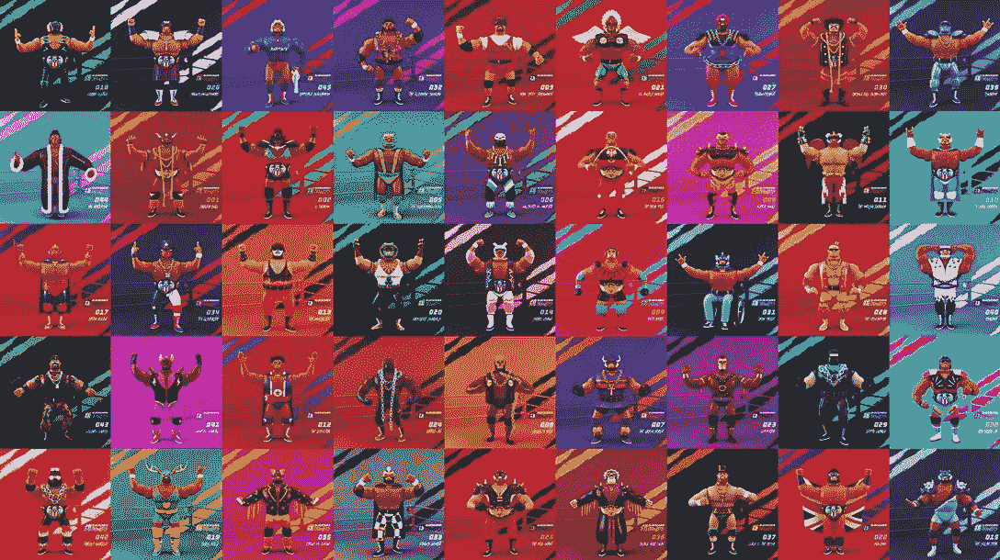

# 什么是区块链格斗家，怎么玩？

> 原文：<https://web.archive.org/web/https://dappradar.com/blog/what-is-blockchain-brawlers-and-how-to-play-it>

## 这是一款基于蜡像区块链的“玩赚”格斗游戏

**区块链格斗家于 2022 年 3 月在区块链蜡像馆推出，从那时起，它已经成为网络上收入最高的游戏之一。作为一个相对较新的游戏，一些玩家可能还不知道如何参与其中。所以下面，我们已经回答了这个问题:什么是区块链格斗家，怎么玩？**

**总结**

*   ***[什么是区块链格斗家？](https://web.archive.org/web/20220813050230/https://dappradar.com/blog/what-is-blockchain-brawlers-and-how-to-play-it/#what-is)***
*   ***[谁创造了这个游戏？](https://web.archive.org/web/20220813050230/https://dappradar.com/blog/what-is-blockchain-brawlers-and-how-to-play-it/#who-created)***
*   ***[怎么开始玩区块链格斗家？](https://web.archive.org/web/20220813050230/https://dappradar.com/blog/what-is-blockchain-brawlers-and-how-to-play-it/#start-playing)***
*   ***[游戏有哪些游戏内 NFT？](https://web.archive.org/web/20220813050230/https://dappradar.com/blog/what-is-blockchain-brawlers-and-how-to-play-it/#in-game-nfts)***
*   ***[区块链格斗家有令牌吗？](https://web.archive.org/web/20220813050230/https://dappradar.com/blog/what-is-blockchain-brawlers-and-how-to-play-it/#have-token)***
*   ***[什么是耐久性？](https://web.archive.org/web/20220813050230/https://dappradar.com/blog/what-is-blockchain-brawlers-and-how-to-play-it/#what-durability)***
*   ***[结束语](https://web.archive.org/web/20220813050230/https://dappradar.com/blog/what-is-blockchain-brawlers-and-how-to-play-it/#closing-words)***
*   ***[有用链接](https://web.archive.org/web/20220813050230/https://dappradar.com/blog/what-is-blockchain-brawlers-and-how-to-play-it/#useful-links)***

访问 DappRadar 的游戏排名，你会发现[区块链格斗家](https://web.archive.org/web/20220813050230/https://dappradar.com/wax/games/blockchain-brawlers)接近列表的顶部。看看我们的[蜡像游戏](https://web.archive.org/web/20220813050230/https://dappradar.com/rankings/protocol/wax/category/games)排名，根据当天的情况，区块链格斗家将排在首位。

每天，用户在交易游戏资产时都会进行成千上万次交易。因此，如果你对游戏感兴趣，并且喜欢玩游戏赚钱，那么了解什么是区块链格斗家以及如何玩它是很重要的。

## 什么是区块链格斗家？

Blockchain Brawlers 是一款玩赚游戏，用户可以通过进入数字游戏圈并与对手战斗来赚取真钱。

它建立在区块链蜡像的基础上，前提非常简单。购买一架格斗机，装备一些装备，进入拳击台，一决雌雄。

奖励以数字代币的形式出现，持有者可以将其兑换成法定货币。就目前情况来看，游戏性非常有限。当你点击一个按钮时，比赛就结束了，结果出现在屏幕上。

打架的结果取决于打架者的稀有程度:稀有程度越高，你获胜的机会就越大。

## 谁创造了这个游戏？

蜡像游戏工作室开发了区块链格斗家。这是第一款直接来自区块链公司的游戏。首席博彩官迈克尔·鲁宾内利领导了这项倡议。这位 25 年的游戏行业老手是免费游戏革命中的一个有影响力的人物。

理查德·加菲尔德也是开发团队的重要成员。他是一名数学教授和游戏设计师，最著名的作品是《魔法:聚会》。他的加入是为了让游戏中玩家对玩家的元素尽可能的刺激和有策略。

[https://web.archive.org/web/20220813050230if_/https://www.youtube.com/embed/lETB0bGmQ1U?feature=oembed](https://web.archive.org/web/20220813050230if_/https://www.youtube.com/embed/lETB0bGmQ1U?feature=oembed)

DappRadar Meets WAX

## 怎么开始玩区块链格斗家？

首先，你需要制作一个蜡质钱包。你可以使用蜡云钱包(WCW)或锚钱包。

其次，你需要去 DappRadar 的《如何开始玩区块链格斗家》，按照我们简单的说明去做。

## 游戏中有什么 NFT？

区块链格斗家有三个主要的游戏内 NFT:

### 1\. Brawlers

斗殴者是游戏的主要 NFT。没有一个，你不能玩。有两种方法可以得到一个打手:你可以手工制作一个或者在二级市场上买一个。

打架者有五种罕见程度:

*   普通的
*   不寻常的
*   罕见的
*   史诗
*   传奇的

打架者的力量来自于其稀有性。所以，如果你想在拳台上称王称霸，就要留心那些不寻常的拳手。但是记住，打架的人越少，费用就越高。

最罕见的打架者是“创始人版”传奇 1 对 1。这些有四个版本:标准，硬核，笼子比赛和死亡比赛。你可以在游戏中玩它们，但是你需要花一些钱来获得一个:它们在公开市场上售价数万美元。

Brawler NFTs

### 2.戒指

你还需要一个环 NFT 从事区块链格斗家的战斗。有四级环:

*   普通(正常)
*   神器(后院)
*   传奇(死亡竞赛)
*   稀有(钢笼)

戒指越稀有，对你的拳手越有利。如果你装备了一个传奇或者稀有的戒指，你可以允许一个以上的格斗者同时格斗。

### 3.齿轮

装备也以 NFT 的形式出现，但在区块链格斗中不是必不可少的。给你的格斗家装备装备会在战斗中给它额外的力量。

你可以买到不同类型的装备:

*   黄铜关节
*   钢椅
*   棒球棒
*   大锤
*   垃圾桶

装备增强你赢得战斗和赚取代币的能力。

### 二级市场

你可以通过任何基于蜡的二级市场购买区块链争吵者 NFTs。 [AtomicHub](https://web.archive.org/web/20220813050230/https://wax.atomichub.io/explorer/collection/bcbrawlers) 、 [NFTHive](https://web.archive.org/web/20220813050230/https://nfthive.io/?utm_source=DappRadar&utm_medium=deeplink&utm_campaign=visit-website) 或 [NeftyBlocks](https://web.archive.org/web/20220813050230/https://neftyblocks.com/?utm_source=DappRadar&utm_medium=deeplink&utm_campaign=visit-website) 都是不错的起点。你可以在 DappRadar 的排名页面上找到一个完整的蜡市场列表，我们在那里提供安全可靠的链接。

## 区块链格斗家有令牌吗？

区块链格斗家有自己的游戏内[令牌](https://web.archive.org/web/20220813050230/https://dappradar.com/hub/tokens/ethereum/all/1)，叫做 BRWL。它在 2022 年 4 月 1 日达到了 0.75 美元的历史最高价。现在离顶峰还有一段距离，[你可以亲眼看到它现在值多少钱。](https://web.archive.org/web/20220813050230/https://www.coingecko.com/en/coins/blockchain-brawlers)

用户需要 BRWL 来制作，这是 Blockchain bloggers 用来创建新游戏资产的术语。

除了 BRWL，玩家也需要黄金 NFT 来制造。事实上，黄金是手工艺的主要成分，不容易得到。你可以在公开市场上交易、赠送或出售黄金。也可以通过币安 x 蜡桥转移到 [BNB 链](https://web.archive.org/web/20220813050230/https://dappradar.com/blog/what-is-bnb-chain-and-how-does-it-work)上。

当玩家击败对手时，他们可以赢得黄金和 BRWL。稀有度越高的打架者赢得的奖励越多。装备装备是赢得更多代币的另一种方式。

## 什么是耐用性？

区块链格斗家中的耐久性表明玩家可以使用一个物品多长时间，然后才会被销毁。

当你的装备 NFT 达到零时，它将从游戏中消失。当一个玩家的戒指达到零时，你需要添加更多的匹配来使它再次可用。

耐久性总是用分数来表示。因此，如果你的装备显示 150/200，这意味着你还有 150 次剩余使用，而不是原来的 200 次。

## 结束语

区块链格斗家仍在大力开发中。开发商将在 2022 年晚些时候增加 PvP 比赛并推出迷你游戏。他们的发展路线图也将延续到 2023 年，因为该团队将在比赛类型中引入女性格斗家和更多种类。

## 有用的链接

*   [区块链格斗家 dapp](https://web.archive.org/web/20220813050230/https://dappradar.com/deeplink/12653)
*   [区块链格斗家单人 dapp 页面](https://web.archive.org/web/20220813050230/https://dappradar.com/wax/games/blockchain-brawlers)
*   [AtomicHub 市场](https://web.archive.org/web/20220813050230/https://wax.atomichub.io/)
*   [NeftyBlocks 市场](https://web.archive.org/web/20220813050230/https://dappradar.com/deeplink/6874)
*   [本周游戏中的区块链格斗者](https://web.archive.org/web/20220813050230/https://dappradar.com/blog/blockchain-brawlers-smashes-in-the-arena-this-week)

 NewsletterUnsubscribe at any time. [T&Cs](https://web.archive.org/web/20220813050230/https://dappradar.com/terms) and [Privacy Policy](https://web.archive.org/web/20220813050230/https://dappradar.com/privacy-policy)