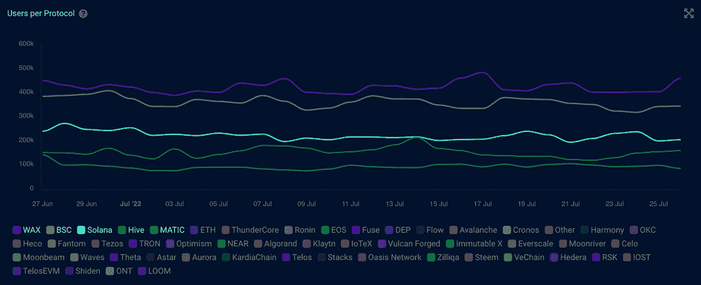

# 什么是 BNB 链，它是如何工作的？

> 原文：<https://web.archive.org/web/https://dappradar.com/blog/what-is-bnb-chain-and-how-does-it-work>

## BNB 链及其生态系统的终极指南

**更新** : [关于如何在以太坊、BSC 和多边形之间移动资产的指南](/web/20220813152622/https://dappradar.com/blog/guide-on-how-to-move-assets-between-ethereum-bsc-and-polygon/)

2022 年 2 月，币安将币安智能连锁和币安连锁合并为新的 BNB 连锁。它是世界上最大的加密货币生态系统之一，其本地令牌 BNB 排名第三，市值为 409 亿美元(名单不包括 stablecoins)。

作为加密领域的竞争对手，[币安](https://web.archive.org/web/20220813152622/https://www.binance.com/en)为世界上一些最受欢迎的不同领域的 dapps 提供高性能的基础设施，包括[元宇宙](/web/20220813152622/https://dappradar.com/blog/what-is-the-metaverse/)、 [DeFi](/web/20220813152622/https://dappradar.com/blog/decentralized-finance-defi-dappradars-ultimate-guide/) 、[市场](/web/20220813152622/https://dappradar.com/blog/best-nft-marketplaces-to-buy-sell-nfts/)、游戏等等。

如下图所示，在 DappRadar 跟踪的所有协议中， [BNB 链](https://web.archive.org/web/20220813152622/https://dappradar.com/rankings/protocol/binance-smart-chain)在过去 12 个月中保持了用户数量第二的位置。

今年 2 月，[币安将其币安连锁店和币安智能连锁店(BSC)更名为 BNB 连锁店](/web/20220813152622/https://dappradar.com/blog/binance-chain-and-binance-smart-chain-become-bnb-chain/)，凸显了 BNB 向更大的创新和权力下放的进化之旅。

**内容:**

*   [什么是 BNB 链？](https://web.archive.org/web/20220813152622/https://dappradar.com/blog/what-is-bnb-chain-and-how-does-it-work/#bnb-chain)
*   [什么是 BNB 烽火连锁？](https://web.archive.org/web/20220813152622/https://dappradar.com/blog/what-is-bnb-chain-and-how-does-it-work/#bnb-beacon-chain)
*   [什么是 BNB 智能链(BSC)？](https://web.archive.org/web/20220813152622/https://dappradar.com/blog/what-is-bnb-chain-and-how-does-it-work/#bsc)
    *   [BSC 是如何工作的？](https://web.archive.org/web/20220813152622/https://dappradar.com/blog/what-is-bnb-chain-and-how-does-it-work/#how-does)
*   BNB 令牌是如何工作的？
*   BNB 连锁对 DeFi 有好处吗？
*   [BNB 连锁对非全日制学生有好处吗？](https://web.archive.org/web/20220813152622/https://dappradar.com/blog/what-is-bnb-chain-and-how-does-it-work/#bnb-nft)
*   在 BNB 的生态系统中，有哪些受欢迎的“玩即赚”游戏？
*   如何使用 DappRadar 跟踪 BNB 链上的加密资产？

## 什么是 BNB 链？

[BNB 链](https://web.archive.org/web/20220813152622/https://www.bnbchain.org/en)是一个社区驱动的、开源的、去中心化的生态系统。更名后的 BNB 连锁店包括 BNB 灯塔连锁店和 BNB 智能连锁店。BNB 信标链，以前的币安链)服务于治理的目的(即，赌注和投票)。BNB 智能链保持以太坊虚拟机兼容，执行共识机制，并成为多链中心。

## 什么是 BNB 灯塔链？

BNB 灯塔连锁公司(原名币安连锁公司)于 2019 年 4 月成立，主要致力于促进快速、分散的交易。在这样做的时候，它必须在操作方面做出一些选择。不幸的是，由于这些选择的限制，BNB Beacon Chain 不具备支持开发人员在该网络中运行智能合同的多功能性。

值得注意的是，BNB 信标链采用 BEP2，这是网络本地令牌或 BNB 的基本令牌标准。BNB 最初是为促进币安连锁网络内的资产交易而设计的，不能用于币安以外的任何其他区块链。

随着币安在区块链激烈的技术竞争中向前迈进，币安智能链(现在的 BNB 智能链)的想法就产生了。

## 什么是 BNB 智能链？

币安智能链于 2020 年 9 月推出，旨在为开发高性能分散式应用(dapps)营造环境。此外，它是为与 BNB 信标链的跨链兼容性而构建的，以确保社区的平稳运行。

与 BNB 信标链不同，BSC 拥有智能合约功能以及与以太坊虚拟机(EVM)的兼容性。因此，它使 BNB 信标链的高吞吐量不受影响，同时将智能合同引入其生态系统并鼓励 dapps 的部署。

从根本上说，区块链并肩作战；因此，BSC 不是第二层或链外可伸缩性解决方案。相反，这是一个独立的区块链，即使 BNB 信号链离线也能运行。

对于用户来说，像 [MetaMask](/web/20220813152622/https://dappradar.com/blog/what-is-metamask/) 这样的应用可以与 BSC 协同工作。因为 BSC 与 EVM 兼容，所以它推出了对以太坊工具和 dapps 的支持。这使得开发者很容易从以太坊移植他们的项目。

[https://web.archive.org/web/20220813152622if_/https://www.youtube.com/embed/acWrJt7GRGg?start=5&feature=oembed](https://web.archive.org/web/20220813152622if_/https://www.youtube.com/embed/acWrJt7GRGg?start=5&feature=oembed)

### BSC 是如何工作的？

币安智能链可以通过使用[授权证明(PoSA)](https://web.archive.org/web/20220813152622/https://docs.binance.org/smart-chain/validator/guideline.html) 实现 3 秒钟的块处理时间，其中参与者让 BNB 成为验证者。如果他们提出一个有效的区块，他们将从包含的交易中收取费用。重要的是，新铸造的 BNB 没有补贴，因为 BNB 没有通货膨胀，并且随着币安定期进行硬币燃烧，供应量会随着时间的推移而减少。

双链架构的思想是用户可以无缝地将资产从一个区块链转移到另一个。通过这种方式，可以在 BNB 信标链上享受快速交易，而 BSC 则服务于运行强大 dapps 的目的。

与 BNB 信标链上的本地令牌不同，BSC 上的本地令牌采用 BEP-20 令牌标准。BEP-20 受以太坊 ERC-20 的启发，提供了与以太坊智能合约的兼容性，但没有涉及太多细节。此外，来自 BNB 信标链的令牌，如 BEP2 BNB，可以使用币安钱包换取 BEP-20 令牌。

## BNB 令牌是如何工作的？

[BNB 是 BNB 链家的生态系统 token](/web/20220813152622/https://dappradar.com/blog/what-is-bnb/) ，于 2017 年首次亮相。它是在 2017 年 6 月 26 日至 7 月 3 日的首次硬币发行(ICO)众筹活动中首次发行和推出的。

币安最初在区块链以太坊发行 BNB 作为 ERC-20 代币，但很快将其作为 BEP-2 转移到币安主链。随着 BNB 智能链的出现，BNB 也可以作为 BEP-20 令牌存在于 BSC 上。BNB 最初的总供应量设定为 200，000，000 枚硬币，但由于定期的硬币焚烧事件，供应量逐渐减少。

BNB 有许多用例。例如，在币安交易所生态系统中，BNB 使用户在支付交易费时能够获得折扣。最重要的是，BNB 继续发展以实现互操作性的目标。它已经可以在不同领域的许多项目中使用，包括[分散地](/web/20220813152622/https://dappradar.com/blog/what-is-decentraland-an-open-world-economy-in-the-metaverse/)、TravelbyBit、BitTorrent、HTC 等等。

## BNB 链条对 DeFi 有好处吗？

BNB 链条是为 DeFi 打造的。几个连锁店的代币可以在 BNB 连锁店不断增长的 DeFi 生态系统中使用。像 PancakeSwap 这样的应用程序允许用户像以太坊的 Uniswap 一样无信任地交换资产，从事农业生产，并对提案进行投票。

自推出以来，BSC 一直非常倾向于 DeFi 应用，试图与以太坊生态系统正面交锋，同时为用户提供更低的成本。似乎对币安有利的策略。

2021 年 1 月， [PancakeSwap](https://web.archive.org/web/20220813152622/https://dappradar.com/blog/pancakeswap-closes-in-on-uniswap-with-36-growth/) 和 [Venus](https://web.archive.org/web/20220813152622/https://dappradar.com/blog/venus-becomes-fastest-growing-defi-dapp-on-binance-smart-chain/) 是 BNB DeFi 生态系统最重要的贡献者。在 2021 年 1 月 150 亿美元的总交易量中，这些交易分别产生了 10 亿美元和 140 亿美元。

一年后，随着几个创新的 DeFi dapps 的加入，BNB 的 DeFi 生态系统变得更加活跃。所以让我们仔细看看谁在 DappRadar 排名中领先。

BNB 链条上流行的 DeFi dapps:

*   [PancakeSwap](/web/20220813152622/https://dappradar.com/blog/what-is-pancakeswap-and-how-to-use-it/)
*   [Biswap](https://web.archive.org/web/20220813152622/https://dappradar.com/binance-smart-chain/defi/biswap)
*   [ApeSwap](https://web.archive.org/web/20220813152622/https://dappradar.com/binance-smart-chain/defi/apeswap)
*   [利伯拉。金融](https://web.archive.org/web/20220813152622/https://dappradar.com/binance-smart-chain/defi/libera-financial)
*   [自动理财](https://web.archive.org/web/20220813152622/https://dappradar.com/binance-smart-chain/defi/autoshark-finance)
*   [稳定资金](https://web.archive.org/web/20220813152622/https://dappradar.com/binance-smart-chain/defi/stablefund)

## BNB 链对非母语教学有好处吗？

币安开发了一个独特的不可替代的令牌生态系统，将艺术家、创作者和加密爱好者聚集在一起。[币安·NFT](https://web.archive.org/web/20220813152622/https://www.binance.com/en/nft)是一个本地平台，用户可以通过该平台平稳、经济地创建和交易非金融交易。

还值得一提的是，币安 NFT 是在玩赚取游戏的前沿。它的特点是收集了大量高质量的游戏，神秘的盒子噱头，以及 NFT 游戏项目的初始游戏提供(IGO)平台，以深入吸引用户。

随着 BNB 连锁已经发展成为一个包罗万象的加密生态系统，许多其他市场也以独特的价值定位在 BNB 连锁的生态系统中找到了自己的位置。热门市场列表如下。

*   tofunft
*   [BitKeep NFT 营销场所](https://web.archive.org/web/20220813152622/https://dappradar.com/binance-smart-chain/marketplaces/bitkeep-nft-market)
*   [炸弹密码市场](https://web.archive.org/web/20220813152622/https://dappradar.com/binance-smart-chain/marketplaces/bomb-crypto-marketplace)
*   [NFTrade](https://web.archive.org/web/20220813152622/https://dappradar.com/binance-smart-chain/marketplaces/nftrade)
*   [无线电卡市场](https://web.archive.org/web/20220813152622/https://dappradar.com/binance-smart-chain/marketplaces/radiocaca-market)

## 在 BNB 的生态系统中，有哪些受欢迎的游戏？

BNB 连锁拥有最具活力的游戏生态系统之一，并不遗余力地为行业做出贡献。如上所述，币安 NFT 市场为游戏团队提供了一个一站式平台来启动他们的 NFT 项目。

此外，最大的加密货币交易所之一币安为投资者提供各种 GameFi 代币，以便高效安全地进行交易。最重要的是，币安实验室，币安的风险投资部门，继续为行业孵化优秀的游戏项目。

毫无疑问，游戏 dapps 已经成为 BNB 连锁生态系统的重要支柱。对于精通 GameFi 的人来说，他们可能会在 BNB 连锁的热门游戏列表中找到一些熟悉的名字。

*   [Mobox](/web/20220813152622/https://dappradar.com/blog/what-is-mobox/)
*   [Era7](https://web.archive.org/web/20220813152622/https://dappradar.com/binance-smart-chain/games/era7-game-of-truth)
*   第二
*   [炸弹密码](https://web.archive.org/web/20220813152622/https://dappradar.com/binance-smart-chain/games/bomb-crypto)
*   [X 世界运动会](https://web.archive.org/web/20220813152622/https://dappradar.com/binance-smart-chain/games/x-world-games)

## 如何使用 DappRadar 跟踪 BNB 链上的加密资产？

BNB 连锁店的用户现在可以在他们的 DappRadar 投资组合跟踪器中找到他们在 BNB 连锁店的资产。DappRadar 投资组合让用户直观地了解他们的 BSC 钱包中的一切，从 DeFi 头寸到代币持有量和 NFT 收藏。

[https://web.archive.org/web/20220813152622if_/https://www.youtube.com/embed/WHL_uYv8riA?feature=oembed](https://web.archive.org/web/20220813152622if_/https://www.youtube.com/embed/WHL_uYv8riA?feature=oembed)

有一些有用的链接供用户跟踪 BNB 链上 dapps 的最新发展。

*   [BNB 连锁超市排名](https://web.archive.org/web/20220813152622/https://dappradar.com/rankings/protocol/binance-smart-chain)
*   [BNB 令牌](https://web.archive.org/web/20220813152622/https://dappradar.com/hub/token/eth/BNB?from=0xb8c77482e45f1f44de1745f52c74426c631bdd52)
*   [BNB 蔑视 TVL](https://web.archive.org/web/20220813152622/https://dappradar.com/defi/protocol/binance-smart-chain)
*   [BNB 国家森林公园](https://web.archive.org/web/20220813152622/https://dappradar.com/nft/protocol/binance-smart-chain)

DappRadar 将继续监测和报告 BNB 链及其生态系统的演变。在 [Twitter](https://web.archive.org/web/20220813152622/https://twitter.com/dappradar) 、 [Discord](https://web.archive.org/web/20220813152622/https://discord.gg/4ybbssrHkm) 和 [Youtube](https://web.archive.org/web/20220813152622/https://www.youtube.com/c/DappRadar) 上关注我们，跟上区块链世界的动态。

 NewsletterUnsubscribe at any time. [T&Cs](https://web.archive.org/web/20220813152622/https://dappradar.com/terms) and [Privacy Policy](https://web.archive.org/web/20220813152622/https://dappradar.com/privacy-policy)