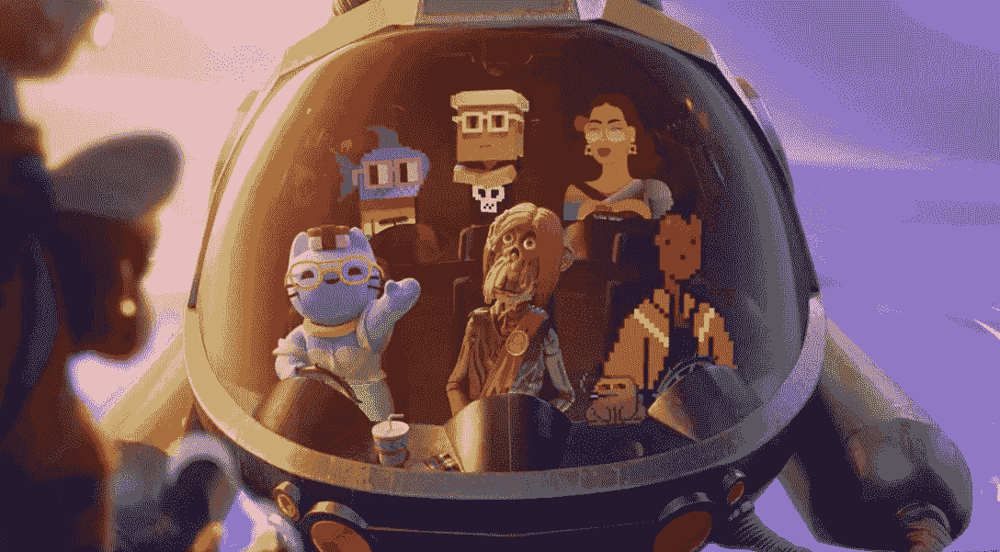
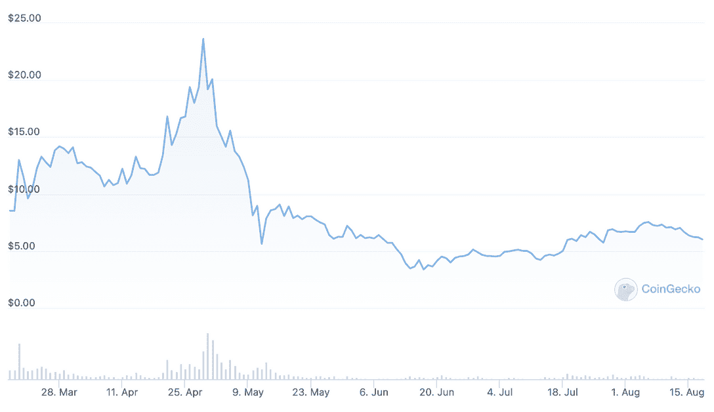

# 什么是无聊猿游艇俱乐部？

> 原文：<https://web.archive.org/web/https://dappradar.com/blog/what-is-bored-ape-yacht-club>

## 这个系列从无到有，成为蓝筹股 NFT 的极致

如果你知道 NFTs，你就知道 Bored Ape 游艇俱乐部。这是一个独家收集的不可替代的代币，可以换手成千上万美元。它有一个由有影响力的声音组成的强大社区，这些声音自豪地佩戴着他们的个人照片。但是这些无聊的猿类是如何变得如此有价值的呢？拥有一个又有什么意义呢？

**总结**

*   ***[什么是无聊猿游艇俱乐部？](https://web.archive.org/web/20221202035639/https://dappradar.com/blog/what-is-bored-ape-yacht-club/#what-is)***
*   ***[谁创办了无聊猿游艇俱乐部？](https://web.archive.org/web/20221202035639/https://dappradar.com/blog/what-is-bored-ape-yacht-club/#who-started)***
*   ***[无聊猿游艇俱乐部 NFTs 有什么效用？](https://web.archive.org/web/20221202035639/https://dappradar.com/blog/what-is-bored-ape-yacht-club/#what-utility)***
*   ***[彼岸是什么？](https://web.archive.org/web/20221202035639/https://dappradar.com/blog/what-is-bored-ape-yacht-club/#what-otherside)***
*   ***[项目是否附带令牌？](https://web.archive.org/web/20221202035639/https://dappradar.com/blog/what-is-bored-ape-yacht-club/#project-token)***
*   ***[百无聊赖的猿猴游艇俱乐部持有者能得到独家 NFT 滴滴吗？](https://web.archive.org/web/20221202035639/https://dappradar.com/blog/what-is-bored-ape-yacht-club/#nft-drops)***
*   ***[为什么无聊猿那么贵？](https://web.archive.org/web/20221202035639/https://dappradar.com/blog/what-is-bored-ape-yacht-club/#so-expensive)***
*   ***[有用链接](https://web.archive.org/web/20221202035639/https://dappradar.com/blog/what-is-bored-ape-yacht-club/#useful-links)***

## 什么是无聊猿游艇俱乐部？

Bored Ape Yacht Club (BAYC)是 10，000 个 NFT 的版本，最初是一个简单的个人资料图片(PFP)集合。每个 NFT 都有一只无聊的猿，由大约 170 种特征组合而成。每一种猿都有超过 170 种不同的特征组合。

[DappRadar’s Ultimate Guide to NFTs](https://web.archive.org/web/20221202035639/https://dappradar.com/blog/what-are-non-fungible-tokens-nfts)

该项目创建并存在于以太坊区块链，是生成艺术的一个例子。生成艺术是指有问题的作品是在计算机程序的帮助下创建的。

在这种情况下，有人创造了一个看起来无聊的猿的轮廓，然后编写了一些计算机代码，将各种特征的组合应用到每个轮廓上。这使得每只猿都是独一无二的，也赋予了每只猿不同的稀有程度。

每只猿有七个主要特征:

*   衣服
*   眼睛
*   毛
*   背景
*   耳环
*   口
*   帽子

您可以使用 DappRadar 的 [NFT 浏览器](https://web.archive.org/web/20221202035639/https://dappradar.com/hub/nft-explorer/collection/bored-ape-yacht-club)根据这些特性过滤 BAYC 集合。那么在这些之下，又有很多个人特质。你还可以发现大量的 alpha 值，比如销售历史、底价、销量等等。

[https://web.archive.org/web/20221202035639if_/https://www.youtube.com/embed/fkEaXYLOW-s?feature=oembed](https://web.archive.org/web/20221202035639if_/https://www.youtube.com/embed/fkEaXYLOW-s?feature=oembed)

DappRadar’s NFT Explorer

## 谁创办了无聊猿游艇俱乐部？

宇迦实验室是 BAYC 背后的工作室。宇迦实验室是由四个区块链爱好者和自称的“文学兄弟”创建的。他们的笔名分别是戈登·戈纳、格格巫、没有萨斯和番茄酱皇帝。

四人组受到 CryptoPunks 项目成功的启发。但是这些人想做一些更不敬的东西。他们想创建一个俱乐部，或者一个社区，通过一只无聊的猿的思维方式和所有权联系起来。于是，BAYC 诞生了。

该项目于 2021 年 4 月 23 日启动预售。4 月 29 日，该项目以 0.08 [ETH](https://web.archive.org/web/20221202035639/https://dappradar.com/hub/token/eth/ETH) 的价格全面上线。该系列在 12 小时内销售一空，但在此之后，人们对该系列没有太多兴趣。

传说当著名的 NFT 收藏家 Pranksy 宣布购买 250 只猿时，这个项目获得了动力。你可以使用[达普拉达的作品集](https://web.archive.org/web/20221202035639/https://dappradar.com/hub/wallet/eth/)查看[普朗西的加密钱包](https://web.archive.org/web/20221202035639/https://dappradar.com/hub/wallet/eth/0xD387A6E4e84a6C86bd90C158C6028A58CC8Ac459)。

> 我刚抢到 250 [@BoredApeYC](https://web.archive.org/web/20221202035639/https://twitter.com/BoredApeYC?ref_src=twsrc%5Etfw) 感谢 [@j1mmyeth](https://web.archive.org/web/20221202035639/https://twitter.com/j1mmyeth?ref_src=twsrc%5Etfw) ，1 万的限制，没有恐怖的 fomo 定价策略，每个 ape 都是. 08 ETH，+他们看起来很棒😀【https://t.co/AKcGxtyJa8[# NFTs](https://web.archive.org/web/20221202035639/https://twitter.com/hashtag/NFTs?src=hash&ref_src=twsrc%5Etfw)
> 
> 你可以在这里造币:[https://t.co/8jXxs2eeY1](https://web.archive.org/web/20221202035639/https://t.co/8jXxs2eeY1)[pic.twitter.com/Y1kAYwlhlZ](https://web.archive.org/web/20221202035639/https://t.co/Y1kAYwlhlZ)
> 
> — Pranksy 📦 (@pranksy) [May 1, 2021](https://web.archive.org/web/20221202035639/https://twitter.com/pranksy/status/1388382316024762368?ref_src=twsrc%5Etfw)

Pranksy’s tweet that got the ball rolling for BAYC

然后在 2021 年 7 月，无聊猿交易量回升，价格开始快速攀升。从那以后，BAYC 一直是蓝筹股，在 DappRadar 的 NFT 排名中一直名列前茅。

## 无聊猿游艇俱乐部 NFTs 有什么效用？

不像许多 NFT 项目跟随它的脚步并试图模仿它的成功，BAYC 确实为持有者提供了真正的效用。当人们抱着一只无聊的猿猴时，这里有一些最大的好处:

#### 进入社区

无聊猿持有者是 NFT 空间中最有权力和影响力的一些人。通常，这是因为他们抱着一只无聊的猿，这传达了地位。尽管这有点像自我实现的反馈循环，但毫无疑问，当来自 BAYC 社区的人推荐一个项目时，这个项目就会受到关注。

BAYC Discord 服务器为无聊的 Ape 持有者提供了专属频道。这个由有影响力的人和 web3 爱好者组成的网络通常是第一个知道重要信息的人，他们互相分享 alpha。因此，如果一个潜在的蓝筹项目正在进行中，这些人就会出现在白名单和预名单上。

#### 版权所有权

无聊猿持有者也拥有 NFT 形象的所有权利。这意味着只要它在某人的加密钱包里，那个人就可以对他们的猿做任何他们想做的事情。

他们可以把它作为他们公司的标志或者用在滑板设计上。阿迪达斯围绕它作为公司持有的无聊猿设计了一系列服装。一个人甚至根据他们自己的无聊猿制作了一系列全新的 NFT。

众所周知，[赛斯·格林根据他养的无聊猿猴创作了一部电视节目](https://web.archive.org/web/20221202035639/https://dappradar.com/blog/seth-green-pauses-movie-production-after-his-bored-ape-got-stolen)。此外，[史努比狗狗](https://web.archive.org/web/20221202035639/https://dappradar.com/hub/wallet/eth/0xce90a7949bb78892f159f428d0dc23a8e3584d75)和[阿姆](https://web.archive.org/web/20221202035639/https://dappradar.com/hub/wallet/eth/0x79f261f483b7cef4f995c1f8a0f46f88450423e3)在他们的最新歌曲的音乐视频中展示了他们的[猿。](https://web.archive.org/web/20221202035639/https://dappradar.com/blog/snoop-dogg-and-eminem-use-nft-ownership-for-new-music-video)

[https://web.archive.org/web/20221202035639if_/https://www.youtube.com/embed/RjrA-slMoZ4?feature=oembed](https://web.archive.org/web/20221202035639if_/https://www.youtube.com/embed/RjrA-slMoZ4?feature=oembed)

Eminem and Snoop Dogg’s track featuring their Bored Apes

#### 这是元宇宙的 3D 头像

因为 BAYC 的持有者拥有他们无聊的猿的图像的权利，他们可以在其他兼容的虚拟世界中使用它作为化身。BAYC 并不是唯一一个允许你这么做的项目，但这绝不是所有 NFT 玩家的标准做法。所以这绝对是这个系列的额外津贴。

要将你无聊的猿 NFT 运送到你想去的地方，你需要找到一个可以容纳不同化身角色的虚拟世界。然后你需要得到 3D 文件并把它转移到新的平台上。

这不仅仅是你可以使用你无聊的猿的单独的虚拟世界。2022 年 5 月，宇迦实验室在另一边出售了近 10 万块数字土地。这是该公司自己对元宇宙的补充。

[DappRadar’s Ultimate Guide to Yuga Labs’ Otherside](https://web.archive.org/web/20221202035639/https://dappradar.com/blog/what-is-the-otherside-metaverse-how-does-it-work)

## 另一边是什么？

另一边是宇迦实验室自己的数字世界，我们称之为元宇宙。五月份的首次销售超额认购，以太坊的汽油费高达 474 美元。宇迦实验室在一天之内卖出了价值 6 亿美元的土地。

7 月份有一个游戏测试，另一边的土地持有者进入虚拟世界玩了一会儿，看看生态系统是否能容纳这么多玩家。网上有这次测试的片段,[dappardar 当时写了一篇关于它的文章](https://web.archive.org/web/20221202035639/https://dappradar.com/blog/will-the-otherside-demo-give-the-metaverse-a-new-push/)。

[https://web.archive.org/web/20221202035639if_/https://www.youtube.com/embed/qt1equGhkQE?feature=oembed](https://web.archive.org/web/20221202035639if_/https://www.youtube.com/embed/qt1equGhkQE?feature=oembed)

Yuga Labs’ trailer Otherside

在彼岸有 10 万块土地，这个平台有自己的市场。交易者需要一枚硬币在市场上购买物品。其他精选 NFT 的持有者可以在宇迦实验室的生态系统中使用它们。

NFT collections compatible with Otherside

## 项目是否附有令牌？

ApeCoin ( [APE](https://web.archive.org/web/20221202035639/https://dappradar.com/hub/token/eth/APE?from=0x4d224452801aced8b2f0aebe155379bb5d594381) )是 Otherside 的土著令牌。因此，虽然没有官方的 BAYC 加密货币，但宇迦实验室在 Bored ape 成功的基础上建立的基于 Ape 的生态系统确实有一枚相关的硬币。

该令牌于 2022 年在“彼岸”发射前夕被丢弃。由于它是人们需要花费才能得到土地的货币，它的价值在土地出售前大幅增加。

The ApeCoin price peaked in late April, just before the Otherside land sale

当代币发行时，无聊的猿类持有者可以获得 10094 枚硬币。当时，这价值 86202 美元。不错，只是因为拿了一个 NFT。你可以使用 DappRadar 的[令牌浏览器](https://web.archive.org/web/20221202035639/https://dappradar.com/hub/tokens/ethereum/all/1)查看[ape coin](https://web.archive.org/web/20221202035639/https://dappradar.com/hub/token/eth/APE?from=0x4d224452801aced8b2f0aebe155379bb5d594381)的当前值。

## 无聊的猿类游艇俱乐部持有人得到独家 NFT 滴？

是的，BAYC 已经给了很多独家的 NFT 给无聊的 Ape 持有者。

#### 变异猿游艇俱乐部

当宇迦实验室向无聊的猿类持有者投放三种血清中的一种时，突变猿类游艇俱乐部诞生了。它要么是 M1，M2，要么是巨大变异(M3)血清，按照稀有程度的顺序上升。宇迦实验室在 2021 年 8 月推出了这个 BAYC 分支。

当持有者混合燃烧血清并将其与他们的猿混合时，他们铸造了一个新的突变猿。这些二级 NFT 现在可以卖到数万美元。使用我们的 NFT 探索者，了解它们目前的价值。

#### 无聊猿养狗俱乐部

这些可爱的小狗在 2021 年 6 月出生，在变异猿被创造出来之前。它们被分发给无聊的猿类持有者，作为成为社区一员的奖励。这个想法是给人类一个猿类最好的朋友，同时拓宽了白鲸的生态系统。

尽管它们是在 MAYC 之前创建的，但 BAKC 在二级市场上的价值较低。你可以通过[访问他们在 DappRadar 的 NFT 浏览器上的页面](https://web.archive.org/web/20221202035639/https://dappradar.com/hub/nft-explorer/collection/bored-ape-kennel-club)来发现他们现在的交易价格。

#### 硬币

正如我们已经看到的，无聊的猿持有者也可以在另一边销售的准备阶段推出硬币代币。当 ApeCoin 达到 26.70 美元的历史高点时，这些代币的价值为 269，510 美元。

## 为什么无聊猿那么贵？

这是一个没有明确答案的问题。有些事情只是抓住了时代精神，并不一定总是有韵律或理由。但有几个原因肯定有助于该系列的成功:

#### 时机

BAYC 在 NFT 牛市开始时推出。毫无疑问，它对此有所贡献，但它也是全球金融危机和人们拥有闲置资本的受益者。NFT 技术是主流媒体，人们希望参与其中。

随着加密货币价格的上涨和人们狂热的投机，无聊的类人猿的价格持续上涨。但是，由于该系列恰好在 NFTs 获得如此多的关注之前推出，它们被视为一个可信的 OG 项目。

#### 名人代言

拥有无聊猿猴的名人名单有我的胳膊那么长。它们是这些非传统食物如此受欢迎的主要原因之一，因为它们是终极的身份象征。

但是，尽管高调的名人经常为品牌和产品代言收取数百万美元的费用，这些名人却为他们的猿类支付了高价。他们是制作 NFTs 必备品的最终代言人。

以下是一些在他们的加密钱包里有一只无聊的猿的著名名字的列表。点击一个名字，看看他们还有什么。

*   [史努比狗狗](https://web.archive.org/web/20221202035639/https://dappradar.com/hub/wallet/eth/0xce90a7949bb78892f159f428d0dc23a8e3584d75)
*   [内马尔](https://web.archive.org/web/20221202035639/https://dappradar.com/hub/wallet/eth/0xc4505db8cc490767fa6f4b6f0f2bdd668b357a5d)
*   [巴黎希尔顿](https://web.archive.org/web/20221202035639/https://dappradar.com/hub/wallet/eth/0xb6aa5a1aa37a4195725cdf1576dc741d359b56bd)
*   [阿姆](https://web.archive.org/web/20221202035639/https://dappradar.com/hub/wallet/eth/0x79f261f483b7cef4f995c1f8a0f46f88450423e3)
*   [麦当娜](https://web.archive.org/web/20221202035639/https://dappradar.com/hub/wallet/eth/0x8ea95Bdc5cDddC0b7EbAd841F0c1f2cA6168b6a9)
*   斯蒂芬·库里

#### 真正的效用和津贴

我们已经看到了人们拥有一只无聊的猿会得到什么。提供的回报可以让人们变得富有，所以拥有一辆车被视为一项不错的投资。

## 有用的链接

*   [前往 BAYC 平台](https://web.archive.org/web/20221202035639/https://dappradar.com/deeplink/6669)
*   [BAYC 单个 dapp 页面](https://web.archive.org/web/20221202035639/https://dappradar.com/ethereum/collectibles/bored-ape-yacht-club)
*   [NFT 探险家中的 BAYC](https://web.archive.org/web/20221202035639/https://dappradar.com/hub/nft-explorer/collection/bored-ape-yacht-club)
*   [去另一边](https://web.archive.org/web/20221202035639/https://dappradar.com/deeplink/15910)
*   [关于 BAYC 的文章](https://web.archive.org/web/20221202035639/https://dappradar.com/blog/search/?q=bored%20ape)

 NewsletterUnsubscribe at any time. [T&Cs](https://web.archive.org/web/20221202035639/https://dappradar.com/terms) and [Privacy Policy](https://web.archive.org/web/20221202035639/https://dappradar.com/privacy-policy)