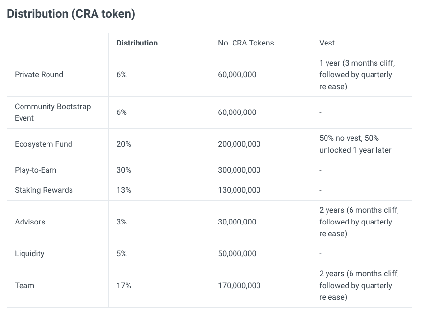
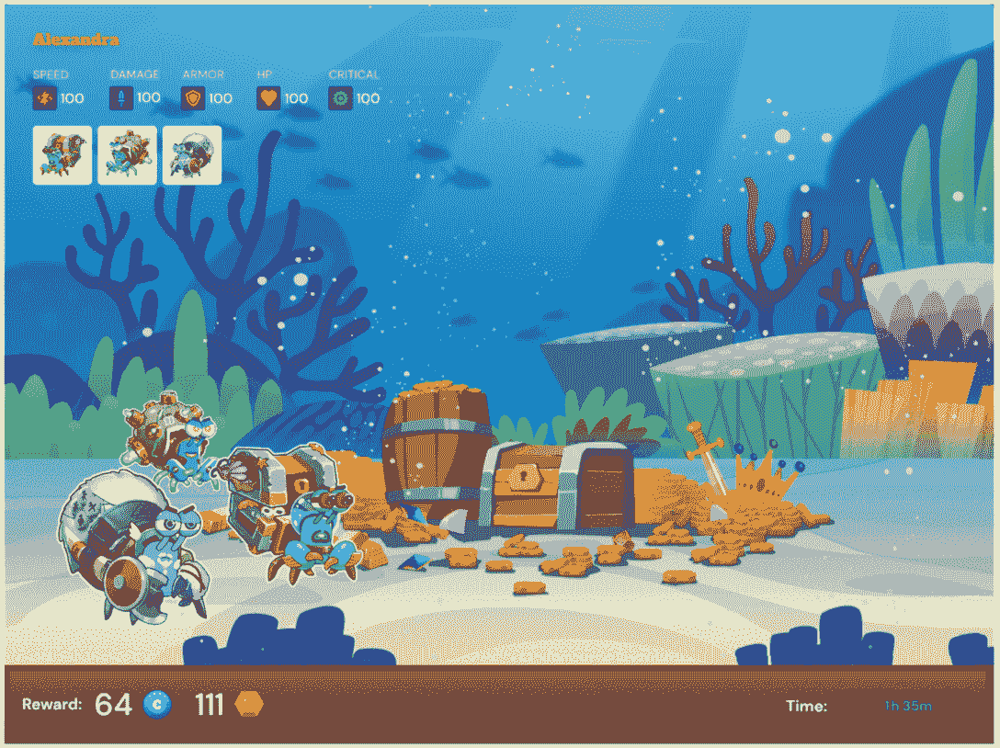
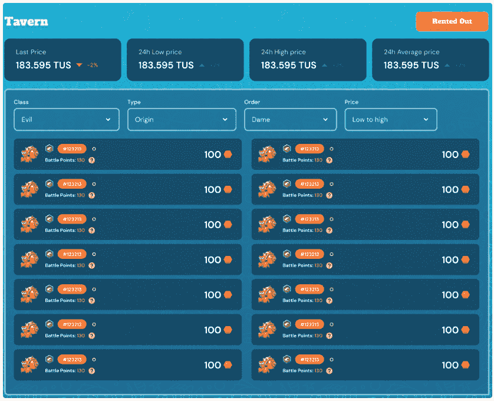
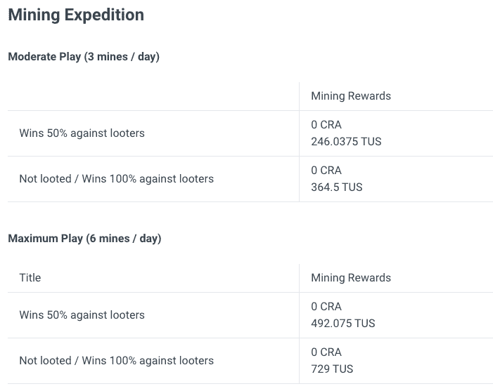
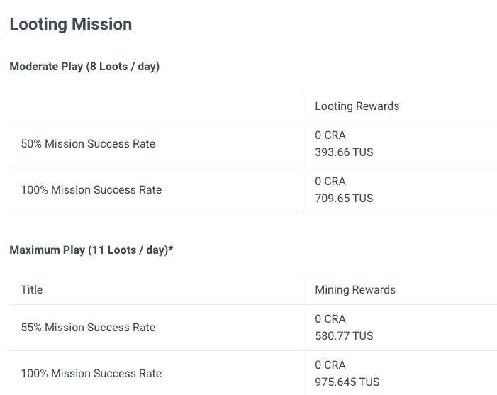

# 克拉巴达和他们的 CRA 令牌是什么？

> 原文：<https://web.archive.org/web/https://dappradar.com/blog/what-is-crabada-cra-token>

## 隐士与螃蟹战斗，用 CRA 代币奖励你

Crabada 是 Avalanche 网络上的一款免费游戏。故事发生在一个海底世界，那里充满了凶猛好斗的寄居蟹克拉巴达。邀请玩家进行以链上 NFT 为代表的养殖、出借、出租、战蟹，赚取具有真实价值的加密货币。

CRA 令牌是 Crabada 的主要治理令牌。硬币的总供应量为 1，000，000，000，玩家可以通过游戏或赌注赢得它。你可以在文章后面的表格中看到 CRA 是如何分布的。

**内容**

*   *[克拉巴达是什么，怎么玩？](https://web.archive.org/web/20230207013337/https://dappradar.com/blog/what-is-crabada-cra-token/#what-is)*
*   *[克拉巴达](https://web.archive.org/web/20230207013337/https://dappradar.com/blog/what-is-crabada-cra-token/#tokens)中的令牌*
*   *[三种游戏模式](https://web.archive.org/web/20230207013337/https://dappradar.com/blog/what-is-crabada-cra-token/#three-modes)*
    *   *[劫掠和采矿任务](https://web.archive.org/web/20230207013337/https://dappradar.com/blog/what-is-crabada-cra-token/#looting-mining)*
    *   *借贷雇佣佣兵蟹*
    *   *[战斗](https://web.archive.org/web/20230207013337/https://dappradar.com/blog/what-is-crabada-cra-token/#combat)*
*   *[在克拉巴达能挣多少？](https://web.archive.org/web/20230207013337/https://dappradar.com/blog/what-is-crabada-cra-token/#earn-crabada)*
*   *[克拉巴达的 NFT 市场](https://web.archive.org/web/20230207013337/https://dappradar.com/blog/what-is-crabada-cra-token/#nft-market)*

[https://web.archive.org/web/20230207013337if_/https://www.youtube.com/embed/H8lxwd7Pl5s?feature=oembed](https://web.archive.org/web/20230207013337if_/https://www.youtube.com/embed/H8lxwd7Pl5s?feature=oembed)

Crabada Battle Demo

[Explore Crabada Data](https://web.archive.org/web/20230207013337/https://dappradar.com/avalanche/games/crabada)

## 什么是克拉巴达，你是如何演奏的？

Crabada 是雪崩上一款流行的即玩即赚游戏，背景是一个名为 Crabada 的寄居蟹世界。玩家可以通过采矿、抢劫、饲养螃蟹或下注代币来赚取游戏中的货币。克拉巴达以其独特的经济模式而闻名，该模式为玩家提供了大量赚取奖励的方式。

有三种主要的方法来玩螃蟹和赚取 CRA:抢劫和采矿任务，租借和雇佣雇佣军螃蟹，或简单的战斗。我们将在下面详细讨论。

## 查巴达代币

Crabada 生态系统有三个不同的令牌，每个令牌都有自己的用例。它们是关于 CRA、TUS 和补习。

*   CRA 是平台上的治理令牌，在激励期内通过下注和玩游戏来获得回报。
*   此外，还有 TUS，游戏中的货币。玩家通过采矿、掠夺和通过酒馆租借螃蟹来赚取 TUS。
*   最后，CRAM 是通过下注 CRA 获得的护身符，可以用于游戏内的额外津贴和独家奖励。

CRA 分布在不同的基金、生态系统和用户中，例如:

CRA token distribution

行权时间表是这样的:

CRA token vesting schedule

### 在查巴达赚取图图

使用由三个克拉巴达组成的团队，玩家可以通过游戏赚取游戏中的货币，TUS。此外，分配 60，000，000 CRA 作为空闲游戏的奖励。这些激励持续了两个月，在游戏刚上线的时候就发放了。

Crabs in action: earning TUS

克拉巴达资产可以部署到海底世界的各种矿山。玩家必须先组成一个采矿队，由三个克拉巴达组成。接下来，玩家选择一个空矿，并部署他们的采矿队。

克拉巴达然后开始工作，开始挖掘宝藏的过程，不需要玩家的任何监督。默认情况下，每次采矿探险需要四个小时，奖励从工具箱到代币不等。

## 三种游戏模式

### 寻找和采矿任务

克拉巴达也可以被部署去掠夺另一个采矿队占领的矿山。玩家必须首先组成一个由三个克拉巴达组成的劫掠队。接下来，玩家选择另一个玩家正在开采的矿，并部署他们的掠夺队。

克拉巴达将开始与采矿队交战。每次抢劫任务将需要一个小时到两个半小时，这取决于采矿方是否派出增援部队来保卫他们的矿井。

与采矿相比，抢劫任务是有风险的，但是游戏用少量的赏金奖励冒险，不管任务的结果如何。

### 租借和雇佣雇佣兵螃蟹

没有采矿或抢劫的闲置克拉巴达仍然可以通过被部署到酒馆当雇佣兵来获得奖励。这使得其他人手不足的玩家可以付费雇佣你的克拉巴达作为增援。

战斗结束后，不管结果如何，所有克拉巴达人都会毫发无伤地回到酒馆。另一方面，如果玩家需要增援，他们可以在 TUS 以贷方确定的价格雇佣克拉巴达。酒馆收取 10%的费用。值得注意的是，螃蟹只能作为战斗中的增援部队，而不能作为采矿或抢劫队伍的一部分。

Tavern rewards

### 战斗

在克拉巴达，战斗带来最大的刺激。矿工将充当防御者，劫掠者将充当进攻者。战斗的胜负由各队最高的总战斗属性点决定。要计算你的团队的战斗潜力，将团队的总生命值、防御和攻击相加。

获胜的队伍以代币的形式获得奖励。

## 在克拉巴达能挣多少？

该平台的游戏指南根据玩家在游戏中进行采矿探险所花费的时间概述了一些潜在的奖励。在这些探险中，玩家可以完成三个低级任务或六个高级任务。

Mining expedition rewards

下面的图表显示了玩家在抢劫探险中取得胜利可以获得的奖励。当你参加更多的比赛时，奖金会翻倍。掠夺探险的奖励会高一点，但是风险也更大，所以要确保你为战斗做好了准备。

Looting mission rewards

## 克拉巴达的 NFT 市场

在本地市场，玩家可以浏览克拉巴达的购买列表，并列出他们的克拉巴达出售。若要出售，您需要创建一个具有指定要价的列表。

买家可以从钱包里拿出 TUS 来购买克拉巴达。值得注意的是，市场交易的本地货币是 TUS 代币，卖家在完成交易后被收取 3.85%的费用。

## 随身携带您的 Web3 之旅

使用 DappRadar 移动应用程序，再也不会错过 Web3。查看最受欢迎的 dapps 的性能，并关注您投资组合中的 NFT。您在 DappRadar 上的帐户会与我们的移动应用程序同步，这样您很快就可以选择实时接收提醒。

[Download the DappRadar app now](https://web.archive.org/web/20230207013337/https://dappradar.app.link/blog)[<picture></picture>](https://web.archive.org/web/20230207013337/https://play.google.com/store/apps/details?id=com.portfolio.dappradar)