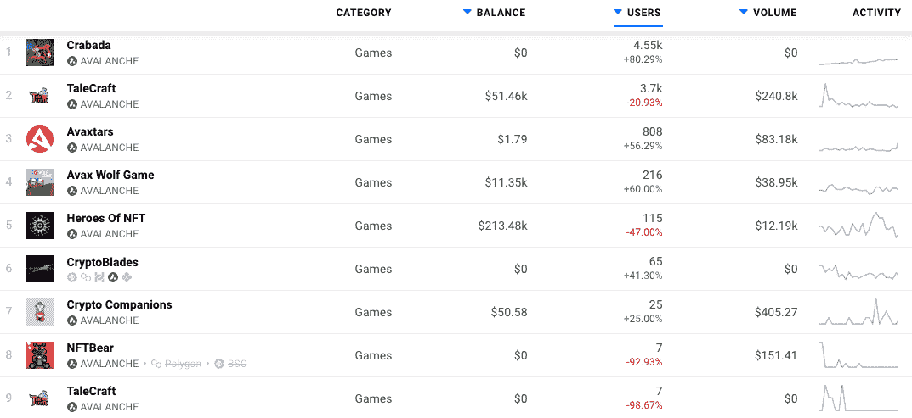
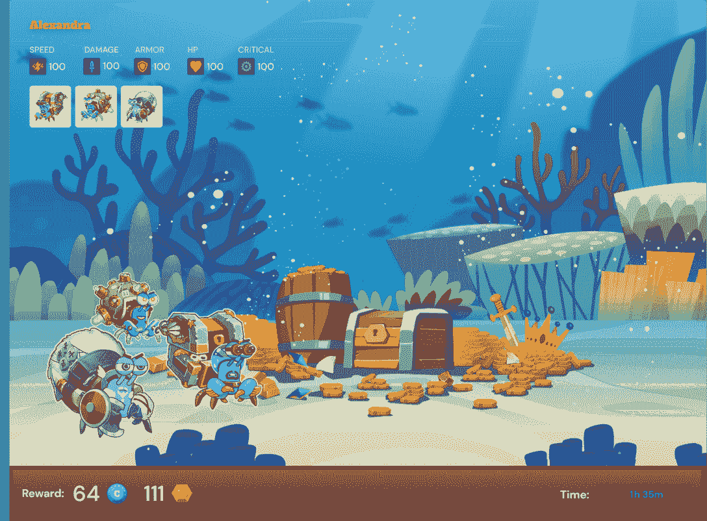
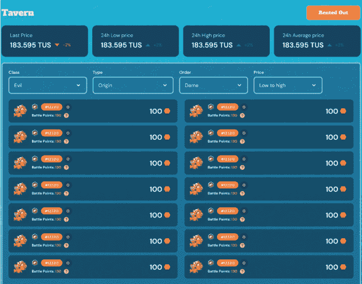
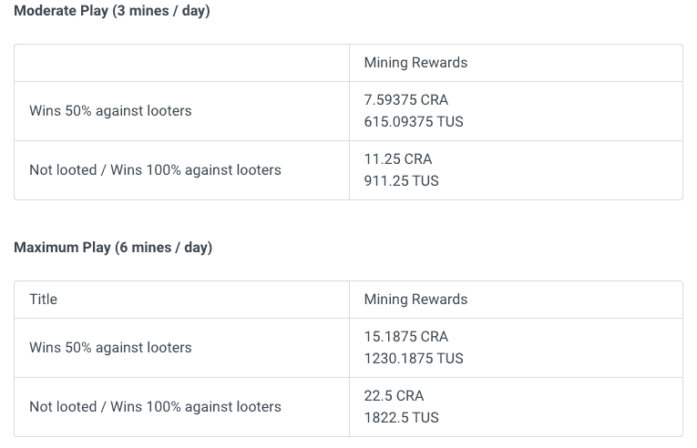
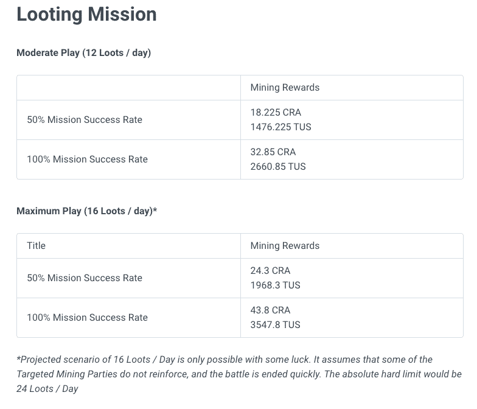
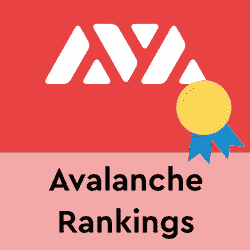

# 克拉巴达是什么？雪崩上的新游戏

> 原文：<https://web.archive.org/web/https://dappradar.com/blog/what-is-crabada-new-play-to-earn-game-on-avalanche>

## 在这款新的游戏中赢取 CRA 和 TUS

Avalanche 网络上的一款新游戏本周在 DappRadar 的游戏排名中攀升。故事发生在一个海底世界，充满了凶猛好斗的寄居蟹，它们被称为[克拉巴达](https://web.archive.org/web/20221206171325/https://dappradar.com/avalanche/games/crabada)。邀请玩家进行以链上 NFT 为代表的养殖、出借、出租、战蟹，赚取具有真实价值的加密货币。

Crabada 已经跻身游戏 dapps 前 50 名，在过去的 30 天里，连接到该平台的钱包数量增加了 80%以上。这些钱包通过 dapps 智能合约产生了近 200 万笔交易。将 Crabada 与 Avalanche 上的其他游戏产品进行比较，可以看出这款游戏虽然相对较新，但很快就站稳了脚跟。

## chabada 生态系统中的令牌

Crabada 生态系统由三个不同的令牌组成，每个令牌都有自己的用例。我们在谈论 CRA、TUS 和克拉姆。

*   CRA 是平台上的治理令牌，在激励期内通过下注和玩游戏来获得回报。在空闲游戏启动之前，CRA 最初可以通过[社区引导事件](https://web.archive.org/web/20221206171325/https://medium.com/@PlayCrabada/crabada-announces-community-bootstrap-event-b5fa60bf6e0c)获得，或者在社区引导事件之后通过 DEX 获得。
*   此外，还有 TUS，游戏中的货币。玩家通过采矿、掠夺和通过酒馆租借螃蟹来赚取 TUS。
*   最后，CRAM 是通过下注 CRA 获得的护身符，可以用于游戏内的额外津贴和独家奖励。

## 如何在克拉巴达获得 TUS

使用由三个克拉巴达组成的团队，玩家可以通过游戏赚取游戏中的货币，TUS。此外，分配 60，000，000 CRA 作为空闲游戏的奖励。这些奖励将持续至少 2 个月的时间，并从推出闲置游戏开始分配。

克拉巴达资产可以部署到海底世界的各种矿山。玩家必须先组建一个采矿队，由 3 个克拉巴达组成。接下来，玩家选择一个空矿，并部署他们的采矿队。克拉巴达然后开始工作，开始挖掘宝藏的过程，不需要玩家的任何监督。默认情况下，每次采矿探险需要 4 个小时，完成一次奖励 3.75 CRA 和 303.75 TUS。更多详情，请查看[场景](https://web.archive.org/web/20221206171325/https://docs.crabada.com/whitepaper/play-to-earn/scenerios#mining-expedition)和[每日项目奖励](https://web.archive.org/web/20221206171325/https://docs.crabada.com/whitepaper/play-to-earn/daily-projected-rewards#mining-expedition)。

## 寻找任务

克拉巴达也可以被部署去掠夺另一个采矿队占领的矿山。玩家必须先组成一个由 3 个克拉巴达组成的劫掠队。接下来，玩家选择另一个玩家正在开采的矿，并部署他们的掠夺队。克拉巴达将开始与采矿队交战。每次抢劫任务需要 1 小时到 2.5 小时，取决于采矿方是否派援军保卫他们的矿山。

与采矿相比，抢劫任务是有风险的，但是游戏用少量的赏金来奖励这种冒险，不管任务的结果如何。每参与一次掠夺任务，掠夺队将获得 0.3 CRA 和 24.3 TUS 的小奖励。一次成功的抢劫任务可以窃取采矿队 65%的奖励，总计 2.4375 CRA 和 197.4375 TUS。一次不成功的抢劫任务不会偷走采矿队的任何奖励。

## 借贷和雇佣雇佣蟹

没有采矿或抢劫的闲置克拉巴达仍然可以通过被部署到酒馆当雇佣兵来获得奖励。这使得其他人手不足的玩家可以付费雇佣你的克拉巴达作为增援。战斗结束后，不管结果如何，所有克拉巴达人都会毫发无伤地回到酒馆。另一方面，如果玩家需要增援，他们可以在 TUS 以贷方**确定的价格雇佣克拉巴达。**酒馆收取 10%的费用。值得注意的是，螃蟹只能作为战斗中的增援部队，而不能作为采矿或抢劫队伍的一部分。

## 查巴达有自己的 nft 市场

玩家可以浏览克拉巴达的列表来购买和出售他们的克拉巴达。

玩家通过创建一个指定要价的列表来出售 Crabada。买家可以从钱包里拿出 TUS 来购买克拉巴达。值得注意的是，市场交易的本地货币是 TUS 代币，卖家在完成交易后被收取 3.85%的费用。

## 你在克拉巴达挣多少钱？

该平台的游戏指南根据玩家在游戏中进行采矿探险所花费的时间概述了一些潜在的奖励。在这些探险中，玩家可以完成三个低级任务或六个高级任务。在撰写本文时， [1 CRA 价值](https://web.archive.org/web/20221206171325/https://www.coingecko.com/en/coins/crabada)约 1.17 美元，1 [TUS 价值约 0.23](https://web.archive.org/web/20221206171325/https://www.coingecko.com/en/coins/treasure-under-sea) 。

根据今天的价格，一个普通玩家在 CRA 赢得 50%的战斗后可以获得 8.70 美元，在 TUS 可以获得 141 美元。大约是每天完成六个矿井的两倍。重要的是，玩家必须检查价格，以确保他们在游戏中的活动是值得的。掠夺探险的奖励有点高，正如前面提到的，这是一个更冒险的活动。

根据今天的价格，普通玩家每天进行 12 次抢劫，成功率为 50%，在 CRA 可以赚 21 美元，在 TUS 大约 339 美元。可以说，更重要的奖励是在 TUS 给予的，因为这是玩家需要在市场上使用的令牌。

## 有猫腻吗？

和大多数游戏赚钱的机会一样，战利品都是为早期采用者准备的。投入生态系统的人越多，提供的奖励就越少，但结果是玩家形成了一个完整的游戏。

克拉巴达的团队可以说已经看到了“玩赚”游戏的成功，比如和谐网络上的 DeFi 王国，他们可以说用第一个“玩赚”提议吸引了和谐网络上的任何游戏倡导者。向一个代币持有者提供更多的效用，并以游戏化的方式在和谐网络上下注，帮助 DeFi 王国将和谐放到地图上。看来类似的事情正在 Crabada 的雪崩上发生。

如需完整的玩到赚指南[，请点击此处](https://web.archive.org/web/20221206171325/https://docs.crabada.com/whitepaper/play-to-earn)。头[在这里](https://web.archive.org/web/20221206171325/https://docs.crabada.com/game-guide/how-to-get-cra-tus)了解更多关于游戏，令牌经济学，背后的团队，以及如何参与。

[<picture></picture>](https://web.archive.org/web/20221206171325/https://dappradar.com/blog/introducing-the-avalanche-blockchain)[<picture></picture>](https://web.archive.org/web/20221206171325/https://dappradar.com/rankings/protocol/avalanche)[<picture></picture>](https://web.archive.org/web/20221206171325/https://dappradar.com/avalanche/defi/pangolin-exchange)

***以上不构成投资建议。此处给出的信息仅供参考。请行使尽职调查，做你的研究。作者持有 ETH、BTC、AGIX、HEX、LINK、GRT、CRO、OMI、不变 X、ENS、GALA、AVASTR、GMEE、CUBE、RADAR、FLOW、FTM、BNB、SPS、WRLD、ATOM 和 ADA。***

 NewsletterUnsubscribe at any time. [T&Cs](https://web.archive.org/web/20221206171325/https://dappradar.com/terms) and [Privacy Policy](https://web.archive.org/web/20221206171325/https://dappradar.com/privacy-policy)