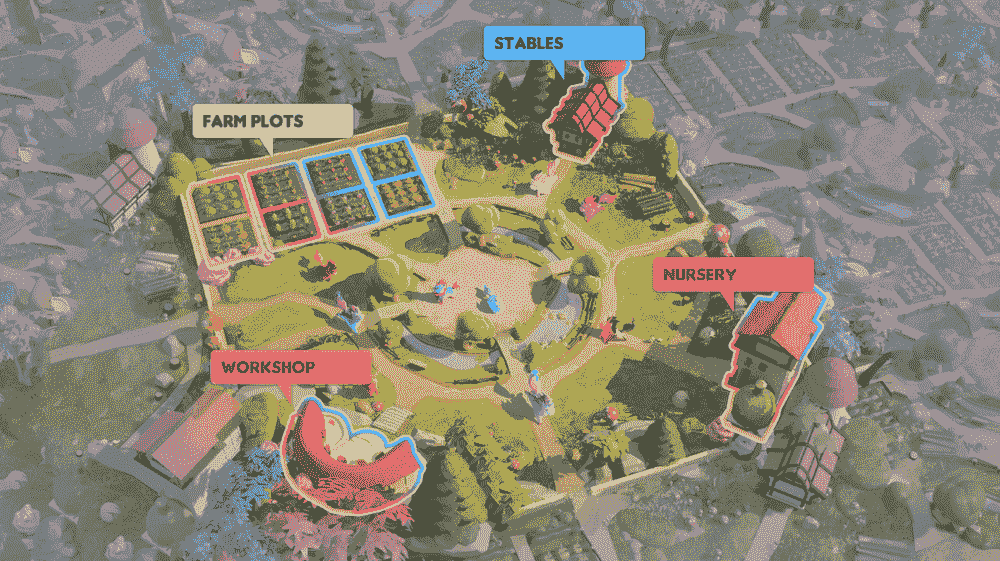
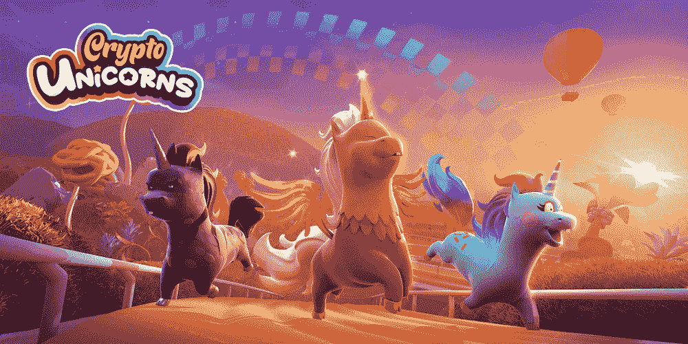

# 什么是加密独角兽，怎么玩？

> 原文：<https://web.archive.org/web/https://dappradar.com/blog/what-is-crypto-unicorns-and-how-to-play>

## 想象一下多边形区块链上可爱的毛绒绒的独角兽，你可以用它来玩和赚钱

**Crypto Unicorns 于 5 月 2 日正式推出其游戏空间。要玩这个游戏，玩家需要获得一只独角兽 NFT 和一只陆地 NFT。之后，玩家可以开始收集、繁殖可爱的独角兽，并在活动中争夺奖励。**

**总结**

*   按交易量计算，加密独角兽目前是多边形区块链上排名第一的游戏 NFT 系列。独角兽 NFTs 产生了 122，250 美元，土地 NFTs 在过去 24 小时内注册了 304，140 美元。
*   玩家需要获得至少一个陆地 NFT 和一个独角兽 NFT 才能开始游戏并获得奖励。
*   加密独角兽有两个令牌，RBW 和 UNIM，以促进游戏生态系统。

加密独角兽是一款生活在多边形区块链上的备受期待的游戏。作为 Laguna Games 的一个创意，Crypto Unicorns 拥有可爱的视觉设计和一个即玩即赚的生态系统。正式游戏于 5 月 2 日推出，其游戏内的 NFT 已经在过去 24 小时内接管了多边形区块链上的 OpenSea。

从 2022 年初开始，随着游戏越来越接近发布日期，两种主要的游戏内资产土地和独角兽的数量一直在稳步增长。从数据的角度来看，独角兽 NFT 已经积累了约 2500 万美元的历史成交量，在过去 24 小时内达到 122，250 美元。陆地非森林旅游也有令人印象深刻的表现，创下了接近 1200 万美元的历史记录，之前 24 小时的交易量达到 301140 美元。

## 加密独角兽游戏解释

加密独角兽目前提供数字宠物工艺和养殖。其他游戏，包括格斗、赛车和团队 RPG，将在 2022 年陆续推出。

要开始游戏，用户需要从 OpenSea 获得一块土地和一只独角兽。一旦玩家拥有一只独角兽，这块土地就会被激活。因此这两个 NFT 是开始游戏的基本资产。

手工艺和农业游戏以土地 NFTs 为中心。每块土地都有四个主要组成部分，每个部分都有独特的功能:

*   农场插槽——玩家可以在那里种植用于制作工艺的职业浆果。
*   工作室——独角兽在这里施展魔法生产和加工材料。生产材料需要玩家在车间里放置独角兽一段时间。
*   **托儿所**——玩家在这里繁殖或进化他们的独角兽。这也是新独角兽诞生的地方。

Stables-玩家可以在这里看到他们所有的独角兽部队，并在未来举行聚会等活动。升级马厩可以让独角兽更快的恢复能量。

土地有不同的稀有性，这意味着稀有土地可以生产更多。地可以分为普通地、稀有地和神话地，稀有程度依次递增。土地越稀有，生产力越高，buffs 越多。拥有自己的独角兽在各种游戏中都是必不可少的，它给这片土地带来了生机。最初，玩家可以从 10，000 个 Genesis 蛋中的一个孵化出他们的第一只独角兽。由于创世纪蛋在去年 11 月全部售罄，玩家只能在 OpenSea 上购买孵化的独角兽，然后可以用两只独角兽繁殖更多。

每只独角兽都有一套基因，赋予它们独特的视觉特征、战斗属性和核心属性。这些统计数据决定了独角兽在特定类型的迷你游戏中赢得奖励的能力。因此，举例来说，格斗和团队角色扮演将使用战斗统计，而赛车将使用结合核心统计计算的分数。

玩家可以从[加密独角兽游戏指南](https://web.archive.org/web/20220929121419/https://cryptounicorns.notion.site/cryptounicorns/Crypto-Unicorns-Game-Guide-4f3df83096fc4e57b58197b328442b71)中了解更多关于游戏的[技巧和诀窍](https://web.archive.org/web/20220929121419/https://cryptounicorns.notion.site/cryptounicorns/Crypto-Unicorns-Game-Guide-4f3df83096fc4e57b58197b328442b71)。

## 加密独角兽标记组学

加密独角兽的特征是双令牌经济，它促进了从玩到赚的机制，并为整个生态系统注入了活力。

彩虹令牌(RBW)，ERC20 令牌，总供应量为 1，000，000，000，在独角兽元宇宙中用作治理令牌。RBW 持有者可以以各种方式利用这些代币，包括进化和繁殖独角兽，对关键的治理决策进行投票，以及获得 RBW 作为奖励。

独角兽牛奶(UNIM)是加密独角兽生态系统中的另一个 ERC20 令牌，也是繁殖和进化独角兽的重要材料。玩家可以通过参加各种活动和锦标赛来获得此令牌。当在繁殖过程中使用时，UNIM 代币将被烧毁，从而被取消供应。

## 通过先锋计划获得游戏材料

加密独角兽公司本周三宣布了它的先锋计划。这是一个土地标桩计划，将跨越四个多星期，游戏中的材料空投给参与者。

要参与该计划，玩家必须在 5 月 8 日 00:00 UTC 之前“锁定”他们的土地。值得一提的是，玩家必须在整个计划中保持他们的土地“锁定”，才有资格获得每周奖励。查看 Crypto Unicorns 的[先锋计划中关于奖励分配的详细信息。](https://web.archive.org/web/20220929121419/https://medium.com/@lagunagames/pioneer-program-ad07e24d23ac)

## 最后的想法

如前所述，玩家需要购买一个土地 NFT 和一个独角兽 NFT 开始玩游戏。目前，陆地非森林交易量为 0.139 ETH，共有 5600 名持有人持有 30000 份非森林交易量。独角兽的底价是 1.2 ETH，2800 名持有人欠 1 万枚代币。

通过这些数字，我们注意到两个问题。首先，这两个 NFT 集合的持有人集中率相对较高，表明容易控制地板价格。这也带来了第二个问题。Crypto Unicorns 游戏空间于两天前首次亮相，但后来者已经很难体验到这款游戏，因为他们需要支付 3000 美元才能入门。可惜这么高的游戏参与门槛恐怕是不利的，如果他们想实现大规模采用的话。

DappRadar 将继续关注加密独角兽的最新发展。在 [Twitter](https://web.archive.org/web/20220929121419/https://twitter.com/dappradar) 、 [Discord](https://web.archive.org/web/20220929121419/https://discord.gg/4ybbssrHkm) 和 [Youtube](https://web.archive.org/web/20220929121419/https://www.youtube.com/c/DappRadar) 上关注我们，跟上区块链世界的动态。