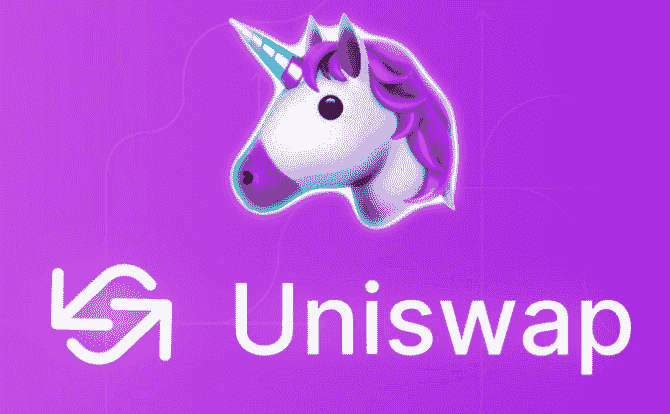
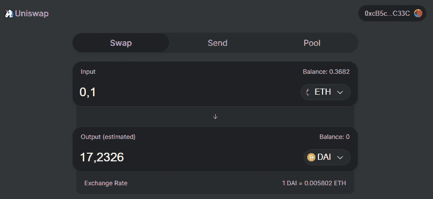
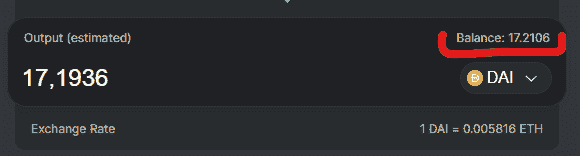
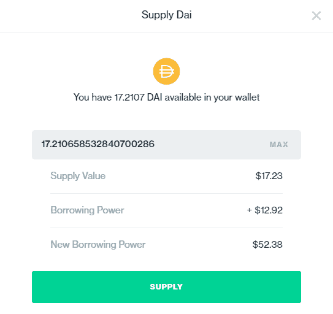
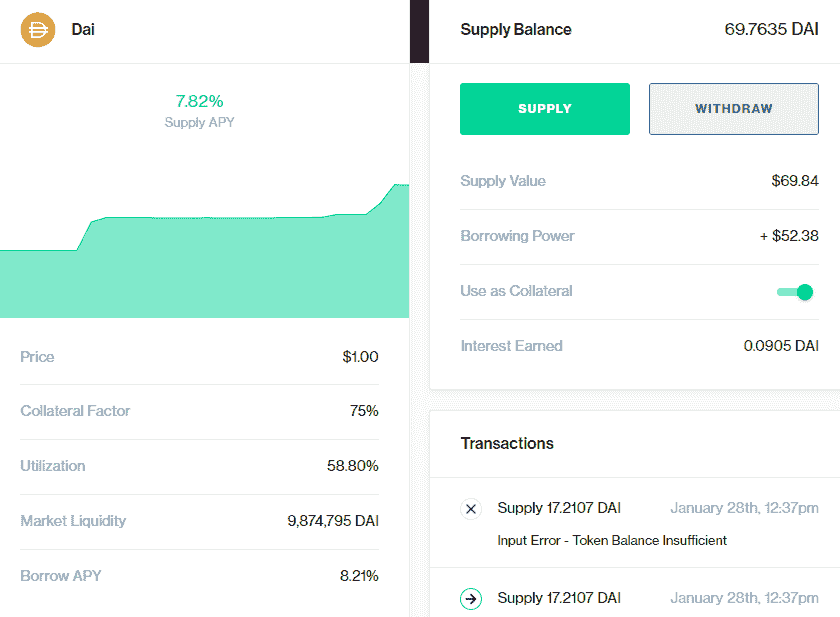
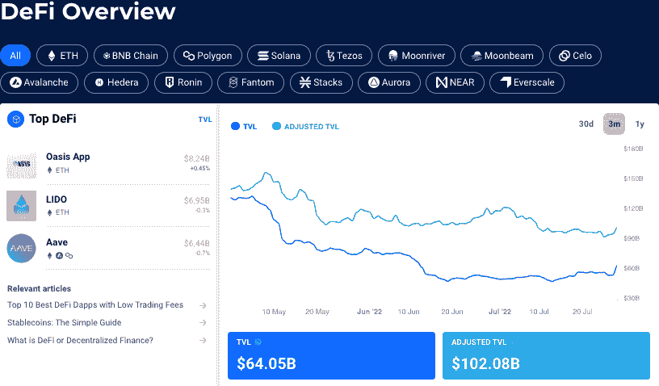

# 什么是 DeFi？逐步入门指南

> 原文：<https://web.archive.org/web/https://dappradar.com/blog/what-is-defi-and-how-can-i-save-money-with-it>

## 以下是如何开始使用 DeFi 的分步指南。

去中心化金融是一种利用去中心化网络将旧的金融产品转变为无中介、无信任的透明协议的运动。

换句话说，它将普通银行客户与银行家放在了同一水平上。

借助以太坊区块链的力量，我们可以毫无困难地充当交易所、流动性提供者和贷款人，为增加整个去中心化金融系统的流动性和稳定性做出贡献，这是我们为自己和我们的财务自由需求而创建的。

*One of the leading products of DeFi is the Uniswap exchange created by* [@haydenzadams](https://web.archive.org/web/20221206093801/https://twitter.com/haydenzadams).

## DeFi 中的 Uniswap 是什么？

[Uniswap](https://web.archive.org/web/20221206093801/https://dappradar.com/blog/what-is-uniswap-and-how-to-use-it) 完全在线，个人只要拥有元掩码，就可以使用该协议。 [Uniswap](https://web.archive.org/web/20221206093801/https://dappradar.com/hub/token/eth/UNI/ETH?from=0x1f9840a85d5af5bf1d1762f925bdaddc4201f984) 是一个用户可以通过向他们想要的货币对提供流动性来赚钱的地方。

 NewsletterUnsubscribe at any time. [T&Cs](https://web.archive.org/web/20221206093801/https://dappradar.com/terms) and [Privacy Policy](https://web.archive.org/web/20221206093801/https://dappradar.com/privacy-policy)

所以，如果你想支持某种代币及其流动性，你需要锁定这种 ERC-20 代币和 ETH(价值完全相同，因为流动性提供者需要充当交易双方)。

这不是一个简单的话题，因此要了解更多信息，请访问[https://docs.uniswap.io/](https://web.archive.org/web/20221206093801/https://docs.uniswap.io/)，如果您正在寻找通过 Uniswap 赚钱的方法，您需要在这里搜索更多关于成为流动性提供商[的信息。](https://web.archive.org/web/20221206093801/https://medium.com/@pintail/uniswap-a-good-deal-for-liquidity-providers-104c0b6816f2)

## Uniswap 和 DeFi 如何提供帮助？

我们将使用 Uniswap 作为一个交易所，在这里我们可以轻松地将 ETH 交易为 DAI，反之亦然，而无需创建帐户或通过 KYC 流程。

在一些国家，银行从存款中给你低至 2%的年利率，但也有一些规定，如“在存款期结束前你不能提取资金”。还有，你不能把这些资金作为抵押品或者其他任何东西。你只是锁定他们，你需要等待一年或更长时间。

所有这些都被标榜为地球上最好的投资机会。此外，投资者过去认为 6-8%的年回报率是最佳时机。时代已经改变，DeFi 正在扰乱金融系统，这就是为什么我们的目标是教育人们更可靠、更适合寻求财务自由的个人的新技术。

## 赌注是如何运作的？

DeFi 中的赌注是一个总括术语，涵盖所有需要临时提交加密资产的 DeF 活动。通过赌注，您可以将加密资产锁定在智能合约中，以换取成为 DeFi 协议或第 1 层区块链中的验证者，并因履行角色要求的职责而获得奖励

## 定义桩有哪些不同的种类？

### 红星

一般来说，DeFi staking 允许你将你的密码锁定在 DeFi smart 契约中，成为网络验证器的一部分。这是一个伟大的方式，使被动收入出你的密码，同时有助于使网络更加安全。

### 高产农业

收益农业是 DeFi 中的另一种被动投资方法，投资者从回报、交易费、利息和价格上涨中获利。它包括将你的密码锁定在一个流动性池中，并促进交易、借贷。

例如，在 yield farming 中，你可以通过 Compound (COMP)向 DAI 放贷，后者再将硬币借给借款人。然后，您可以获取每天赚取的利息，并获得可以增值的红利硬币。

### 流动性挖掘

流动性开采是产量农业的一个子集。在 DeFi 中使用流动性挖掘作为投资策略涉及锁定各种区块链协议中的加密资产，以赚取被动收入。

它与高产农业非常相似，但有一些不同。它更具竞争力，因为农民被迫追逐 APY 利率最高的流动性池。收益养殖协议除了费用奖励外，还分发流动性池代币，当这些代币被养殖时，非永久性损失的风险会增加。

非永久性是指基于流动性池的自动做市商(AMM)中两种加密货币资产价值之间的净差额。

通过 DappRadar 的终极指南了解更多关于分散金融(DeFi)的信息。

## 什么是复合金融？

Compound 是一个开源的自治协议，专为开发人员构建，用于开发一系列新的金融应用程序。它专注于开放金融系统的利息和借款。

根据 DappRadar 的数据，该复合协议的锁定价值超过 40.3 亿美元。

本质上，Compound 是一个基于以太坊的去中心化借贷平台。复合协议支持特定加密货币的借贷。

以下是 Compound 支持的一些主要令牌:

*   美元硬币(USDC)
*   乙醚
*   包装 BTC (WBTC)
*   奶妈
*   基本注意力标志
*   系绳(USDT)

在下面的例子中，我们将看到如何使用复合金融通过 DAI 加密货币节省一些钱。

## 如何与戴复合使用？

要操作复合协议并赚取 7.5%的年利率(在撰写本文时)，您需要[将您的 ETH 兑换成 MakerDAO 的 DAI](https://web.archive.org/web/20221206093801/https://dappradar.com/hub/swap/eth/ETH/DAI) stablecoin。

最好也是最简单的方法(不需要新账户，不需要 KYC)是使用完全分散的 Uniswap 交换。您可以直接从 Metamask 钱包中使用它，而无需将您的珍贵令牌发送到任何其他集中的交易所。

### 这就是如何用十个简单的步骤开始。

1.使用您的元掩码登录 uni swap([https://uniswap.exchange/swap](https://web.archive.org/web/20221206093801/https://uniswap.exchange/swap))

2.解锁您的 ETH 和 DAI，并允许 Uniswap 与您的令牌进行交互。

3.把你的以太变成戴

4.等待几分钟，以太坊区块链处理交易。此后，您将在同一窗口中看到戴余额。

5.前往[https://app.compound.finance/](https://web.archive.org/web/20221206093801/https://app.compound.finance/)并使用您的 Metamask 帐户登录。

6.从可用市场中选择戴，然后单击它。

7.这是主面板，您可以在这里看到您的储蓄统计数据。点击绿色的“供应”按钮，以便将您的 DAI 锁定在复合智能合同中(借给想要借用它的其他人，因此您给出了“对借用电力池的供应”)。

8.设置您想要锁定的 DAI 数量。请记住，你可以在任何时候提取你的戴，此外，你将取出你在锁定资金期间获得的所有收益。

9.再次单击绿色的 Supply 按钮，并在元掩码中确认交易

10.就是这样！你只是开始以完全被动和分散的方式赚钱。

### 使用 DeFi 轻松省钱

在主面板的左侧，有关于复合储蓄率和市场流动性的总体统计数据。在右侧，您可以看到您的帐户信息，例如:您在智能合约中锁定了多少，您的借贷能力是多少，以及您为池中提供 DAI 赚了多少。

只需十个步骤，你就可以轻松省钱。没有 KYC，没有新账户，没有邮件确认，一点麻烦都没有。存款没有最低限额。取消押金没有罚款。你说魔法，我说纯形态的 DeFi。

## DeFi 应该被监管吗？

尽管去中心化金融(DeFi)赋予了其用户很大的权力，提供了任何银行都无法提供的大量服务，但它并不全是桃子和奶油。

DeFi 协议依赖于构建它们的区块链，并且可能经历多种网络攻击。例如，这些攻击可能通过利用耗尽用户资金的特定协议漏洞而发生。

此外，攻击可以通过所谓的“快速贷款”发生，这种贷款是没有抵押品的代币贷款，然后可以用来影响价格并在快速偿还贷款之前获利。

如果每个人都同时从流动性池中提取加密货币(一种“银行挤兑”情景)，结果对最终失去资金和流动性的用户不利。

全世界的监管机构都在致力于监管 crypto，特别是 DeFi。对他们来说，有三个基本问题:打击洗钱、恐怖融资和消费者保护。

投资者在涉足加密领域之前，尤其是 DeFi 之前，应该好好教育自己。至于 DeFi 要不要监管，这个看你问谁了。

一些人认为这样做有助于培养一种透明和消费者保护的文化，这最终对 DeFi 和 crypto 的整体采用是积极的。

然而，其他人认为，DeFi 的要点是保持分散，顾名思义，这意味着它不应该对法规负责，因为这些法规需要集中的行为者来执行。

我们 DappRadar 正在密切关注这个话题。这里是你需要知道的关于全球密码法规的所有信息。

## 你怎么能对 DeFi 使用 DappRadar？

首先，确保将你的钱包连接到 DappRadar，并[成为专业用户](https://web.archive.org/web/20221206093801/https://dappradar.com/token/pro)，这样你就可以充分享受我们的平台。然而，任何用户都可以通过使用我们的 [DeFi 排名工具](https://web.archive.org/web/20221206093801/https://dappradar.com/defi)，跟踪他们喜欢的 DeFi dapps，并获得 DeFi 景观的完整概述。

在这里，您可以按协议过滤 dapps，并获得实时准确的数据和补充信息，了解做出正确决策所需的所有信息。

使用上面的 uni WAP 示例，在将您的 Metamask 钱包连接到我们的平台后，您还可以通过 DappRadar 访问 uni WAP。

了解如何将您的钱包连接到 DappRadar

[https://web.archive.org/web/20221206093801if_/https://www.youtube.com/embed/woduDyWuKHY?feature=oembed](https://web.archive.org/web/20221206093801if_/https://www.youtube.com/embed/woduDyWuKHY?feature=oembed)

***以上不构成投资建议。此处给出的信息仅供参考。请行使尽职调查，做你的研究。***

 NewsletterUnsubscribe at any time. [T&Cs](https://web.archive.org/web/20221206093801/https://dappradar.com/terms) and [Privacy Policy](https://web.archive.org/web/20221206093801/https://dappradar.com/privacy-policy)