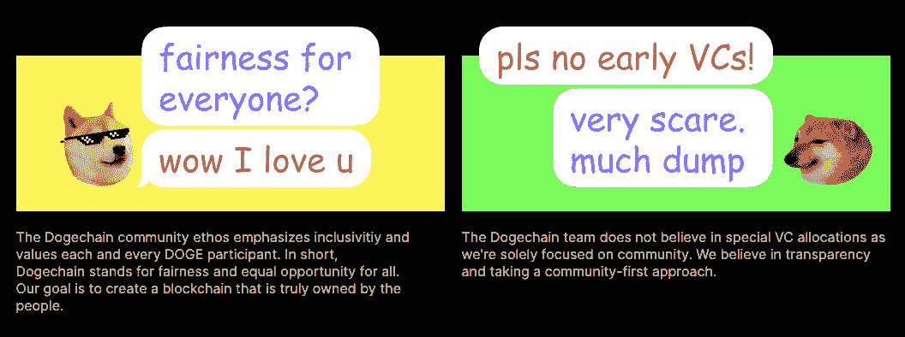
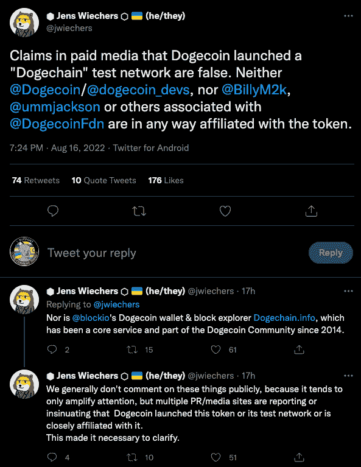
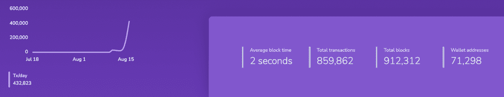
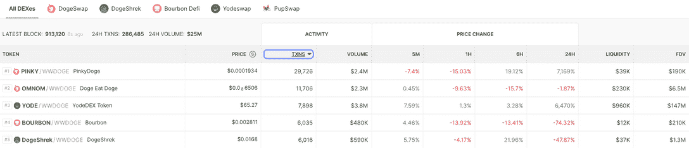

# Dogechain 是什么？用于 DeFi、游戏和 NFTs 的 DOGE 第 2 层

> 原文：<https://web.archive.org/web/https://dappradar.com/blog/what-is-dogechain-the-doge-layer-2-for-defi-gaming-nfts>

## 桥接 Dogecoin (DOGE)接入 DeFi 服务

新区块链专注于提供游戏，非功能性游戏似乎每周都会出现。然而，一个有可能让人回头的是 Dogechain，这是一个专为 Dogecoin 持有者设计的第二层解决方案，考虑到了游戏、DeFi 和 NFTs。

由有影响力的人和名人交易，DOGE 是一种现象。起初只是一个笑话的迷因币已经成为最受欢迎的加密货币之一。尽管如此，随着 Dogechain 的推出，领先的迷因硬币可能会获得更多的效用。

Dogechain 不是真正的第二层网络，因为它不是建立在 doge chain 之上的。相反，它是一个独立的网络，基于流行的[多边形边缘定制区块链](/web/20220926002339/https://dappradar.com/blog/what-is-polygon-nightfall/)，一个以太坊侧链。它与[以太坊虚拟机](/web/20220926002339/https://dappradar.com/blog/what-is-ethereum-dappradars-ultimate-guide/)兼容，这意味着它可以运行[为以太坊](https://web.archive.org/web/20220926002339/https://dappradar.com/rankings/protocol/ethereum)打造的 dapps。

这将向无数的 [DeFi](/web/20220926002339/https://dappradar.com/blog/what-is-defi-and-how-can-i-save-money-with-it/) 、 [gaming](/web/20220926002339/https://dappradar.com/blog/gaming-dappradars-ultimate-guide/) 和[NFT](/web/20220926002339/https://dappradar.com/blog/ten-things-everybody-should-know-about-nfts/)dapp 开放 Dogechain，以实现飞跃，并试图利用 DOGE 及其生态系统崇拜者的用户群。

## Dogechain 不是官方的

然而，故事中真正的转折是 Dogechain 并不是官方的 Dogecoin 创造。Dogecoin 基金会[转发了一条消息](https://web.archive.org/web/20220926002339/https://mobile.twitter.com/jwiechers/status/1559576884182237186),声明它没有参与 Dogechain，硬币的创始人杰克逊·帕尔默和比利·马库斯也没有参与。他们进一步澄清说，它也与一只同名的区块链探险者犬无关。

虽然这个项目不是官方的，但是 DOGE meme coin 的精神和有趣的风格被带到了网站上。

这不是第一次非官方项目成为 DOGE 生态系统中的重要工具，因为 Block.io 的 Dogecoin 钱包和 [block explorer](https://web.archive.org/web/20220926002339/https://dogechain.info/) 自 2014 年以来一直是 Dogecoin 生态系统的核心服务和一部分，也是非官方的。

## 你能在 Dogechain 上做什么？

Dogechain 的关键目标之一是鼓励持有人使用 DeFi、交易和 dapp。正如网站上所说: *Dogechain 给予 Doge 持有者超能力，像 DeFi，NFTs，游戏等等！是时候释放 Doge 社区的创造力和全部潜力了。*

DOGE 持有者可以将他们现有的 DOGE 连接到 Dogechain，以获得 wDOGE 或包装 DOGE 作为回报。然后，他们可以在新的 Dogechain 平台上使用它来连接到 DogeSwap 等 dapp，将来还可以连接到 NFT 和游戏 dapp。

在撰写本文时， [Dogechain 已经上线运行](https://web.archive.org/web/20220926002339/https://dogechain.dog/)，用户可以转移 DOGE 并与分散的交易所互动，以购买 Dogechain 上铸造的新代币。Dogecoin 还用于为 Dogechain 网络上的交易支付汽油费。

查看 [Dogechain block explorer，](https://web.archive.org/web/20220926002339/https://explorer.dogechain.dog/)我们看到，自一周前推出以来，已经处理了近 900，000 笔交易，超过 71，000 个钱包地址。相比之下， [Polygon 每天处理大约 300 万笔交易](https://web.archive.org/web/20220926002339/https://polygonscan.com/)。

[查看 DEX Screener](https://web.archive.org/web/20220926002339/https://dexscreener.com/dogechain) ，我们看到过去 24 小时内的交易额超过 2500 万美元。 [Dogeswap 占据了该交易量的最大份额](https://web.archive.org/web/20220926002339/https://dexscreener.com/dogechain/dogeswap)，超过 1600 万美元。YODE、OMNOM 和 PINKY 是最受欢迎的代币，在过去的 24 小时内[的交易量超过 870 万美元](https://web.archive.org/web/20220926002339/https://dexscreener.com/dogechain)。

Dogechain 团队[在推特](https://web.archive.org/web/20220926002339/https://twitter.com/DogechainFamily/status/1559610335367073792)上表示，他们对 Dogechain 的回应感到震惊，自该网络一周前推出以来，已有超过 58，000 个钱包被创建，总交易量超过 480，000 笔。

## 承诺承诺

Dogechain 网站做出承诺。据说这是一个新的区块链，是为社区驱动而建造和设计的。没有风投，也没有团队无法兑现的大承诺，比如由改变世界的共识算法驱动的每秒 1 万亿次交易。该项目希望将区块链应用程序引入 Dogecoin 社区。

[进一步的承诺](https://web.archive.org/web/20220926002339/https://dogechain.dog/)与计划中的未来空投给 Dogecoin 持有者的 DC 土著代币有关。而那些在交易应用程序上持有 DOGE 的人，[罗宾汉](/web/20220926002339/https://dappradar.com/blog/contrasting-the-2022-market-crash-to-2018s-crypto-winter/)将排队领取免费的 DC 代币。

## 小心行事

虽然 Dogechain 的发布肯定会在加密领域引起一些议论和交易，但有趣的是，它不是唯一一个试图努力的 meme coin，因为竞争对手基于以太坊的令牌 [Shiba Inu](https://web.archive.org/web/20220926002339/https://decrypt.co/resources/what-is-shiba-inu-shib-meme-coin-dogecoin-rival) (SHIB)也将推出其名为 Shibarium 的第二层扩展网络。

此外，最初的 DOGE 创造者不在船上应该意味着投资者和交易者空气的谨慎。然而，正如我们以前无数次看到的那样，当低交易活动成为常态时，一些人会兴奋地在新的链条上发现新的资产。

现在还为时尚早，但已经有人担心会出现另一种 [BNB 链](https://web.archive.org/web/20220926002339/https://dappradar.com/rankings/protocol/binance-smart-chain)式的设置，在这种设置中，创作者很容易推出 dapps 和代币，每周都会出现泵和转储项目。然而，我们愿意假定这个项目是无辜的。一如既往， [DappRadar 将继续跟踪和监控](https://web.archive.org/web/20220926002339/https://dappradar.com/blog/) Dogechain 的发展。

 NewsletterUnsubscribe at any time. [T&Cs](https://web.archive.org/web/20220926002339/https://dappradar.com/terms) and [Privacy Policy](https://web.archive.org/web/20220926002339/https://dappradar.com/privacy-policy)

***以上不构成投资建议。此处给出的信息仅供参考。请行使尽职调查，做你的研究。作者持有多种加密货币的头寸，包括 BTC、瑞士法郎和雷达。***