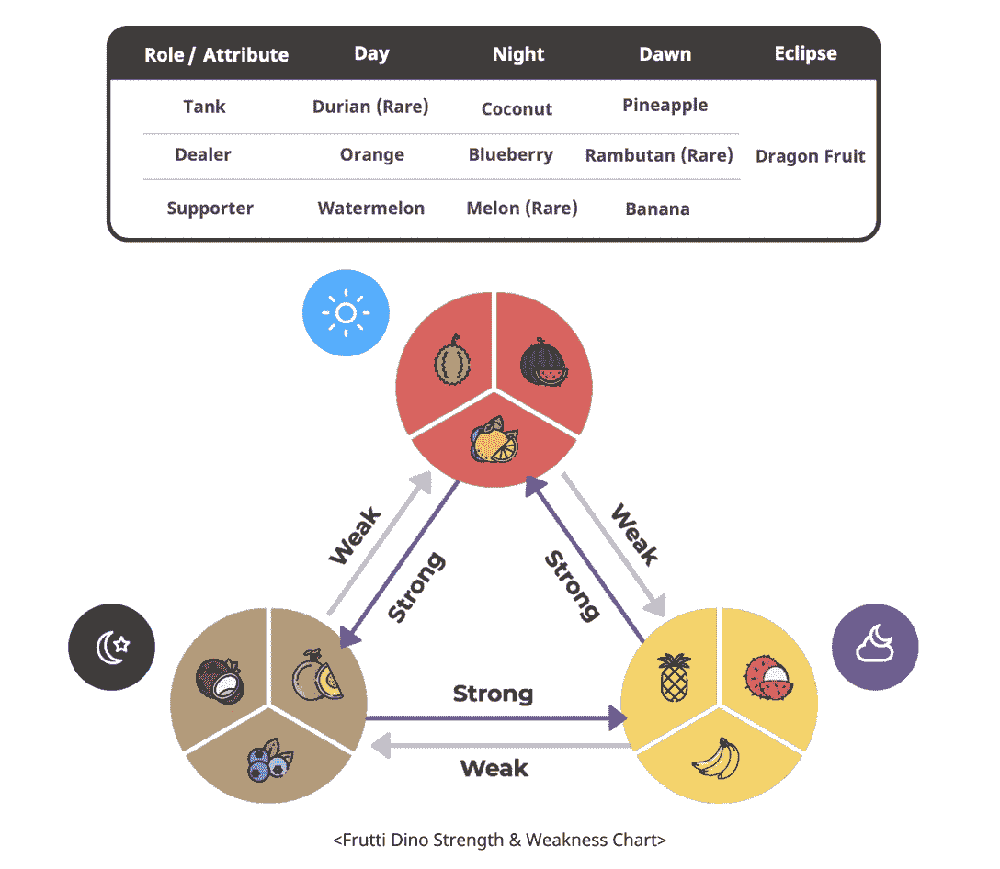
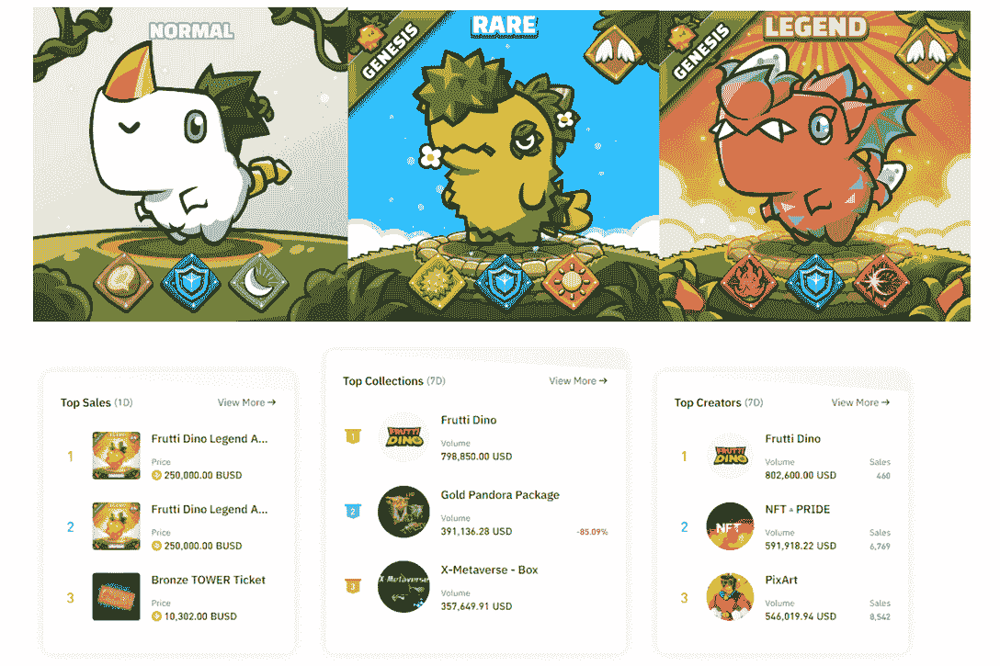
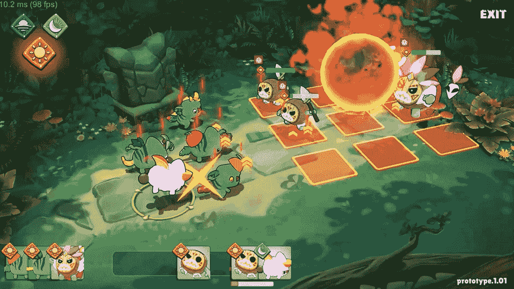

# Frutti Dino 是什么，怎么玩？

> 原文：<https://web.archive.org/web/https://dappradar.com/blog/what-is-frutti-dino-and-how-to-play-it>

## Frutti Dino 及其生态系统的权威指南

Frutti Dino 是一款休闲模拟角色扮演游戏，玩家使用 NFT Dino 角色来玩一个有趣的游戏。Frutti Dino 背后的团队 Monoverse 致力于建立一个协作和社区驱动的生态系统，让每个参与者的声音都能被听到。

**内容**

*   [什么是 Frutti Dino？](https://web.archive.org/web/20220926010506/https://dappradar.com/blog/what-is-frutti-dino-and-how-to-play-it/#frutti-dino)
*   [Frutti Dino NFTs 是如何工作的？](https://web.archive.org/web/20220926010506/https://dappradar.com/blog/what-is-frutti-dino-and-how-to-play-it/#futti-dino-nfts)
*   什么是地诺沃斯地？
*   Frutti Dino 的游戏系统是如何工作的？
    *   [租赁系统](https://web.archive.org/web/20220926010506/https://dappradar.com/blog/what-is-frutti-dino-and-how-to-play-it/#lease)
    *   [远征系统](https://web.archive.org/web/20220926010506/https://dappradar.com/blog/what-is-frutti-dino-and-how-to-play-it/#expedition)
    *   [手工艺系统](https://web.archive.org/web/20220926010506/https://dappradar.com/blog/what-is-frutti-dino-and-how-to-play-it/#crafting)
    *   [战斗系统](https://web.archive.org/web/20220926010506/https://dappradar.com/blog/what-is-frutti-dino-and-how-to-play-it/#battle)
*   Frutti Dino 的令牌组学是如何工作的？
*   [和 Frutti Dino 怎么玩怎么结束？](https://web.archive.org/web/20220926010506/https://dappradar.com/blog/what-is-frutti-dino-and-how-to-play-it/#play-and-earn)
*   Frutti Dino 的未来会怎样？

随着玩家对游戏质量的要求越来越高，区块链游戏产业出现了快速创新。高质量的游戏不仅需要可持续的游戏生态系统，还需要引人入胜的游戏性。

带着这种想法，Frutti Dino 进入了我们的视线。拥有出色的视觉效果和加密驱动的游戏内经济，这些可爱的小恐龙将带玩家进行什么样的[边玩边赚](https://web.archive.org/web/20220926010506/https://dappradar.com/blog/tag/play-to-earn)的冒险呢？

## 什么是 Frutti Dino？

Frutti Dino 是一款 [NFT](/web/20220926010506/https://dappradar.com/blog/how-to-buy-and-sell-nfts-on-dappradar/) 边玩边赚的模拟角色扮演游戏(SRPG)，在 [BNB 连锁店](/web/20220926010506/https://dappradar.com/blog/what-is-bnb-chain-and-how-does-it-work/)销售。这款游戏由 Monoverse 开发，由多种可爱的恐龙组成，拥有独特的特征和颜色。每只恐龙都是 NFT 的一个角色，玩家可以繁殖、升级和交易它们来获利。

在 Dinoverse，Frutti Dino 的虚拟世界中，玩家的任务是保卫这些 NFT 角色的栖息地，抵御入侵者。在游戏中，玩家可以收集各种资源并拥有它们的所有权，因为玩家可以将数字资产作为令牌或 NFT 存储在他们的 Web3 钱包中。

Monoverse 为 Frutti Dono 创造了精心设计的游戏，以吸引玩家并让 Dinoverse 可持续发展。该团队的最终目标是将 Frutti Dono 发展成为一个拥有各种生态系统和游戏的平台。然后，角色 IP 可以通过特许经营获得许可，例如，衍生游戏的推出。

同样值得注意的是 Monoverse 正在开发它自己的 mainnet，Entropy，一个基于 BSC 的侧链。这一战略计划旨在将传统的和基于 NFT 的第三方游戏纳入该项目的生态系统。

## Frutti Dino NFTs 是如何工作的？

Frutti Dino 是一种独特的生物，通过给恐龙喂食水果安瓿制成。除了创世纪恐龙，所有恐龙都是通过繁殖创造出来的，并经历 4 个发展阶段:蛋、萌芽、青少年和成年。

了解 Dino 的职业和角色可以帮助用户更快的掌握游戏。所以，恐龙有三种类型，食肉的，草食的和杂交的，这取决于它们吃什么水果。此外，恐龙吃什么水果决定了它们在战斗中的角色和表现。下图显示了水果和恐龙属性之间的关系。

由于其可爱的形象和基本的实用功能，这些 Dino NFTs 在 2022 年 1 月出现在币安 NFT 市场[后，实现了全周最高排名。](https://web.archive.org/web/20220926010506/https://medium.com/@FruttiDino/first-dino-x-binance-nft-marketplace-nft-sales-c9b541c1e8db)

## 什么是恐龙帝国？

Frutti Dinos 的世界被命名为 Dinoverse，玩家可以拥有一块土地。要做到这一点，他们需要拥有一个 NFT 土地，这使他们能够创造新的世界和游戏来创收。此外，这些土地是训练恐龙以提高它们的统计数据的地方。此外，陆地上有丰富多样的自然资源，这些资源是为恐龙制作独特道具的宝贵材料。

土地所有者也可以通过收取租赁费将土地出租给他人来赚取利润。随着游戏的展开，土地将有更多的用途，并在多方面使其所有者受益。

## Frutti Dino 的游戏系统是如何工作的？

现在我们知道了 Frutti Dino 的角色，我们如何在游戏中使用它们呢？Monoverse 为 Frutti Dino 精心制作了一个多层游戏系统，它们相互关联，让玩家沉浸其中。让我们来看看 Frutti Dino 中的基本游戏系统。

[https://web.archive.org/web/20220926010506if_/https://www.youtube.com/embed/SUcjCye3fWg?start=40&feature=oembed](https://web.archive.org/web/20220926010506if_/https://www.youtube.com/embed/SUcjCye3fWg?start=40&feature=oembed)

### 租赁系统

玩家可以从本地市场获得恐龙。但是如果玩家买不起呢？放心吧！租赁系统允许玩家以低得多的价格从现有玩家那里租借恐龙。其目的是降低新玩家的进入门槛，同时让现有玩家通过租赁费获得收入。

### 探险系统

Frutti Dino 还采用了一个探险系统，允许玩家

即使不玩也要收集稀有物品。要开始远征模式，玩家必须组队。可供探索的区域包括公共土地和私人土地。

私人土地可能包含稀有物品，提高恐龙的性能水平。然而，开发私有土地需要向土地所有者支付有限的费用。

### 工艺系统

玩家可以用探险中挖掘出的稀有材料和自然资源为恐龙装备特殊部件。零件升级可以修改 Dino 的外观和属性，并增强其性能。这也意味着那些升级后的恐龙很可能在市场上以更高的价格出售。

为了让 Frutti Dino 的经济更有活力，未来将会有一个将 Dino 拆卸成 NFT 零件的系统。

### 战斗系统

Dino Frutti 为玩家提供了多种令人兴奋的战斗模式。例如，玩家可以参加锦标赛来爬上排行榜。更高的排名可以给玩家带来更多的代币奖励。寻求更大刺激和更大奖励的玩家可以参加皇家战役，最后一名玩家将获得象征性奖励。

此外，Dino Frutti 还将举办电竞赛事。在那些赛事中，玩家可以自由选择自己擅长的项目，为奖池而战。

## Frutti Dino 的 tokenomics 是如何工作的？

Frutti Dino 有两个 BEP-20 令牌，Frutti Dino 令牌(FDT)和 FAT 令牌，都是币安智能链的本地产品。FDT 将 Frutti Dino 的生态系统作为治理标志，并将游戏与现实世界的系统联系起来。

用户可以下注 FDT 来赚取利息。这些利益攸关的 FDT 还将授予持有者分享 Frutti Dino 游戏及其生态系统所产生的利润的权利。

脂肪是生态系统中的效用标志。Frutti Dino 将为玩家设计各种赚取和使用 FATs 的方式，以最大化玩游戏的乐趣和收益。玩家将有机会在探险系统、工艺系统、租赁系统等等中使用 FATs。

## 用 Frutti Dino 怎么玩怎么赚？

Frutti Dino 提供了多种从玩到赚的机制，以适应玩家的不同偏好。比如参与不同的战斗模式，击败对手，会为玩家赚取奖励。

除此之外，玩家可以加入探险系统，寻找稀有材料，制作最特别的恐龙，在市场上高价出售。

参加季节性活动是另一个收获回报的机会。例如，拥有具有独特属性的恐龙的玩家可以参加比赛来获得代币。此外，由于 Frutti Dino 强调包容性和玩家驱动的氛围，非参赛者也可以通过猜测正确的 Dino 比赛获胜者来参与并获得奖励。

## Frutti Dino 的未来会怎样？

Monoverse 团队致力于创建一个基于透明、公平和协作的开放游戏平台。为了实现这个目标，团队[正在开发自己的 mainnet，Entropy](https://web.archive.org/web/20220926010506/https://medium.com/@FruttiDino/important-bsc-has-been-adopted-for-the-implementation-of-the-frutti-dino-project-155ad4735909) ，一个基于 BSC 的侧链。熵将作为基本的去中心化基础设施，并吸引第三方游戏和开发者做出贡献并从中受益。

同样值得注意的是，Frutti Dino 高度重视其社区，并希望采用 DAO 方式让用户为项目做出贡献。因此，Frutti Dino 将推出游戏刀、生态刀和全能刀。

这种安排旨在允许对项目进行更结构化和更具体的治理，成员可以选择他们所关心和擅长的方向。

了解更多关于 Frutti Dino 的信息:

[网站](https://web.archive.org/web/20220926010506/https://fruttidino.com/#1)

[推特](https://web.archive.org/web/20220926010506/https://twitter.com/FruttiDino)

[不和](https://web.archive.org/web/20220926010506/https://discord.com/invite/Vvhr9TCeHq)

[中等](https://web.archive.org/web/20220926010506/https://medium.com/@FruttiDino)

[白皮书](https://web.archive.org/web/20220926010506/https://www.fruttidino.com/pdf/Frutti_dino_Whitepaper_v1.91_EN.pdf)

**免责声明** —这是一篇赞助文章。DappRadar 不认可本页面上的任何内容或产品。DappRadar 旨在提供准确的信息，但读者应该在采取行动之前总是自己做研究。DappRadar 的文章不能被认为是投资建议。