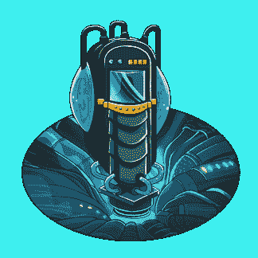
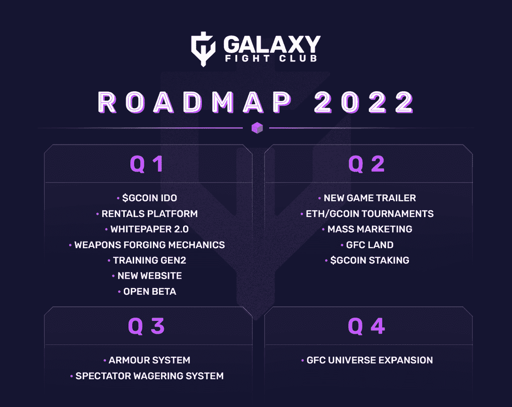

# 银河搏击俱乐部是什么？

> 原文：<https://web.archive.org/web/https://dappradar.com/blog/what-is-galaxy-fight-club>

## 想象一下区块链世界里的超级巨星

[**银河搏击俱乐部**](https://web.archive.org/web/20221227100957/https://dappradar.com/ethereum/collectibles/galaxy-fight-club) **允许 NFT 持有者在跨 PC 和移动的 PvP 战斗中部署自己的头像。如果互操作性是元宇宙的圣杯，那么这种类型的跨平台游戏就是朝着这个方向迈出的一步。**

想象一只[无聊的猿](https://web.archive.org/web/20221227100957/https://dappradar.com/ethereum/collectibles/bored-ape-yacht-club)与一只 [mfer](https://web.archive.org/web/20221227100957/https://dappradar.com/ethereum/collectibles/mfers) 交战。或者一只[小狗](https://web.archive.org/web/20221227100957/https://dappradar.com/ethereum/collectibles/the-doggies-snoop-dogg)一头撞上一只[时尚弄潮儿](https://web.archive.org/web/20221227100957/https://dappradar.com/ethereum/collectibles/cool-cats)。这是《银河搏击俱乐部》( GFC)带给游戏世界的场景。为了更流畅的游戏和更好的用户体验，开发者们已经将游戏的重要部分建立在链上。更密集的、面向加工的部分发生在链外。

[https://web.archive.org/web/20221227100957if_/https://www.youtube.com/embed/YuU-wWU9Osc?feature=oembed](https://web.archive.org/web/20221227100957if_/https://www.youtube.com/embed/YuU-wWU9Osc?feature=oembed)

Galaxy Fight Club trailer

跨知识产权(跨 IP)游戏是 GFC 的主要特色。为了让人们在 3v3 团队锦标赛模式中玩自己的 NFT，他们需要拥有一个银河战士。其中 10，129 枚是铸造的，目前的底价是 0.52 ETH(1，564.57 美元)。

The mystical Galaxy Fight generator

## 一些简单的事实

*   位置——一颗被称为布鲁纳 8 号的行星
*   年份—**2049 年(四年后*准备好的玩家一* )**
*   本地令牌-**gco in**
*   区块链—**多边形**
*   NFT 标准-**部署在以太坊主网上的 ERC-721**
*   天然气价格—**最低。战士，连同他们的武器和特性，被储存在链上。其他所有东西都存储在一个外链数据库中。**

## 跨 IP 游戏是如何工作的？

一个没有边界的世界的想法是诱人的。这是每个相信区块链力量的人的梦想。但是 GFC 是如何实现他们的跨 IP 世界的呢？在这个世界里，NFT 的虚拟形象不再受孤立平台的传统障碍的限制。

GFC 有一些有趣的方式将其他 NFT 系列的角色融入到游戏中:

*   **NFT 所有权**。NFT 的独特卖点是，它们安全地归一个钱包所有，这是 GFC 能够在其游戏中使用该图像的基础。一旦收藏的开发者卖出了一幅 NFT，他们就不再拥有那幅特定艺术品的版权。因此，如果有人想扮演 GFC 中的 NFT 角色，他们需要做的就是让游戏创建一个看起来与问题中的 NFT 一模一样的衍生艺术品。因此，玩家在 GFC 玩的不一定是*的*NFT——但却是看起来完全一样的东西。

*   **合作关系**。GFC 目前正在与 NFT 的多个项目合作，包括 Metakey、、Animas、[恶人头盖骨](https://web.archive.org/web/20221227100957/https://dappradar.com/hub/assets/eth/0x85f740958906b317de6ed79663012859067e745b/5080)、[外星男孩](https://web.archive.org/web/20221227100957/https://dappradar.com/hub/assets/eth/0x4581649af66bccaee81eebae3ddc0511fe4c5312/9253)、 [BYOPILL](https://web.archive.org/web/20221227100957/https://dappradar.com/hub/assets/eth/0xbd275ce24f32d6ce4e9d9519c55abe9bc0ed7fcf/4524) 等等。理想情况下，GFC 将与尽可能多的 NFT 项目合作，以便其艺术品与原作精确匹配。但是，如果 NFT 开发商选择不与 GFC 合作，GFC 将在其游戏领域为我们创造一个非常好的近似 NFT 的环境。根据 GFC 的发展规模，NFT 的项目可能很快就会排队与跨 IP 平台合作。

*   **团结**。GFC 建立在游戏开发工具 Unity 之上。Unity 配备了一系列现成的声音、物理、渲染和控制组件。在为在线游戏设计的东西的基础上构建，允许 GFC 开发者快速创建并快速做出任何必要的改变。考虑到跨 IP 游戏所需要的移动部件的数量，GFC 快速移动的能力是允许它创造它所拥有的世界的关键贡献因素。

## 银河搏击俱乐部的路线图中会出现什么？

2022 年 GFC 路线图看起来很忙。开发人员已经达到了他们计划中的许多里程碑。他们的[白皮书](https://web.archive.org/web/20221227100957/https://whitepaper.galaxyfightclub.com/)存在于 2.0 版本中，新的游戏预告片可以在上面看到。

看看下面 GFC 官方的 2022 年路线图。这看起来像是区块链博彩业的未来。

Galaxy Fight Club 2022 Roadmap