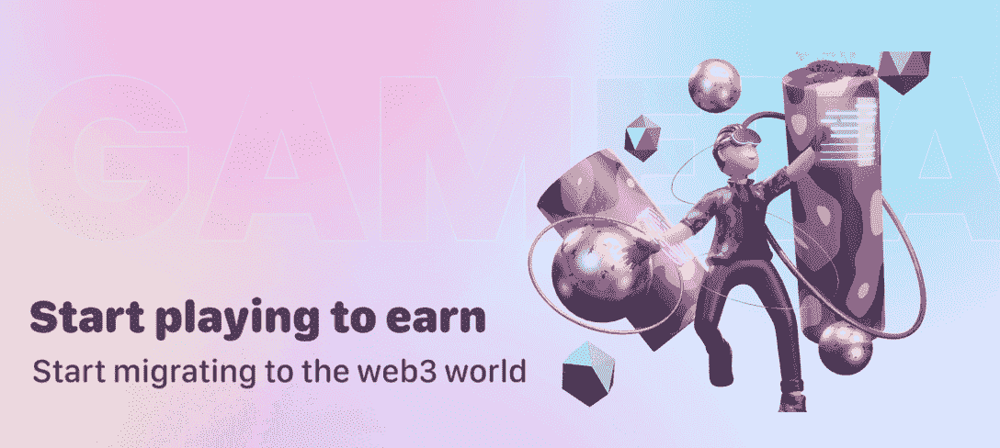
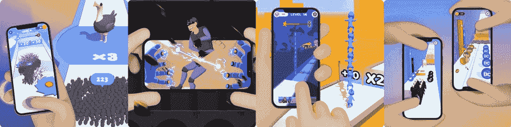
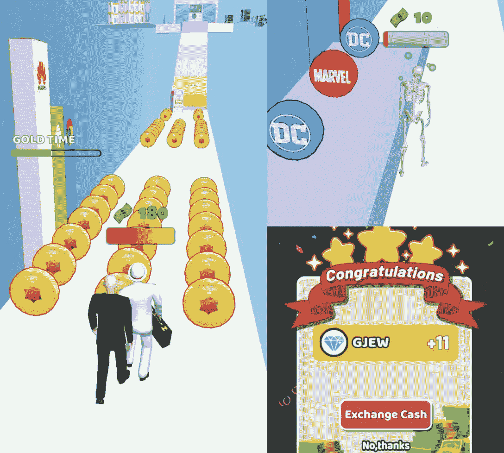
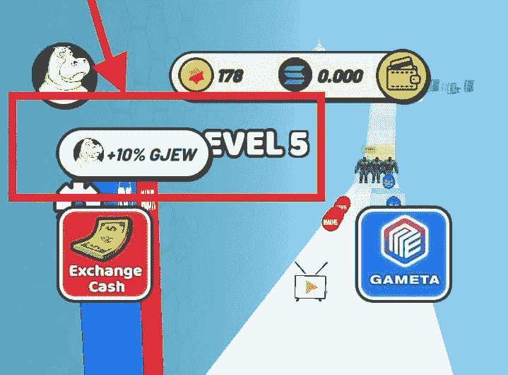

# Gameta 是什么，怎么用？

> 原文：<https://web.archive.org/web/https://dappradar.com/blog/what-is-gameta-and-how-to-use-it>

## Gameta 本周在 DappRadar 的游戏排名中名列第八

Gameta 推出了一个简单的、激励驱动的游戏平台，为用户提供无缝的 Web 3 访问。该平台强调通过超休闲游戏增加用户的参与度。

#### **内容**

*   [什么是 Gameta？](https://web.archive.org/web/20221003234809/https://dappradar.com/blog/what-is-gameta-and-how-to-use-it/#gameta)
*   [Gameta 上目前有哪些游戏？](https://web.archive.org/web/20221003234809/https://dappradar.com/blog/what-is-gameta-and-how-to-use-it/#games)
*   [用户如何开始玩？](https://web.archive.org/web/20221003234809/https://dappradar.com/blog/what-is-gameta-and-how-to-use-it/#play)
*   [Gameta 的游戏赚取机制是如何工作的？](https://web.archive.org/web/20221003234809/https://dappradar.com/blog/what-is-gameta-and-how-to-use-it/#play-to-earn)
*   [进一步了解 Gameta 的 NFT 和 tokenomics](https://web.archive.org/web/20221003234809/https://dappradar.com/blog/what-is-gameta-and-how-to-use-it/#tokenomics)
    *   [两种类型的非功能性测试](https://web.archive.org/web/20221003234809/https://dappradar.com/blog/what-is-gameta-and-how-to-use-it/#nfts)
    *   [两种代币:HIP 和 GJEW](https://web.archive.org/web/20221003234809/https://dappradar.com/blog/what-is-gameta-and-how-to-use-it/#tokens)
*   Gameta 的未来会怎样？

Web3 游戏平台 Gameta 在 DappRadar 30 天用户排名中遥遥领先。从 7 月 10 日到 8 月 8 日，它吸引了超过 10 万名用户。在 DappRadar 跟踪的所有游戏 dapps 中，只有六个在这 30 天内拥有超过 10 万用户。它们是 [Axie Infinity](/web/20221003234809/https://dappradar.com/blog/what-is-axie-infinity-and-how-does-it-work/) 、[spliter land](/web/20221003234809/https://dappradar.com/blog/splinterlands-guide-to-play-and-earn/)、[外星世界](/web/20221003234809/https://dappradar.com/blog/how-to-play-alien-worlds-like-a-pro/)、[高地](/web/20221003234809/https://dappradar.com/blog/how-to-play-and-win-upland/)、[纸牌闪电战](/web/20221003234809/https://dappradar.com/blog/over-140000-users-are-playing-joyrides-solitaire-blitz-to-earn-real-money-rewards/)，当然还有——休闲游戏平台 Gameta。

## Gameta 是什么？

Gameta 是一个 Web3 游戏平台，最初建立在 Solana T1 上，但很快将迁移到 T2 BNB 链 T3 上。该平台努力吸引尽可能多的从 Web2 到 Web3 的用户。为了做到这一点，它为用户提供了一系列超休闲游戏，他们可以随时随地享受，为公众创造了一个无摩擦的 Web3 游戏体验。

该平台主要以简单但有趣的手机友好型游戏为特色。值得注意的是，这些游戏不会占用用户大量的时间或移动数据，也不需要高性能的移动设备。因此，它们是为了满足大多数人的游戏需求而构建的。

## 平台上目前有哪些游戏？

七款游戏可供玩家在平台上体验，投资大师、蚂蚁快跑者、超级手套、睡眠布娃娃、蛙人狂奔、人类之塔、蝌蚪计数。用户可以从 Google Play 下载所有这些软件，并安装在他们的 Android 设备上。

至于玩法，都有简单易懂的规则。如果用户玩过《神庙逃亡》或《水果忍者》，在 Gameta 上掌握游戏对他们来说是小菜一碟。我们以投资大师为例。

要玩游戏，玩家只需要在手机屏幕上左右滑动，就可以控制游戏角色。如下图所示，玩家在游戏中的目标是收集足够的金币来换取游戏内代币，GJEW。如果玩家撞上障碍物，他们就会失分。

Gameta 平台上的其他迷你游戏基本上和 Invest Master 一样容易玩，不需要复杂的游戏控制。

## 用户如何开始玩？

首先，用户需要选择他们感兴趣的 dapp，并通过 Gameta 官网上的链接安装 dapp。例如，如果用户想尝试投资大师，他们可以[在这里](https://web.archive.org/web/20221003234809/https://www.gameta.pro/#/gameDetails)找到下载页面。

安装成功后，用户需要向 Gameta 注册一个 Web3 账户。这很容易，因为 Gameta 可以为用户生成一个带有唯一种子短语的随机钱包地址。值得一提的是，这个钱包地址是用户访问所有 Gameta 应用程序和收集奖励的通用帐户。

因此，用户需要确保钱包和种子短语的安全。一旦完成注册过程，用户将获得一些免费代币开始游戏和一个 NFT。代币和 NFT 都是提高玩家收入的重要游戏资产。如下图所示，这个免费的 NFT 给玩家增加了 10%的奖励。

## Gameta 的游戏赚取机制是如何工作的？

既然我们已经了解了在 Gameta 上开始玩游戏是多么容易，那么让我们来看看 Gameta 的从玩到赚机制是如何工作的。最重要的是，玩家如何才能获得最大的回报？

Gameta 上的游戏都是基于等级的，玩家每完成一个等级都会获得奖励。奖励的多少取决于玩家的技能以及他们拥有的 NFT 的等级。值得注意的是，系统提供的免费 NFT 也可以增加玩家的收入，但没有购买的多。

## 对 Gameta 的 NFTs 和 tokenomics 的进一步研究

NFT 和其他游戏内代币对玩家的成功至关重要。

### 两种类型的 NFT

在 Gameta 的生态系统中，有两种类型的 NFT 服务于不同的目的:

*   平台 NFTs
*   和 in-dapp NFTs

两种都可以交易获利。

平台 NFT 是用户在 Gameta 中地位的象征，但他们也授予用户特权。例如，拥有这些有限 NFT 的用户可以优先获得空投，并享受早期奖励。

游戏中的 NFT 通常是道具，是用户获得游戏王牌的必要条件。一般来说，这些 NFT 主要执行激活或促进玩家赚钱过程的功能。而且，用户还可以繁殖这些 NFT，生成新的 NFT。

### 两种类型的令牌

Gameta 的经济系统是一个精心设计的框架，确保生态系统的可玩性和可持续性。两种代币促进了 Gameta 的经济系统。它们是治理令牌 HIP 和实用令牌 GJEW。

HIP 作为 Gameta 的治理令牌，总供应量为 10 亿。生态系统内的交易将向用户收取费用，费用以 HIPs 支付。用户可以通过持有高排名高等级的 NFT 来获得 HIP。此外，用户可以通过下注金币或从交易所购买金币来赚取 HIP 令牌。

GJEW 是 Gameta 生态系统中的实用令牌。玩家通过持有足够的 NFT 并参与游戏来赚取 GJEW。玩家可以用获得的 GJEW 代币做什么？玩家可以出售它们以获取利润，或者简单地出售 HODL 以获取未来的溢价。此外，GJEW 是培育新 NFT 的重要资源。

## Gameta 的未来会怎样？

Gameta 是一个仍处于早期阶段的项目，但它已经建立了一个充满活力的生态系统，有可能推动 Web3 的大规模采用。该项目的最令人兴奋的部分是其可扩展的商业模式。随着更多 dapps 加入平台，他们将带来不同细分市场的用户。这样一来，Gameta 的生态系统就可以继续扩大。

Gameta 的野心并不止于为游戏提供平台。该团队的长期计划是提供一个生态系统，让所有的 Web3 活动都能产生回报。Gameta 将这种模型称为 X2E，其中 X 代表任何种类的活动。

请访问 DappRadar 上的 Gameta dapp 页面,了解休闲游戏平台的最新动态。或者访问 [DappRadar 排名](https://web.archive.org/web/20221003234809/https://dappradar.com/rankings)，看看 Gameta 在区块链游戏生态系统中的表现如何。

DappRadar 将继续关注 Gameta 的最新进展。在 [Twitter](https://web.archive.org/web/20221003234809/https://twitter.com/dappradar) 、 [Discord](https://web.archive.org/web/20221003234809/https://discord.gg/4ybbssrHkm) 和 [Youtube](https://web.archive.org/web/20221003234809/https://www.youtube.com/c/DappRadar) 上关注我们，跟上区块链世界的动态。