# 什么是生成艺术，为什么你应该关注它

> 原文：<https://web.archive.org/web/https://dappradar.com/blog/what-is-generative-art-and-why-should-you-care>

## 沉寂了 60 年后，生成艺术终于在 Web3 中找到了它茁壮成长的土壤

**什么是生成艺术？为什么会随着 NFTs 的兴起而走到聚光灯下？那么艺术街区、Fidenza 和 Ringers 呢？生成艺术和人工智能驱动的艺术有什么不同？加入我们，探索这些问题的答案。**

今天，关于不可替代代币(NFT)价格创历史新高的消息可能不再令人惊讶。计算机生成的像素朋克或卡通猿可以象征社会地位，因此价值不菲。然而，这听起来仍然很疯狂。

最近的媒体头条不断强调 NFTs 交易量的大幅下降。但是再多做一点研究，你会发现这个领域有永无止境的创新。两年前只是一个时髦词的东西已经演变成各种项目用来增强用户体验的工具。

NFT 驱动的创新包括永久版税、数字资产所有权，以及如 Vitalik 所设想的，激励人们做出响应的灵魂绑定令牌。

但最重要的是，非物质文化遗产赋予了一种被忽视了半个世纪的艺术形式。多亏了 NFTs，生成艺术终于进入了公众视野。

## 目录

*   NFT 之前的生成艺术——沉默 60 年
*   使生成艺术闻名于世的 NFT 是今天吗？
*   [链上生成艺术简史](https://web.archive.org/web/20221128093533/https://dappradar.com/blog/what-is-generative-art-and-why-should-you-care/#history)
    *   [自动摄影](https://web.archive.org/web/20221128093533/https://dappradar.com/blog/what-is-generative-art-and-why-should-you-care/#autoglyphs)
    *   [艺术街区](https://web.archive.org/web/20221128093533/https://dappradar.com/blog/what-is-generative-art-and-why-should-you-care/#artblocks)
    *   [泰佐斯](https://web.archive.org/web/20221128093533/https://dappradar.com/blog/what-is-generative-art-and-why-should-you-care/#tezos)
    *   [【qql】](https://web.archive.org/web/20221128093533/https://dappradar.com/blog/what-is-generative-art-and-why-should-you-care/#qql)
*   更深层次的探讨——没有艺术家，生成艺术能完成吗？
*   [最终想法](https://web.archive.org/web/20221128093533/https://dappradar.com/blog/what-is-generative-art-and-why-should-you-care/#final)

## NFT 之前的生成艺术——沉默 60 年

在我们深入研究生成艺术的历史之前，让我们先来看看它的定义。

> 生成艺术指的是使用自主系统创作的艺术。艺术家通常会定义流程，输出是机器和艺术家之间的集体作品。

生成艺术指的是使用自主系统创作的艺术。艺术家通常会定义流程，输出是机器和艺术家之间的集体作品。生成艺术的起源可以追溯到 20 世纪 60 年代，远在互联网出现之前，更不用说区块链的发明了。

随着时间的推移，生成艺术最终发展成为一种艺术流派。在那些日子里，计算机艺术、算法艺术和计算机图形等术语描述了这种艺术方法。今天，生成艺术和算法艺术在某些语境下仍然可以互换使用。

在艺术运动的浪潮中，生成艺术受到冷落并不奇怪，因为 20 世纪 60 年代是现代艺术最耀眼的十年之一。这十年见证了无数其他风格和概念的兴起，如波普艺术、op 艺术、概念艺术、行为艺术、女权主义艺术等等。

安迪·沃霍尔、布里奇特·赖利、小野洋子和罗伊·利希滕斯坦等艺术家为这一时期增光添彩。毫无疑问，他们的影响是深远的，直到今天。

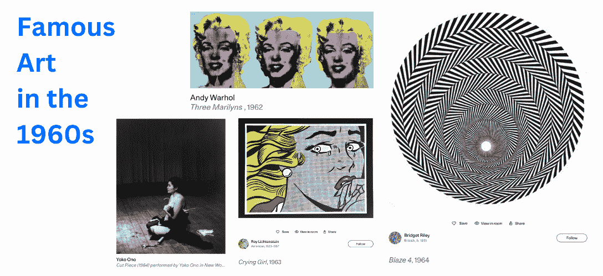

[Source](https://web.archive.org/web/20221128093533/https://www.artsy.net/)

但这可能不是生成艺术最糟糕的情况。也许和平给了早期生成艺术先驱们将全部注意力投入到这一领域的先决条件。1965 年，第一届生成艺术展展出了德国学者 Georg Nees 的作品，他也是计算机艺术的重要贡献者。

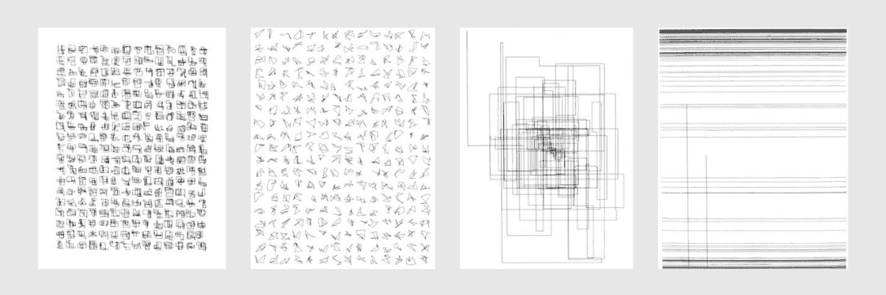

[Georg Nees: Computergrafik, February 5, 1965 (exhibition)](https://web.archive.org/web/20221128093533/http://dada.compart-bremen.de/item/exhibition/164)

此后，一系列“生成艺术”会议在许多城市举行。到 20 世纪末，生殖艺术家、设计师、音乐家和理论家团体开始会面，引发跨学科讨论。

这些倡议涉及多个有意义的主题，如技术如何影响艺术和人机互动，为生成艺术达到目前的突出地位奠定了基础。

## NFTs 让生成艺术在今天出名了吗？

收藏家们对艺术品的品味和赞助是不断变化的，可以说那些顶级拍卖行对此最有嗅觉。

2021 年 3 月 11 日，佳士得拍卖行敲定了其第一件 NFT 艺术品，由数字艺术家迈克·温克尔曼创作的[第一个 5000 天(又名毕普)，价格接近 7000 万美元(42329.453 瑞士法郎)。](https://web.archive.org/web/20221128093533/https://dappradar.com/hub/assets/eth/0x2a46f2ffd99e19a89476e2f62270e0a35bbf0756/40913)

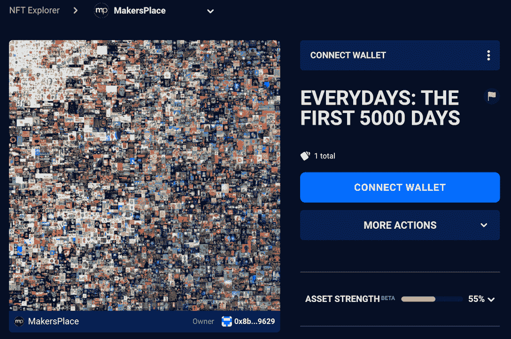[Check out the most valuable NFTs](https://web.archive.org/web/20221128093533/https://dappradar.com/hub/nft-explorer)

此后，NFTs 成为主要拍卖行的常客。在策划的拍品中，有大量的生殖艺术作品。

同年，佳士得和苏富比举行了大型在线拍卖，展示了 [Art Blocks 的](https://web.archive.org/web/20221128093533/https://dappradar.com/ethereum/collectibles/art-blocks)各种前卫的生成性艺术项目，承认该平台是推广 NFT 和生成性艺术的重要参与者

[What is Art Blocks?](https://web.archive.org/web/20221128093533/https://dappradar.com/blog/what-is-the-art-blocks-nft-marketplace)

然后一个更有趣的现象出现了。传统艺术界的看门人开始庆祝生成艺术的复兴。那时，它实际上比 NFT 狂潮晚了一年多。

2022 年 4 月，苏富比推出了 Natively Digital 1.3，这是一种混合销售，提供 NFT 和实物作品。这个活动描绘了从 20 世纪 60 年代运动到今天最受欢迎的艺术家的生成艺术的演变。

不足为奇的是，2022 年 7 月，菲利普策划了“前玛奇纳”,这是一场回顾生成艺术历史的拍卖。这是一场早期电脑、视频和数字艺术的展览和在线拍卖

这两次拍卖包括 20 世纪 60 年代活跃的再生艺术家的几件拍品。你可以在名单上找到格奥尔格·尼斯、弗里德·纳克、维拉·莫尔纳尔、罗曼·维罗斯科等等。基本上，你能在维基百科上看到的生成艺术的名字。

如果你想知道名单上是否有 NFT 本土艺术家，答案是肯定的。

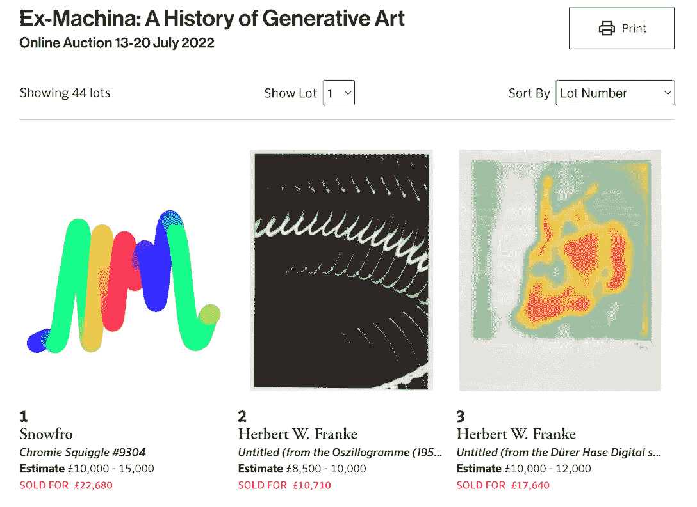

[Source: Philips ](https://web.archive.org/web/20221128093533/https://www.phillips.com/auctions/auction/UK090322)

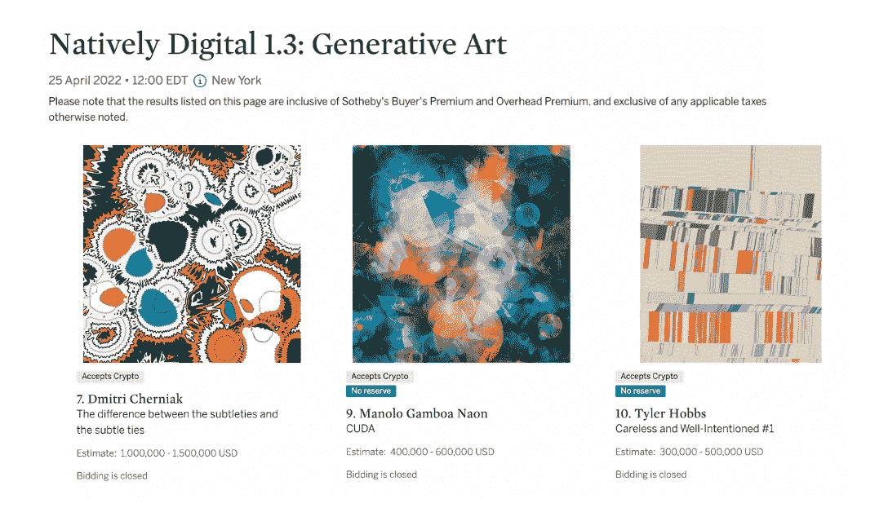

[Source: Sotheby’s](https://web.archive.org/web/20221128093533/https://www.sothebys.com/en/buy/auction/2022/natively-digital-1-3-generative-art?locale=en)

[Check out these NFTs’ value in ETH](https://web.archive.org/web/20221128093533/https://dappradar.com/hub/nft-explorer)

## 链上生成艺术简史

如果代码是生成艺术家用来工作的画笔，那么区块链提供了一份真实性证书，确保这项工作是永久的、不可改变的和可验证的。类似于传统的验证机构，但具有 100%的准确性。

### autoglyphs——以太坊上第一个“链上”生成艺术

Autoglyphs 是一项生殖艺术实验，收集了 512 个符号，每一个都是独一无二的。该项目由[crypto punk 的创始人幼虫实验室于 2019 年创建。](https://web.archive.org/web/20221128093533/https://dappradar.com/ethereum/collectibles/cryptopunks)

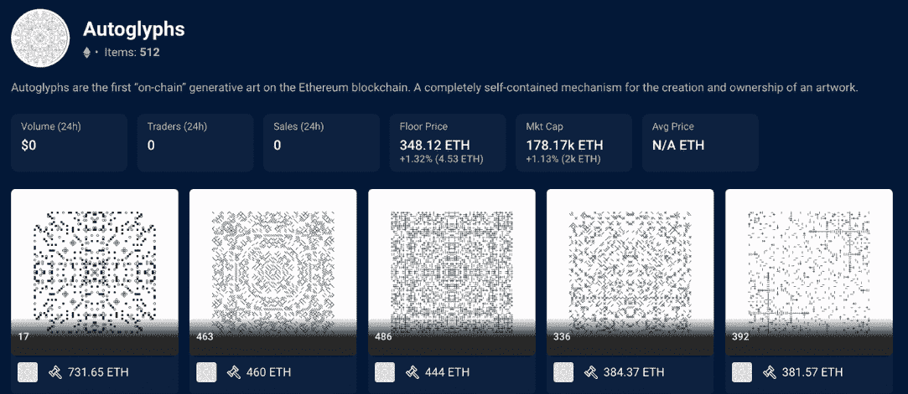

Autoglyphs 是一种高度优化的生成算法，能够创建数十亿个独特的艺术作品。Autoglyphs 和非区块链生成艺术之间的根本区别在于，艺术在智能合约本身内部。因此，它实际上是“区块链上的艺术”

那么这个项目是如何运作的呢？

任何人只要向幼虫实验室的慈善机构 350.org 支付 0.2 ETH(相当于 35 美元)，就可以产生自己的自体抗体。每个字形的创造者成为该字形的第一个所有者。值得注意的是，在创建了 512 个字形之后，生成器将永远关闭。但是用户仍然可以在二级市场上获得字形。

你可以很容易地看到，Autoglyph 的图像有早年生成艺术的痕迹。目前，最贵的 NFT 自动直升机价值 731.65 瑞士法郎(941，428 美元)。

Check out the whole collection of Autoglyphs

### 艺术街区——基于以太坊的最大的生成艺术平台

Art Blocks 是一个创造和管理生殖艺术的平台，基于以太坊的平台由 Erick Calderon (Snowfro)于 2020 年推出。

> 我的目标之一是将推动 web3、生成艺术和所有数字艺术的技术提升给更广泛的受众。我们必须跳出框框思考，找到人们对内容感到兴奋的体验，而技术正是内容的最佳渠道。
> 
> [Snowfro (Twitter)](https://web.archive.org/web/20221128093533/https://twitter.com/ArtOnBlockchain/status/1554235871783796738)

有史以来第一个在艺术块上铸造的系列是 Chromie Squiggles，这是平台创始人 Snowfro 自己的项目。在撰写本文时，该系列已经产生了 5，400 ETH 的交易量，底价为 10.88 ETH。

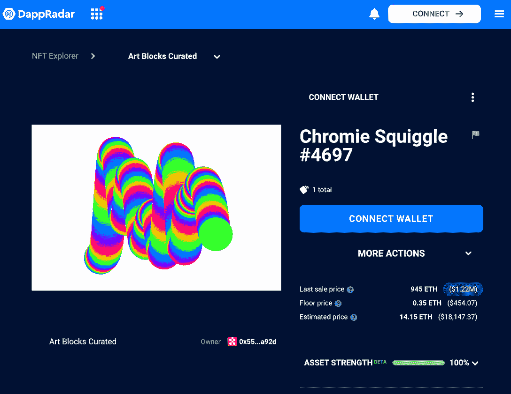

当一个艺术家创建一个艺术街区 NFT 项目时，他们必须将他们精心设计的算法上传到这个平台。这种算法允许艺术家为该系列制定一种视觉风格，但最终的图像只有在铸造完成时才会显示出来。

有趣的是，买家收集的不仅是一种视觉风格，还有一套算法，这些算法承载了生成艺术家的概念和哲学。毫不夸张地说，Art Blocks 为更大的用户群体带来了这种前所未有的艺术收藏体验。一路走来，它培养了一个高度忠诚的收藏家市场。

[Check out collections on Art Blocks](https://web.archive.org/web/20221128093533/https://dappradar.com/hub/nft-explorer/collection/art-blocks-curated)

#### 艺术街区中价格最高的五家非艺术商店

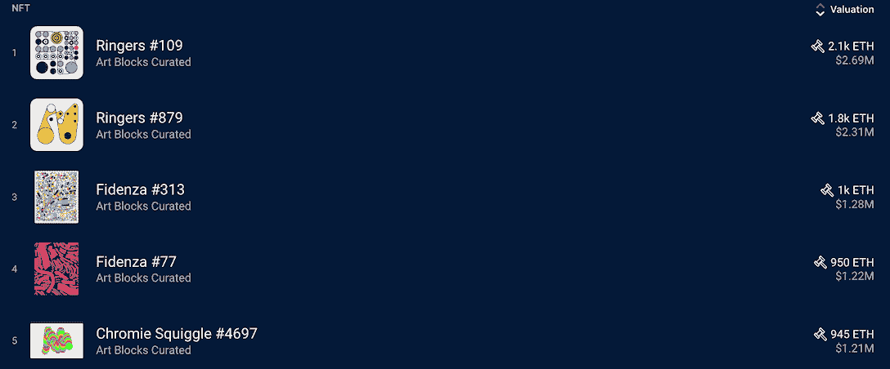

1.  [响铃人#109](https://web.archive.org/web/20221128093533/https://dappradar.com/hub/assets/eth/0xa7d8d9ef8d8ce8992df33d8b8cf4aebabd5bd270/13000109)
2.  [响铃人#879](https://web.archive.org/web/20221128093533/https://dappradar.com/hub/assets/eth/0xa7d8d9ef8d8ce8992df33d8b8cf4aebabd5bd270/13000879)
3.  [菲登扎#313](https://web.archive.org/web/20221128093533/https://dappradar.com/hub/assets/eth/0xa7d8d9ef8d8ce8992df33d8b8cf4aebabd5bd270/78000313)
4.  [菲登扎 77 号](https://web.archive.org/web/20221128093533/https://dappradar.com/hub/assets/eth/0xa7d8d9ef8d8ce8992df33d8b8cf4aebabd5bd270/78000077)
5.  [铬黄曲线#4697](https://web.archive.org/web/20221128093533/https://dappradar.com/hub/assets/eth/0x059edd72cd353df5106d2b9cc5ab83a52287ac3a/4697)

### tezos——致力于数字艺术繁荣的公共连锁店

Tezos 是 2018 年推出的一款开源、可自我扩展的区块链游戏。像许多区块链网络一样，Tezos 的使命是构建高性能和低成本的基础设施，以支持 NFT 的快速增长。

[Read What is Tezos?](https://web.archive.org/web/20221128093533/https://dappradar.com/blog/what-is-tezos)

经过多年的努力，Tezos 的数字艺术景观已经发展成为一个与众不同的景观。Tezos 在巴塞尔艺术展等领先的艺术展览中扮演着积极的角色， [Tezos 正在成为数字艺术的下一个前沿。](https://web.archive.org/web/20221128093533/https://dappradar.com/blog/tezos-digital-nft-art-immerses-the-public-on-nfts-at-art-basel)

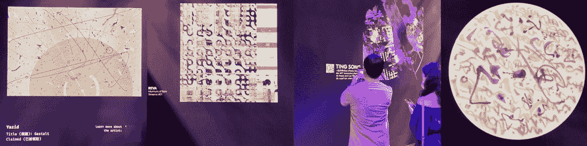

2021 年见证了 NFT 平台的繁荣，Tezos 上的 [Hic Et Nunc (HEN](https://web.archive.org/web/20221128093533/https://dappradar.com/tezos/marketplaces/hic-et-nunc) )成为最引人注目的平台之一。高速、可负担性和开放性使 HEN 成为创作者，尤其是生殖艺术家工作的新舞台。

不幸的是，由于其创始人的个人决定，HEN 在成功后不久就关闭了。但是多亏了泰佐斯区块链的不可改变的本质，母鸡上的艺术作品和内容得以保存下来。然后他们在新的平台上重生，比如 [objkt](https://web.archive.org/web/20221128093533/https://dappradar.com/tezos/marketplaces/objkt-com) 和 [Teia](https://web.archive.org/web/20221128093533/https://dappradar.com/tezos/marketplaces/teia) 。

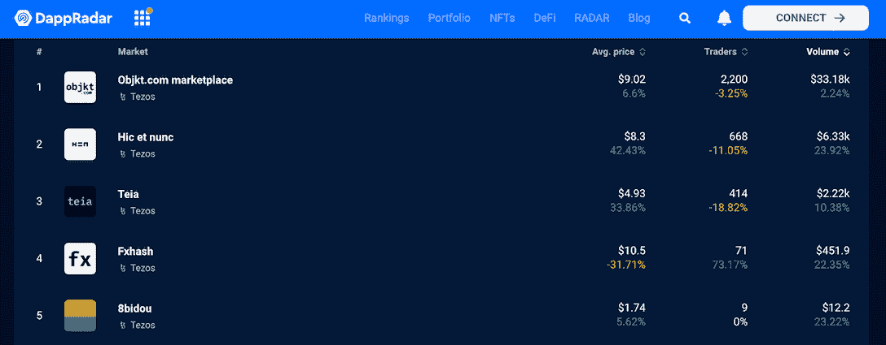

今天，Tezos 继续以其开放、包容和多样化的氛围吸引着许多艺术家，其中也有生殖艺术家。

[Check out dapps and NFTs on Tezos](https://web.archive.org/web/20221128093533/https://dappradar.com/rankings/protocol/tezos)

### 泰勒·霍布斯和蒲公英·威斯特的生殖艺术合作实验。

> 我们创造、分享和浏览文化内容(文字、图像、视频和游戏)的方法都是用代码构建的。如果说木材、混凝土、玻璃和钢是 20 世纪重要新建筑的核心材料，那么编码在 21 世纪已经轻而易举地取代了它们。
> 
> Tyler Hobbs, creator of Fidenza

在生成艺术的世界里，最新的新星是 QQL。这是 Dandelion 和 Tyler 之间的一次合作，是关于如何最好地利用生殖艺术的一次实验。这种合作关系将围绕创造、收集和管理生殖艺术的多种观点结合到一个有凝聚力的项目中。

[Check out artwork created with QQL](https://web.archive.org/web/20221128093533/https://dappradar.com/hub/nft-explorer/collection/qql)

值得注意的是，QQL 是一个所有人都可以访问的平台。用户可以体验该算法，并生成自己的作品。渲染完艺术品后，用户可以免费下载。

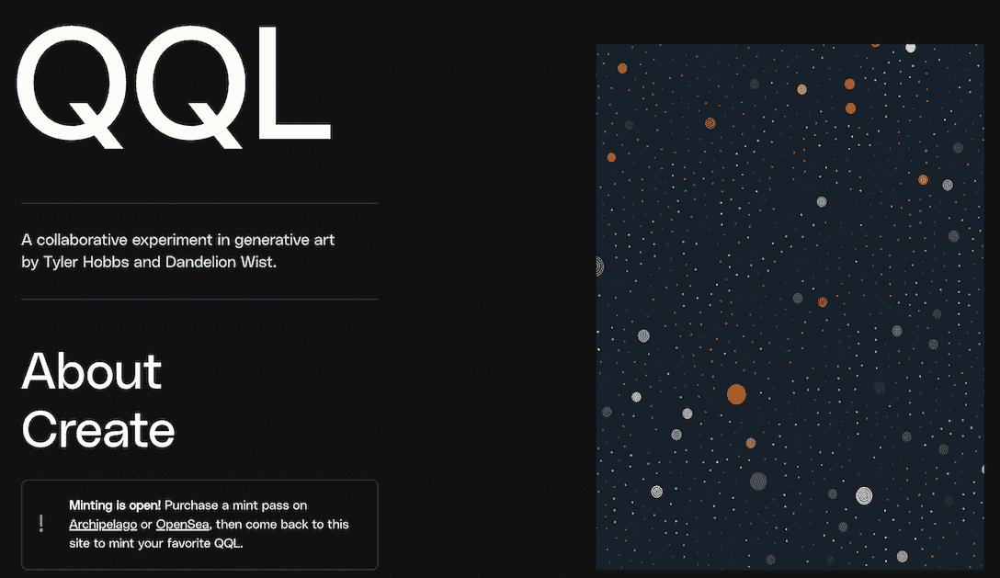

[Source](https://web.archive.org/web/20221128093533/http://qql.art/)

但是，如果您想将您的作品转化为官方的 QQL NFTs，您将需要一个铸造通行证。该平台发行了 999 张 NFT 铸币通行证，允许持有者铸造官方 QQL NFTs。mint pass 系列目前的底价为 16.5 ETH。

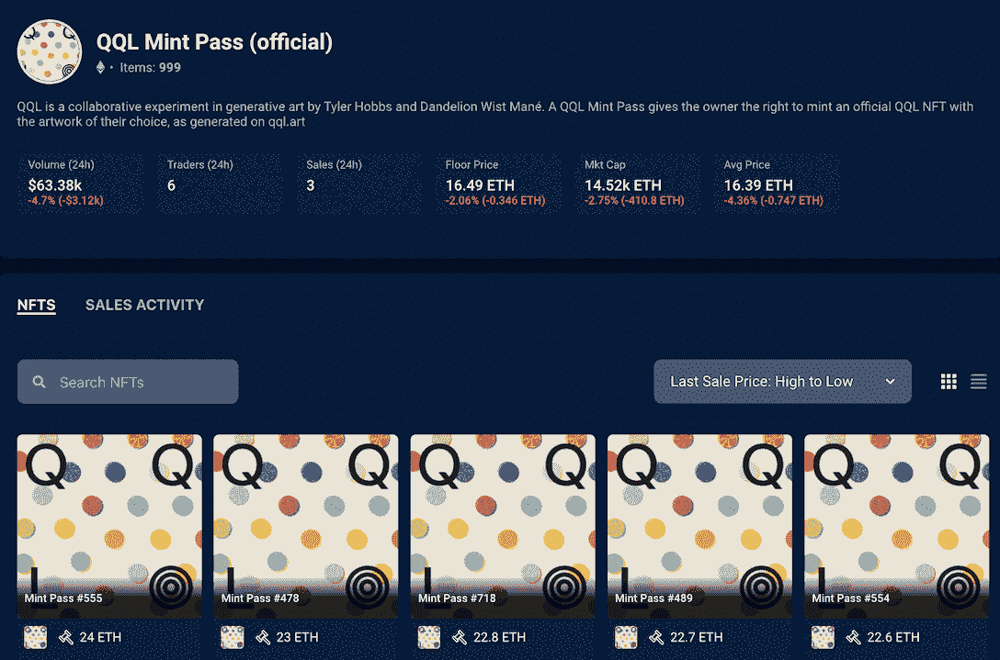[Check out QQL Mint Pass](https://web.archive.org/web/20221128093533/https://dappradar.com/hub/nft-explorer/collection/qql-mint-pass-official)

如果你也像我一样没有通行证，试试这些工具吧。毕竟，你可以下载这些图像供个人使用，例如，一个手机屏幕保护程序。以下是我的创作和我用 QQL 算法生成的设置。

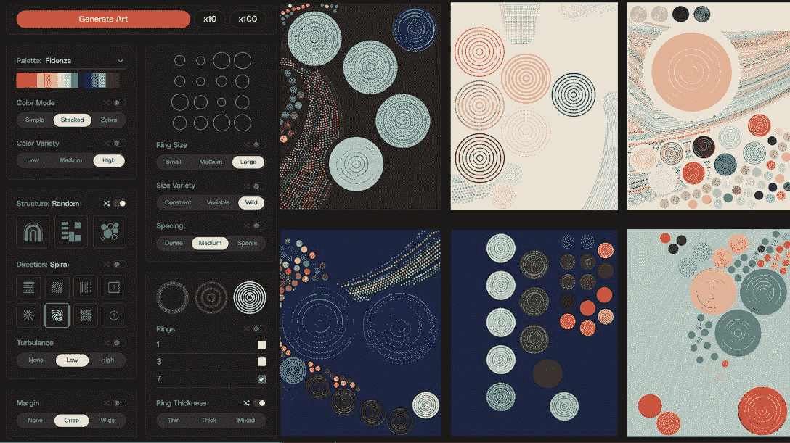

当您关注最终外观时，不难注意到 QQL 算法可以创建具有丰富纹理细节的艺术作品。

### 使用达普拉达 NFT 探险家找到辉煌的 NFT 艺术

[https://web.archive.org/web/20221128093533if_/https://www.youtube.com/embed/fkEaXYLOW-s?start=4&feature=oembed](https://web.archive.org/web/20221128093533if_/https://www.youtube.com/embed/fkEaXYLOW-s?start=4&feature=oembed)

## 一个更深层次的探索——没有艺术家，生成艺术能完成吗？

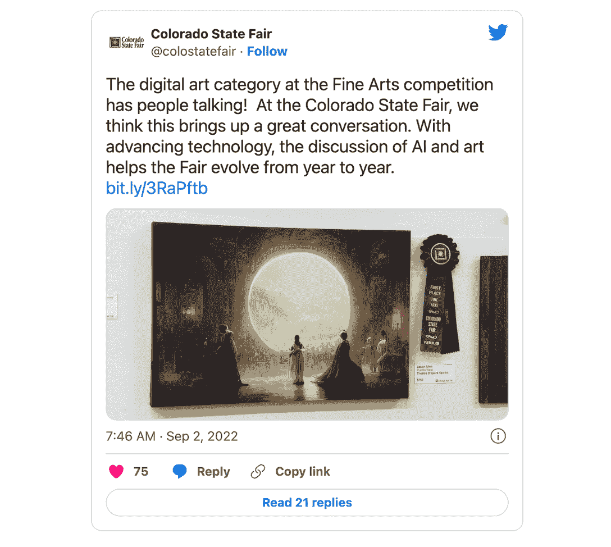

人工智能(AI)程序 Midjourney 创作的一件艺术品在今年 9 月的科罗拉多州博览会上赢得了美术比赛的第一名。该事件引发了关于人工智能生成的艺术作品是否可以参加比赛的争议，并使人们怀疑人工智能是否会取代艺术家。

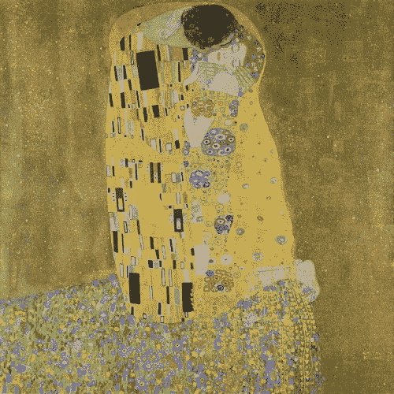

[Gustav Klimt’s original ‘The Kiss’ and DALL-E’s variations](https://web.archive.org/web/20221128093533/https://openai.com/dall-e-2/#demos)

DALL-E、Midjourney 和 Stable Diffusion 等人工智能系统允许用户通过输入他们想看的内容的文本描述来生成令人惊叹的图像。但这与像 QQL 这样让用户点击几下就能输出艺术的项目有什么不同呢？

也许下面的类比不是最好的，但是你明白了。

我们永远不会把一个通过各种生活经历掌握了多种语言的人和 Google Translate 的 AI 引擎进行比较，这个引擎有上百种语言的能力。这是因为这两种情况具有完全不同的含义。

所以在生成艺术中，艺术家的角色或人类的参与是这个过程不可或缺的一部分。艺术家设计生成系统和算法来说明艺术思想，而系统只是执行创作者的角色。

QQL 是泰勒·霍布斯(Tyler Hobbs)和蒲公英·威斯特(Dandelion Wist)将集体创作注入生成艺术的探索。因此，QQL 背后的动机和意义与人工智能程序有着根本的不同。

## 最后的想法

生成艺术在广阔的数字艺术领域中独树一帜，随着 Web3 技术的演进，沉寂了 60 年的生成艺术终于找到了茁壮成长所需的土壤。

然而，就策展、研究和批评而言，生成艺术领域仍然存在巨大的空白。生成艺术需要大量的人才在这些方面付出努力，才能成为连接艺术和技术的桥梁。

## 随身携带您的 Web3 之旅

使用 DappRadar 移动应用程序，再也不会错过 Web3。查看最受欢迎的 dapps 的性能，并关注您投资组合中的 NFT。您在 DappRadar 上的帐户会与我们的移动应用程序同步，这样您很快就可以选择实时接收提醒。

[Download the DappRadar app now](https://web.archive.org/web/20221128093533/https://dappradar.app.link/blog)[<picture></picture>](https://web.archive.org/web/20221128093533/https://play.google.com/store/apps/details?id=com.portfolio.dappradar) NewsletterUnsubscribe at any time. [T&Cs](https://web.archive.org/web/20221128093533/https://dappradar.com/terms) and [Privacy Policy](https://web.archive.org/web/20221128093533/https://dappradar.com/privacy-policy)