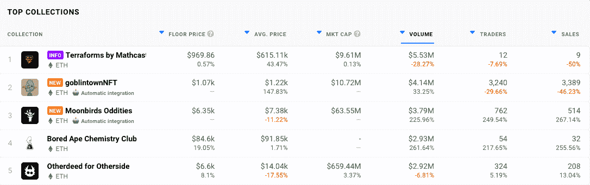

# 妖精镇是什么？

> 原文：<https://web.archive.org/web/https://dappradar.com/blog/what-is-goblin-town>

## 没有白名单，合作或不和的月球

不敬的 NFT 收藏地精镇不知从哪里冒出来，地板价刚刚超过 0.5 瑞士法郎。它做到了这一点，没有大肆宣传，没有路线图或大量的追随者，而 NFT 是免费分发的。他们只有一个拥有 10，600 名粉丝的 Twitter 账户，而且人数还在增加。

总结

*   该系列在 OpenSea 上被称为 Goblintown.wtf，免费到薄荷的 NFT 的底价目前约为 0.5 ETH。
*   这个项目背后的团队颠覆了通常的社区建设、营销、合作、列入白名单和为造币厂制造宣传的方法。
*   该项目于 5 月 22 日低调启动，造币厂免费提供给任何听说过 NFTs 的人。
*   ***用看似很少的努力投入发射，任何比彻底失败更大的事都是成功。最终，没有什么可失去的，哥布林镇会得到一切。***

哥布林镇建立在区块链以太坊的基础上，是一个由 10，000 多名生殖力 NFT 组成的集合，于 5 月 22 日发布。这个项目的 Twitter 个人资料是这个月才建立起来的，这个收藏项目的团队已经强调不要暴露自己。

没有详细说明项目走向的路线图，团队与社区的沟通也没有冲突。最后，地精镇的开发者明确声明 NFTs 没有任何附加的功能。

## 妖精镇是什么？

从设计上来说，我们对地精镇的了解并不多。这些收藏品似乎不知从何而来，也没有被大量推销给 NFT 社区。尽管如此， [OpenSea](https://web.archive.org/web/20220808231234/https://dappradar.com/ethereum/marketplaces/opensea) 上的 NFTs 交易量已经超过 3,800 ETH(在撰写本文时超过 776 万美元)。

[DappRadar’s ranking pages for NFT Top Collections](https://web.archive.org/web/20220808231234/https://dappradar.com/nft/collections)

哥布林镇 NFT 收藏已经在达普拉达的 NFT 排行榜上名列第二。仅在过去的 24 小时内，这些不可替代的代币就创造了 414 万美元的销售额。即便如此，推特上的人们仍然不知道这些收藏来自哪里。但这并没有阻止互联网对一个全新项目无中生有的能力印象深刻。

> 想象一下，在 NFT 的一个项目上工作了几个月，与最大的项目/阿尔法小组建立了合作关系，获得了 20 万追随者参与 WL 现货赠品，然后在造币厂之后，每个人都以造币厂的价格
> 
> 盖布林敦:免费造币厂，没有合作关系，没有 WL，没有不和【pic.twitter.com/bMiJoWufyg】T2
> 
> — ashrobin (@ashrobinqt) [May 22, 2022](https://web.archive.org/web/20220808231234/https://twitter.com/ashrobinqt/status/1528481126775459841?ref_src=twsrc%5Etfw)

Source: Twitter

关于地精镇，我们知道的一件事是它不是由地精建造的。该团队在其网站上发布的信息也很少。但是除了这一点点无关紧要的信息，我们所知道的 NFTs 背后的人是不敬的，他们发现了市场的缺口。

他们想出了一种在这个行业脱颖而出的有效方法，这个行业的用户声称欣赏可靠的智能合同、清晰的路线图、沟通清晰的团队和有价值的公用事业。我们看到的是人们渴望新奇。他们希望将自己与一个全新的 NFT 概念联系起来，因为这将反过来使 NFT 的持有者脱颖而出。

## 哥布林镇有什么计划？

看起来短期目标是巨魔每个认为[无聊猿](https://web.archive.org/web/20220808231234/https://dappradar.com/ethereum/collectibles/bored-ape-yacht-club)、[变异猿](https://web.archive.org/web/20220808231234/https://dappradar.com/ethereum/collectibles/mutant-ape-yacht-club)、[月鸟](https://web.archive.org/web/20220808231234/https://dappradar.com/ethereum/collectibles/moonbirds)、[克隆 X](https://web.archive.org/web/20220808231234/https://dappradar.com/ethereum/collectibles/clone-x-x-takashi-murakami) 和[隐形朋友](https://web.archive.org/web/20220808231234/https://dappradar.com/ethereum/collectibles/invisible-friends)是严肃收藏的人。颠覆对“蓝筹股”NFT 的先入之见似乎是哥布林镇的方法，以区别于有时沾沾自喜的项目，这些项目利用自己的排他性进行交易。

> [pic . Twitter . com/elgl 6 asjxi](https://web.archive.org/web/20220808231234/https://t.co/eLGl6ASJXI)
> 
> — goblintown.wtf (@goblintownwtf) [May 22, 2022](https://web.archive.org/web/20220808231234/https://twitter.com/goblintownwtf/status/1528411117466304515?ref_src=twsrc%5Etfw)