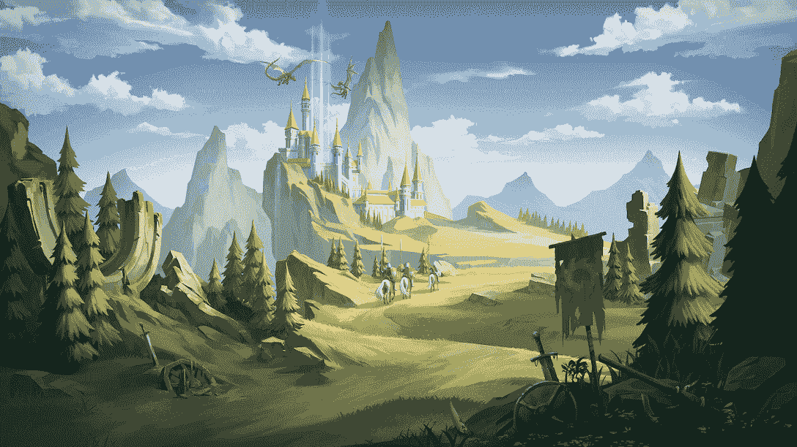
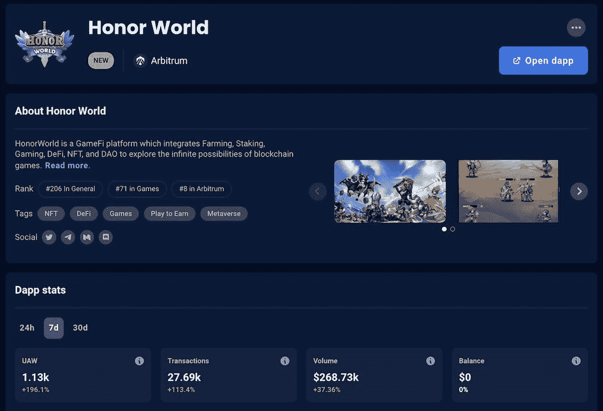
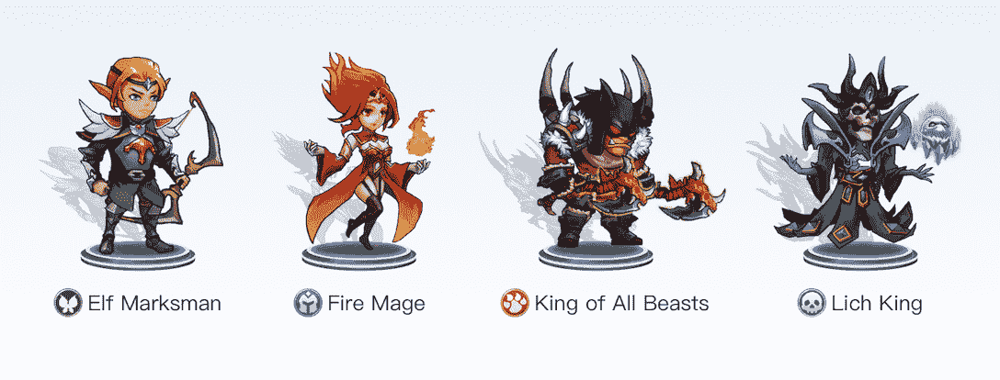
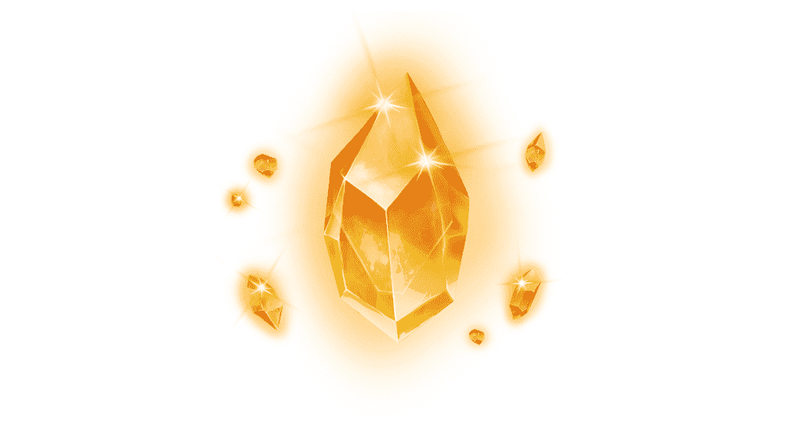
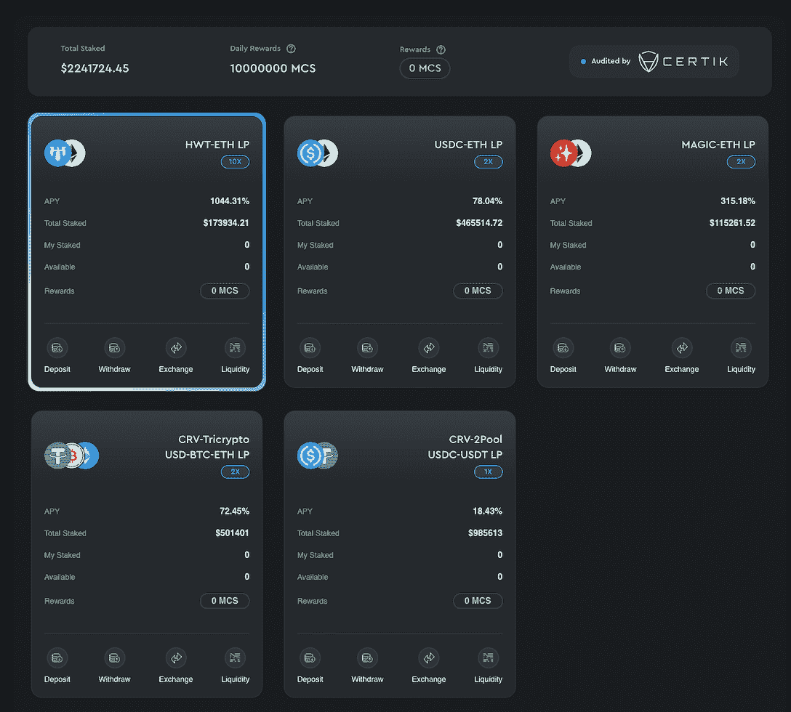
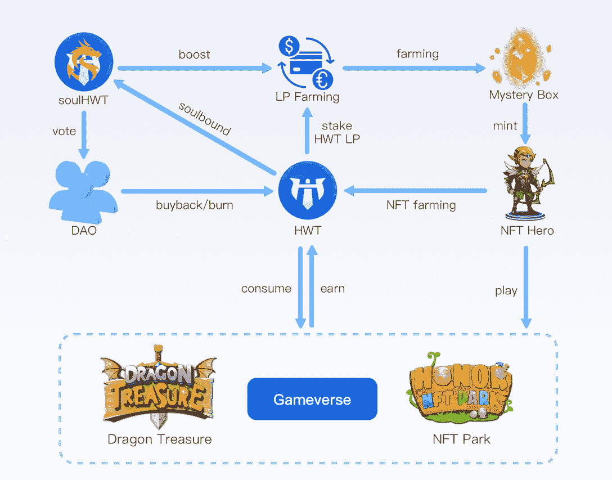

# 什么是荣誉世界，如何像职业玩家一样玩

> 原文：<https://web.archive.org/web/https://dappradar.com/blog/what-is-honor-world-and-how-to-play-it-like-a-pro>

## 参与荣誉世界的 NFT 农业，赌注，游戏，和更多的最终指南。

荣誉世界是一个独特的 GameFi 平台，整合了农业、流动性开采、游戏、道和许多其他元素，以探索 Web3 的无限潜力。此外，该平台利用 Arbitrum 网络为用户带来安全、流畅的体验。今年 1 月，荣誉世界将把龙宝引入其生态系统。

在这篇文章中，你将了解到这款游戏如何以其动态的生态系统和游戏赚钱的机制吸引玩家。

**内容**:

*   [*什么是荣誉世界*](https://web.archive.org/web/20230128214234/https://dappradar.com/blog/what-is-honor-world-and-how-to-play-it-like-a-pro/#what)
*   *[如何玩荣誉世界](https://web.archive.org/web/20230128214234/https://dappradar.com/blog/what-is-honor-world-and-how-to-play-it-like-a-pro/#how)*
    *   [*英雄 NFT 及其使用方法*](https://web.archive.org/web/20230128214234/https://dappradar.com/blog/what-is-honor-world-and-how-to-play-it-like-a-pro/#hero)
    *   *[召唤水晶帮助玩家获得独特英雄](https://web.archive.org/web/20230128214234/https://dappradar.com/blog/what-is-honor-world-and-how-to-play-it-like-a-pro/#summon)*
    *   [*水晶矿池解说*](https://web.archive.org/web/20230128214234/https://dappradar.com/blog/what-is-honor-world-and-how-to-play-it-like-a-pro/#mining)
*   [*概括地说就是*](https://web.archive.org/web/20230128214234/https://dappradar.com/blog/what-is-honor-world-and-how-to-play-it-like-a-pro/#token)
*   *[龙族宝藏即将在 Gameverse](https://web.archive.org/web/20230128214234/https://dappradar.com/blog/what-is-honor-world-and-how-to-play-it-like-a-pro/#dragon)*中上线

## 什么是荣誉世界

荣誉世界是一个社区驱动的 GameFi 平台，充满了巨大的虚拟世界，迷人的角色和丰富的游戏。该平台致力于为玩家带来 DeFi、NFT 和 GameFi 元素的完美平衡。因此，除了享受游戏的多样性，荣誉世界玩家还可以从充满活力的财务机制中受益，探索游戏和赚钱的机会。

荣誉世界背后的团队拥有丰富的游戏开发经验，并成功推出了几款热门游戏，如《水晶猎人》。考虑到 Arbitrum 的安全性、速度和成本优势，该团队决定在这个第 2 层网络上推出。

尽管这款游戏才刚刚推出，但它的增长速度是引人注目的。根据 DappRadar 2022 年 12 月 30 日的数据，独立活跃钱包的数量周环比增长超过 100%。

[View more stats about Honor World](https://web.archive.org/web/20230128214234/https://dappradar.com/arbitrum/games/honor-world)

## 荣誉世界怎么玩

玩家从加入荣誉世界的那一刻起，就会意识到这个游戏充满了各种可能。幻想叙事会把玩家拉入它的世界。这里有商品丰富的农场，有奇幻的游戏乐园，有山里的巨龙，还有无数的宝藏等着你去探索。

所以我们先从最基本的元素开始，游戏内角色。

### 英雄 NFT 以及如何使用它们

英雄是荣誉世界游戏生态系统中的重要资产，它们以 NFT 的形式存在。有五个等级的英雄:普通的，不普通的，稀有的，史诗的和传奇的，按照力量的增加顺序。此外，英雄有四个种族，人类，兽人，精灵和亡灵。

英雄和他们的能力在荣誉世界中是至关重要的，因为玩家可以通过下注他们的英雄 NFT 来获得游戏内的令牌 HWT。英雄等级越高，挣钱能力越强。

[Start earning HWT with Honor World now](https://web.archive.org/web/20230128214234/https://farm.honorworld.io/)

玩家如何才能获得一个英雄？首先，你可以从荣誉世界的市场上购买英雄。但是有一个更令人兴奋的方法来招募他们。

### 召唤水晶帮助玩家获得独特的英雄

召唤英雄 NFTs，玩家需要召唤水晶，荣誉世界平台上的神秘盒子。玩家首先激活水晶，从激活的水晶中召唤英雄 NFTs。召唤水晶可以从生态系统 NFT 市场获得，也可以按照 1:10000 的比例召唤水晶碎片来制作。

要制作召唤水晶，玩家必须使用神秘水晶碎片。考虑到这一点，是时候让赌注机制发挥作用了。

### 水晶矿池解释道

荣誉世界是 DeFi 和游戏的创新融合。向荣誉世界水晶矿池下注的用户将获得 MCS 作为奖励。MCS 的每日总奖励随着锁定的总价值而增加(TVL)。

目前，有五个流动性池可供用户选择。它们显示在下面的截图中。流动性挖掘是平台上享有大量用户的功能，这得益于它能够为用户带来丰厚的被动收入。

从令牌桩产生 MSC 的机制在荣誉世界经济中起着至关重要的作用，并且对于整个循环经济是至关重要的。

[Try Honor World now](https://web.archive.org/web/20230128214234/https://farm.honorworld.io/)

## 简而言之，象征经济学

荣誉世界中的每一项资产都在促进游戏生态系统的可持续性和活力方面发挥着独特的作用。下图解释了各种资产之间的联系。

如上所述，赌注英雄 NFT 可以为玩家产生 HWT，这个令牌有几个用途。首先，HWT 将在游戏中充当交换媒介。此外，HWT 可以与 ETH 配对，并在其中一个采矿平台池中下注，以生成 MCS。

在上面的图表中，还有一种类型的资产我们还没有触及:SoulHWT。

SoulHWT 是一个灵魂绑定令牌，可以用来提高奖励。更重要的是，它是荣誉世界未来重大决策的唯一投票令牌。要获得 SoulHWT，用户需要绑定 HWT，这个过程类似于令牌锁定。HWT 被束缚的时间越长，生产的灵魂就越多。

荣誉世界的生态系统继续朝着更加强健的未来发展。其中一个关键举措是继续开发游戏世界。

[Play Honor World now](https://web.archive.org/web/20230128214234/https://farm.honorworld.io/)

## 龙宝藏将很快登陆荣誉世界游戏世界

龙宝是一款闲散游戏。即使玩家不需要投入大量的时间去掌握游戏，但还是要有策略的去玩。游戏允许用户与敌人战斗，获得游戏内资源，不断增强自己的英雄，并爬上排行榜，以赚取丰厚的奖励。

这款游戏将于 2023 年 1 月 7 日对所有玩家开放。如果你想占据先发优势，那就走项目官方渠道，抢占先机。

#### 有用的链接

*   [网站](https://web.archive.org/web/20230128214234/https://farm.honorworld.io/)
*   [推特](https://web.archive.org/web/20230128214234/https://twitter.com/honorworld_io)
*   [文档](https://web.archive.org/web/20230128214234/https://docs.honorworld.io/)
*   [电报](https://web.archive.org/web/20230128214234/https://t.me/honorworld_official)

**免责声明** —这是一篇赞助文章。DappRadar 不认可本页面上的任何内容或产品。DappRadar 旨在提供准确的信息，但读者应该在采取行动之前总是自己做研究。DappRadar 的文章不能被认为是投资建议。