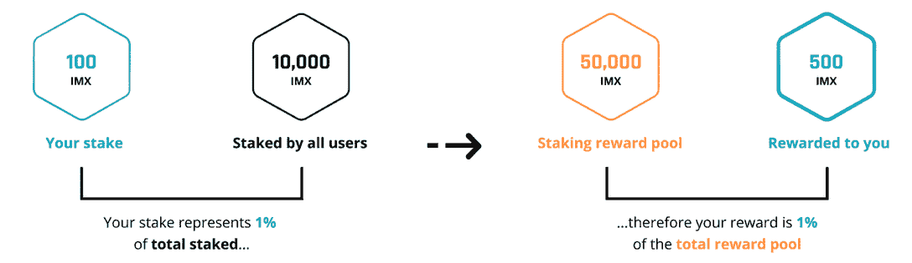

# 什么是不可变 X？游戏区块链

> 原文：<https://web.archive.org/web/https://dappradar.com/blog/what-is-immutable-x>

## 以太坊第 2 层网络专为速度、规模和游戏玩家打造

不可变 X 是第二层区块链，它为用户带来以太坊的所有好处，而没有高昂的成本和偶尔缓慢的确认时间。Immutable X 创建于 2018 年，现在是越来越多的 Web3 游戏的网络选择，它提供免费的 NFT 造币平台、专用市场和每秒 9000 笔交易。

**内容**

*   *[什么是不可变 X？](https://web.archive.org/web/20221204093401/https://dappradar.com/blog/what-is-immutable-x/#what-is)*
*   *[不可变 X 上有哪些 dapps？](https://web.archive.org/web/20221204093401/https://dappradar.com/blog/what-is-immutable-x/#dapps-on)*
*   *[区块链是如何工作的？](https://web.archive.org/web/20221204093401/https://dappradar.com/blog/what-is-immutable-x/#blockchain-work)*
*   *[不可变 X 有什么好处？](https://web.archive.org/web/20221204093401/https://dappradar.com/blog/what-is-immutable-x/#benefits-of)*
*   *[什么是 IMX 令牌？](https://web.archive.org/web/20221204093401/https://dappradar.com/blog/what-is-immutable-x/#imx-token)*
*   *[不可改变的 X 市场](https://web.archive.org/web/20221204093401/https://dappradar.com/blog/what-is-immutable-x/#immutable-marketplace)*
*   *[有用链接](https://web.archive.org/web/20221204093401/https://dappradar.com/blog/what-is-immutable-x/#useful-links)*

现在[以太坊合并已经完成](https://web.archive.org/web/20221204093401/https://dappradar.com/blog/what-is-the-ethereum-merge)，区块链的开发者和爱好者正在询问去中心化网络的未来会是什么样子。无论发生什么，我们确信像不可变 X 这样的第二层区块链将会发挥重要作用。

[Discover Immutable X Dapps](https://web.archive.org/web/20221204093401/https://dappradar.com/rankings/protocol/immutablex)

## 什么是不可变 X？

不可变 X 是构建在以太坊区块链之上的第 2 层伸缩解决方案。它的设计和创建是为了给 NFT 的交易和铸造提供近乎即时的确认和近乎零的汽油费。

詹姆斯·弗格森，罗比·弗格森和亚历克斯·康诺利于 2018 年在澳大利亚推出了 Immutable。不变是不变 X 网背后的公司。

它最初是为了降低与用 NFT 交易被解放的(不可变游戏)的[神相关的成本而创建的。但更大的目标是创建一个游戏专用的区块链，可以托管游戏平台，同时降低成本，加快交易时间。](https://web.archive.org/web/20221204093401/https://dappradar.com/multichain/games/gods-unchained)

## 不可变 X 上有哪些 dapps？

作为一个为 NFT 交易和游戏打造的区块链，不可变 X 上的大多数 dapps 都归入了[游戏](https://web.archive.org/web/20221204093401/https://dappradar.com/rankings/protocol/immutablex/category/games)和[收藏品](https://web.archive.org/web/20221204093401/https://dappradar.com/rankings/protocol/immutablex/category/collectibles)的保护伞之下。我们已经提到了《被解放的上帝》,但是在 Immutable 上还有很多平台绝对值得一看:

*   immutaswap . io-一个不可变的 X 市场，用于交易稳定的 NFT。

*   [守护者协会](https://web.archive.org/web/20221204093401/https://dappradar.com/immutablex/games/guild-of-guardians)–专注于玩家所有权的移动 RPG。

*   [HRO](https://web.archive.org/web/20221204093401/https://dappradar.com/immutablex/collectibles/hro)——一个通过实物和数字交易卡在现实和幻想之间架起桥梁的平台。

*   即将上市的 NFT RPG 游戏和自动战斗机。

*   [Highrise](https://web.archive.org/web/20221204093401/https://dappradar.com/immutablex/games/highrise)–拥有 150 万月活跃用户的移动虚拟世界。

Explore Immutable X Games

## 区块链是如何工作的？

该网络基于一种叫做零知识积累(ZK 积累)的技术。这意味着交易在确认后不会自动添加到区块链中。

相反，它们在不可变的 X 网络上被成批处理，然后作为一个安全的信息单元被转移到区块链上。这就是为什么它被称为第二层，因为它建立在以太坊之上，以太坊是第一层。

通过收集和确认链外交易，然后一次性将所有交易转移到链上，Immutable X 每秒能够处理 9000 笔交易，同时保持汽油费接近于零。这种方法也使得在不可变的 X 上铸造和交易 NFT 100%碳中和。不可改变的抵消了使用碳信用的少量能源。

[https://web.archive.org/web/20221204093401if_/https://www.youtube.com/embed/BgCgauWVTs0?feature=oembed](https://web.archive.org/web/20221204093401if_/https://www.youtube.com/embed/BgCgauWVTs0?feature=oembed)

Wondering what a Layer 2 is?

## 不可变 X 有什么好处？

*   **成本和速度**–这是唯一一个无汽油的铸造平台，交易时间是即时的。因为 Immutable X 是为游戏玩家设计的，所以它会尽一切努力来迎合这个群体。

*   **易于使用**–不可变的 X Web3 钱包集成了信用卡支付，因此不习惯使用区块链技术的人仍然可以访问该生态系统。Immutable 表示，它拥有“简单的 API 和 SDK，可以让你更快地构建和启动”。这意味着对于需要一个主机来进行创作的开发人员来说，这是一个很好的选择。

*   **全球 NFT 交易**-对于任何想要进行 NFTs 交易的人来说，在不变的 X 网络上列出商品的人可以立即访问整个全球订单簿。这意味着，如果有人在一个不可变的 X 市场上列出一个 NFT，它会自动添加到每个交易不可变的 X 项目的市场中。

*   以太坊的好处–不可变的 X 用户也从以太坊区块链的安全性中获益。虽然交易和费用在不可变 X 上的第 2 层处理，但所有信息最终都在以太坊上确认。该解决方案还支持所有桌面以太坊钱包，无需用户切换到不同的网络。

## 什么是 IMX 代币？

不可变 X (IMX)是一个 ERC-20 实用令牌，它充当保持不可变 X 齿轮转动的润滑油。用户需要它来进行网络交易、提供流动性和构建应用程序。

对于不可变的 X 网络，它有三个核心用途:

#### 费用

Immutable 对网络上进行的所有二级交易收取 2%的费用。其中的 20%必须在 IMX 支付。这种支付可以直接用 IMX 代币进行，也可以在公开市场上将购买货币(如 [ETH](https://web.archive.org/web/20221204093401/https://dappradar.com/hub/token/eth/ETH) )换成 IMX。

#### 红星

收取的费用被分配给 IMX 赌注者，与他们贡献给集合池的代币数量成比例。下面的图片是如何工作的一个例子。

How staking rewards works

要获得赌注奖励，用户必须:

*   按住第 1 层或第 2 层的 IMX
*   在过去 30 天内对治理提案进行了投票

他们还需要做以下两件事之一:

*   在不变的 X 上持有 NFT
*   在过去 30 天内完成了不可变 X 的交易。

#### 分权治理

IMX 代币持有者可以对社区提出的提案进行投票。投票可以针对保留令牌分配、开发者授权或改变令牌供应等主题。更多的 IMX 代币赋予持有者更多的投票权。

[Check IMX Price](https://web.archive.org/web/20221204093401/https://dappradar.com/hub/token/eth/IMX?from=0xf57e7e7c23978c3caec3c3548e3d615c346e79ff)

## 不变的 X 市场？

作为一个为交易游戏 NFT 而建立的区块链，Immutable X 有自己的市场，用户可以在那里买卖他们的游戏内资产。它是所有在网络上出售的物品的家。因此，如果你选择的二级市场以不可变的 X NFTs 为特色，你会看到所有已经在官方市场上列出的东西。

正如我们已经提到的，NFT 可以在不可变 x 上免费铸造，并且不可变只收取 2%的销售费用。这使得区块链非常适合那些在推出下一个系列时寻求低成本的人。

你可以[访问不可变的 X marketplace](https://web.archive.org/web/20221204093401/https://market.immutable.com/) 亲自看看有哪些 NFT 可以购买。

## 有用的链接

*   [发现不可变的 X dapp](https://web.archive.org/web/20221204093401/https://dappradar.com/rankings/protocol/immutablex)
*   [探索不可变 X 上的 NFTs】](https://web.archive.org/web/20221204093401/https://dappradar.com/nft/protocol/immutablex)
*   [诸神被解放单人 Dapp 页面](https://web.archive.org/web/20221204093401/https://dappradar.com/multichain/games/gods-unchained)
*   [查看 IMX 代币价格](https://web.archive.org/web/20221204093401/https://dappradar.com/hub/token/eth/IMX?from=0xf57e7e7c23978c3caec3c3548e3d615c346e79ff)
*   [文章:用不可变的 X 进行赌注](https://web.archive.org/web/20221204093401/https://dappradar.com/blog/staking-with-immutable-x)
*   [文章:不可变 X 的 5 亿美元发展基金](https://web.archive.org/web/20221204093401/https://dappradar.com/blog/immutable-x-plans-500-million-fund-for-nfts-and-game-developers)

 NewsletterUnsubscribe at any time. [T&Cs](https://web.archive.org/web/20221204093401/https://dappradar.com/terms) and [Privacy Policy](https://web.archive.org/web/20221204093401/https://dappradar.com/privacy-policy)