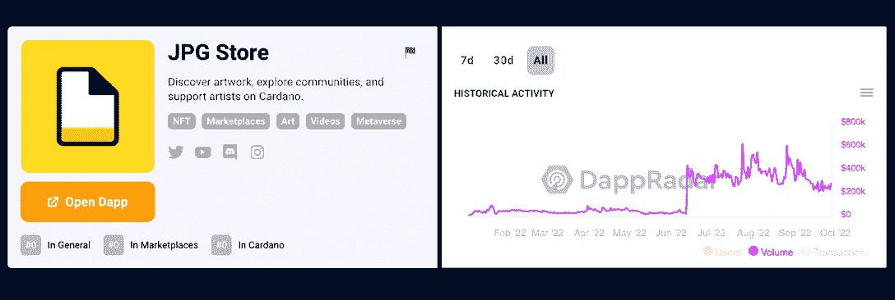
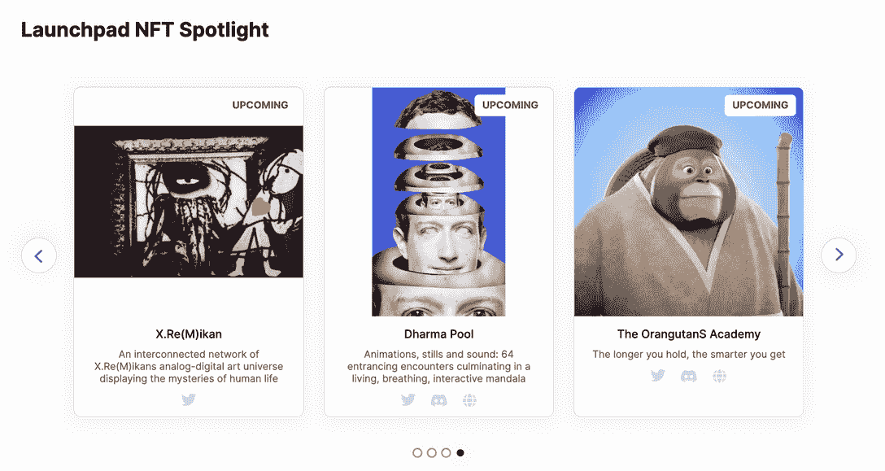
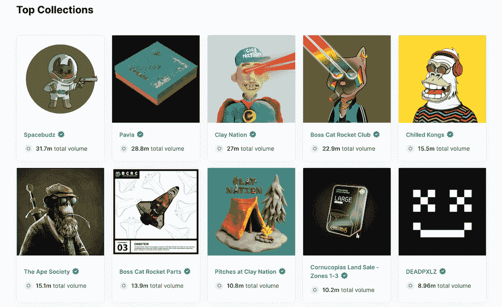
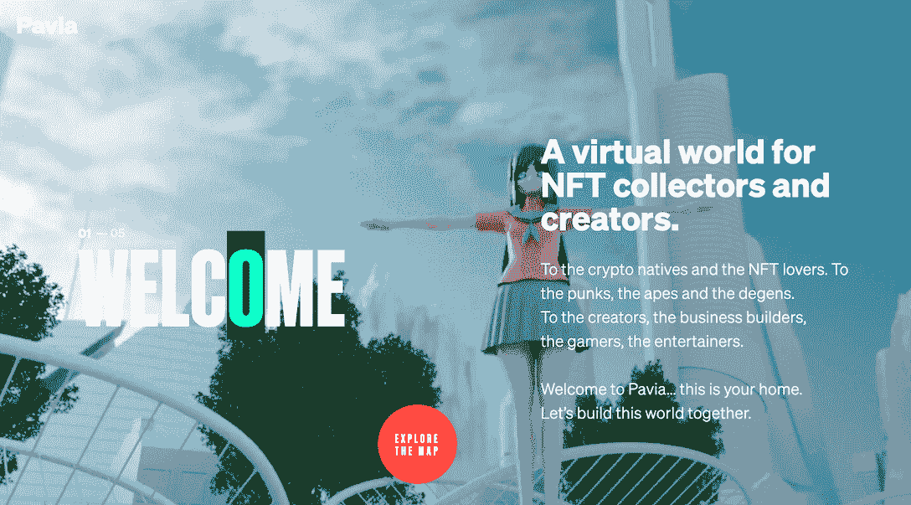
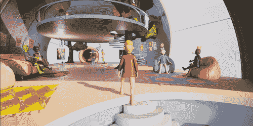

# 什么是 JPG 商店:卡尔达诺最大的 NFT 市场

> 原文：<https://web.archive.org/web/https://dappradar.com/blog/what-is-jpg-store-the-largest-nft-marketplace-on-cardano>

## 用户可以在 JPG 商店建立，交易和收集。

JPG 商店是一个卡尔达诺 NFT 市场，允许用户创作和发现艺术品。作为卡尔达诺的领先市场，JPG 商店努力支持那些艺术家、创作者和社区推进生态系统，帮助卡尔达诺释放其潜力。

内容:

*   [什么是 JPG 店？](https://web.archive.org/web/20221130133844/https://dappradar.com/blog/what-is-jpg-store-the-largest-nft-marketplace-on-cardano/#what)
*   [在 JPG 商店创建 NFTs】](https://web.archive.org/web/20221130133844/https://dappradar.com/blog/what-is-jpg-store-the-largest-nft-marketplace-on-cardano/#create)
*   如何在 JPG 商店销售 NFT？
*   如何在 JPG 购买 NFT？
*   JPG 商店里最受欢迎的系列是什么？
*   [使用 DappRadar 跟踪区块链不同地区的非功能性神经营养不良趋势。](https://web.archive.org/web/20221130133844/https://dappradar.com/blog/what-is-jpg-store-the-largest-nft-marketplace-on-cardano/#track)

在不断变化的 NFT 空间中，一个引人注目的项目正在获得关注，这就是卡尔达诺的 JPG 商店。JPG 店的交易量在今年 6 月出现了高峰，此后大部分时间都保持在高位。这是市场看好 Cardano 生态系统的有力证据。

如果你也看好卡达诺的 NFT 生态系统，你可能有兴趣探索其他卡达诺市场。我们编辑了这个卡达诺 NFT 顶级市场的列表，它可以帮助你比较和找到你喜欢的。

事不宜迟，让我们进入今天的话题，看看 JPG 店是什么。

## 什么是 JPG 商店？

[JPG 商店](https://web.archive.org/web/20221130133844/https://dappradar.com/cardano/marketplaces/jpg-store)是一个卡尔达诺 NFT 市场，允许用户创造、发现和收集各种艺术品。通过利用 Cardano 高度可扩展的低延迟网络，JPG 商店可以为创作者和收藏家带来流畅的 NFT 体验。

此外，JPG 商店有一个包容性的社区来支持创作者，并教育他们使用区块链的好处。

卡尔达诺网络的核心一直是可持续和人道主义愿景。作为卡达诺生态系统的一员，JPG 商店致力于这样的使命，该平台 1%的收入直接用于环保事业。

由于 Cardano 有自己的区块链，用户需要用特定的钱包支付特定的代币才能使用 Cardano dapps。因此，JPG 商店上的交易必须用 ADA 支付，ADA 是 Cardano 网络的本地令牌。NamiWallet、FlintWallet、GeroWallet 和 EternlWallet 是这个市场上使用的一些钱包。

如果你是 Cardano 新手，对这款区块链不太了解，[你可以在这里找到深入的 Cardano 钱包对比指南。](https://web.archive.org/web/20221130133844/https://dappradar.com/blog/best-wallets-for-cardano)它会帮你决定选择哪个钱包。

[*阅读 DappRadar 关于 Cardano 的终极指南，*](https://web.archive.org/web/20221130133844/https://dappradar.com/blog/what-is-cardano-a-simple-explanation/#What-is-Cardano?) *一个兼容以太坊的下一代区块链网络。*

## 如何在 JPG 商店创建 NFT？

[JPG 店](https://web.archive.org/web/20221130133844/https://dappradar.com/cardano/marketplaces/jpg-store)目前允许用户“创建单个 NFT”，生成“批量&大集合”的功能即将上线。在市场上制造 NFT 很容易，只需要几个简单的步骤。

1.  首先，在网站右上角找到“创建者”，然后点击“创建您的收藏”。
2.  然后，您将被带到下一页，并在那里选择“创建单一 NFT”。
3.  如果您要创建不属于任何现有集合的全新 NFT，请选择“创建新策略 ID”。如果它已经是您想要添加更多插图的当前收藏，请选择“添加到现有策略 ID”。
4.  在这一步中，您可以个性化他们的收藏，例如输入一个朗朗上口的名字，一个简短的描述等。'
5.  完成所有设置后，点击保存按钮，您将被要求使用您的钱包密码进行签名以完成该过程。

[JPG 商店](https://web.archive.org/web/20221130133844/https://dappradar.com/cardano/marketplaces/jpg-store)有一个启动平台计划，支持创作者、设计师和艺术家创作艺术品，为 Cardano 社区增加价值。

该计划提供了一系列的好处来帮助创作者启动他们的项目。这些包括技术援助、指导、营销支持等等。[点击此链接，了解有关 Launchpad 计划的更多信息。](https://web.archive.org/web/20221130133844/https://jpgstore.notion.site/JPG-Store-Launchpad-f51bcae9793647d38b0f5757726dc782)

以下是 Launchpad 孵化的部分优秀作品。

## 如何在 JPG 商店销售 NFT？

你可以随时在 JPG 商店上通过点击来买卖 NFT。然而，要出售你拥有的 NFT，你必须首先在市场上列出它。

转到您的个人资料，在“我的非专利技术”下，您将看到您拥有的所有非专利技术。找到你想要出售的物品，点击“出售 NFT”按钮，输入想要的售价，然后点击“发送列表”。确认钱包中的密码后，您的 NFT 将开始出售。

## 如何在 JPG 商店购买 NFT？

在该网站的“市场”部分，你可以找到各种各样的 NFT，从数字艺术到头像。此外，JPG 商店提供了直观的类别视图和高级搜索功能，允许用户定义排序、价格范围等。

一旦你找到你想买的 NFT，点击“购买 NFT”。然后你需要用你的钱包密码签署交易以完成购买。

## JPG 商店里最受欢迎的系列是什么？

JPG 商店目前出售的数字资产超过 30 万件。这些 NFT 由各种项目、社区和艺术家发起，为用户提供了各种各样的实用工具。让我们来看看一些最热门的项目。

Pavia 是一个身临其境的社区虚拟世界，用户可以在这里创造、玩、拥有和赚钱。这个乌托邦式的未来世界是为早期元宇宙开拓者在卡达诺生态系统中定居、建设和发展而创造的。Pavia 旨在将游戏和社交网络的乐趣与 Web3 的新数字所有权范式相结合。

用户现在可以在 JPG 商店获得帕维亚土地 NFTs。

Pavia

泥人国度是一个广阔的虚拟环境，有着欢乐的氛围和独特的泥人艺术风格。该项目对艺术充满热情，致力于建立一个 Web3 艺术社区。未来，克莱国家将敞开大门，扩展到举办虚拟和物理艺术和文化活动——克莱 NFT 和访客卡持有者均可参加。

Clay Nation

## 使用 DappRadar 跟踪各种区块链的趋势性 NFT。

JPG 商店和卡达诺 NFT 生态系统的崛起必将为 NFT 领域带来多样性，丰富用户体验。然而，随着多链 NFT 生态系统的发展，用户将不可避免地被海量信息淹没。

DappRadar 为每个人提供了最方便的 NFT 跟踪和分析工具。即使在动荡的市场中，DappRadar 也能让您随时捕捉趋势。

[https://web.archive.org/web/20221130133844if_/https://www.youtube.com/embed/fkEaXYLOW-s?feature=oembed](https://web.archive.org/web/20221130133844if_/https://www.youtube.com/embed/fkEaXYLOW-s?feature=oembed)

点击下面的图标，查看这些有用的工具。

[<picture></picture>](https://web.archive.org/web/20221130133844/https://dappradar.com/rankings/category/games)[<picture></picture>](https://web.archive.org/web/20221130133844/https://dappradar.com/hub/nft-explorer)[<picture></picture>](https://web.archive.org/web/20221130133844/https://dappradar.com/blog/10-games-to-play-and-earn-for-less-than-10-dollars)

## 随身携带您的 Web3 之旅

使用 DappRadar 移动应用程序，再也不会错过 Web3。查看最受欢迎的 dapps 的性能，并关注您投资组合中的 NFT。您在 DappRadar 上的帐户会与我们的移动应用程序同步，这样您很快就可以选择实时接收提醒。

[Download the DappRadar app now](https://web.archive.org/web/20221130133844/https://dappradar.app.link/blog)[<picture></picture>](https://web.archive.org/web/20221130133844/https://play.google.com/store/apps/details?id=com.portfolio.dappradar)