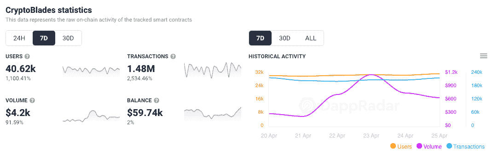

# 什么是国王，隐剑王国的本土令牌

> 原文：<https://web.archive.org/web/https://dappradar.com/blog/what-is-king-cryptoblades-kingdoms-native-token>

## 升级村庄，攻击和征服你的敌人，都由国王提供动力

**总结**

*   过去一周，CryptoBlades 王国的链上分析全面飙升。
*   ***游戏中的*** [***原生令牌王者***](https://web.archive.org/web/20220927100909/https://dappradar.com/hub/token/bsc/KING?from=0x0cCD575bf9378c06f6DCa82f8122F570769F00C2) ***也曾在价格暴涨之后几乎立刻又回落下来。***

[**CryptoBlades 王国的**](https://web.archive.org/web/20220927100909/https://dappradar.com/multichain/games/cryptoblades) **王者令牌是网络策略游戏自带的整个生态系统的核心。玩家可以建造村庄，征服敌人，所有这些都通过使用国王令牌。在过去的一周里，CryptoBlades 王国有超过 40，000 名玩家，是后起之秀之一。**

## 国王令牌

当《隐剑王国》发行时，KING 取代 SKILL 成为了隐剑特许经营权的本土标志。令牌建立在[币安智能链](https://web.archive.org/web/20220927100909/https://dappradar.com/rankings/protocol/binance-smart-chain)上。

花王只有一个办法。玩家可以用它来获得黄金，然后成为游戏中的代币。在这一点上，当国王变成了黄金，游戏就脱离了链条。

这意味着交易和玩家行为的信息被记录在中央服务器上，而不是区块链上。许多 P2E 游戏这样做是为了通过削减汽油费来加快游戏速度和降低交易成本。

玩家可以在隐剑王国使用黄金做以下事情:

*   升级一个村庄
*   发送攻击或支持
*   宣称拥有一个新村庄
*   取消行动和交易
*   给钱包起绰号

## 隐剑王国

CryptoBlades 在过去的一周里一直处于疯狂状态。该游戏的链上分析显示，在过去的七天里，各项指标都有所增长。用户增长了 1，100%，达到 40，620 人，平台上的交易数量激增了 2，534%，达到 148 万笔。

[DappRadar’s seven-day on-chain analytics for CryptoBlades](https://web.archive.org/web/20220927100909/https://dappradar.com/multichain/games/cryptoblades)

国王令牌今天早上(4 月 26 日)也短暂飙升，然后回落到之前的水平。这些上升趋势是否相关还有待观察，但游戏粉丝应该会受到游戏整体链上活动峰值的鼓舞。

## 什么是隐剑王国？

CryptoBlades 王国于 2021 年 10 月推出，作为原始 CryptoBlades 的继任者。国王令牌与新游戏一起推出。《隐剑王国》围绕着传说中的剑刃展开，玩家需要搜索并获得这些剑刃。一旦玩家得到这些神秘的物品，他们就有机会成为英雄。

游戏赚取模式是基于玩家通过游戏赚取代币，并通过使用和改进来建立其 NFT 的价值。新的特性不断被引入，这使得玩家可以继续增强他们物品的力量。

资产是玩家拥有的按照 ERC-721 标准制造的非功能性游戏，人们可以在二级市场上自由交易。要亲自了解 CryptoBlades Kingdoms 的表现，请查看平台的 [DappRadar 页面。](https://web.archive.org/web/20220927100909/https://dappradar.com/multichain/games/cryptoblades)

 NewsletterUnsubscribe at any time. [T&Cs](https://web.archive.org/web/20220927100909/https://dappradar.com/terms) and [Privacy Policy](https://web.archive.org/web/20220927100909/https://dappradar.com/privacy-policy)