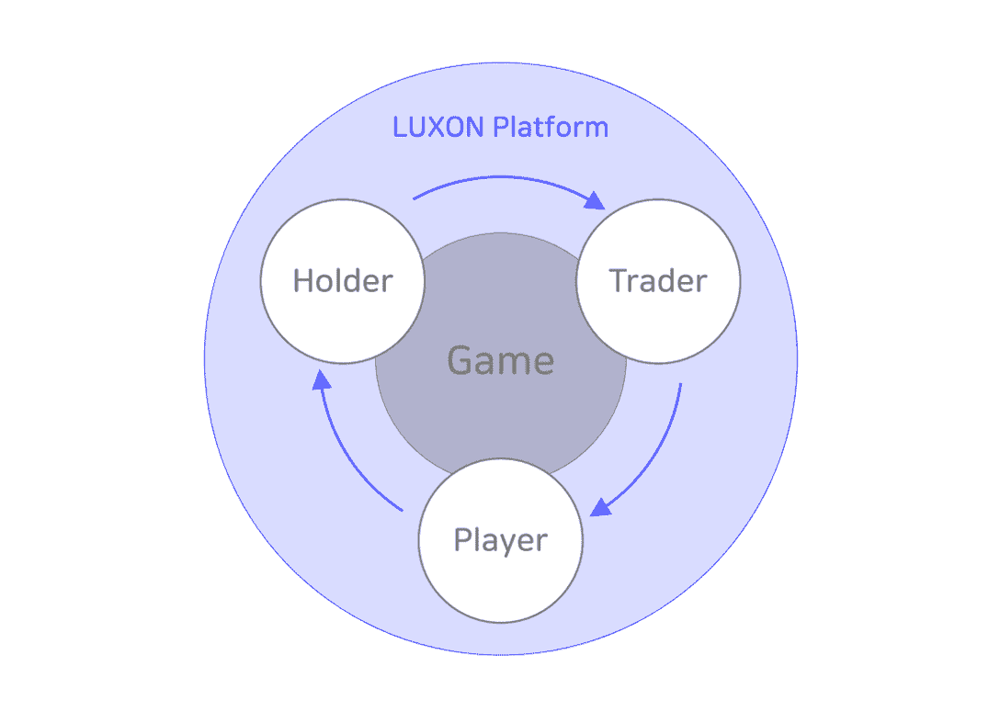
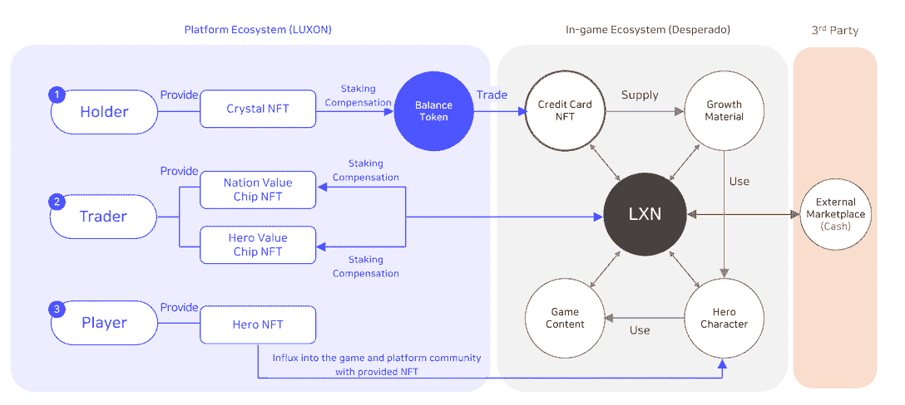
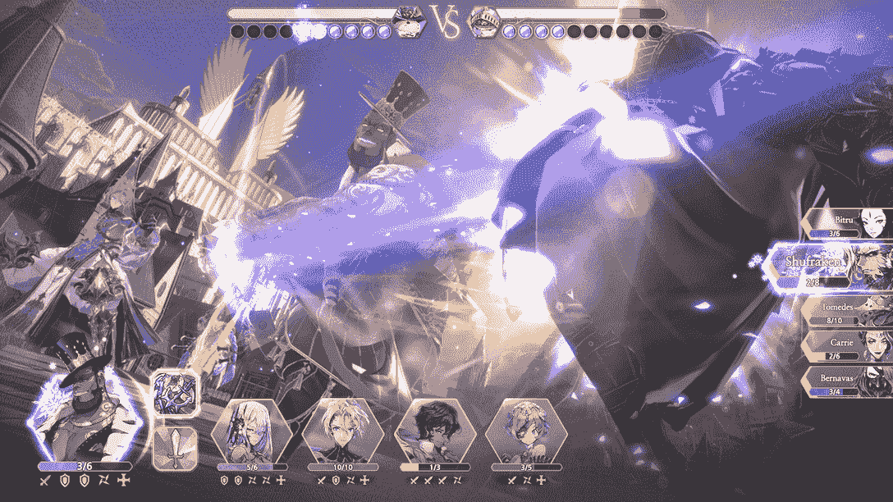
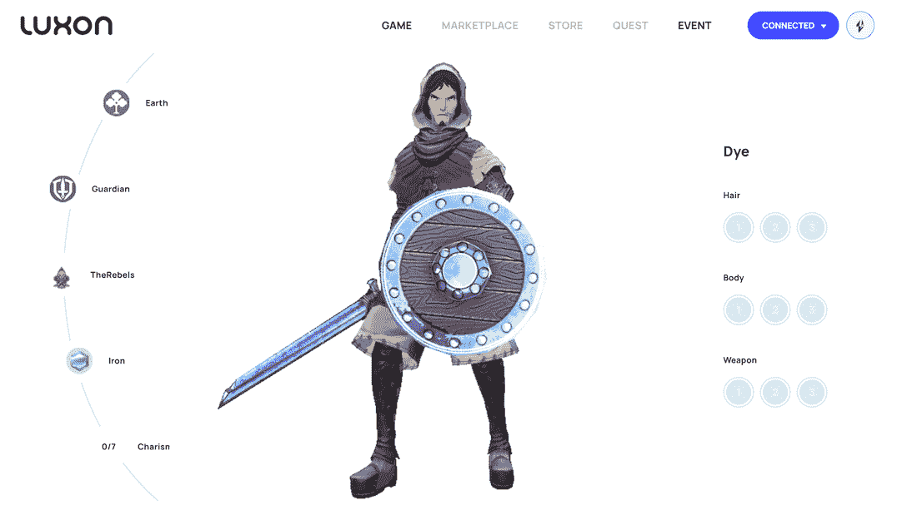
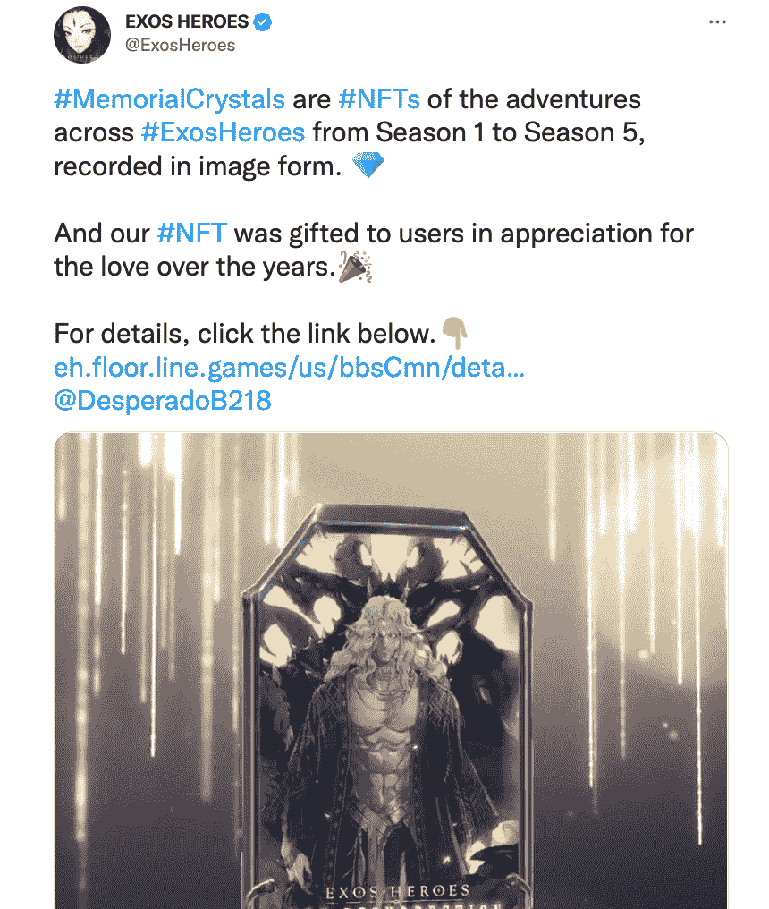

# 什么是 LUXON，它是如何工作的？

> 原文：<https://web.archive.org/web/https://dappradar.com/blog/what-is-luxon-and-how-does-it-work>

## LUXON 与 DappRadar 合作，向用户空投 1000 辆 Hero NFTs。

LUXON 是一个多边形驱动的游戏平台。它帮助游戏采用 NFT 来增强游戏深度，允许开发者发布可收集的角色和其他物品来增加游戏的可玩性。该平台将发布其首款游戏《亡命之徒 B218:Exos 的伤疤》，该游戏将于 11 月 17 日至 24 日进行封闭测试。最重要的是，LUXON 已经与 DappRadar 合作，向用户空投关键的游戏内 NFT 物品。

## 目录

*   [什么是卢克逊？](https://web.archive.org/web/20221130142643/https://dappradar.com/blog/what-is-luxon-and-how-does-it-work/#what)
*   谁是卢克森的幕后黑手？
*   [LUXON 生态系统中有哪些角色？](https://web.archive.org/web/20221130142643/https://dappradar.com/blog/what-is-luxon-and-how-does-it-work/#roles)
    *   [角色如何促进 LUXON 的生态系统？](https://web.archive.org/web/20221130142643/https://dappradar.com/blog/what-is-luxon-and-how-does-it-work/#how)
*   [亡命之徒 B218，LUXON 上的第一个游戏](https://web.archive.org/web/20221130142643/https://dappradar.com/blog/what-is-luxon-and-how-does-it-work/#game)
    *   游戏中的角色:英雄
    *   [代币](https://web.archive.org/web/20221130142643/https://dappradar.com/blog/what-is-luxon-and-how-does-it-work/#tokens)
    *   [纪念水晶 NFTs](https://web.archive.org/web/20221130142643/https://dappradar.com/blog/what-is-luxon-and-how-does-it-work/#nfts)
*   [LUXON 将权力放在用户手中](https://web.archive.org/web/20221130142643/https://dappradar.com/blog/what-is-luxon-and-how-does-it-work/#users)

## 什么是 LUXON？

LUXON 是一个游戏平台和生态系统，它利用多边形网络来增强用户和开发者的能力。它为游戏开发者提供了一个发布游戏的平台，也为用户提供了一个交易 NFT 的市场。最重要的是，LUXON 分析用户在链上的交易，以识别他们的游戏行为，并创建一个可持续的游戏生态系统。

LUXON 旨在解决 P2E 的局限性以及 Web2 游戏业务和管理模式中存在的问题。例如，当前的“玩到赚”加密游戏正在失去除经济诱惑之外的用户利益，而 Web2 游戏剥夺了用户对游戏内资产的真正所有权。

LUXON 希望通过其科学设计的生态系统，基于 Web3 原则让用户受益，包括经济可持续性、游戏可玩性、用户游戏资产主权等。

第一个在平台上推出的游戏是 Desperado B218:Exos 的伤疤，它将在 11 月 17 日至 24 日之间进行封闭测试(CBT)。

只有有限的用户可以提前接触到游戏，那些参加 CBT 的人将有机会赢得 USDC 或 NFT allowlist 机会等奖品。

[Games on LUXON](https://web.archive.org/web/20221130142643/https://dappradar.com/polygon/games/desperado-b218)

## 谁是卢克森的幕后黑手？

Luxon 是韩国 Nerdystar 的创意，Nerdystar 是游戏发行商 Line Games 的新投资部门，Line Games 是一家视频游戏发行商和开发商，是 LINE Corporation 的子公司。耐德司达为其区块链游戏平台 Luxon 获得了 580 万美元的投资，使该公司的融资总额达到 1080 万美元。

通过 LUXON，Nerdystar 打算通过向传统游戏玩家提供由 NFTs 支持的高质量游戏，将他们带入 Web3 游戏领域。利用 Line Games 强大的 IP 和游戏组合，Nerdystar 可以迅速将设计精良的游戏带入 Web3。未来，平台还将吸纳第三方游戏，使用户的选择多样化。

[Learn more about LUXON’s ecosystem](https://web.archive.org/web/20221130142643/https://dappradar.com/polygon/games/desperado-b218)

## 在 LUXON 生态系统中有哪些角色？

不同的用户有不同的 web 产品使用习惯。因此，团队只有深入了解用户的偏好，才能交付正确的产品。那么我们如何洞察用户习惯的信息呢？

Web3 用户的数据作为交易历史记录存在于区块链上。这些数据是匿名的、公开的，每个人都可以使用，但是在这些数据变得有意义之前，必须收集、清理和分析大量的数据。

LUXON 平台通过将用户数据整合到三个身份(持有者、交易者和玩家)中，简化了这一过程。

### 角色如何促成 LUXON 的生态系统？

当用户通过 Web3 钱包连接到 LUXON 时，该平台可以获取用户的匿名数据。然后，LUXON 对用户的链上数据进行分析，识别用户的生态系统角色。

*   如果 IP NFTs 和平台令牌是一个人钱包中的主要资产，用户将属于持有者类别。
*   如果用户有活跃的 NFT 交易，他们被识别为交易者
*   最后，如果用户积极参与游戏，他们当然就是玩家。

随着用户在 LUXON 生态系统中的角色被定义，他们将有权访问相应的身份 NFT。这些 NFT 都有特定的功能，在 LUXON 的系统中跑马圈地会让用户获得相应的奖励。

这是为了感谢各种用户对 LUXON 生态系统的贡献，也是吸引用户参与平台的必要过程。下表简要描述了与每个平台角色相对应的 NFT 以及相应的优势。

值得注意的是，LUXON 绝不会强迫用户进入自己不希望的角色。无论用户是想专注于游戏、交易还是投资，选择权都在他们。用户可以随时参与上述所有角色。

未来，生态系统还将为那些为平台制作内容的人引入创作者角色。

[Learn more about LUXON’s ecosystem](https://web.archive.org/web/20221130142643/https://dappradar.com/polygon/games/desperado-b218)

## 亡命之徒 B218，LUXON 上的第一个游戏

亡命之徒 B218，是一个五对五的战略团队战斗游戏。在这里，玩家可以招募英雄，组成强大的阵容，并派遣他们进行战斗。此外，玩家可以使用英雄来协助他人，与其他玩家竞争，并向队友请求援助。

[Access DESPERADO B218 via single dapp page](https://web.archive.org/web/20221130142643/https://dappradar.com/polygon/games/desperado-b218)

### 英雄

英雄是游戏中重要的角色和资产，以 NFT 的形式存在。这意味着用户实际上可以拥有它们，并使用它们与游戏的智能合约进行交互，以获得成就和奖励。

英雄有普通的、不普通的、稀有的、史诗的和传奇的，有他们的属性、装备等等。

目前，用户可以通过参与初始空投来获得这些英雄。之后，用户必须从 LUXON 商店购买英雄招募门票才能获得英雄。或者，您可以在 LUXON Marketplace 上与其他用户进行交易来获得它们。

### 代币

LUXON 的特色是拥有 LXN 和余额令牌(BT)的双令牌经济。LXN 是一个实用令牌，用户可以使用它在商店中购买商品、在市场上进行交易等等。BT 是促进鲁迅“道”运作的治理令牌。用户可以通过押水晶，消费，或者持有 LXN 来赚取 BT。

随着项目的进展，LUXON 团队和社区将为这两种令牌引入更多的用例。

### 纪念水晶

Exos Heros 由 Line Games 跨多个平台发行，包括 Steam、Android、iOS 和 Floor (Line Games 自有平台)。游戏最近发布了纪念水晶 NFTs，在 LUXON 生态系统和 DESPERADO B218 中有长期价值。

用户可以在纪念水晶上下注并获得奖励。定期地，平衡代币将被分配到帐户的纪念水晶。然后用户就可以花这些代币来兑换亡命之徒 B218 游戏内资源。

[Learn more about DESPERADO B218’s in-game assets](https://web.archive.org/web/20221130142643/https://dappradar.com/polygon/games/desperado-b218)

## LUXON 将权力放在用户手中

在 Web2 中，游戏是集中的，这意味着玩家在游戏决策中没有发言权。当一款游戏停止服务后，用户已经获得和投入的所有资产、努力、时间和金钱都瞬间化为乌有。许多开发商多年的努力也将化为乌有。

LUXON 希望从根本上改变这种情况，将平台构建为用户共有的 DAO，并允许他们塑造项目的未来。

[Check out LUXON](https://web.archive.org/web/20221130142643/https://dappradar.com/polygon/games/desperado-b218)

## 在 DappRadar 的游戏排名页面找到更多游戏

如果这对你来说还不够刺激，那就去看看 DappRadar 游戏排名页面吧！游戏种类繁多，从射击游戏到 MMO、虚拟世界等等。

[https://web.archive.org/web/20221130142643if_/https://www.youtube.com/embed/HSVvtpxWNWs?feature=oembed](https://web.archive.org/web/20221130142643if_/https://www.youtube.com/embed/HSVvtpxWNWs?feature=oembed)

更好的是，你可以在其单个 dapp 页面中找到每款游戏的多维度信息，包括活跃钱包、交易数量、是否得到玩家的 Boost Power 支持等等。

[DappRadar Game Ranking](https://web.archive.org/web/20221130142643/https://dappradar.com/rankings/category/games)[Trending games on Polygon](https://web.archive.org/web/20221130142643/https://dappradar.com/rankings/protocol/polygon/category/games)

## 随身携带您的 Web3 之旅

使用 DappRadar 移动应用程序，再也不会错过 Web3。查看最受欢迎的 dapps 的性能，并关注您投资组合中的 NFT。您在 DappRadar 上的帐户会与我们的移动应用程序同步，这样您很快就可以选择实时接收提醒。

[Download the DappRadar app now](https://web.archive.org/web/20221130142643/https://dappradar.app.link/blog)[<picture></picture>](https://web.archive.org/web/20221130142643/https://play.google.com/store/apps/details?id=com.portfolio.dappradar) NewsletterUnsubscribe at any time. [T&Cs](https://web.archive.org/web/20221130142643/https://dappradar.com/terms) and [Privacy Policy](https://web.archive.org/web/20221130142643/https://dappradar.com/privacy-policy)