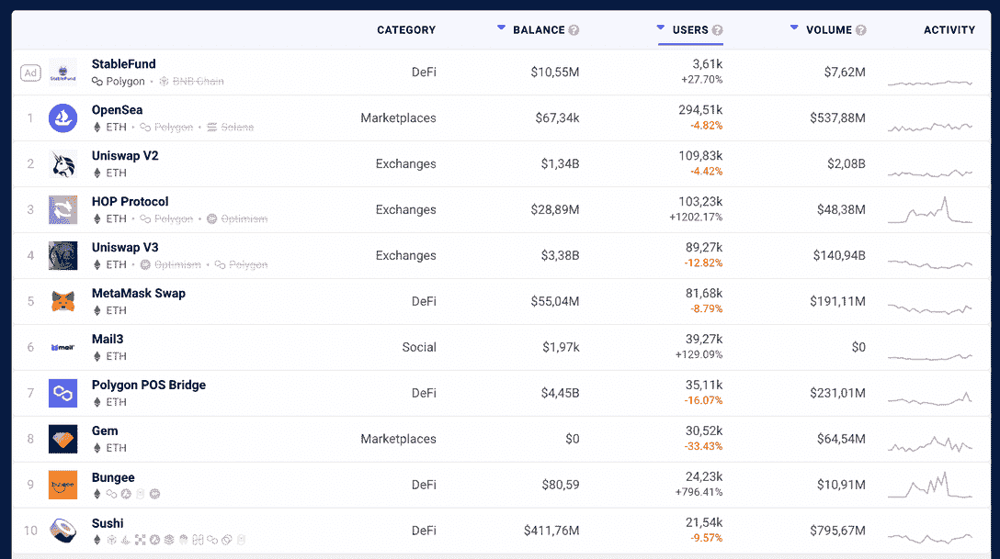
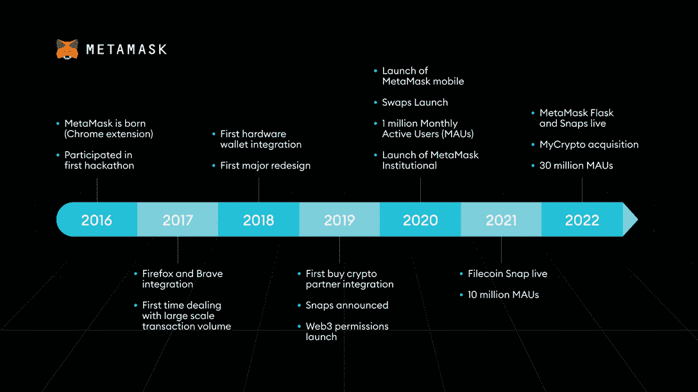

# 什么是 MetaMask？区块链钱包解释道

> 原文：<https://web.archive.org/web/https://dappradar.com/blog/what-is-metamask>

## 了解更多关于区块链钱包的信息

在加密的数字世界里，拥有一个钱包是必要的，而且它不会花你一毛钱。没有兼容的区块链钱包，您无法发送和接收区块链的交易。这就是 MetaMask 的用武之地！但是**什么是 MetaMask** ，我该如何入门数字钱包？这篇文章将引导你解决这些非常常见的问题。坚持到底！

## 什么是数字钱包？

用区块链的话来说，数字钱包就像你的传统皮革钱包一样，是一个允许你存储私人密钥并根据钱包类型与多个数字账本进行交互的界面。

每个公共区块链都有自己的钱包。MetaMask 钱包原生于以太坊，支持 ETH 及其令牌的存储。它就像一座桥梁，通过浏览器拉近了[以太坊区块链](https://web.archive.org/web/20221206034814/https://dappradar.com/rankings/protocol/ethereum)与用户的距离。

## 什么是 MetaMask？

[MetaMask 是一个连接用户和以太坊区块链的钱包](https://web.archive.org/web/20221206034814/https://metamask.io/?utm_source=DappRadar)。早在 2016 年，其创造者的目标就是让 [ETH](https://web.archive.org/web/20221206034814/https://dappradar.com/hub/token/eth/ETH) 交易尽可能简单直观。这个项目的发展远不止这些，它现在是最大的 web3 公司之一。

通过 MetaMask，你还可以轻松地进行交互和使用各种以太坊 dapp——你可以从你的桌面或移动应用程序中完成这些操作。

Access thousands of dapps on the Ethereum network through DapprRadar

**你可能也喜欢阅读**:[2022 年最佳加密货币钱包](https://web.archive.org/web/20221206034814/https://dappradar.com/blog/best-cryptocurrency-wallets-for-2022)

## MetaMask 是如何工作的？

由于他们的总体目标是促进采用，MetaMask 是自托管的，其插件可用于不同的浏览器。

你只需要给你的浏览器添加一个扩展，无论是 Firefox，Chrome，Opera 还是 Brave。

它也是非托管的，这意味着你可以完全控制你的资金。此外，MetaMask 有一个安全库，可以保护您的身份安全，允许最终用户从不同的浏览器与以太坊进行交互，并签署交易。

## 如何在我的 Chrome 浏览器上安装 MetaMask？

1.  访问 MetaMask 的[官方网站](https://web.archive.org/web/20221206034814/https://metamask.io/)并选择你的下载选项(Chrome、iOS 或 Android 应用)。前往 Chrome 官方商店，点击“获取 Chrome 扩展”
2.  按照链接，点击“添加到 Chrome”添加扩展，并安装 MetaMask 插件。一旦准备好，您将被重定向到一个新的标签。
3.  首先，您可以“导入钱包”(适用于以前拥有元掩码钱包的用户)，或者“创建钱包”(适用于想要创建新钱包的用户)。要创建一个新的，请单击此按钮。
4.  在“帮助我们改进元掩码”上，单击同意授予元掩码权限。
5.  创建新密码。
6.  接下来，备份你的种子短语。你可以用这些短语来找回丢失的钱包。在一张纸上记下这些关键词，并安全地保存它们。
7.  单击“全部完成”结束该过程。

观看下面的视频，了解什么是元蒙版以及**如何创建自己的钱包**。

[https://web.archive.org/web/20221206034814if_/https://www.youtube.com/embed/XMnghGaSH4Y?feature=oembed](https://web.archive.org/web/20221206034814if_/https://www.youtube.com/embed/XMnghGaSH4Y?feature=oembed)

## 如何将资金转移到我的 Metamask 钱包？

要从外部帐户接收资金，请单击主窗口上的“接收”。您可以复制您的公共地址或扫描二维码开始交易。

您还可以将元掩码连接到 Ledger 等硬钱包，或者连接到另一个 web 或桌面钱包。

使用 MetaMask 区块链钱包，您还可以在浏览器中轻松地向任何以太坊 dapp 存入或从其接收 ETH。

## 什么是元掩码交换？

于 2020 年推出的 [MetaMask Swap](https://web.archive.org/web/20221206034814/https://dappradar.com/ethereum/defi/metamask-swap) 是一项允许你将一个加密货币令牌交换(或交换)到另一个加密货币令牌的功能。

MetaMask Swap 在您的桌面或移动钱包上工作，合并来自不同分散的 exchange 聚合器的数据。

它类似于 [DappRadar 的令牌交换](https://web.archive.org/web/20221206034814/https://dappradar.com/hub/swap/)，但是这里的令牌必须只来自以太坊网络。

## MetaMask 的前景如何？

MetaMask 将于 2022 年庆祝成立 6 周年。作为庆祝这一时刻的一种方式，该公司有史以来第一次分享了独家见解和非常有趣的用户数据。

今年，凭借超过 3000 万的月活跃用户，MetaMask 已经成为每个加密新手的首选。因此，它是以太坊采用的最重要的工具之一。

**进一步阅读** : [关于如何在 Metamask 中切换网络的指南](https://web.archive.org/web/20221206034814/https://dappradar.com/blog/guide-on-how-to-switch-network-in-metamask)

## 通过 DappRadar 不断了解数字资产

一旦你设置好你的 MetaMask 钱包并存储好你的代币，就去 DappRadar 吧。

借助 [DappRadar 投资组合跟踪器](https://web.archive.org/web/20221206034814/https://dappradar.com/hub/wallet/)，您可以纵览您在多个区块链中的所有数字资产——加密货币和 NFT。观看下面的视频，了解如何将 MetaMask 钱包连接到 DappRadar。

[https://web.archive.org/web/20221206034814if_/https://www.youtube.com/embed/woduDyWuKHY?feature=oembed](https://web.archive.org/web/20221206034814if_/https://www.youtube.com/embed/woduDyWuKHY?feature=oembed)

在不断变化的去中心化应用、加密货币和区块链世界中，保持消息灵通非常重要。

幸运的是，DappRadar 的团队每天都在努力工作，为您提供最新的新闻和必要的教程。如果你想了解更多关于最佳 Web3 项目的信息，请关注 DappRadar [博客](https://web.archive.org/web/20221206034814/https://dappradar.com/blog/)、 [YouTube](https://web.archive.org/web/20221206034814/https://www.youtube.com/c/DappRadar) 频道和 [Twitter](https://web.archive.org/web/20221206034814/https://twitter.com/dappradar) 。

 NewsletterUnsubscribe at any time. [T&Cs](https://web.archive.org/web/20221206034814/https://dappradar.com/terms) and [Privacy Policy](https://web.archive.org/web/20221206034814/https://dappradar.com/privacy-policy)