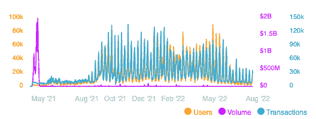
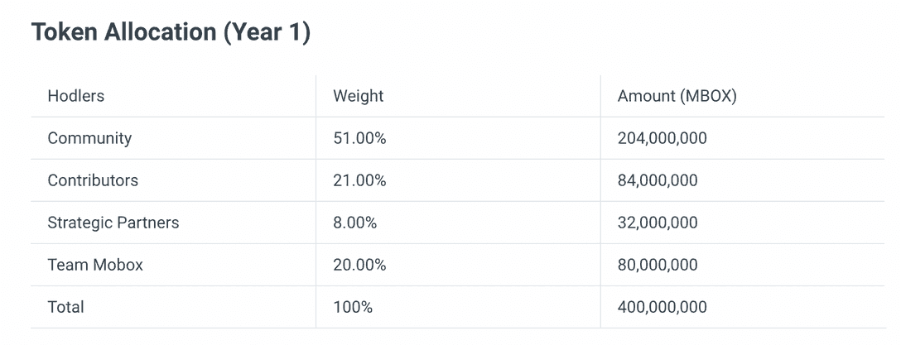
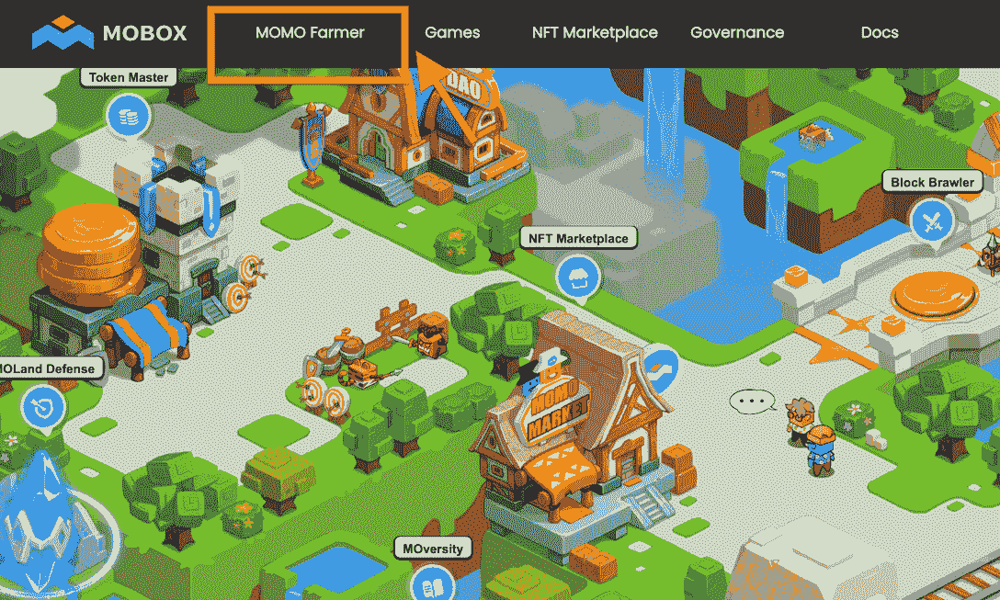
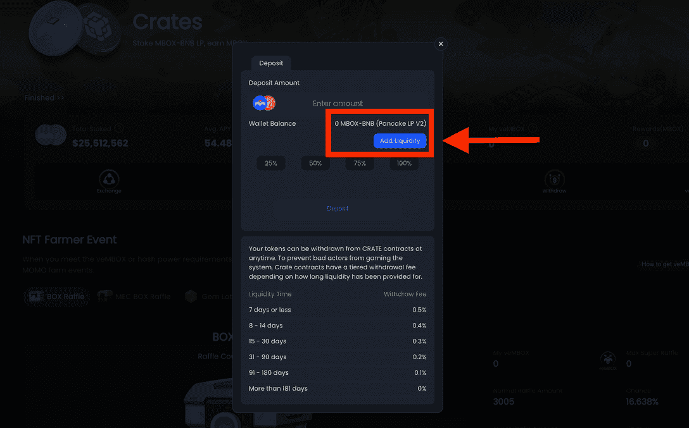
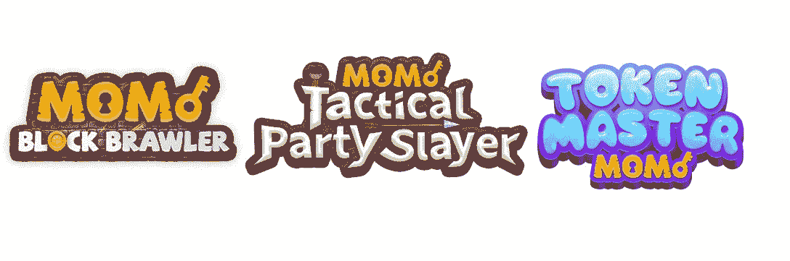

# 什么是 MOBOX？

> 原文：<https://web.archive.org/web/https://dappradar.com/blog/what-is-mobox>

## 介绍 MOBOX，BNB 智能链上的一个充满活力的游戏平台

MOBOX 是一个 NFT 驱动的游戏平台，有机地结合了产量农业和 NFT 农业。该平台采用免费游戏和游戏赚钱两种机制。最终，MOBOX 通过引入一个名为 MOMOverse 的虚拟世界，努力为 NFT 和 DeFi 技术带来更有趣的使用场景。

在过去的几年里，神秘盒子已经成为一种有效的营销手段。不足为奇的是，这种组合已经席卷了加密社区。但是当 NFT 遇到神秘盒子时会发生什么呢？

[BNB 智能链](https://web.archive.org/web/20220813162822/https://dappradar.com/rankings/protocol/binance-smart-chain)上的 MOBOX 以神秘盒子机制为独特卖点。现在，它已经发展成为区块链行业独一无二的游戏平台。值得注意的是，MOBOX 在 4 月份创造了一个令人印象深刻的记录，在一天之内向 dapp 发送了 90，000 个用户。

**内容**

*   [什么是 MOBOX？](https://web.archive.org/web/20220813162822/https://dappradar.com/blog/what-is-mobox/#what-is-mobox)
*   [什么是 MBOX？](https://web.archive.org/web/20220813162822/https://dappradar.com/blog/what-is-mobox/#what-is-mbox)
*   [游戏赚钱在 MOBOX 中是如何工作的？](https://web.archive.org/web/20220813162822/https://dappradar.com/blog/what-is-mobox/#play-to-earn)
    *   [产量农业](https://web.archive.org/web/20220813162822/https://dappradar.com/blog/what-is-mobox/#farming)
    *   [NFT 矿业](https://web.archive.org/web/20220813162822/https://dappradar.com/blog/what-is-mobox/#mining)
    *   [神秘盒子](https://web.archive.org/web/20220813162822/https://dappradar.com/blog/what-is-mobox/#box)
    *   [玩游戏](https://web.archive.org/web/20220813162822/https://dappradar.com/blog/what-is-mobox/#games)
*   [什么是 MOMOverse？](https://web.archive.org/web/20220813162822/https://dappradar.com/blog/what-is-mobox/#momoverse)
*   [MOBOX 社区](https://web.archive.org/web/20220813162822/https://dappradar.com/blog/what-is-mobox/#community)

## 什么是 MOBOX？

MOBOX 是 BNB 智能链上的一个游戏生态系统，结合了产量农业和农业 NFTs。这些 NFT 允许玩家在平台上的多个[即玩即赚](https://web.archive.org/web/20220813162822/https://dappradar.com/blog/tag/play-to-earn) (P2E)游戏中参与和使用它们。在 MOBOX 的免费游戏平台上，玩家可以通过押注加密货币来挖掘陌陌 NFT。

## 什么是 MBOX？

MBOX 令牌分发将经历 5 年时间，第一年将发行 400，000，000 个令牌。第一年的令牌分配如下。

首先，MBOX 令牌有助于游戏内购买，如获取装备和角色。此外，玩家获得 MBOX 作为参与游戏和其他活动(如 NFT 采矿)的奖励。

在治理方面，MBOX 令牌持有者可以提交提案并进行投票，以影响平台的发展和业务方向。此外，用户可以在平台上的各种流动性池中下注，以获得 MBOX 令牌的下注奖励。

## 游戏赚钱在 MOBOX 中是如何工作的？

MOBOX 拥有一个可持续的代币经济系统，游戏化在其中发挥着关键作用。此外，该平台允许用户以各种方式从玩家拥有的经济中受益。

用户可以找到三种方法来产生被动收入。他们是产量采矿，陌陌采矿，和神秘的盒子。在陌陌农民网页上可以找到它们。

### 高产农业

产量耕作是一种受欢迎的 DeFi 工具。它指的是通过 DeFi 协议存放或借出指定的令牌来最大化加密回报。这一机制将为互换资金池提供流动性。因此，用户可以通过参与产量耕作来获得佣金。

在 MOBOX 平台上，用户可以存放 MBOX-BNB 流动性池(LP)令牌，以增加池的流动性。后来，参与者可以获得 MBOX 的空投，作为提供流动性的奖励。

[点击此链接](https://web.archive.org/web/20220813162822/https://faqen.mobox.io/resources/User-Guide/2.-get-started/yield-farming)在 MOBOX 上获得 MOBOX 产量农业的分步指南。

### 陌陌 NFT 矿业公司

要加入 NFT 矿业并获得奖励，用户需要陌陌，这是 MOBOX 平台的 NFT 资产。用户可以通过打开神秘盒子或从 NFT 市场购买来获得陌陌。

用户获得 MOMOs 后，系统会自动将他们置于下注模式。因此，它开始挖掘 MBOX 令牌并每天产生收入。用户可以去采矿营检查他们的采矿活动的最新状态。

陌陌 NFT 农场以一种新的方式将 NFT 和 DeFi 结合在一起，并为这些技术开辟了独特的使用场景。[这篇 DappRadar 文章](/web/20220813162822/https://dappradar.com/blog/the-incredible-rise-of-mobox-nft-farmer/)帮助用户更好地了解陌陌 NFT 的农业体验。

### 神秘盒子

神秘盒子是一个 BEP-1155 形式的 NFT 盲盒。对于那些不熟悉 BEP-1155 的人来说，它是 BNB 智能链上的多令牌标准。它在一个智能合同中结合了 BEP-20 的可替代性和 BEP-721 的不可替代性。

每个神秘的盒子里都有一个随机质量的陌陌·NFT，根据概率有不同的散列值。值得注意的是，陌陌的散列值决定了它的盈利能力。每个陌陌 NFT 有一个随机的基础哈希功率，可以通过消耗其他陌陌 NFT 或 MEC NFT 提高。

要用神秘盒子赚取收入，用户可以直接出售神秘盒子。另一种方法是打开盒子后出售里面的陌陌。馍馍的价格取决于市场需求，但更稀有的陌陌肯定会更有利可图。

### 玩游戏

同时参与 NFT 采矿和游戏将显著增加用户的盈利能力。除此之外，游戏悟性还会有很多提升收入的方法，比如冶炼装备、交易装备、排名奖励等等。另一个赚取收入的机会是将 MOMOs 出租给其他参与者。

团队 MOBOX 已经发布了三款游戏，让用户在平台上体验 P2E 的特权。为了给 MOBOX 生态系统注入互操作性，陌陌 NFTs 可以在所有游戏中使用，每个游戏都有独特的游戏内用途。

MOBOX 上有三款游戏，分别是 Token Master、战术派对杀手和 Block Brawl。

## 什么是 MOMOverse？

MOBOX 团队努力构建一个引人入胜的虚拟世界。它将允许移动机器人建立一个网络，探索虚拟土地，并为玩家驱动的经济创造无限的可能性。

考虑到这一点，该团队推出了 MOMOverse，使玩家能够体验身临其境、互动和渐进的游戏体验。

在 MOMOvers 中，玩家可以选择一个职业，一个有几条职业道路可供选择的角色，包括店主、建筑商和农民。有 MOsocial embedded 来促进虚拟世界中的社交网络。博物馆是向用户展示 NFT 收藏的地方。

MOMOverse 还通过数字所有权和创作者经济赋予用户权力。莫兰德游戏允许玩家和公会建立自己的领地，并尝试虚拟商业模式。

MOMOverse 仍处于早期阶段，随着 Web3 的发展，它将增加更多用户驱动的游戏。

## MOBOX 社区

MOBOX 团队推出了 [MOBOX 社区](https://web.archive.org/web/20220813162822/https://www.mobox.io/community/)作为 MOBOX 平台的官方论坛。论坛上有六个部分，服务于不同的目的。

*   【一般聊天】，
*   [游戏策略]
*   [提议]
*   [陌陌创造者]
*   [公告]
*   [反馈]

用户也可以通过以下渠道与 MOBOX 取得联系。

*   推特
*   不调和
*   中等

DappRadar 将继续关注 MOBOX 及其生态系统的最新发展。在 [Twitter](https://web.archive.org/web/20220813162822/https://twitter.com/dappradar) 、 [Discord](https://web.archive.org/web/20220813162822/https://discord.gg/4ybbssrHkm) 和 [Youtube](https://web.archive.org/web/20220813162822/https://www.youtube.com/c/DappRadar) 上关注我们，跟上区块链世界的动态。

DappRadar 社区的成员可以每周参加激动人心的加密令牌空投和赠品活动。创建一个帐户，并查看哪些[免费加密空投](https://web.archive.org/web/20220813162822/https://dappradar.com/hub/airdrops)正在进行！

[<picture></picture>](https://web.archive.org/web/20220813162822/https://dappradar.com/hub/airdrops)