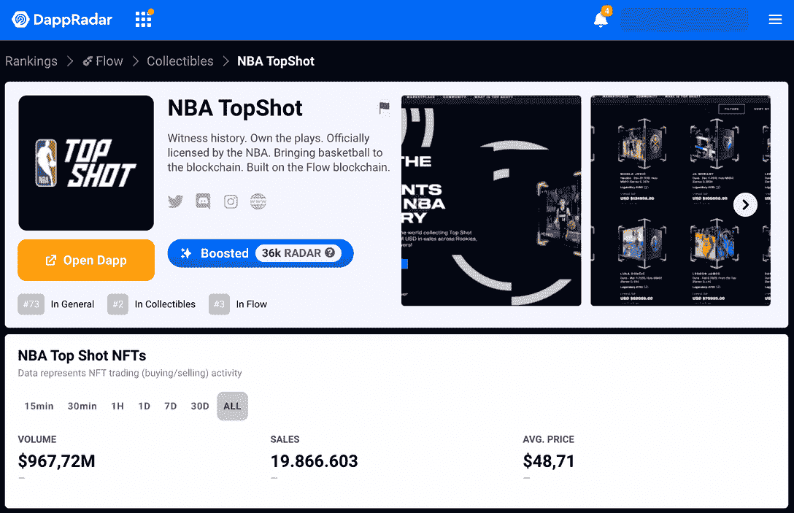
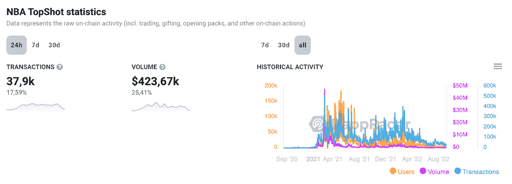
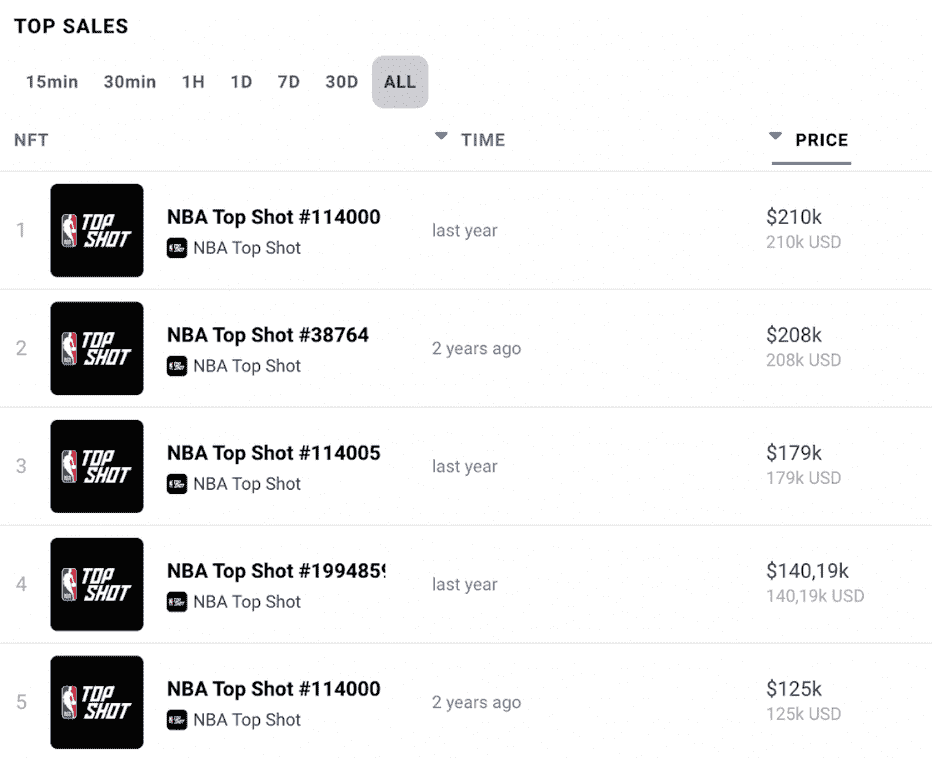
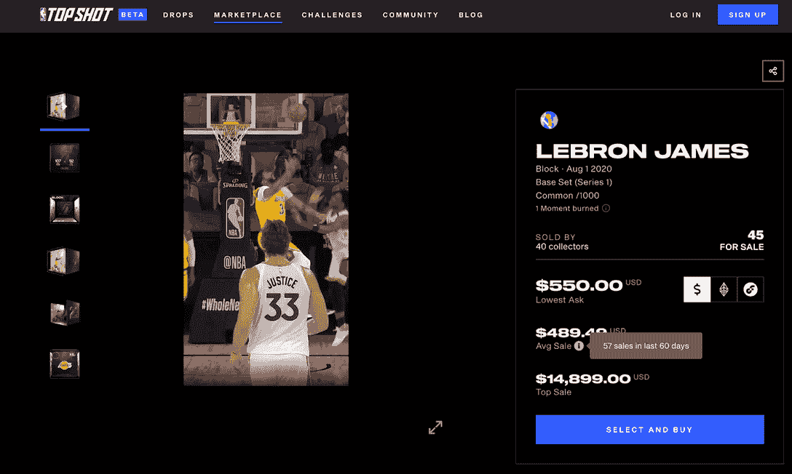
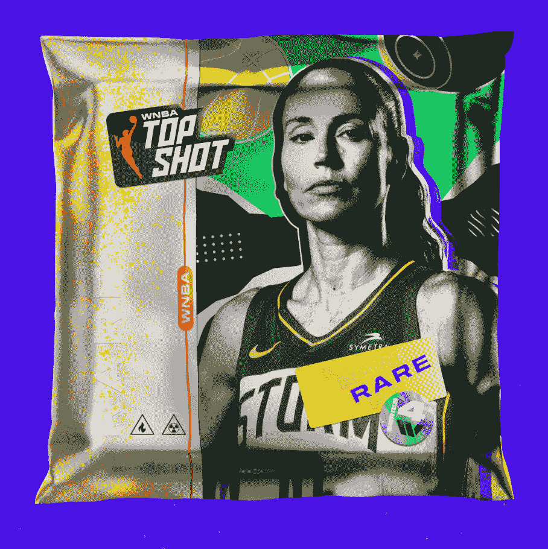
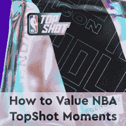
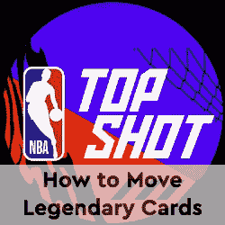

# 什么是 NBA 顶级投篮？了解所有标志性的 NFTs

> 原文：<https://web.archive.org/web/https://dappradar.com/blog/what-is-nba-top-shot-learn-all-about-the-iconic-nfts>

## 探索引领体育迷首次加入数字收藏品世界的 NFT 项目

收集有价值的玩家卡并不是什么新鲜事。几十年来，球迷们一直把他们最喜欢的球员留在记忆中，放在家里的书架上。但当 NBA 决定将这股浪潮带到区块链时，他们将球迷体验带到了另一个层面。《遇见 NBA Top Shot》这个项目打破了 NFT 销量记录，成为了 Web3 历史上的一个里程碑。

## 目录

*   [什么是 NBA Top Shot？](https://web.archive.org/web/20220925232026/https://dappradar.com/blog/what-is-nba-top-shot-learn-all-about-the-iconic-nfts/#What-is-NBA-Top-Shot?)
*   [谁创造了 NBA Top Shot？](https://web.archive.org/web/20220925232026/https://dappradar.com/blog/what-is-nba-top-shot-learn-all-about-the-iconic-nfts/#Who-created-NBA-Top-Shot?)
*   [NBA Top Shot NFTs 是如何运作的？](https://web.archive.org/web/20220925232026/https://dappradar.com/blog/what-is-nba-top-shot-learn-all-about-the-iconic-nfts/#How-do-NBA-Top-Shot-NFTs-work?)
*   为什么 NBA 最佳射手 NFT 系列如此成功？
*   一个 NBA 顶级射手 NFT 能做什么？
*   [NBA 顶级投篮 NFTs 多少钱？](https://web.archive.org/web/20220925232026/https://dappradar.com/blog/what-is-nba-top-shot-learn-all-about-the-iconic-nfts/#How-much-do-NBA-Top-Shot-NFTs-cost?)
*   [哪里可以买卖 NBA Top Shot NFTs？](https://web.archive.org/web/20220925232026/https://dappradar.com/blog/what-is-nba-top-shot-learn-all-about-the-iconic-nfts/#Where-can-I-buy-and-sell-NBA-Top-Shot-NFTs?)
*   运动 NFTs 的下一步是什么？
*   [用 DappRadar 继续学习 NFTs】](https://web.archive.org/web/20220925232026/https://dappradar.com/blog/what-is-nba-top-shot-learn-all-about-the-iconic-nfts/#Keep-learning-about-NFTs-with-DappRadar)

## 什么是 NBA 顶级投篮？

[NBA Top Shot](https://web.archive.org/web/20220925232026/https://dappradar.com/flow/collectibles/nba-topshot) 是 NFT 的一个收藏品项目，将篮球比赛中的关键时刻保存在区块链的视频中。

就像球迷可以花数百万美元购买、保存或交易的传统篮球卡一样，这些 NFT 增强了社区体验——并产生了许多投机行为。

第一个系列于 2019 年 7 月推出，并立即获得成功。然而，最大的繁荣出现在 2021 年初，当时 5000 万美元的销售额使 NBA Top Shot 成为 NFT 最大的市场。

[https://web.archive.org/web/20220925232026if_/https://www.youtube.com/embed/FlxYFM1VzAA?feature=oembed](https://web.archive.org/web/20220925232026if_/https://www.youtube.com/embed/FlxYFM1VzAA?feature=oembed)

你可以在 DappRadar 上阅读我们多年来从 NBA Top Shot 跟踪的最大新闻。但在此之前，让我们继续我们的学习之路。

### 什么是 NFT？

NFT 代表[不可替代令牌](https://web.archive.org/web/20220925232026/https://dappradar.com/blog/what-are-non-fungible-tokens-nfts)，是一种安全、不可逆地存储唯一信息的新方式。这些代币存储在区块链上，代表数字或实物资产，也存储它们的交易历史。NFT 可以是照片、视频、歌曲等等，有些甚至可以[随时间变化](https://web.archive.org/web/20220925232026/https://dappradar.com/blog/what-is-a-dynamic-nft)。

据《卫报》报道，2021 年，收藏者在 NFT 上花费了超过 220 亿美元。尽管大多数 NFT 收藏品现在已经不再引起公众的兴趣，因此价格已经大幅下跌，但所有者认为他们持有一些有价值的东西。

## 谁创造了 NBA Top Shot？

让球迷通过 NFTs 收集篮球集锦的想法是由美国国家篮球协会(NBA)和美国国家篮球运动员协会(NBPA)与领先的 Web3 公司 Dapper Labs 共同实现的。

它建立在 Dapper Labs 的 Flow 区块链基础上，自 2019 年以来推出了新的系列，以扩大社区。

*   **了解更多** : [什么是流量区块链:关于 NBA Top Shot 主场的一切](https://web.archive.org/web/20220925232026/https://dappradar.com/blog/introducing-the-flow-blockchain-home-of-nba-top-shot)

## NBA 顶级投篮 NFTs 是怎么运作的？

与大多数著名的 NFT 收藏不同，NBA Top Shot 不是你可以在个人资料图片上使用的生成图像。相反，它们是比赛集锦——视频——的记录，但工作方式与其他静态 NFT 相同。

视频信息存储在[流量区块链](https://web.archive.org/web/20220925232026/https://dappradar.com/rankings/protocol/flow)上的每个 NFT 智能合约中。每个都包含某些影响其稀有性和价值的特征或元数据。

它不可更改，销售历史将永久保存在区块链上，所有人都可以看到，也可以查看哪些钱包。

换句话说，当你买了一个这样的 NFT，并把它安全地存放在你的加密钱包里，这个时刻就正式属于你了，随之而来的实用程序也是。

## 为什么 NBA 顶级射手 NFT 系列如此成功？

从 DappRadar 上的[统计数据可以看出，从发布到撰写本文时，NBA 顶级投篮系列已经为 567，630 名交易者创造了 19，866，603 笔销售。每件收藏品的平均价值为 48.71 美元，销售额已经超过 9.6772 亿美元。](https://web.archive.org/web/20220925232026/https://dappradar.com/flow/collectibles/nba-topshot)

这些数字使 NBA Top Shot 分散化应用程序在 2022 年初 NFT 牛市后的几个月内成为 DappRadar [顶级收藏品 Dapps 排名](https://web.archive.org/web/20220925232026/https://dappradar.com/rankings/category/collectibles)的榜首。

但是是什么让这个 NFT 体育项目如此成功呢？除了项目背后的强大团队，负责 Web3 上的其他成功，如 [CryptoKitties](https://web.archive.org/web/20220925232026/https://dappradar.com/ethereum/games/cryptokitties) ，NBA Top Shot 也有 cryptoverse 以外的大牌投资。

此外，有 NBA 作为后盾给了 NFT 的新来者更多的信心，这个项目真的是一个投资机会，而不是一个骗局。由于 NBA Top Shot 和购买过程的便利，许多人第一次获得了 NFTs。

数十名名人也通过从该系列购买自己的 NFT 加入了 NBA Top Shot 社区——这只会有助于该项目的声誉。迈克尔·乔丹、马克·库班和凯文·杜兰特是最知名的收藏家。

## 我能用一个 NBA 顶级射手 NFT 做什么？

尽管大多数人想得到他们的 NBA 顶级投篮 NFT 只是为了收集它们，但还有更多额外的好处来增强所有者的体验。

如官方网站所述，车主可以:

> ***“参加挑战，赢取令人难以置信的新时刻，并获得奖励，参加一生一次的 VIP 活动，观看 NBA 比赛，等等。”***

## NBA Top Shot NFTs 多少钱？

像所有与区块链技术相关的东西一样，非专利技术的价值也会受到波动的影响。然而，一些集合如 NBA Top Shot 比平均水平更稳定，因此被称为[蓝筹 NFTs](https://web.archive.org/web/20220925232026/https://dappradar.com/blog/what-are-blue-chip-nft-collections) 。

尽管如此，NBA 热门 NFTs 的价值根据 NFT 的稀有程度和球迷对球员、球队、系列赛、层级等的兴趣而有很大不同。

看看下面有史以来最昂贵的销售，可在 [NBA Top Shot Dapp 页面](https://web.archive.org/web/20220925232026/https://dappradar.com/flow/collectibles/nba-topshot)上找到:

尽管在撰写本文时，NBA 顶级射手 NFT 的平均价格为 48.71 美元，但最稀有的作品已经卖到 21 万美元。

*   **阅读进一步** : [如何估值 NBA 顶级投篮 NFTs](https://web.archive.org/web/20220925232026/https://dappradar.com/blog/how-to-value-nba-top-shot-nfts)

## 哪里可以买卖 NBA Top Shot NFTs？

NBA 顶级投篮 NFT 在他们的官方市场[出售](https://web.archive.org/web/20220925232026/https://nbatopshot.com/marketplace)。你可以在那里用美元买卖非金融衍生工具，也可以买卖加密货币，比如 FLOW、ETH、、、DAI 和。

NBA Top Shot marketplace 相当全面，允许你根据球员、系列、价格、球队甚至球员位置来过滤 NFT。在那里，你还可以找到 WNBA 收藏的 NFTs 女子国家篮球协会。

在每个列表页面上，你还可以看到每只 NFT 在过去 60 天内的交易次数，以及平均和最高销售价格。

同样值得注意的是，根据目前的篮球赛季，还有新的 NFT 系列即将发布。因此，根据你想加入这个项目的时间，除了市场上的单个 NFT，你还可以购买包含惊喜 NFT 的 NFT 包。

然而，在购买和收藏之前，你应该好好研究一下投资 NFTs 的风险，并想出一个你自己的策略。如果你想购买一件收藏品进行交易，你应该有一些想法，而如果你只是想把它作为纪念品，其他的。

## 什么是 WBNA 最佳射手 NFT？

女子国家篮球协会 [(WNBA) NFT 系列](https://web.archive.org/web/20220925232026/https://wnba.nbatopshot.com/)于 2021 年 8 月推出，遵循了与第一个项目几乎相同的想法。球迷们可以通过视频 NFTs 收集女子锦标赛的最佳比赛瞬间。

这是另一个有趣的项目，它承诺增加 NFT 空间(T1)中女性的存在和代表性，以及诸如[女性世界(T3)和](https://web.archive.org/web/20220925232026/https://dappradar.com/hub/nft-explorer/collection/world-of-women-nft)[老板美人(T5)等系列。](https://web.archive.org/web/20220925232026/https://dappradar.com/ethereum/collectibles/boss-beauties)

Source: [WNBA Top Shot](https://web.archive.org/web/20220925232026/https://wnba.nbatopshot.com/)

如果你是一个球迷，你可以把苏·伯德、阿贾·威尔逊、希尔维亚·福尔斯和塞布丽娜·约内斯库等球员的精彩片段放在你的 Flow 钱包里。

## 体育 NFTs 的下一步是什么？

毫无疑问，NBA Top Shot 改变了普通公众看待 NFTs 的方式，特别是通过将体育和网络世界结合在一起。

由于像这样的收藏，粉丝们在投资时会获得更多。而这种趋势已经在其他运动中催生了其他几个类似的项目，比如 [Sorare](https://web.archive.org/web/20220925232026/https://dappradar.com/ethereum/games/sorare) ，UFC Strike 等等。

然而，整个 NFT 空间的下一步是继续发展技术和用户体验。更多的效用来评估所有权，以及将 NFTs 与游戏联系起来，可能标志着像 NBA Top Shot 这样的项目的未来。事实上，随着另一个 NBA 项目的启动，这已经成为现实，[动态 NFTs 协会](https://web.archive.org/web/20220925232026/https://dappradar.com/hub/nft-explorer/collection/the-association-nft-nba)。

无论如何，我们 DappRadar 将继续跟踪 NBA Top Shot 的轨迹，引领 NFT 最大的项目，让您了解最新动态。

## 用 DappRadar 继续学习 NFTs

我们希望你喜欢了解这个惊人的 NFT 项目。如果你有兴趣了解更多关于 NFTs 的知识，可以看看我们的[博客](https://web.archive.org/web/20220925232026/https://dappradar.com/blog/)和 [Youtube 频道](https://web.archive.org/web/20220925232026/https://www.youtube.com/c/DappRadar)的精彩教育内容。

别忘了订阅我们的时事通讯，在 Twitter 上关注 DappRadar，第一个获得最新消息。

[<picture></picture>](/web/20220925232026/https://dappradar.com/blog/how-to-send-legendary-nba-topshot-moments-to-external-wallets/)[<picture></picture>](https://web.archive.org/web/20220925232026/https://dappradar.com/flow/collectibles/nba-topshot)

***以上不构成投资建议。此处给出的信息仅供参考。请尽职调查并自行研究。***

 NewsletterUnsubscribe at any time. [T&Cs](https://web.archive.org/web/20220925232026/https://dappradar.com/terms) and [Privacy Policy](https://web.archive.org/web/20220925232026/https://dappradar.com/privacy-policy)