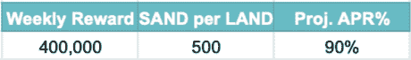
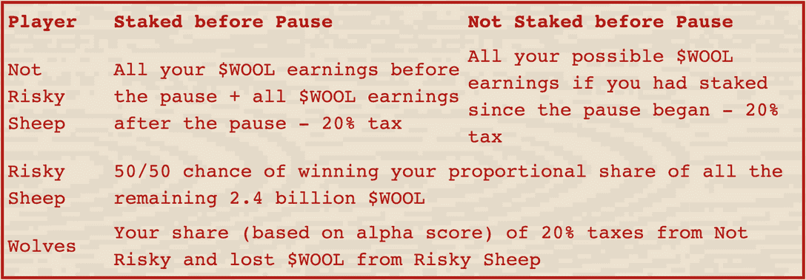
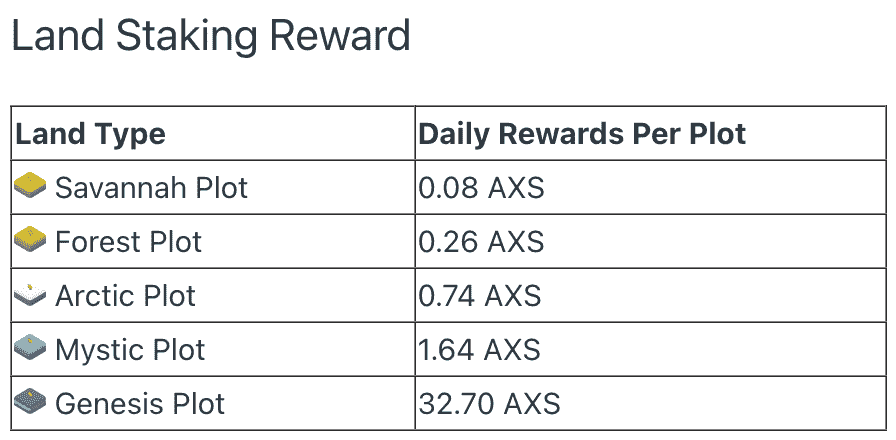

# NFT 在赌什么？

> 原文：<https://web.archive.org/web/https://dappradar.com/blog/what-is-nft-staking>

## 在 web3 中赚取被动收入的另一种方法

NFT 不仅仅是人们在互联网上交易的数字艺术品。今天，NFT 赌注是一个可行的工具，赚取真正的回报。自从第一枚 NFT 硬币于 2014 年 5 月在纽约新博物馆铸造并出售以来，越来越多的实用工具被添加到区块链代币中。了解如何将 NFT staking 添加到您的 web3 工具包中。

**总结**

*   ***[NFT](https://web.archive.org/web/20221128052045/https://dappradar.com/blog/what-is-nft-staking/#staking-explained)***
*   ***[了解下注的回报](https://web.archive.org/web/20221128052045/https://dappradar.com/blog/what-is-nft-staking/#what-returns)***

    *   ***[战狼](https://web.archive.org/web/20221128052045/https://dappradar.com/blog/what-is-nft-staking/#wolf-game)***
*   几个最好的 NFT 项目
    *   ***[变异猫](https://web.archive.org/web/20221128052045/https://dappradar.com/blog/what-is-nft-staking/#mutant-cats)***
    *   ***[NFT 一亩三分地](https://web.archive.org/web/20221128052045/https://dappradar.com/blog/what-is-nft-staking/#nft-worlds)***
    *   ***[轴协无穷大](https://web.archive.org/web/20221128052045/https://dappradar.com/blog/what-is-nft-staking/#axie-infinity)***

*   赌定 NFT 的未来

如果你参与了 DeFi，那么你可能听说过加密货币赌注。这是锁定你的数字硬币以换取奖励的过程。

NFT 赌注以同样的方式运作，因为 NFT 是令牌化的资产。与 NFT 相配的图像可能是一只疲惫的猴子或一只像素化的猫头鹰。但是在这些图片下面是按照 ERC-721 标准编写的代码，这使得每个 NFT 都是独一无二的资产。

[https://web.archive.org/web/20221128052045if_/https://www.youtube.com/embed/4lnlrnpQbxE?feature=oembed](https://web.archive.org/web/20221128052045if_/https://www.youtube.com/embed/4lnlrnpQbxE?feature=oembed)

Buying and selling NFTs through your DappRadar Portfolio

在正确的时间进入并获得最大的回报需要大量的研究和一点运气。区块链技术使人们能够提供他们的资产，以换取平台确定的利益。各种项目的建设都特别考虑到了打桩。

## nft 星际争霸解释道

NFT 赌注是将你的不可替代的令牌锁定在区块链协议上，通常是为了换取奖励。开发人员使用智能合约来部署 NFTs

NFT 赌注的存在有许多原因:

*   **推高稀缺**。如果 NFT 被锁起来，那么它就不能被出售。如果卖不出去，供应就会减少，价格就会上涨。
*   **为 NFT 持有者赚取被动收入**。如果赌注对 NFT 持有者没有好处，那就没有理由这么做。因此，当拥有 NFT 的人把它锁起来时，项目背后的团队会给他们一些回报。
*   **支持利益证明(PoS)网络**。PoS 是大多数区块链用来验证网络交易的机制。

对于任何想在区块链上赌一把 NFT 的人来说，通常都会有相关的天然气费用。这是因为验证者需要付费作为他们保护网络的报酬。所以赌注者得到的奖励是油费。

## 看看你的星际回报会是什么

每个 NFT 赌注计划提供不同的奖励，通常是与项目相关的货币。

### 沙盒

以沙盒为例。该平台将于本月引入土地标桩。元宇宙中的陆地实际上只是一个 NFT，代表虚拟世界地图中的一个位置。

[https://web.archive.org/web/20221128052045if_/https://www.youtube.com/embed/fkEaXYLOW-s?feature=oembed](https://web.archive.org/web/20221128052045if_/https://www.youtube.com/embed/fkEaXYLOW-s?feature=oembed)

Explained: DappRadar’s NFT Explorer

对于任何在沙盒中下注 NFT 的人，他们将获得游戏中的数字货币[和](https://web.archive.org/web/20221128052045/https://dappradar.com/hub/token/eth/SAND?from=0x3845badade8e6dff049820680d1f14bd3903a5d0)。你可以使用我们的[令牌探索者](https://web.archive.org/web/20221128052045/https://dappradar.com/hub/tokens/ethereum/all/1)来找出多少沙子是值得的。

沙盒已经留出了价值 1000 万美元的沙子，作为人们对他们土地的奖励。该平台已宣布他们的年百分比收益率(APY)将是多少。他们还设定了每块沙地使用者可以获得的最大收益。

SAND rewards for land staking in The Sandbox

每当持有人在 NFT 下赌注时，他们应该首先找出相关的赌注成本是多少。确定是否有必要的锁定期也很重要，因为一些平台有用户锁定其 NFT 所需的最短时间。

最后，一旦你发现你要花多少钱去赌，你需要赌多久，看看你会得到什么好处。沙盒有一个 90%的预计 APR，而。

### 狼游戏

再比如狼的游戏。DappRadar [在 2021 年 11 月写了关于“玩到赚”的文章。游戏中的象征是羊毛，用户可以用他们的狼或羊来换取不同的奖励。](https://web.archive.org/web/20221128052045/https://dappradar.com/blog/wolf-game-a-play-to-earn-million-dollar-idea)

NFT staking rewards in Wolf Game

养狼的人比养羊的人赚得多。绵羊赌注者也可以通过冒险和暴露他们的 NFT 到危险中来赚取更多的羊毛。这是游戏化金融的最大乐趣。

## NFT 最值得投资的项目

并非所有的 NFT 赌马项目都提供相同的回报。有些人起初回报率很高，但随着他们的代币充斥市场，其价值就会下降。其他项目

永远记住，你应该将你的回报与 NFT 的初始成本进行比较。如果你为 NFT A 公司支付的价格是 NFT B 公司的三倍，但 A 公司给你的回报却是 B 公司的两倍，那么从 NFT A 公司收回成本就需要更长的时间

### 变异猫

赌注[突变猫](https://web.archive.org/web/20221128052045/https://dappradar.com/ethereum/collectibles/mutantcats)给予持有人项目分散自治组织(DAO)金库资产的细分所有权。每只被押上赌注的猫每天还能获得 10 条鱼的产量。

该系列由 9，999 个 NFT 组成，于 2021 年 10 月推出。它得到了酷猫的支持，这个项目背后的想法是让人们不用花高价就能获得这些资产。

变异猫背后的团队也有一个名为变异大猩猩的收藏。每只被钉死的大猩猩会在 60 天后产生一种血清。血清是一种可交易的 NFT，具有治愈变异猫的能力。

### NFT 世界

NFT 世界[在三月](https://web.archive.org/web/20221128052045/https://dappradar.com/blog/stake-and-earn-money-in-nft-worlds)推出了赌注，总共有 17.5 亿 [WRLD](https://web.archive.org/web/20221128052045/https://dappradar.com/hub/token/eth/WRLD?from=0xd5d86fc8d5c0ea1ac1ac5dfab6e529c9967a45e9) 代币作为奖励。该计划是在五年内发行这些代币，并在此后很长一段时间内创造一个可持续的经济。

NFT 世界的每块土地都有稀有等级，赌注者会根据等级比例获得 WRLD。总的来说，越少的土地 NFT 被标上，那些标上的人得到的回报就越多。

用自己的土地做赌注的用户也可以同时出租给其他用户。这增加了一个额外的被动收入来源，并使 NFT 世界的持有者进一步锁定在该平台上。

### 无限轴

Axie Infinity [本月启动了自己的土地标桩项目](https://web.archive.org/web/20221128052045/https://dappradar.com/blog/axie-infinity-land-staking-is-live)。游戏中有五种类型的 NFT 土地:大草原，森林，北极，神秘和创世纪。目前在售的最便宜的是 1.275 ETH(2000 美元)。

Axie Infinity 用户在 2019 年 1 月首次开始购买土地 NFT，因此它的效用已经到来了很长时间。该平台为下注土地 NFT 的用户提供以下奖励。

NFT staking rewards in Axie Infinity

### SkuxxVerse

SkuxxVerse 与大多数土地投资机会略有不同。在这个项目中，SkuxxVerse 团队买下了 NFT 并对其进行投资。

然后，用户可以购买 SkuxxVerse NFT 通行证，让他们进入一个定制的虚拟世界，更重要的是，分享赌注奖励。

迄今为止，SkuxxVerse 已经向其持有者分发了超过 100 万 WRLD，并刚刚在 NFT 世界内部推出了自己的虚拟世界。每位 SkuxxVerse 通票持有者还将获得一个免费的 NFT，代表元宇宙的一个家。

### 网络空间

CyberKongz 就是一个例子，持有人无需持有股票，就能从非流通股中获得收益。Genesis CyberKongz NFTs 的持有者每天可以获得 10 个香蕉，保证 10 年。他们还可以烧掉自己获得的代币，赋予自己的虚拟角色与众不同的特征。

在 2021 年 10 月香蕉价格达到峰值时，数码港持有者每天的收入为 1000 美元。从那以后，价格下降了。

集合中还有两个角色:小孔兹和赛博孔兹·VX。这两个分支猿类都没有授予持有者香蕉产量。但是他们确实给了特权群体。

## nft 星际争霸的未来

随着 NFT 价值下跌，加密货币价格暴跌，NFT 赌博业目前的前景并不乐观。在 2021 年牛市高峰期间表现出色的项目现在回报很低。

但这并不意味着 NFT 赌马没有未来。在接下来的几年里，项目将会为他们的 NFT 找到新的更好的工具。随之而来的肯定是赌注项目。

所有新项目和平台的目标都是开发一些不纯粹建立在炒作基础上的东西。一旦他们实现了这一点，那么从 NFT 赌博中获得可持续回报就成为了现实。