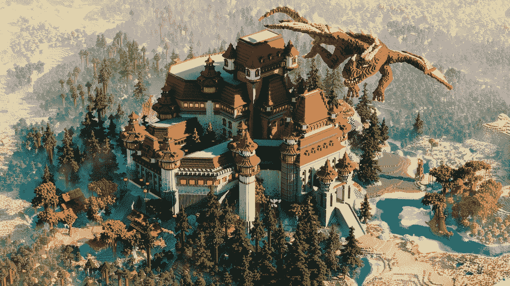
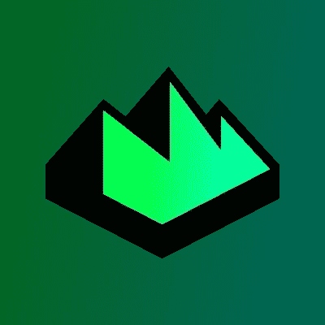
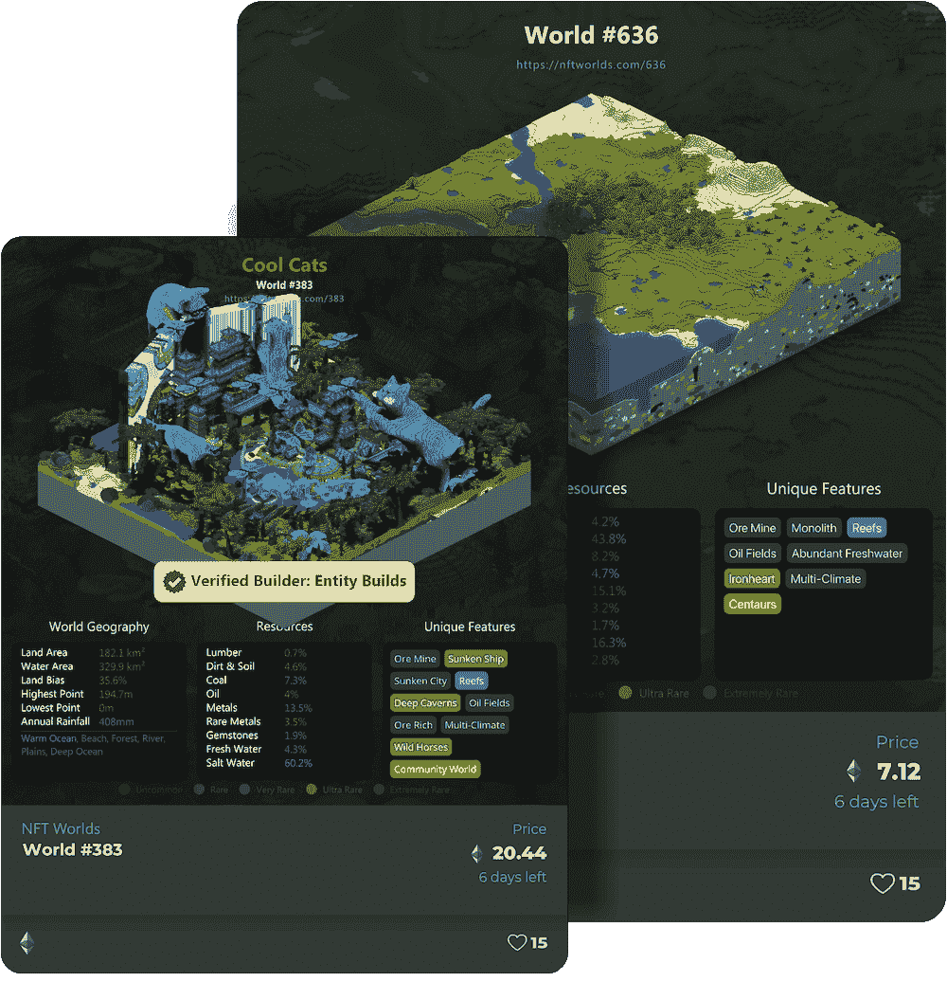

# 如何玩和赢:NFT 世界

> 原文：<https://web.archive.org/web/https://dappradar.com/blog/what-is-nft-worlds-guide-play>

## 重新焕发活力的开放世界平台，所有者可以在这里创造自己的现实

NFT 世锦赛再次崛起。自从微软禁止其游戏平台使用 NFTs，这意味着 NFT 世界不能再依赖《我的世界》的基础设施，Web3 平台就开始了转型和重新发现的旅程。现在，NFT 世界似乎准备从灰烬中重生，重新夺回其作为最激动人心的区块链奥运会之一的地位。

**内容**

*   *[什么是 NFT 世锦赛？](https://web.archive.org/web/20230128214234/https://dappradar.com/blog/what-is-nft-worlds-guide-play/#what-is)*
*   *[游戏如何入门](https://web.archive.org/web/20230128214234/https://dappradar.com/blog/what-is-nft-worlds-guide-play/#get-started)*
*   *[如何玩赢 NFT 世锦赛](https://web.archive.org/web/20230128214234/https://dappradar.com/blog/what-is-nft-worlds-guide-play/#play-and-win)*
    *   *[作为游戏玩家](https://web.archive.org/web/20230128214234/https://dappradar.com/blog/what-is-nft-worlds-guide-play/#gamer)*

*   *[是什么让游戏具有创新性？](https://web.archive.org/web/20230128214234/https://dappradar.com/blog/what-is-nft-worlds-guide-play/#innovative)*
    *   *[世界建造者](https://web.archive.org/web/20230128214234/https://dappradar.com/blog/what-is-nft-worlds-guide-play/#world-builder)*
    *   [WRLD 2.0 令牌](https://web.archive.org/web/20230128214234/https://dappradar.com/blog/what-is-nft-worlds-guide-play/#wrld-token)

    *   *远离微软和《我的世界》的举动*
*   *[有用链接](https://web.archive.org/web/20230128214234/https://dappradar.com/blog/what-is-nft-worlds-guide-play/#useful-links)*

过去一周，NFT 世界的土地价格一直在稳步上升。1 月 20 日，底价低于 0.8 ETH。该下限增加了 1 ETH 以上，现在为 1.85 ETH。对于一个土地经常以超过 3.5 万美元的价格买卖的平台来说，它距离历史高点仍有一段距离。但是这些最近的市场发展对游戏来说是有希望的。

总体交易量也出现飙升:在过去一周，人们买卖了价值 504，110 美元的 NFT 世界的土地。[与之前的七天时间](https://web.archive.org/web/20230128214234/https://dappradar.com/nft/collections)相比，增长了 790%。来自《NFT 世界》的消息称，他们正在重新推出他们的改版游戏，不依赖《我的世界》，这让游戏玩家、交易者和 Web3 社区再次兴奋起来。

[https://web.archive.org/web/20230128214234if_/https://www.youtube.com/embed/pzfsKNJa6jM?feature=oembed](https://web.archive.org/web/20230128214234if_/https://www.youtube.com/embed/pzfsKNJa6jM?feature=oembed)

Trailer for the former NFT Worlds

[Explore NFT Worlds Data](https://web.archive.org/web/20230128214234/https://dappradar.com/ethereum/games/nft-worlds/)

## 什么是 NFT 世界？

NFT 世界是一个分散的大型多人元宇宙游戏生态系统，玩家拥有并可以在 10，000 个独特的世界中创造无限的体验和可能性。它最初建立在《我的世界》的基础设施上。现在，NFT 世界有了自己完全拥有的生态系统。

这些 NFT 世界是程序生成的 3D 体素世界，由两个元素组成:它们的视觉外观和游戏中的体验与区块链相关，它们的链上数据和资源信息将与未来附加的 NFT 世界 dapps、令牌分发等相关。

How the game looked in the Minecraft days

通过拥有一个 NFT 世界，你就拥有了 NFT 世界生态系统中那个世界的权利，拥有了在那个世界中建造和建造所有东西的能力，拥有了游戏中的体验，以及更多。

你可以把它想象成一块稀缺的数字元宇宙土地，它可以转变成任何你可以想象的东西，供其他人玩耍、体验等等。所有这些都在大型多人游戏环境中进行。

## 如何在游戏中入门

### 使用 Explorer dapp

您可以使用浏览器 dapp 轻松探索任何 NFT 世界，该浏览器可以直接从您的浏览器访问。

网络 dapp 是用户友好的，你所需要做的就是搜索一个特定的世界号码，然后在你的网络浏览器中输入网址**https://nftworlds.com/WORLD_NUMBER**。

#### **在计算机和移动设备上使用 explorer web dapp:**

在移动设备上，屏幕上的控件可用于上下、前后移动。

对于计算机，以下键盘和鼠标控件可用于探索:

*   使用 W、A、S 和 D 键移动。
*   按住空格键向上走。
*   按住 shift 键往下走。
*   单击并拖动鼠标四处查看。

## 如何参加并赢得 NFT 世界

### 作为游戏玩家

在这个游戏中，一切都从世界开始。拥有一个并在里面建造是最好的游戏方式。要构建 NFT 世界的生态系统，您需要访问 NFT 世界，它为构建您的游戏元宇宙提供了基础，并访问生态系统的基础设施、区块链层、WRLD 令牌、社区支持等。

有两种方法可以获得一个 NFT 世界:在二级市场上购买或者通过租赁系统长期租用。租赁系统允许你以 WRLD 代币的月租费从现有所有者那里租赁一个世界的完整所有权。

The new NFT Worlds logo

一旦你获得或租用了一个世界，你就可以开始构建任何你能想象到的游戏模式或体验，比如赛车、射手、角色扮演游戏和皇家战役。根据您对数字生态系统的体验和您的具体需求，有两种方式开始构建您的 NFT 世界:

1.  通过访问[https://docs . NFT words . com/NFT-worlds-tutorials/start-exploring-and-building](https://web.archive.org/web/20230128214234/https://docs.nftworlds.com/nft-worlds-tutorials/start-exploring-and-building)了解如何构建您的世界
2.  在 NFT 世界建造者市场的 Discord 服务器上查找经过验证的专业建造者，以获得定制环境、游戏模式和启动帮助。

玩这个游戏的另一种方式是参观世界，享受建设者创造的东西，并参与他们开发的任何挑战和竞争。

### 作为一个挣钱者

在 NFT 世界中，玩赚钱游戏和玩游戏没有太大区别。如果你以土地所有者的身份玩游戏，并在你的世界中创造了一种体验，你可以向进入和玩游戏的人收费。

或者，你可以交易 WRLD 代币和 NFT 世界的土地获利。你需要很好的时机来以高于你支付的价格卖出它们。这是一种有风险的赚钱方式，因为它介于投资和投机之间。最近 NFT 世界的土地价格上涨表明，从交易中获利是可能的。

通过下注您的 NFT 世界，您可以定期赢取 WRLD 代币。赌注包括锁定您的 NFT，赢得的代币数量由您的 NFT 世界的稀有程度决定。

你也可以出租你的 NFT 世界。为租赁者设定月租金和租赁期限。通过出租你的 NFT 世界，你将从赌注和租金中获得 WRLD 代币。

在下一节中查看更多关于赌注和租赁的信息。

## 是什么让游戏具有创新性？

### 世界建设者

NFT 世界变得如此受欢迎，因为它允许持有者拥有自己的元宇宙部分，并以他们想要的任何方式建造它。一旦他们创建了自己的世界，所有者就可以邀请人们加入进来，一起创造新的东西，甚至可以对消费他们制作的内容的人收费。

Verified world builders can create your new slice of the metaverse

在 NFT 世界中建造比其他元世界更简单，提供了更多的可能性，因为每个世界都很大，可以完全控制其结构。你可以创建任何游戏模式或体验，包括赛车，射手，角色扮演游戏，皇家战役，等等。

### 世界 2.0 令牌

WRLD 2.0 是区块链以太坊上的 ERC-20 令牌，在 NFT 世界中用作主要的实用令牌。它在 2022 年 12 月取代了最初的 WRLD 代币。玩家使用 WRLD 2.0 代币获得 NFT 世界中的独家体验、物品、津贴和内容。

> [$WRLD](https://web.archive.org/web/20230128214234/https://twitter.com/search?q=%24WRLD&src=ctag&ref_src=twsrc%5Etfw) 令牌现在可以转换为 [$WRLD](https://web.archive.org/web/20230128214234/https://twitter.com/search?q=%24WRLD&src=ctag&ref_src=twsrc%5Etfw) 2.0 令牌。 [$WRLD](https://web.archive.org/web/20230128214234/https://twitter.com/search?q=%24WRLD&src=ctag&ref_src=twsrc%5Etfw) 2.0 实现了大量基础设施和可伸缩性的改进，这是 [$WRLD](https://web.archive.org/web/20230128214234/https://twitter.com/search?q=%24WRLD&src=ctag&ref_src=twsrc%5Etfw) 1.0 无法实现的。
> 
> 你可以按 1 [$WRLD](https://web.archive.org/web/20230128214234/https://twitter.com/search?q=%24WRLD&src=ctag&ref_src=twsrc%5Etfw) 兑换 1.05 [$WRLD](https://web.archive.org/web/20230128214234/https://twitter.com/search?q=%24WRLD&src=ctag&ref_src=twsrc%5Etfw) 这里:[https://t.co/sHA8sQHjMv](https://web.archive.org/web/20230128214234/https://t.co/sHA8sQHjMv)
> 
> — NFT Worlds (@nftworldsNFT) [December 14, 2022](https://web.archive.org/web/20230128214234/https://twitter.com/nftworldsNFT/status/1603176247202574336?ref_src=twsrc%5Etfw)

Users can exchange their old WRLD for WRLD 2.0

世界所有者获得代币来换取特定的经验、物品、津贴和内容。交易通过连接到区块链的游戏内用户界面进行。

WRLD 也用于购买可选的 NFT 角色，并可能需要未来的全球津贴和 NFT 世界的内容。

### 饥饿和租赁

赌注 NFT 世界允许业主锁定供应，赚取 WRLD 代币，同时支持生态系统。他们也可以通过设定 WRLD 代币的月租价格来出租他们的游戏世界。

这种租赁系统对于有才华的建筑商和开发商来说非常重要，他们可以创造伟大的 NFT 世界体验并获得 WRLD 代币，如果他们买不起 NFT 世界，也不会因为价格太高而出局。它还允许所有者将他们未使用的世界投入使用。

### 离开微软和《我的世界》

2020 年 7 月 20 日，微软旗下的《我的世界》宣布，在其生态系统内不能使用任何基于区块链的技术。这使得 NFT 世界和《我的世界》的合作无法继续。NFT 世界 NFTs 的价格大幅下降，更广泛的 Web3 社区质疑该平台是否能够成功继续。

> 这里先来看看我们即将发布的关于《我的世界》和 NFTs 的指南。如果你是一个积极参与购买、出售或交易使用《我的世界》的 NFT 的玩家或创作者，请阅读下面文章中的信息。https://t.co/3S4uYmiSvfpic.twitter.com/Gl0EkoKQqs[T4](https://web.archive.org/web/20230128214234/https://t.co/3S4uYmiSvf)
> 
> — Minecraft (@Minecraft) [July 20, 2022](https://web.archive.org/web/20230128214234/https://twitter.com/Minecraft/status/1549842815185813504?ref_src=twsrc%5Etfw)