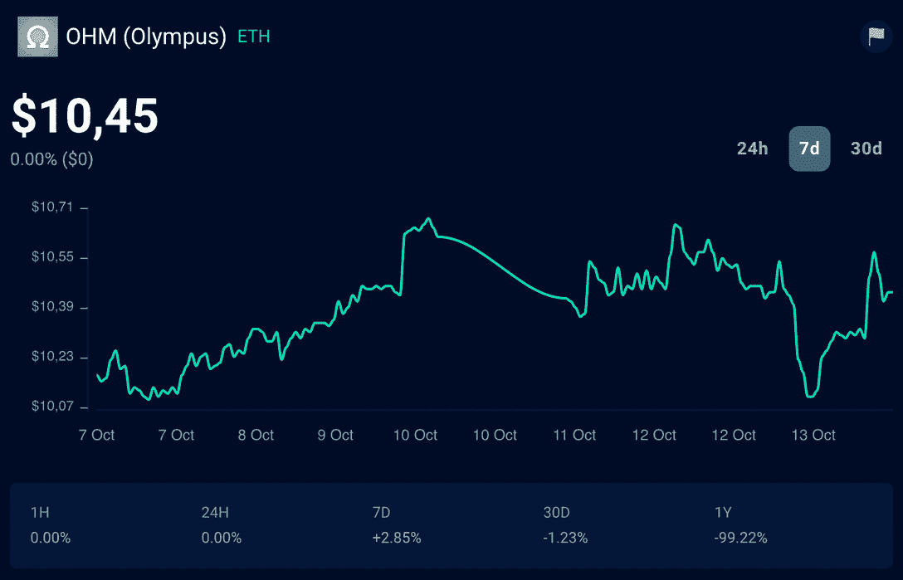
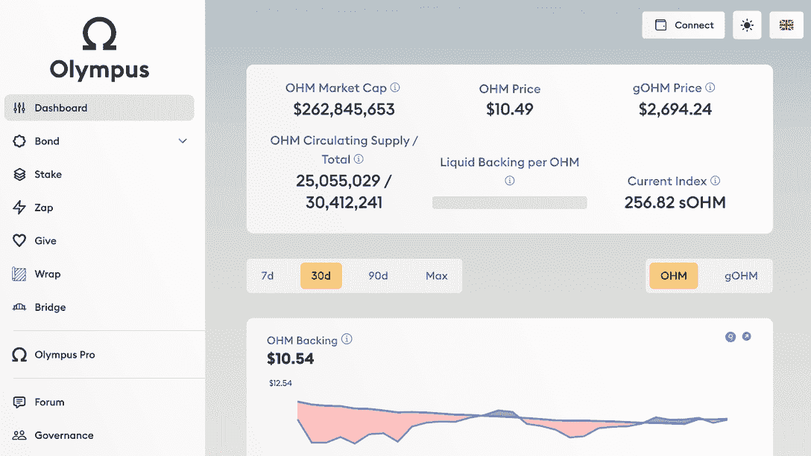

# 奥林巴斯道是什么&它如何重新定义 DeFi？

> 原文：<https://web.archive.org/web/https://dappradar.com/blog/what-is-olympus-dao>

## 奥林巴斯道是一个很快受到关注的名字。发现它的一切！

**区块链技术开创了去中心化金融的新时代(DeFi。)Olympus DAO 是当今最具创新性的 DeFi 项目之一，它正在迅速重新定义金融互动的方式。请继续阅读，了解更多关于它如何创造第一种分散储备货币的信息。**

## 目录

*   奥林巴斯刀是什么？
*   奥林巴斯刀是如何工作的？
*   奥林巴斯刀为什么不一样？
*   介绍欧姆:奥林巴斯令牌
*   奥林巴斯道是去中心化的吗？
*   奥林巴斯刀怎么入门？
*   通过 DappRadar 继续了解 DeFi

## 奥林巴斯刀是什么？

Olympus DAO 是一个分散的自治组织(DAO ),专注于协议所有的流动性(POL)。这是引领 DeFi 2.0 的协议，这是一个承诺用流动性回报解决分散金融(DeFi)问题的时代。

它于 2021 年 3 月在区块链以太坊推出。该协议的目标是为其社区创建一个透明和稳定的 DeFi 生态系统。

作为一名 DAO，任何 Olympus 成员都可以在论坛上创建提案以供讨论，并发布到 snapshot 以进行治理投票。社区可以投票决定协议政策的未来、策略的改变等等。

它的本地令牌称为 Olympus (OHS ),是协议的稳定货币和治理令牌。协议拥有的资产支持奥林巴斯金库的每一个代币。

[Explore Olympus DAO Data](https://web.archive.org/web/20230120064549/https://dappradar.com/ethereum/defi/olympus-dao)

## 奥林巴斯刀是如何工作的？

如您所知，Olympus DAO 网络由专门的社区成员组成，他们执行通过社区治理投票表决的决策和协议机制。

该协议使用一种绑定模式，允许用户购买打折的[欧姆令牌](https://web.archive.org/web/20230120064549/https://dappradar.com/hub/token/eth/OHM)——他们的本地令牌。这将用户与网络捆绑在一起，并为他们提供了通过产量耕作计划增加本地令牌供应的激励。

奥林巴斯拥有约 99%的流动性，解决了早期 DeFi 项目的流动性问题。

## 介绍欧姆:奥林巴斯令牌

奥林巴斯协议使用奥林巴斯令牌(欧姆)作为其本地货币。奥林巴斯代币是一种稳定的加密货币，由奥林巴斯财政部的数字资产支持，而不是像美元那样与法定货币挂钩。

[<picture></picture>](https://web.archive.org/web/20230120064549/https://dappradar.com/hub/token/eth/OHM)

OHS 的历史最高值为 2021 年 11 月的 1334.36 美元，最低价为 2022 年 9 月的 9.06 美元。在撰写本报告时，该代币的流通市值超过 2.9798 亿美元，OHS 价格为 10.45 美元。

> ***“奥林巴斯志在成为 Web3 的首要分散储备货币”***

该协议的目的是让 OHS 成为一种具有高度流动性的货币，这样人们就可以很容易地用它来支付其他资产、产品和服务。此外，代币被设计成具有中长期增长的稳定性，保护持有者的购买力。

[Track OHS Token](https://web.archive.org/web/20230120064549/https://dappradar.com/hub/token/eth/OHM)

## 奥林巴斯刀为什么不一样？

奥林巴斯道是整个 DeFi 领域都在寻找的解决方案。怎么会？在不耗尽协议资源的情况下，确保分散交易所的流动性安全，换句话说，彻底改造产量农业。

虽然自动做市商(AMM)分散式交易所(DEX)需要提供充足的代币流动性，以便加密货币交易者在交易中使用它们时几乎没有滑点，但这并不总是发生。这时收益农业出现了，允许流动性提供者(LP)用他们的 LP 代币来换取 DEX 原生代币的高回报。然而，这也不是一个完美的解决方案。

为了激励有限合伙人将流动性锁定在他们的资金池中，资产管理公司提供的回报太高，无法在不稀释本地令牌供应的情况下长期发挥作用。

Olympus DAO 没有像 yield farming 最初所做的那样租赁流动性，而是将债券的使用引入 DeFi。奥林巴斯债券允许用户通过向协议提供他们的 LP 令牌或其他加密货币资产来购买折扣欧姆令牌。

这意味着 Olympus DEX 流动性不再由流动性提供商所有，而是由协议本身所有。此外，*“奥林巴斯用复利回报赌注者，随着时间的推移，这使得赌注更有利可图。”*

> 是什么让 [$OHM](https://web.archive.org/web/20230120064549/https://twitter.com/search?q=%24OHM&src=ctag&ref_src=twsrc%5Etfw) 如此令人向往:
> 
> 1。确定性流动性(奥林巴斯自有流动性，保证你能退出)
> 
> 2。货币政策灵活性
> 
> 3。
> 
> 土产欧姆债券(债)4。可扩展性
> 
> 5。稳定，但不盯住
> 
> (20/X)
> 
> — OlympusDAO (@OlympusDAO) [October 11, 2022](https://web.archive.org/web/20230120064549/https://twitter.com/OlympusDAO/status/1579960556509093888?ref_src=twsrc%5Etfw)

## 奥林巴斯道是去中心化的吗？

这个简单的问题也是有意义的。根据协议的[官方文件](https://web.archive.org/web/20230120064549/https://docs.olympusdao.finance/main/basics/readme):

> ***“道奉行的是‘渐进式分权’的策略目前，该协议的主要组件由 DAO 在高层进行控制。不过，最终的重点是在财政、政策和经济层面创建一个基础，并使机构群体能够以信任和流程最小化的方式直接操作协议机制。***

这意味着，从此刻起，就像大多数自称为[去中心化自治组织(DAOs)](https://web.archive.org/web/20230120064549/https://dappradar.com/blog/what-is-a-dao-how-does-it-work) 的协议一样，奥林巴斯也很早就走上了完全去中心化的道路。但是，必须指出，这个协议是这个领域中领先的 Dao 之一。

*   你知道吗？ [达普拉达也在造自己的刀](https://web.archive.org/web/20230120064549/https://dappradar.com/blog/why-every-dapp-community-needs-a-voice-in-dappradar-dao)

## 奥林巴斯怎么入门？

如果你想加入奥林巴斯道社区，拥有 OHS，并使用协议的 DeFi 解决方案，前往[官方网站](https://web.archive.org/web/20230120064549/https://www.olympusdao.finance/)并连接你的以太坊兼容钱包。

[<picture></picture>](https://web.archive.org/web/20230120064549/https://dappradar.com/ethereum/defi/olympus-dao)

在 dapp 中，您可以购买奥林巴斯债券——以折扣价用各种代币兑换欧姆，下注 OHS，交换代币等等。

## 通过 DappRadar 继续了解 DeFi

如果您对投资、使用或开发 DeFi 项目感兴趣，DappRadar 是关注行业发展的最佳选择。

除了在用户友好的排名中提供准确的数据，我们的团队还分析市场，并创建报告和教育内容。通过这种方式，我们陪你一起进入去中心化金融的奇妙世界。

我们希望你喜欢了解更多关于奥林巴斯道。DappRadar 将继续遵循协议的道路，你可以通过关注我们的 [Twitter](https://web.archive.org/web/20230120064549/https://twitter.com/DappRadar) 和加入我们的 [Discord](https://web.archive.org/web/20230120064549/https://discord.com/invite/4ybbssrHkm) 来更新。

[**(按钮)概述 DeFi 行业**](https://web.archive.org/web/20230120064549/https://dappradar.com/defi)

### 有用的链接

*   分散金融(DeFi): DappRadar 的终极指南
*   [什么是 Crypto 中的产量农业？初学者指南](https://web.archive.org/web/20230120064549/https://dappradar.com/blog/beginners-guide-to-yield-farming)
*   [什么是 DeFi 2.0？奥林巴斯道如何重塑 DeFi](https://web.archive.org/web/20230120064549/https://dappradar.com/blog/what-is-defi-2-0)

## 随身携带您的 Web3 之旅

使用 DappRadar 移动应用程序，再也不会错过 Web3。查看最受欢迎的 dapps 的性能，并关注您投资组合中的 NFT。您在 DappRadar 上的帐户会与我们的移动应用程序同步，这样您很快就可以选择实时接收提醒。

[Download the DappRadar app now](https://web.archive.org/web/20230120064549/https://dappradar.app.link/blog)[<picture></picture>](https://web.archive.org/web/20230120064549/https://play.google.com/store/apps/details?id=com.portfolio.dappradar)

***以上不构成投资建议。此处给出的信息仅供参考。请尽职调查并自行研究。***

 NewsletterUnsubscribe at any time. [T&Cs](https://web.archive.org/web/20230120064549/https://dappradar.com/terms) and [Privacy Policy](https://web.archive.org/web/20230120064549/https://dappradar.com/privacy-policy)