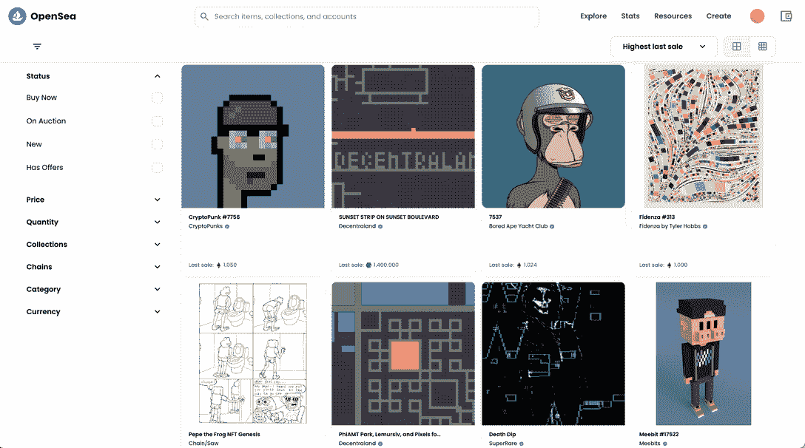
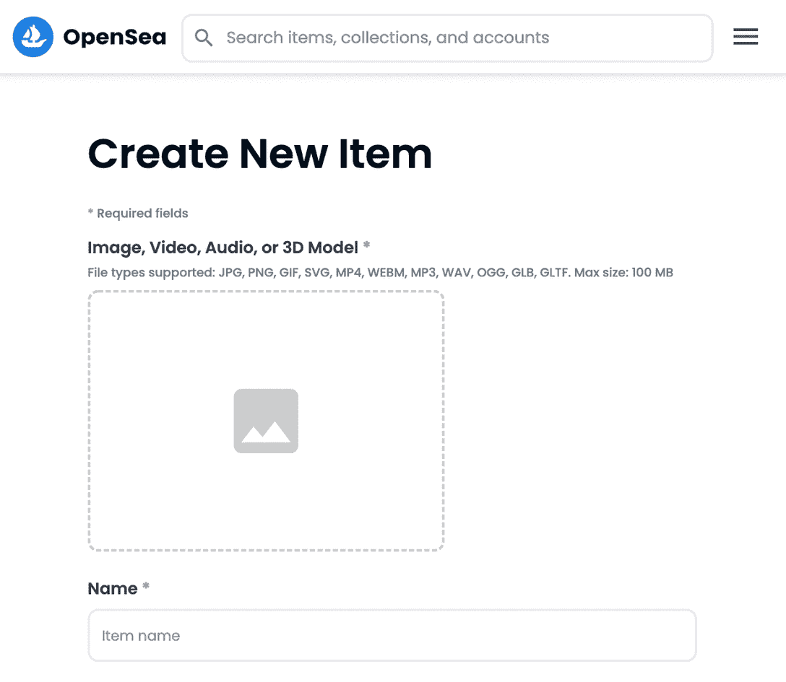

# 什么是 OpenSea，如何使用？初学者指南

> 原文：<https://web.archive.org/web/https://dappradar.com/blog/what-is-opensea-and-how-to-use-it-the-beginners-guide>

## 关于在世界上最大的 NFT 市场上买卖 NFT，你需要知道的就是

如果你一直在关注 NFT 的最新趋势，你就会知道 OpenSea 在这个行业中是一个响当当的名字。但是你知道这是怎么回事，怎么用吗？什么是 OpenSea？我怎样才能在那里买到我的第一个 NFT？创建原创系列怎么样？本文将指导您解决一些关于 OpenSea 的最常见问题，所以请不要走开！

## 什么是 OpenSea？

OpenSea 是 NFT 最大和最重要的市场之一。它创建于 2017 年 12 月，是区块链[以太坊](https://web.archive.org/web/20220816210341/https://dappradar.com/rankings/protocol/ethereum)上第一个不可替代代币的公开市场。

目前，它还支持在[多边形](https://web.archive.org/web/20220816210341/https://dappradar.com/rankings/protocol/polygon)、[索拉纳](https://web.archive.org/web/20220816210341/https://dappradar.com/rankings/protocol/solana)和[克莱恩](https://web.archive.org/web/20220816210341/https://dappradar.com/rankings/protocol/klaytn)区块链上的 NFT，并且是 2021 年 NFT 奔牛节的主要角色之一。那时，这些数字资产开始成为主流。

任何人都可以[访问 OpenSea marketplace](https://web.archive.org/web/20220816210341/https://opensea.io/) ，只要他们有一个 [web3 钱包](https://web.archive.org/web/20220816210341/https://dappradar.com/blog/best-cryptocurrency-wallets-for-2022)和加密货币，这比你想象的要容易得多。

## 什么是 NFT？

万一你在这里有点迷路，让我们回到开始。[NFT 是不可替代的代币](https://web.archive.org/web/20220816210341/https://dappradar.com/blog/what-are-non-fungible-tokens-nfts)，这是一种通过区块链技术拥有数字资产的新方式。

它们在本质上是独特的，不像比特币和以太等加密货币令牌。这意味着每个 NFT 都是不同的，可以证明某些东西的价值。它可以是艺术品、视频、门票、投票、契约、游戏角色等等。

请参见下面的视频，了解直观的解释:

[https://web.archive.org/web/20220816210341if_/https://www.youtube.com/embed/o71ROauqvOY?feature=oembed](https://web.archive.org/web/20220816210341if_/https://www.youtube.com/embed/o71ROauqvOY?feature=oembed)

*   **进一步阅读:** [什么是不可替代令牌，或 NFT？](https://web.archive.org/web/20220816210341/https://dappradar.com/blog/what-are-non-fungible-tokens-nfts)

## OpenSea 和 NFTs:它是如何工作的

如你所知，OpenSea 是一个 NFT 市场，一个分散的平台，人们可以在这里买卖他们不可替代的代币。

该团队的使命是帮助人们在安全有趣的环境中轻松发现和交易数字资产，你很快就会发现他们做得很好。

去中心化意味着市场运行在一个区块链上(在这种情况下，在[以太坊](https://web.archive.org/web/20220816210341/https://dappradar.com/blog/what-is-ethereum-dappradars-ultimate-guide)、Polygon、Solana 和 Klaytn 上)。因此，OpenSea 的交易不容易被任何公司或政府控制，它们也不持有你的资产——你持有，在你的钱包里。

## 如何使用 OpenSea？

接下来，我们将向您展示一些 OpenSea 基础知识，以便您了解该平台如何工作，并有足够的信心在您认为合适的时候开始使用它。

### 创建一个 OpenSea 帐户

开始使用 OpenSea 需要做的第一件事就是在官网上[注册。要做到这一点，您只需要一个类似](https://web.archive.org/web/20220816210341/https://opensea.io/login)[的 web3 钱包。您只需要按照以下步骤操作:](https://web.archive.org/web/20220816210341/https://dappradar.com/blog/what-is-metamask)

1.  打开 OpenSea 网站，点击右上角的账号图标；
2.  您将转到登录页面并连接您的钱包。从列表中选择您喜欢的一个；
3.  一旦您连接了您的钱包，您将被重定向到您的 OpenSea 仪表板；

然后，您就可以开始使用 OpenSea 了。根据您想要在市场中进行的活动，建议您在连接的钱包地址中准备必要的令牌。

*   **你可能也喜欢阅读:** [交易索拉纳 NFTs——魔法伊甸园 vs OpenSea](https://web.archive.org/web/20220816210341/https://dappradar.com/blog/trading-solana-nfts-magic-eden-vs-opensea)

## 在 OpenSea 上购买 NFT

大多数 OpenSea 的游客会访问平台寻找购买的东西，这种体验相当轻松。

如果你想在 OpenSea 上购买一件 NFT，你可以按类型浏览收藏，按链、价格、购买风格等进行过滤。

在那里，您可以浏览和发现新的 NFT，或者使用搜索栏来查找特定的内容。

说起来，在 OpenSea 上，你可以通过点击“立即购买”立即购买 NFTs，或者在拍卖上“出价”。这将取决于卖方自己对资产上市的选择。用户还可以对任何 NFT 进行报价，报价将在一段时间内保持有效。在这种情况下，交易不会发生，除非 NFT 持有者接受报价。

我们将仔细研究这两种方法，以便您决定哪种方法最适合您。

### 我应该“立即购买”还是在拍卖中出价？

“立即购买”选项的优势在于您将立即拥有您所购买的商品。缺点是卖家可能定的价格很高，你要一次性付清。

在拍卖的情况下，你必须出价，如果计时器结束时你的出价最高，你将赢得 NFT 奖。虽然你最终支付的价格可能低于“立即购买”的价格，但其他人可能会出价更高，从你手中夺走 NFT。

综上所述，如果你不着急，又想争取好的成交，那就去竞拍吧。但如果你想确保拿到 NFT，并且不介意多付一点钱，那就选择立即购买。

## 在 OpenSea 上创建 NFTs

如果你是一个创造者，你会很高兴知道 OpenSea 也允许你创建并列出你的 NFT 进行销售。就像买一样，这个过程也很直接。

下面是在 OpenSea 上创建 NFT 的一步一步的过程。

1.  第一，必须连接钱包才能登录；
2.  在主菜单上，点击[创建](https://web.archive.org/web/20220816210341/https://opensea.io/asset/create)；
3.  上传 NFT 文件并填写信息字段；
4.  创建您的 NFT 或将它添加到收藏中；
5.  选择一个区块链来铸造你的 NFTs
6.  每次在平台上出售 NFT 时，编辑“创作者的收入”。

完成后，你会发现你创建的 NFT 出现在你的钱包和个人资料中。然后，你可以把它出售！

请记住，OpenSea 不提供启动您自己的智能合约的选项。您的 NFTs 将加入到一个通用智能合同或 NFT 集合中的用户生成内容的巨大堆中。那些想要更多可定制性的人，可能想要做更多的研究，并推出他们自己的智能合同。

## 在公海上销售 NFT

现在让我们看看如何在 OpenSea 上销售您的 NFTs。在您的[档案](https://web.archive.org/web/20220816210341/https://opensea.io/account)中选择您想要出售的 NFT 后，您可以点击“出售”开始配置列表。

然后，你可以选择出售的类型，要么是固定价格，要么是在以太坊上铸造的 NFT 的定时拍卖。到目前为止，该平台还不支持 Solana，Polygon 或 Klaytn 上的定时拍卖。

### 我应该在 OpenSea 上以固定价格还是定时拍卖的方式出售我的 NFTs？

以一个固定的价格出售你的 NFT 有好处也有坏处。这样做的好处是，你可以更好地控制价格，一旦 NFT 售出，你就可以收到钱。

但这也意味着你的 NFT 价格可能吸引不了买家的眼球，最终根本卖不出去。

至于用定时拍卖出售，还有其他事情需要考虑。首先，有两种拍卖方式可供选择:英式拍卖(卖给出价最高的人)或降价出售(降价直到有人买)。

虽然选择拍卖您的 NFT 可能需要更多的时间来配置，但它也可以帮助您获得更好的价格，因为买家觉得他们必须竞争 NFT。

同样值得一提的是，当你第一次这样做时，你需要支付一笔费用，让买家进行预授权出价。

因此，最终的选择取决于你，取决于你的策略和每个 NFT 的特点。

[<picture></picture>](https://web.archive.org/web/20220816210341/https://dappradar.com/blog/what-are-non-fungible-tokens-nfts)[<picture></picture>](https://web.archive.org/web/20220816210341/https://dappradar.com/nft/marketplaces)[<picture></picture>](https://web.archive.org/web/20220816210341/https://dappradar.com/nft/sales)

## OpenSea 的费用是多少？

你可以免费访问和导航 OpenSea，然而，在平台上买卖 NFT 需要付费。

如你所知，卖家在第一次创建拍卖时需要付费，但在接受任何类型的报价时也需要付费。

此外，当出售由其他用户在平台上创建的 NFT 时，您将不得不支付上述创建者收入。这笔费用最高可达购买价格的 10%,这样创作者就可以从他们创作的每一笔销售中获得一定的百分比。

现在关于 OpenSea 的服务费，是**每买一个 NFT 2.5%**。

## 除了 OpenSea，NFT 还有其他市场吗？

是的，在不同的区块链有许多替代 OpenSea 的 NFT 市场，但是选择它们是个人的选择。其他一些[最佳 NFT 市场](https://web.archive.org/web/20220816210341/https://dappradar.com/nft/marketplaces)包括:

*   [魔法伊甸园](https://web.archive.org/web/20220816210341/https://dappradar.com/blog/how-to-buy-and-sell-nfts-on-magic-eden)；
*   [looks rare](https://web.archive.org/web/20220816210341/https://dappradar.com/ethereum/marketplaces/looksrare)；
*   原子商品房；
*   [稀有的](https://web.archive.org/web/20220816210341/https://dappradar.com/blog/what-is-rarible-and-how-to-use-it)。

每个市场都有自己的优势和劣势，所以针对你的具体情况做自己的研究是很重要的。

*   **阅读我们的文章**了解更多信息:[20 大最佳 NFT 市场&出售 NFT](https://web.archive.org/web/20220816210341/https://dappradar.com/blog/best-nft-marketplaces-to-buy-sell-nfts)

## 用 DappRadar 继续跟踪 OpenSea

DappRadar 将继续走开放海洋之路，引领 NFT 社区。您可以使用我们的 [NFT 市场排名](https://web.archive.org/web/20220816210341/https://dappradar.com/nft/marketplaces)来跟踪市场的表现。

为了更深入地了解如何管理自己的 NFT 投资组合，我们建议使用 [DappRadar NFT 投资组合跟踪器](https://web.archive.org/web/20220816210341/https://dappradar.com/hub/wallet/)。

[https://web.archive.org/web/20220816210341if_/https://www.youtube.com/embed/wUN0ZdgNRjY?feature=oembed](https://web.archive.org/web/20220816210341if_/https://www.youtube.com/embed/wUN0ZdgNRjY?feature=oembed)

如果你想进一步了解令人兴奋的去中心化应用世界中的最佳项目，那么关注 DappRadar [博客](https://web.archive.org/web/20220816210341/https://dappradar.com/blog/)、 [YouTube](https://web.archive.org/web/20220816210341/https://www.youtube.com/c/DappRadar) 频道和 [Twitter](https://web.archive.org/web/20220816210341/https://twitter.com/dappradar) 。

***以上不构成投资建议。此处给出的信息仅供参考。请行使尽职调查，做你的研究。***

 NewsletterUnsubscribe at any time. [T&Cs](https://web.archive.org/web/20220816210341/https://dappradar.com/terms) and [Privacy Policy](https://web.archive.org/web/20220816210341/https://dappradar.com/privacy-policy)