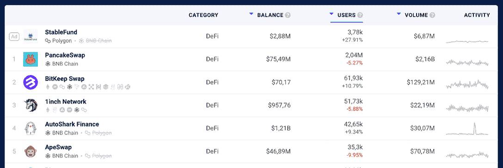
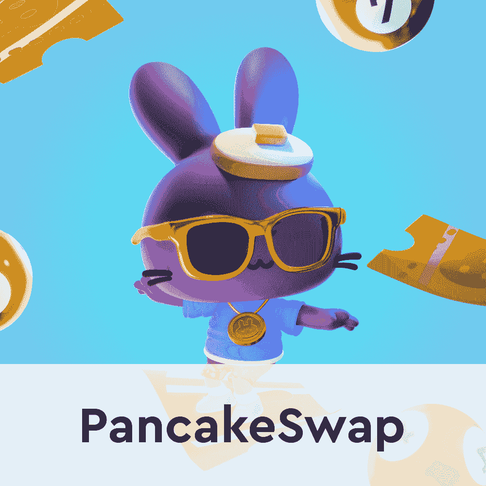
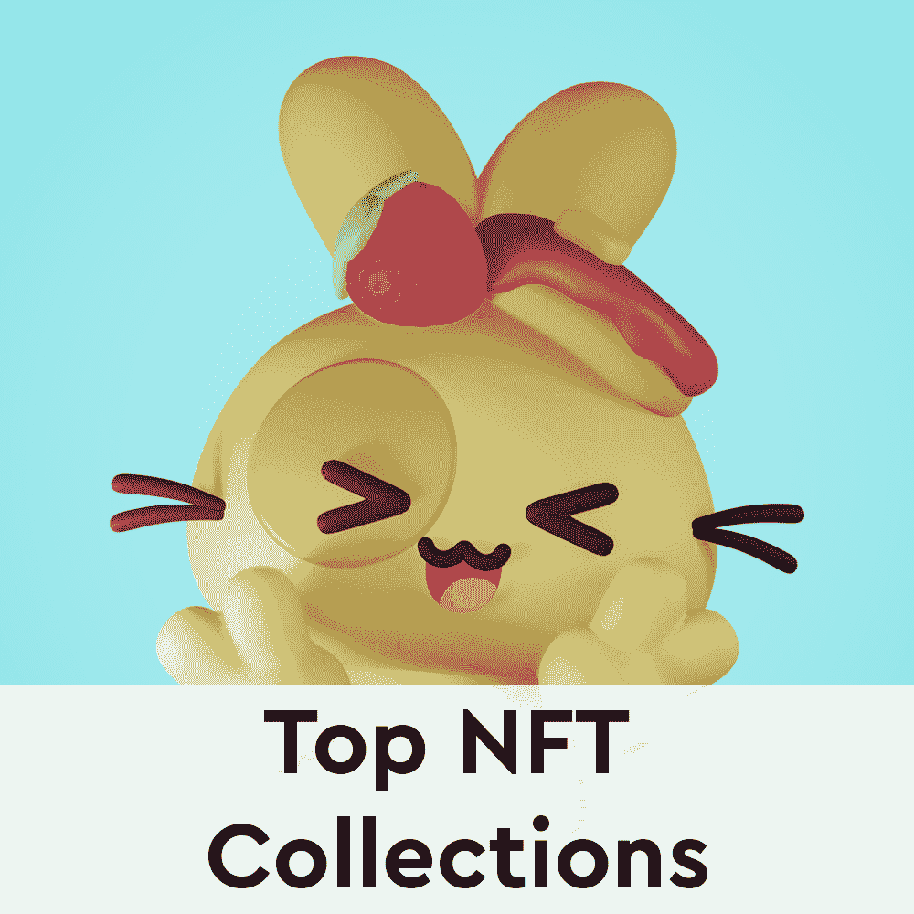
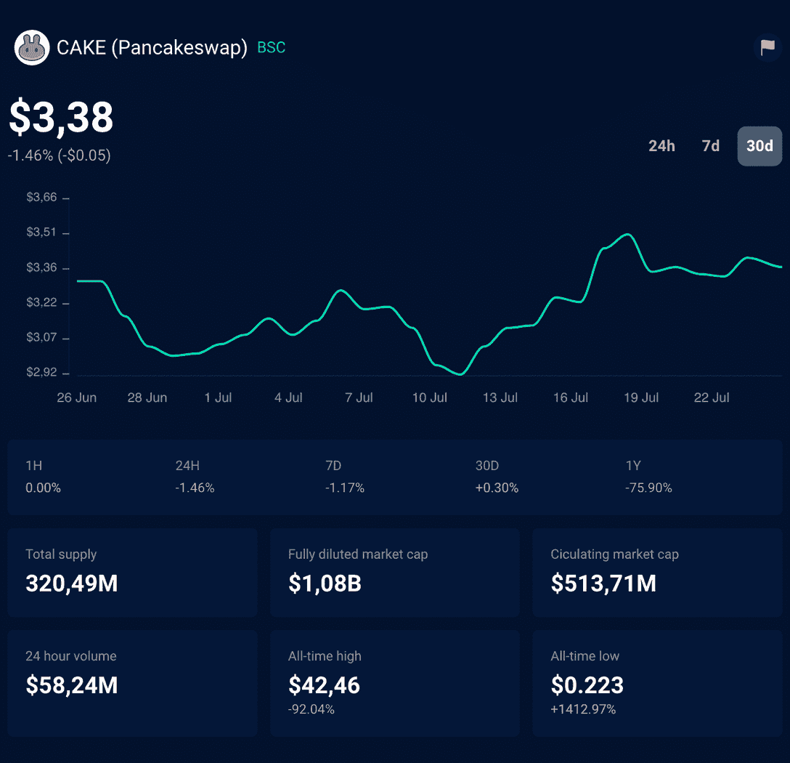
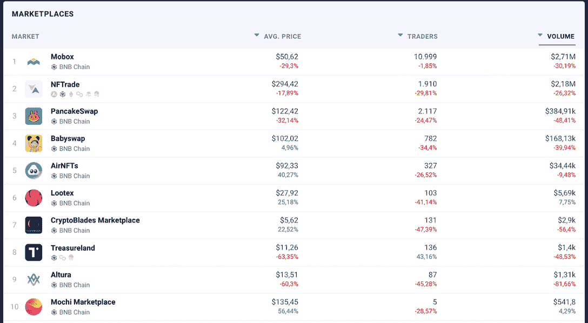
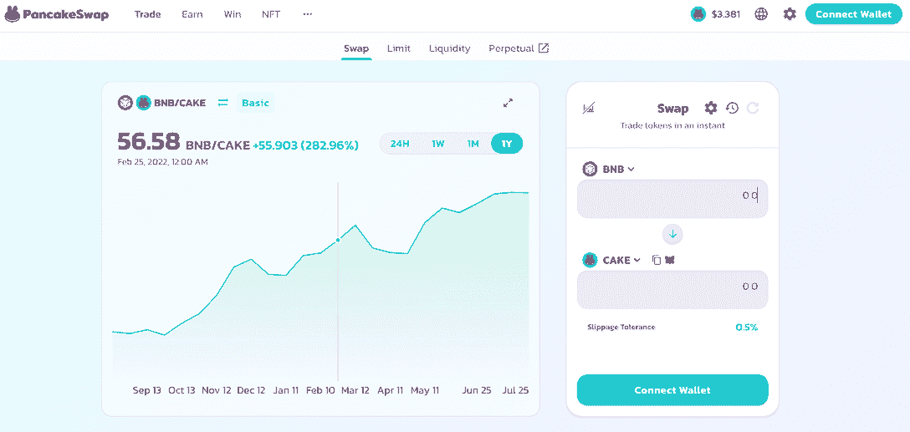
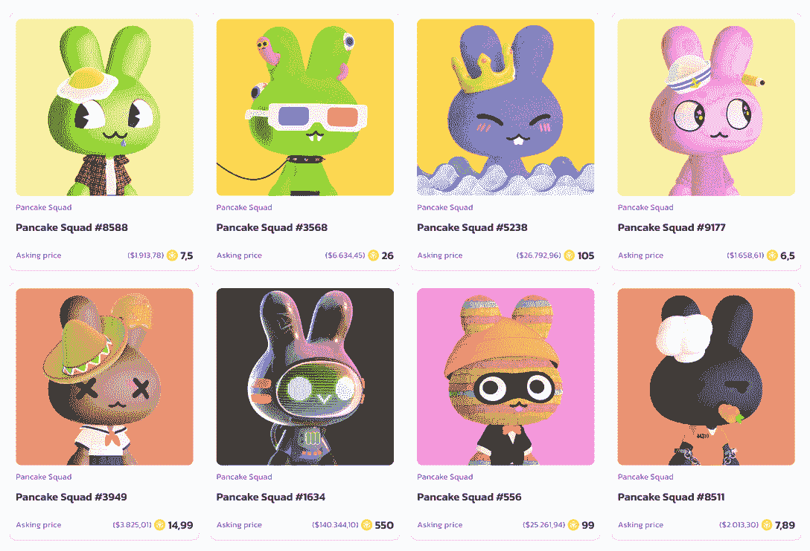

# 什么是 PancakeSwap 以及如何使用它

> 原文：<https://web.archive.org/web/https://dappradar.com/blog/what-is-pancakeswap-and-how-to-use-it>

## 了解更多关于 BNB 连锁分散交易所和 NFT 市场的信息

你是否曾经想跳进 DeFi 和 NFTs 的世界，但不知道如何开始？这篇博文将向你介绍一个最好的入门工具。**什么是 PancakeSwap？**把它想象成一个平台，让初学者更容易理解和参与加密货币的机会。所以继续读下去，了解更多关于如何使用 PancakeSwap！

## 什么是 PancakeSwap？

PancakeSwap 是建立在 BNB 链上的最大的分散式交易所(DEX)和 NFT 市场之一。

虽然它的目标是让人们更容易参与 DeFi 和 NFTs，但 PancakeSwap 也已成为该领域最受欢迎的 DeFi 平台之一。

它于 2020 年 9 月首次推出，但是，正如你在 [DappRadar Top BNB 连锁店 DeFi Dapps](https://web.archive.org/web/20220813162755/https://dappradar.com/rankings/protocol/binance-smart-chain/category/defi) 中看到的，PancakeSwap 仍然是使用最多的交易所之一。

2022 年 7 月，PancakeSwap 的总交易量为 216 亿美元，月用户超过 200 万。

[***访问 PancakeSwap 官网***](https://web.archive.org/web/20220813162755/https://pancakeswap.finance/)

[<picture></picture>](https://web.archive.org/web/20220813162755/https://dappradar.com/binance-smart-chain/defi/pancakeswap)[<picture></picture>](https://web.archive.org/web/20220813162755/https://dappradar.com/nft)[<picture></picture>](https://web.archive.org/web/20220813162755/https://dappradar.com/hub/swap/bsc/BNB/CAKE)

### PancakeSwap 的蛋糕令牌是什么？

蛋糕令牌是 PancakeSwap 的本地令牌，它有几个用途。您可以用它来支付交易费用，赚取提供流动性的奖励，甚至对 PancakeSwap 治理提案进行投票！

你可以在 [DappRadar 的 Token Explorer](https://web.archive.org/web/20220813162755/https://dappradar.com/hub/tokens/bsc/all/) 上查看，蛋糕的历史最高值是 2021 年 4 月的**42.46 美元**，而历史最低值是 2020 年 9 月的**0.22 美元**。在撰写本文时，2022 年 7 月，蛋糕的价格为 3.38 美元。

如果你有兴趣了解更多这方面的知识，可以看看我们的文章 [PancakeSwap 和它的本地蛋糕令牌](https://web.archive.org/web/20220813162755/https://dappradar.com/blog/pancakeswap-and-its-native-cake-token)。

用户可以在 PancakeSwap 或其他支持币安智能链资产的交易所交易蛋糕，如 [DappRadar Token Swap](https://web.archive.org/web/20220813162755/https://dappradar.com/hub/swap/bsc) 。

## 我能用 PancakeSwap 做什么？

PancakeSwap 最大的好处之一就是每个人都有适合自己的东西。无论你是对 DeFi、NFTs 感兴趣，还是对两者都感兴趣，PancakeSwap 都能满足你。以下是您从使用 PancakeSwap 中获益的主要方式:

### PancakeSwap:分散的交易所

PancakeSwap 的第一个也是主要的产品是由其社区支持的 DEX。

DEX 是一种不依赖于中央权威的交易所。这意味着 PancakeSwap 是抗审查的，不能被任何政府或公司轻易关闭。

此外，与币安或比特币基地这样的集中式交易所不同，PancakeSwap 不持有你的资金。这意味着你完全控制你的硬币，直接从你的数字钱包交易。

PancakeSwap DEX 使用自动做市商(AMM)模式，没有订单簿来匹配买家和卖家。相反，它利用流动性池提供低费用的公平交易体验。

我们将在文章的后面更详细地解释你如何从 PancakeSwap 杰出的[分散金融(DeFi)](https://web.archive.org/web/20220813162755/https://dappradar.com/blog/decentralized-finance-defi-dappradars-ultimate-guide) 产品中获益。

### NFT 市场

除了 DEX，PancakeSwap 还有一个 NFT 市场，于 2021 年 9 月非常成功地推出。

我们 DappRadar [密切关注 PancakeSwap 的首次亮相](https://web.archive.org/web/20220813162755/https://dappradar.com/blog/pancake-bunnies-storm-nft-charts)，正如你在 [DappRadar NFT 市场排名](https://web.archive.org/web/20220813162755/https://dappradar.com/nft/marketplaces/protocol/binance-smart-chain)中看到的，它仍然是 BNB 连锁店中最重要的一家。

一个 [NFT 是一个不可替代的令牌](https://web.archive.org/web/20220813162755/https://dappradar.com/blog/what-are-non-fungible-tokens-nfts)，这意味着它是一种独特的数字资产，其他资产无法替代。PancakeSwap NFT 市场允许您以友好的用户体验买卖这些数字资产。

PancakeSwap 的 NFT 市场由 BNB 连锁店提供支持，允许你以非常低的交易费用购买、出售或交易 PancakeSwap 特有的 NFT。

虽然没有区块链以太坊的 NFT 那么有名，但 BNB 连锁 NFT 正迅速引起收藏家的兴趣。

## 如何开始使用 PancakeSwap？

现在你对 PancakeSwap 有了更多的了解，让我们深入了解如何使用它！

### 连接您的钱包

在 PancakeSwap 上进行任何操作之前，您需要连接您的数字钱包。PancakeSwap 支持广泛的钱包，包括 [MetaMask](https://web.archive.org/web/20220813162755/https://dappradar.com/blog/what-is-metamask) ，Opera Wallet，Blocto，SafePal 等等。

如果你还没有电子钱包，我们建议你看看下面的视频，看看如何选择一个电子钱包。

[https://web.archive.org/web/20220813162755if_/https://www.youtube.com/embed/Odixm1ehnfw?feature=oembed](https://web.archive.org/web/20220813162755if_/https://www.youtube.com/embed/Odixm1ehnfw?feature=oembed)

一旦你创建了你的钱包，你需要做的就是点击 [PancakeSwap 网站](https://web.archive.org/web/20220813162755/https://pancakeswap.finance/)上的“连接钱包”按钮，然后按照指示操作。连接钱包后，你就可以开始了！

## 如何用 PancakeSwap 进行交易并产生被动收入？

现在你已经设置好了，是时候开始 PancakeSwap 的主要产品:去中心化交换了。

### 交换代币

在 PancakeSwap 中交易代币是一种相当简单的体验。一旦你的钱包连接上了，你的代币准备好了，你只需要选择你的金额和交换！

你必须为每笔掉期交易支付 0.25%的交易费，交易将在 [BscScan explorer](https://web.archive.org/web/20220813162755/https://www.bscscan.com/) 上显示。

### 提供流动性

我们之前提到过，PancakeSwap 是一种使用由几个用户提供的资金组成的[流动性池(LPs)](https://web.archive.org/web/20220813162755/https://dappradar.com/blog/what-is-liquidity-pool-and-liquidity-provider) 的 DEX。

这些 LP 是在用户将其令牌存入 PancakeSwap 智能合约时创建的。作为回报，他们会收到代表他们在该池中份额的 LP 令牌。

例如，如果您向蛋糕/BNB LP 存款 100 BNB，您将获得 100 个蛋糕-BNB LP 代币。这些代币可以在 PancakeSwap 或其他交易所交易其他 BNB 连锁资产。

### 带糖浆池的星际蛋糕

PancakeSwap 有所谓的“糖浆池”，与 LPs 非常相似，但有一个主要区别:奖励是蛋糕，PancakeSwap 的本地令牌。

它们基本上是赌注池，为流动性提供者提供了另一种赚取回报的方式。

### 高产农业

您还可以通过下注 LP 代币赢得 PancakeSwap 的蛋糕代币。对于你提供流动性的池中发生的每一笔交易，你都会得到一小块蛋糕作为奖励。

这就是所谓的[收益农业](https://web.archive.org/web/20220813162755/https://dappradar.com/blog/beginners-guide-to-yield-farming)，也是用户在 PancakeSwap 上赚取被动收入的主要方式之一。

然而，需要指出的是，这些回报并非没有风险。提供流动性意味着你面临**非永久性损失和永久性损失**。

*   **进一步阅读** : [如何在 PancakeSwap 上获得被动收入](https://web.archive.org/web/20220813162755/https://dappradar.com/blog/how-to-make-passive-income-on-pancakeswap)

## 如何在 PancakeSwap 上买卖 NFT？

PancakeSwap 最新推出的 [NFT 市场](https://web.archive.org/web/20220813162755/https://pancakeswap.finance/nfts)，允许用户在 BNB 智能链上买卖不可替代的代币。凭借出色的 UX 和透明的流程，这里是[最好的 NFT 市场之一。](https://web.archive.org/web/20220813162755/https://dappradar.com/blog/best-nft-marketplaces-to-buy-sell-nfts)

### 在 PancakeSwap 上购买 NFT

要在 PancakeSwap 上购买 NFT，你需要做的就是找到想要的收藏和令牌，查看物品详情和价格，然后点击“购买”。然后，系统会提示您使用连接的钱包确认交易。

交易确认后，PancakeSwap 会将 NFT 加入你的钱包。

PancakeSwap NFT 市场的每笔交易都收取 2%的交易费，用于回购和焚烧蛋糕代币。

### 在 PancakeSwap 上销售 NFT

要在 PancakeSwap 上出售 NFT，你首先需要将你的收藏加入白名单。如果你的申请被接受，那么你可以在市场上出售你的 NFT。

有些事情肯定会帮助你的 NFT 收藏在 PancakeSwap 上上市，比如铸造所有的 NFT。如果你的项目有一个活跃的网站和社交媒体账户，这表明你的收藏有一个参与的社区和一个强大的商业计划，值得 PancakeSwap。

## PancakeSwap 的官方 NFT 收藏和简介

除了用户创建的收藏，PancakeSwap 也有自己的官方 NFT 收藏。其中包括[煎饼小队系列](https://web.archive.org/web/20220813162755/https://dappradar.com/ethereum/collectibles/pancakeswap-squad)和煎饼兔子系列。

此外，PancakeSwap 上的用户可以创建他们自己的 NFT 用户档案，完全个性化。通过允许用户选择他们的名字、团队和 NFT 个人资料图像，该市场创造了一个社区驱动的环境——这在 NFT 市场中还不常见。

## 用 DappRadar 跟踪 PancakeSwap

如果你正在寻找一种更好的方式来管理你的加密和 NFT 投资组合，你必须看看 DappRadar [投资组合跟踪器](https://web.archive.org/web/20220813162755/https://dappradar.com/hub/wallet/eth/)。

[https://web.archive.org/web/20220813162755if_/https://www.youtube.com/embed/WHL_uYv8riA?feature=oembed](https://web.archive.org/web/20220813162755if_/https://www.youtube.com/embed/WHL_uYv8riA?feature=oembed)

DappRadar 将继续关注 PancakeSwap 的 DEX 和 NFT 市场的数据和新闻。如果你有兴趣了解更多关于这个和其他重要的 web3 项目，一定要看看我们的[博客](https://web.archive.org/web/20220813162755/https://dappradar.com/blog/)、 [Youtube](https://web.archive.org/web/20220813162755/https://www.youtube.com/c/DappRadar) 和 [Twitter](https://web.archive.org/web/20220813162755/https://twitter.com/dappradar) 。

***以上不构成投资建议。此处给出的信息仅供参考。请行使尽职调查，做你的研究。***

 NewsletterUnsubscribe at any time. [T&Cs](https://web.archive.org/web/20220813162755/https://dappradar.com/terms) and [Privacy Policy](https://web.archive.org/web/20220813162755/https://dappradar.com/privacy-policy)