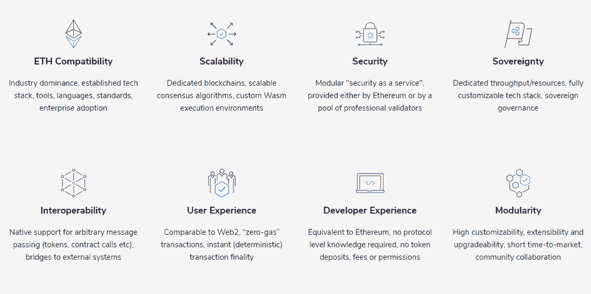
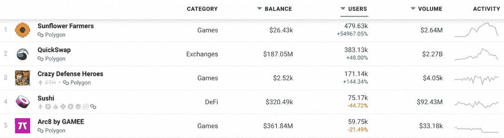
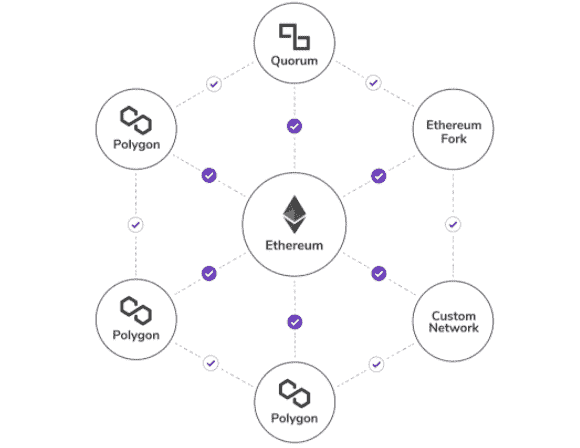
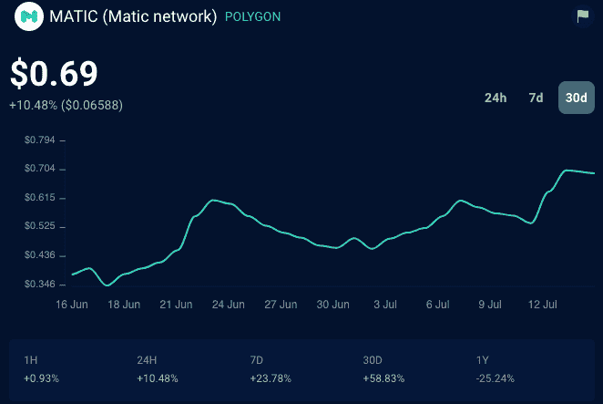

# 什么是多边形:简单的解释

> 原文：<https://web.archive.org/web/https://dappradar.com/blog/what-is-polygon-a-simple-explanation>

## 了解 Polygon 是什么，以及为什么它能够以更低的汽油费提供以太坊的最佳服务。

Polygon 是一个为以太坊扩展和基础设施开发而设计的平台。这是一个第 2 层扩展解决方案，允许更便宜的燃气费和更快的交易速度。本文将解释什么是 Polygon，以及它为什么不是新的以太坊，而是一个为连接兼容以太坊的区块链网络而构建的协议。我们开始吧！

**目录**

*   *[什么是多边形？](https://web.archive.org/web/20221208051052/https://dappradar.com/blog/what-is-polygon-a-simple-explanation/#What-is-Polygon?)*
    *   *[多边形 vs 以太坊](https://web.archive.org/web/20221208051052/https://dappradar.com/blog/what-is-polygon-a-simple-explanation/#Polygon-vs-Ethereum)*
*   *[Polygon 最大的项目有哪些？](https://web.archive.org/web/20221208051052/https://dappradar.com/blog/what-is-polygon-a-simple-explanation/#What-are-Polygon's-biggest-projects?)*
*   *[多边形是如何工作的？](https://web.archive.org/web/20221208051052/https://dappradar.com/blog/what-is-polygon-a-simple-explanation/#How-does-Polygon-work?)*
*   *[多边形有什么好处？](https://web.archive.org/web/20221208051052/https://dappradar.com/blog/what-is-polygon-a-simple-explanation/#What-are-the-benefits-of-Polygon?)*
*   *[多边形背后的技术是如何工作的？](https://web.archive.org/web/20221208051052/https://dappradar.com/blog/what-is-polygon-a-simple-explanation/#How-does-the-technology-behind-Polygon-work?)*
*   *[什么是 MATIC？](https://web.archive.org/web/20221208051052/https://dappradar.com/blog/what-is-polygon-a-simple-explanation/#What-is-MATIC?)*
    *   *[MATIC 值多少钱？](https://web.archive.org/web/20221208051052/https://dappradar.com/blog/what-is-polygon-a-simple-explanation/#How-much-is-MATIC-worth?)*
*   *[准备好用 DappRadar 追踪多边形了？](https://web.archive.org/web/20221208051052/https://dappradar.com/blog/what-is-polygon-a-simple-explanation/#Ready-to-track-Polygon-with-DappRadar?)*
*   *[进一步多边形资源](https://web.archive.org/web/20221208051052/https://dappradar.com/blog/what-is-polygon-a-simple-explanation/#Further-Polygon-Resources)*
    *   *[有用链接](https://web.archive.org/web/20221208051052/https://dappradar.com/blog/what-is-polygon-a-simple-explanation/#Useful-Links)*

## 什么是多边形？

[Polygon](https://web.archive.org/web/20221208051052/https://dappradar.com/rankings/protocol/polygon) 是一个流行的第二层协议，解决当前以太坊生态系统固有的问题。它提供了更高的吞吐量，并处理高气费。

本质上，Polygon 试图将以太坊和其他区块链的精华结合到一个解决方案中，同时增加更好的用户体验。

[https://web.archive.org/web/20221208051052if_/https://www.youtube.com/embed/PKw0RTT1Hp4?feature=oembed](https://web.archive.org/web/20221208051052if_/https://www.youtube.com/embed/PKw0RTT1Hp4?feature=oembed)

*   **查看我们的[指南，了解如何在以太坊、BSC 和多边形](/web/20221208051052/https://dappradar.com/blog/guide-on-how-to-move-assets-between-ethereum-bsc-and-polygon/)之间转移资产。**

### 多边形 vs 以太坊

Polygon 的一个主要目标是减少汽油费用和提高交易速度。Polygon side-chains 上的所有交易费用都以 MATIC 代币支付(交易自动收报机目前仍为 MATIC ),远低于以太坊。该协议已经在内部测试网上的单个侧链上实现了高达每秒 10，000 个事务(TPS ),这明显快于以太坊所能实现的 14 TPS。

## Polygon 最大的项目是什么？

Polygon 上推出的第一个也是最成功的项目之一是 [Aavegotchi](https://web.archive.org/web/20221208051052/https://dappradar.com/polygon/games/aavegotchi) ，这是一款 DeFi-engined 数字收藏品游戏，旨在成为现有最具创新性的 DeFi 和 NFT 应用程序。此外，Aavegotchi 在以太坊是不可行的，因为高昂的汽油费使游戏无法进行。

以太坊是区块链开发平台的选择，但是它有一些限制，比如吞吐量低，用户在汽油费方面的体验差，以及延迟终结。

因此，许多项目正在探索兼容以太坊的区块链，以此来减轻这些限制，同时仍然利用以太坊蓬勃发展的生态系统。然而，没有专门的框架来构建这样的区块链，也没有协议来连接它们。

[<picture></picture>](https://web.archive.org/web/20221208051052/https://matic.network/about)

Source: [https://matic.network/about](https://web.archive.org/web/20221208051052/https://matic.network/about)

## 多边形是如何工作的？

当你考虑到 Polygon 的核心目标是减少汽油费用和提高交易速度时，它的潜在用例有很多。将 MATIC token payments 集成到分散式应用程序中很简单，对于寻求为客户提供快速廉价交易的分散式交易所(DEX)的开发人员来说，这显然是一个有用的工具。

Uniswap 是首屈一指的 dex 之一，但在速度和高额油费方面仍然存在问题，有些交易的成本高达 200 美元。当你移动大量的代币时，这不是问题，但当你只是想为虚拟世界中的虚拟角色购买一套新衣服或使用 Aavegotchi dapp 时，这是一颗难以下咽的苦药丸。

随着 [QuickSwap](https://web.archive.org/web/20221208051052/https://dappradar.com/polygon/exchanges/quickswap) 的推出，这一理论在 2021 年得到了检验。在撰写本文时，就用户和交易量而言，dapp 已经迅速成为 Polygon 上最受欢迎的交易所。

[<picture></picture>](https://web.archive.org/web/20221208051052/https://dappradar.com/rankings)

Source: [DappRadar](https://web.archive.org/web/20221208051052/https://dappradar.com/rankings)

## 多边形有什么好处？

Polygon 相信它有解决这些问题的方案，作为一个协议和一个框架来建立和连接以太坊兼容的区块链网络。它可以为开发人员提供一系列好处，例如:

*   一键部署预设的区块链网络
*   用于开发定制网络的模块越来越多
*   用于与以太坊和其他区块链交换消息的互操作性协议
*   模块化和可选的“安全即服务”
*   实现现有区块链网络互操作性的适配器模块

总的来说，Polygon 可以将以太坊和主权区块链的精华提供给开发人员，并为开发人员构建一套有吸引力的功能。

[<picture></picture>](https://web.archive.org/web/20221208051052/https://dappradar.com/rankings)

## 多边形背后的技术是如何工作的？

Polygon 可以使用侧链提供可扩展的、安全的和即时的交易，该侧链基于 Plasma 安全框架的适应性实现和分散的利害关系证明(PoS)验证器网络。

本质上，Polygon 允许任何人创建可扩展的 dapps，同时以安全和分散的方式确保更好的用户体验。

Polygon 解决方案意味着任何项目都可以有一个专用的、优化的以太坊迭代，它结合了独立区块链的最佳特性，如主权、可伸缩性和灵活性，以及以太坊的安全性、互操作性、开发人员体验和支持。

此外，Polygon 支持两种兼容以太坊的区块链。首先是独立的，其次是利用安全即服务的网络。

关于 Polygon 的完整架构和技术分解，请下载[光纸](https://web.archive.org/web/20221208051052/https://polygon.technology/lightpaper-polygon.pdf)。

## 什么是 MATIC？

[自动令牌](https://web.archive.org/web/20221208051052/https://dappradar.com/hub/token/polygon/MATIC)是多边形网络的本地数字货币。MATIC 为 polygon 网络上的 dapps 供电，并为这一第 2 层协议上的交易提供资金，该协议提供与以太坊 dapps 相同的服务，而成本只是其一小部分。

[点击此处了解更多关于 MATIC 令牌背后的基础知识](https://web.archive.org/web/20221208051052/https://dappradar.com/blog/matic-was-trending-are-the-fundamentals-still-strong)

### MATIC 值多少钱？

MATIC 目前价值 0.69 美元，在过去 30 天里大幅提升了其价值和表现。Polygon 与 Meta 等 web2 品牌和 HTC 等电话公司建立了牢固的合作关系。此外，Polygon 是唯一被选中参与 2022 年迪士尼加速器计划的区块链。

使用 [DappRadar 的令牌资源管理器](https://web.archive.org/web/20221208051052/https://dappradar.com/hub/tokens/polygon/all/1)，我们可以观察 Polygon 的正面性能。MATIC 的交易价格为 69 美分，比过去一天上涨了 20%，达到一个月来的最高水平。

[<picture></picture>](https://web.archive.org/web/20221208051052/https://dappradar.com/hub/token/polygon/MATIC)

Source: [DappRadar](https://web.archive.org/web/20221208051052/http://www.dappradar.com/)

## 准备好用 DappRadar 追踪多边形了吗？

多边形网络继续成功吸引用户。在过去三个月与区块链连接的独特活动钱包方面，它超过了以太坊。

为了满足用户对多边形能力的需求，DappRadar 推出了[多边形令牌交换](https://web.archive.org/web/20221208051052/https://dappradar.com/hub/swap/polygon)服务。此外，多边形网络现在也已经集成到 [DappRadar 投资组合跟踪器](https://web.archive.org/web/20221208051052/https://dappradar.com/hub/wallet/polygon/)工具中。

**了解如何使用 DappRadar 设置多边形钱包**

[https://web.archive.org/web/20221208051052if_/https://www.youtube.com/embed/LXzkVkPbvUs?feature=oembed](https://web.archive.org/web/20221208051052if_/https://www.youtube.com/embed/LXzkVkPbvUs?feature=oembed)

**现在使用 DappRadar 在多边形、以太坊和 BSC 上交换代币**

[https://web.archive.org/web/20221208051052if_/https://www.youtube.com/embed/ZHiHfYvNjJU?feature=oembed](https://web.archive.org/web/20221208051052if_/https://www.youtube.com/embed/ZHiHfYvNjJU?feature=oembed)

## 更多多边形资源

*   [官网](https://web.archive.org/web/20221208051052/https://polygon.technology/)
*   [白皮书](https://web.archive.org/web/20221208051052/https://github.com/maticnetwork/whitepaper)
*   [推特](https://web.archive.org/web/20221208051052/https://twitter.com/maticnetwork)
*   [不和](https://web.archive.org/web/20221208051052/https://discord.com/invite/XvpHAxZ)
*   [电报](https://web.archive.org/web/20221208051052/https://t.me/maticnetwork)

### 有用的链接

*   [10 日区块链与对手以太坊](/web/20221208051052/https://dappradar.com/blog/10-blockchains-that-could-replace-ethereum/)
*   [开发者仪表板](https://web.archive.org/web/20221208051052/https://dappradar.com/developers)
*   [DappRadar 投资组合跟踪系统](https://web.archive.org/web/20221208051052/https://dappradar.com/hub/wallet/)

 NewsletterUnsubscribe at any time. [T&Cs](https://web.archive.org/web/20221208051052/https://dappradar.com/terms) and [Privacy Policy](https://web.archive.org/web/20221208051052/https://dappradar.com/privacy-policy)