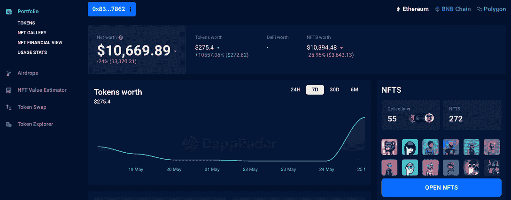

# 什么是多边形黄昏？

> 原文：<https://web.archive.org/web/https://dappradar.com/blog/what-is-polygon-nightfall>

## 一个乐观的总结，旨在降低私人转让令牌的成本

**第 2 层扩展解决方案 Polygon 推出了 Nightfall，以降低私人转让 ERC20、ERC721 和 ERC1155 令牌的交易成本。对原始夜幕网络的这一更新使用乐观的卷起技术来降低成本，并通过利用零知识证明来实现隐私。**

由于需要通过利用智能合同来管理商品或服务交换的公司的需求不断增长，Polygon 推出了一个名为[Polygon night](https://web.archive.org/web/20220830213852/https://docs.polygon-nightfall.technology/Nightfall/introduction/introduction/)的公共、专注于隐私的第 2 层汇总解决方案。

与安永会计师事务所(Ernst)、扬会计师事务所(EY)合作，该项目将为希望使用以太坊的公司提供可访问性和隐私保护。Polygon 团队于 5 月 17 日发布了夜幕测试版 Mainnet，将与 EY 合作进行测试。

EY 与 Polygon 合作，为企业研究和建造许可的私营工业区块链。EY 已经在 EY OpsChain 和它的区块链分析器中有两个与区块链相关的旗舰服务。

两者现在都连接到多边形夜幕，当前用户可以通过连接到[多边形网络](https://web.archive.org/web/20220830213852/https://dappradar.com/rankings/protocol/polygon)来访问它们。

[https://web.archive.org/web/20220830213852if_/https://www.youtube.com/embed/yLnUc-933Xk?feature=oembed](https://web.archive.org/web/20220830213852if_/https://www.youtube.com/embed/yLnUc-933Xk?feature=oembed)

Source: [PolygonTV](https://web.archive.org/web/20220830213852/https://www.youtube.com/c/PolygonTV)

## 慢点说，什么是易拉宝？

汇总允许以太坊智能合约内的交易的链外聚合，这通过将区块链的吞吐量从当前的每秒 15 次交易(tps)增加到超过 1，000 tps 来减少费用和拥塞。

[汇总的两种方法](https://web.archive.org/web/20220830213852/https://dappradar.com/blog/ethereum-rollups-a-simple-explanation)是乐观汇总和 ZK 汇总，它们在确保有效性的方式上有所不同。对于乐观汇总，通过防欺诈和同步假设来确保有效性，而对于 ZK 汇总，通过零知识证明来确保有效性，这是 nighth 将使用的系统。

ZK-Roll-ups 是一种第 2 层扩展解决方案，其中所有资金都由以太坊主链上的智能合约持有。同时，它在链外执行处理和存储，通过零知识证明确保侧链的有效性。

零知识证明是一种方法，通过该方法，一方(证明者)可以向另一方(验证者)证明他们知道值 X，除了他们知道值 X 的事实之外，不传递任何信息

想想你的借记卡或信用卡在转移资金时的运作方式。如今，你可以在几分钟内通过几个应用程序把钱取出来。例如，从您的菲亚特银行账户到 Revolut 或 Monzo 等充值卡，再到比特币基地等交易所。

这些事务看似在几秒钟内发生，但后台发生的过程需要更长时间。但作为一个用户，你只需要安心的钱是可用的和安全的。

## 密码和非功能性文件的私人传输

夜幕降临后，区块链行业可以转移三种基本的加密货币和 NFT 代币。ERC20 是以太坊区块链上创建和发布智能合约最常用的标准。

ERC721 是表示不可替换令牌所有权的标准，其中每个令牌都是唯一的，ERC1155 也是如此。

一个合理的新令牌标准旨在从以前的标准中吸取精华，以创建一个不可知可替换性和节能的令牌契约。

Polygon Nightfall 是 Polygon 可扩展性解决方案套件的一部分，包括 [Polygon Hermez](https://web.archive.org/web/20220830213852/https://polygon.technology/solutions/polygon-hermez/) 、 [Polygon Miden](https://web.archive.org/web/20220830213852/https://polygon.technology/solutions/polygon-miden/) 和 [Polygon Zero](https://web.archive.org/web/20220830213852/https://polygon.technology/solutions/polygon-zero/) 。Nightfall 与众不同，它是为企业用例设计的注重隐私的易拉宝。

它结合了乐观汇总和零知识(ZK)加密的概念，以提供私有和可伸缩的事务。

## 夜幕降临时没有任何价值或目的地

夜幕降临带来了更高的可扩展性，并消除了组织在使用区块链进行日常活动时面临的一个障碍，即公共区块链上的交易缺乏隐私。

夜幕降临增加了一层保密性，使关键的交易参数，如价值和目的地无法追溯。

这两个特性意味着企业将 Nightfall 视为一种以可持续的价格在分散网络中执行其业务逻辑并与供应链协调的方式，同时保持第一层以太坊网络的固有安全性和隐私性。

[夜幕降临](https://web.archive.org/web/20220830213852/https://blog.polygon.technology/introducing-polygon-nightfall-mainnet-decentralized-private-transactions-for-enterprise/?utm_source=Twitter-Main+&utm_medium=Tweet+&utm_campaign=Tier-1-Announcement+)是 Polygon 首个面向企业的区块链解决方案，使他们能够轻松完成复杂的日常工作。它使用混合 ZK-乐观汇总为企业提供以下功能:

*   安全性:以太坊作为结算层的安全性
*   效率:快速交易和低费用
*   隐私:没有第三方访问交易和数据

## 为什么多边形和黄昏很重要

在过去的两年里， [Polygon 在 B2C 业务方面树立了新的水平](/web/20220830213852/https://dappradar.com/blog/gaming-on-polygon-sees-strong-april-as-battle-for-market-share-intensifies/)，成为区块链的领先企业，拥有发达的、使用良好的 dapps 生态系统[。](https://web.archive.org/web/20220830213852/https://dappradar.com/rankings/protocol/polygon)

通过 DappRadar，用户可以跟踪所有主要类别的数千个多边形 dapp，也可以通过我们专用的 NFT 浏览器跟踪[多边形 NFT](https://web.archive.org/web/20220830213852/https://dappradar.com/nft/protocol/polygon)。

DappRadar Portfolio Manager 跟踪你的多边形资产，这样用户就可以跟踪他们所有的多边形活动，买卖 NFT，等等。

快速交易、低费用和支持 dapps 提供与以太坊同行相同的服务[帮助 Polygon 保持相关性](/web/20220830213852/https://dappradar.com/blog/gaming-on-polygon-sees-strong-april-as-battle-for-market-share-intensifies/)并作为 go-to-Layer-2 解决方案建立强大的存在。

然而，Polygon 认为公共区块链不适合商业用途，因为所有交易对外部各方都是可见的。从根本上说，企业不希望他们的交易数据向公众展示。这和隐藏见不得人的生意无关。简单地说，这是关于组织之间的直接竞争，披露关键的财务策略可能会导致问题。

在同一个地方查看您在不同区块链的代币、NFT 和 DeFi 头寸。连接您的 Web3 钱包并[查看您的投资组合](https://web.archive.org/web/20220830213852/https://dappradar.com/hub/wallet)！

[<picture></picture>](https://web.archive.org/web/20220830213852/https://dappradar.com/hub/wallet)

## 智能合同改善了供应链行业

全球供应链行业价值约 50 万亿美元，区块链技术，更重要的是，不可变的总账和智能合同可以大幅简化事情。来自 EY 的 OpsChain 已经在帮助公司跟踪和管理他们的供应链。

夜幕降临将允许他们创建代表真实资产的 NFT，可在链上追踪，并可在库存中验证。此外，对于组织来说，使用 Nightfall 将比传统解决方案更快、更便宜。

这一事实在未来几年严峻的经济条件下将变得越来越重要。同时，敏感数据的隐私得到保护。

除此之外，在金融、医疗和教育等行业中也有使用案例。Polygon 之所以重要，是因为它已经证明了自己是车载用户智能合同应用程序的坚实区块链，而像夜幕降临这样的解决方案之所以重要，是因为它可以让企业转变工作方式。

 NewsletterUnsubscribe at any time. [T&Cs](https://web.archive.org/web/20220830213852/https://dappradar.com/terms) and [Privacy Policy](https://web.archive.org/web/20220830213852/https://dappradar.com/privacy-policy)

***以上不构成投资建议。此处给出的信息仅供参考。请行使尽职调查，做你的研究。作者持有多种加密货币的头寸，包括 BTC、瑞士法郎和雷达。***