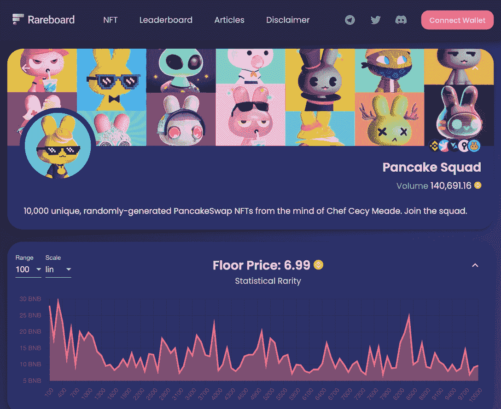

# 什么是稀有纸板&为什么你的 NFT 狩猎需要它

> 原文：<https://web.archive.org/web/https://dappradar.com/blog/what-is-rareboard-why-your-nft-hunt-needs-it>

## BNB 智能连锁 NFT 市场聚合器上个月的交易量增长了 269%。

寻找有价值的非功能性食物的激动人心的过程可能相当耗时。然而，有了 Rareboard，你可以轻松地从 10 个不同的 NFT 市场的 70 多个系列中进行铸造。请继续阅读，了解有关这个 NFT 市场聚合器和稀有度仪表盘的一切，帮助您首先找到最佳交易。

任何想投资 NFTs 的人都应该知道如何计算潜在的收藏价值。但是，如果分析上市的稀有性往往既困难又必要的话，该怎么做呢？

正是在对这一信息的巨大需求中，2021 年最后一个季度创建了 Rareboard。煎饼小队 NFT 系列的推出是如今罕见板的起点。

## 什么是稀有动物？

Rareboard 是币安智能连锁店的 NFT 市场聚合器。这意味着它是一个地方，你可以出价，铸造，并购买来自不同市场的各种集合的 NFT。

它还允许你获得稀有度仪表盘上列出的藏品的第二稀有度和价格数据。

正如你在下面的视频中所看到的，在 Rareboard 上分析、过滤和比较 NFT 收藏和市场列表变得很容易。

> 🚀如何在 [@Rareboard](https://web.archive.org/web/20220813153309/https://twitter.com/rareboard?ref_src=twsrc%5Etfw) 上造币通过 [@CryptoxNvl](https://web.archive.org/web/20220813153309/https://twitter.com/CryptoxNvl?ref_src=twsrc%5Etfw)
> 
> ⭐️连接你的钱包
> ⭐️选择收藏
> ⭐️选择金额进行造币
> 
> ⭐️确认交易
> ⭐️查看你的 [#NFT](https://web.archive.org/web/20220813153309/https://twitter.com/hashtag/NFT?src=hash&ref_src=twsrc%5Etfw) 点击我的 NFT
> 
> 如果一开始没有看到你的 NFT，造币后刷新页面以便平台更新[pic.twitter.com/5mjjaPHkyL](https://web.archive.org/web/20220813153309/https://t.co/5mjjaPHkyL)
> 
> — Rareboard (@rareboard) [July 8, 2022](https://web.archive.org/web/20220813153309/https://twitter.com/rareboard/status/1545330480551272448?ref_src=twsrc%5Etfw)

7 月 8 日，Rareboard 在其官方 Twitter 账户上宣布，它已经达到了两个重要的里程碑。仅在 24 小时内，他们的铸币总量就突破了 100 万美元大关，总贸易额突破了 1100 万美元。

正如该项目所述，BNB NFT 空间的大型投资者通过 Rareboard 进行购买，这似乎给了新收藏家一些信心。

你可以通过 Dapp Radar 的 NFT 市场排名来了解 Rareboard 的成长之路。

我们还将关注市场聚合器给 NFT 空间带来的新的合作伙伴关系和好处。如果你想在激动人心的 web3 世界中了解更多最好的项目，请关注我们的[博客](https://web.archive.org/web/20220813153309/https://dappradar.com/blog/)、 [YouTube](https://web.archive.org/web/20220813153309/https://www.youtube.com/c/DappRadar) 频道和 [Twitter](https://web.archive.org/web/20220813153309/https://twitter.com/dappradar) 。