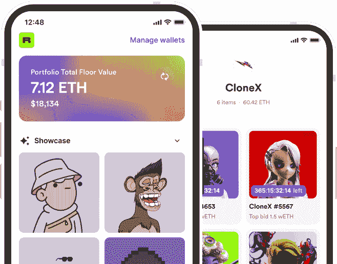
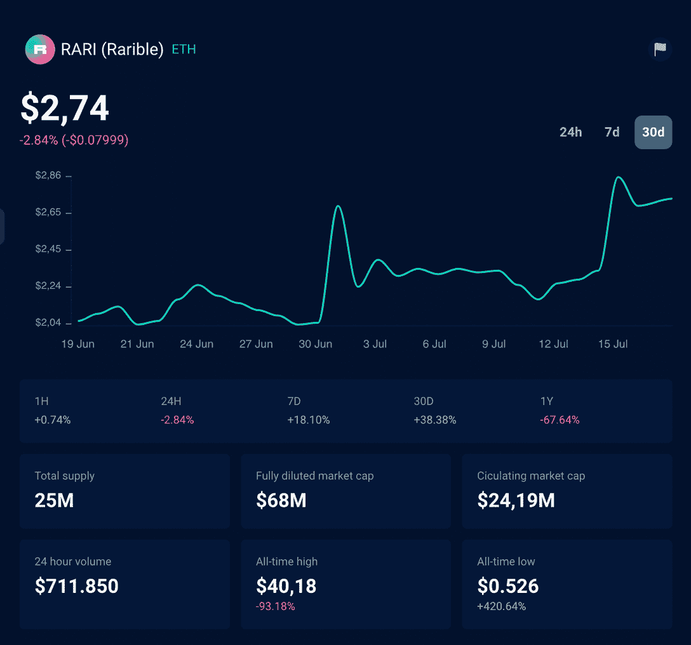

# 什么是稀有的以及如何使用它

> 原文：<https://web.archive.org/web/https://dappradar.com/blog/what-is-rarible-and-how-to-use-it>

## 一家领先的 nft 市场解释道

秘密艺术的增长是过去几年最有趣的趋势之一。在众多 NFT 市场中， **Rarible** 脱颖而出。但是什么是稀有的，你又如何用它来交易和跟踪你的数字资产呢？Rarible 值得用吗？请继续阅读，了解这个领先的 NFT 市场。

## 什么是稀有的？

Rarible 是一个多链平台，你可以在这里购买、出售和创建不可替代的代币(NFT)。它是 NFT 的主要市场之一，基于 Rarible 协议，一个开源的多链社区管理的 NFT 协议。

由于 2021 年是 NFTs 的突破年，Rarible 增长了很多，根据其官方媒体[的说法](https://web.archive.org/web/20221004142152/https://rarible.medium.com/)，每月活跃用户超过 200 万。到 2022 年 7 月，市场整合了以太坊、多边形、Flow、Tezos 和 Solana。

## 如何在 Rarible 上购买 NFTs？

为了开始在 Rarible 上收集 NFTs，首先，你需要将你的[数字钱包](https://web.archive.org/web/20221004142152/https://dappradar.com/blog/best-cryptocurrency-wallets-for-2022)连接到它。

一旦你找到了选择的 NFT 项目，并确认它属于原来的收藏，是时候购买了。完成购买后，您的新 NFT 将安全完好地放在您的钱包里。

与 DappRadar 类似，Rarible 也有一个应用程序，你可以在 iOS 和 Android 上跟踪你的 NFT 投资组合。

## 如何在 Rarible 上创建自己的 NFT？

1.  去 Rarible.com 连接钱包(即 meta mask)；
2.  单击页面顶部的蓝色创建按钮；
3.  选择您是要铸造单个 NFT 还是多个版本的 NFT；
4.  上传您的图像、视频或音乐文件。
5.  指定价格、名称、描述、版税和其他信息。
6.  单击创建项目；
7.  你的钱包会要求你签名并支付油费。汽油费可能很高，选择合适的时机铸造 NFT 是值得的；
8.  为了避免以太坊的交易费用，Rarible 在 2021 年 10 月推出了“懒人造币厂”，买家支付造币气费。

### 为什么在 Rarible 上制造 NFT？

人们更喜欢 Rarible 的一个主要原因是，它允许任何人只需支付汽油费就可以铸造一件 NFT 艺术品。

虽然像 SuperRare 和 Makers 这样的平台在他们的平台上策划艺术家，但任何人都可以在 Rarible 上创作 NFT。

这为年轻的天才和未来的艺术家打开了闸门，但不幸的是，也为骗子。这就是为什么 Rarible 创建了一个**验证流程**来最小化处理虚假项目的风险。

## 如何在网上出售 NFT？

将 NFT 放在稀有市场上出售也是一个简单的过程。一旦你的不可替代代币被正式注册，你可以以固定的价格出售它，让它公开竞价，或者组织一次定时拍卖。

[Linsey Lohan 在 Rarible](https://web.archive.org/web/20221004142152/https://app.rarible.com/lindsaylohan) 上发布了自己的个人资料，以略高于 50，000 美元的价格出售了自己的作品“[比特币闪电”。额外转售的部分将归这位女演员所有，她还宣布将捐赠给“接受比特币的慈善机构”。她追随了其他在该平台上创造了第一张 NFT 的名人，包括美国亿万富翁马克·库班和说唱歌手酱爆弟弟。](https://web.archive.org/web/20221004142152/https://decrypt.co/57366/lindsay-lohan-bitcoin-lightning-nft-sells-50000)

## 什么是 RARI 代币？

在不仅仅是一个 NFT 市场的背景下，Rarible 在 2021 年推出了自己的 ERC-20 治理令牌， [RARI](https://web.archive.org/web/20221004142152/https://dappradar.com/hub/token/eth/RAR) 。从 2020 年到 2021 年，任何在 Rarible 上出售或购买艺术品的人还将获得一些 RARI 代币，这是 DeFi 热潮中的一项关键技术。

好消息是，它鼓励人们使用 Rarible 并开始收集加密艺术，导致 Rarible 成为 DappRadar 排名中的顶级市场。

RARI 在 2021 年 3 月达到了他的历史高点 40 美元左右，他的实时价值可以使用 [DappRadar 令牌浏览器](https://web.archive.org/web/20221004142152/https://dappradar.com/hub/token/eth/RARI)来检查。

RARI token price at July 18, 2022

阅读我们的文章[如何申领 RARI 代币](https://web.archive.org/web/20221004142152/https://dappradar.com/blog/how-to-claim-rari-tokens)了解更多关于这种加密货币的信息。

## 什么是 NFT？

NFT 是区块链上的一种令牌，可以证明所有权并确认数字资产的稀有性或稀缺性。NFT 是不可替代令牌的缩写，这意味着这些数字资产中的每一项都有其独特的方式。

NFT 数字艺术让人们能够真正拥有独一无二的物品，这是一种有形价值储存的额外奖励。无论是在虚拟环境中展示的数字艺术作品，如 Cryptovoxels 还是 CryptoPunk，前提都是相同的。真正由所有者控制，能够出售、交易和利用资产。

这些非机动车牌照都有自己的登记号码，类似于房屋地址或汽车登记号码。[想了解更多关于 NFTs 的信息吗？读读这个。](https://web.archive.org/web/20221004142152/https://dappradar.com/blog/what-are-non-fungible-tokens-nfts)

## 什么是稀有的？结束语

正如你现在所知道的，由于许多原因，Rarible 是 NFT 的领先市场。在那里，您可以购买、销售和铸造各种协议的不可替代令牌，同时支持您的社区。这也是一个经历了巨大增长并且仍然保持强劲的项目。

DappRadar 将继续沿着 Rarible 的道路领导 NFT 社区。如果你想进一步了解令人兴奋的去中心化应用世界中的最佳项目，那么关注 DappRadar [博客](https://web.archive.org/web/20221004142152/https://dappradar.com/blog/)、 [YouTube](https://web.archive.org/web/20221004142152/https://www.youtube.com/c/DappRadar) 频道和 [Twitter](https://web.archive.org/web/20221004142152/https://twitter.com/dappradar) 。

## 有用的链接

*   [更多稀有数据](https://web.archive.org/web/20221004142152/https://dappradar.com/ethereum/marketplaces/rarible)
*   [NFT 七大市场](/web/20221004142152/https://dappradar.com/blog/top-7-nft-marketplaces-beginners-guide/)
*   [NFT Dapp 排名](https://web.archive.org/web/20221004142152/https://dappradar.com/nft-marketplaces)

 NewsletterUnsubscribe at any time. [T&Cs](https://web.archive.org/web/20221004142152/https://dappradar.com/terms) and [Privacy Policy](https://web.archive.org/web/20221004142152/https://dappradar.com/privacy-policy)