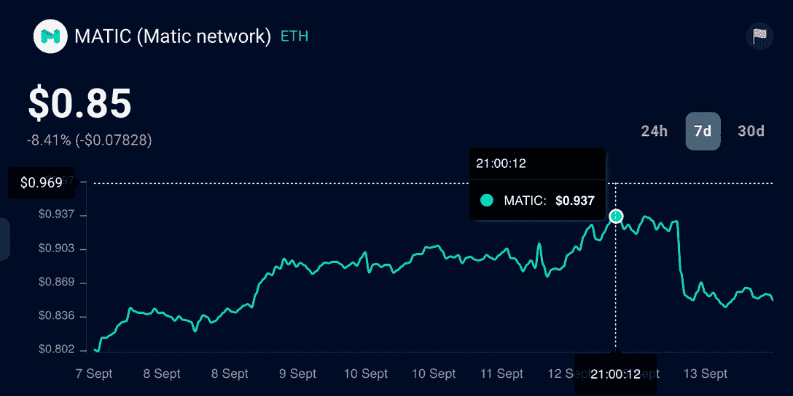
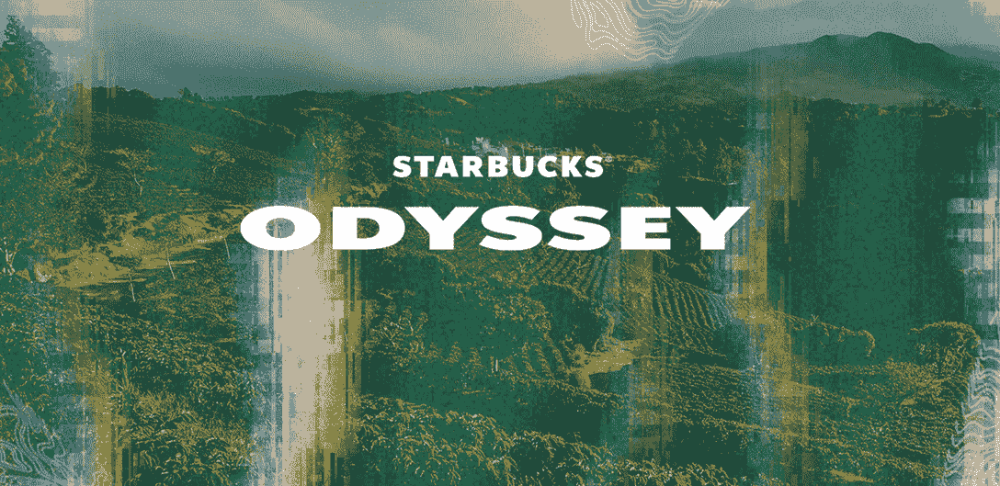
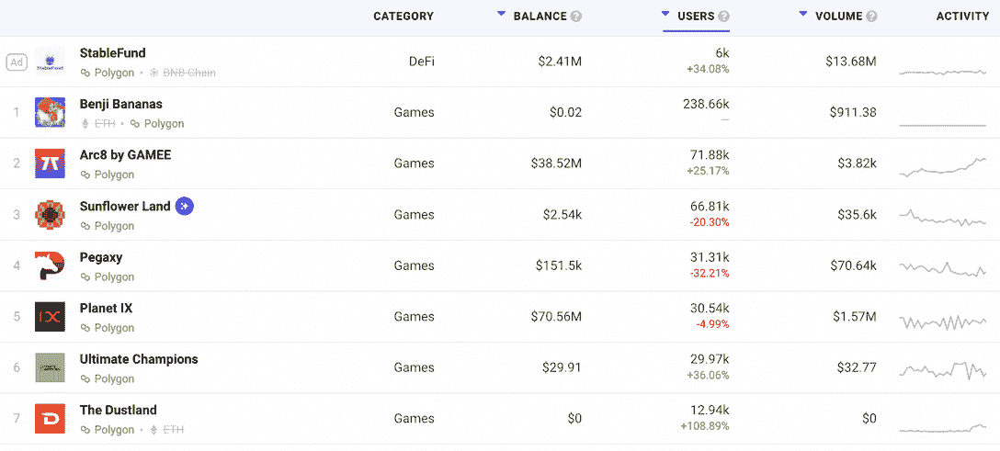

# 星巴克基于多边形的忠诚度计划是什么？

> 原文：<https://web.archive.org/web/https://dappradar.com/blog/what-is-starbucks-polygon-based-loyalty-program>

## 星巴克将推出由 NFTs 支持的忠诚度平台 Starbucks Odyssey。

本周，星巴克推出了星巴克奥德赛。这是一种由 Polygon 提供动力的新体验，并为其美国客户提供赚取和购买数字收藏资产的独家机会。此外，它允许客户获得更多的好处和前所未有的沉浸式咖啡体验。

**概要:**

*   星巴克的 Odyssey,[Polygon-powered](https://web.archive.org/web/20221115022344/https://dappradar.com/rankings/protocol/polygon)忠诚度计划于 9 月 12 日开放供候补注册。
*   会员可以通过完成“旅程”来收集[NFT](https://web.archive.org/web/20221115022344/https://dappradar.com/hub/nft-explorer)。
*   这些基于多边形的 NFT 将为持有者生成数字点数，他们可以用这些点数来兑换独家特权。
*   用户可以使用诸如 [DappRadar Ranking](https://web.archive.org/web/20221115022344/https://dappradar.com/rankings/protocol/polygon) 、 [NFT 探索者](https://web.archive.org/web/20221115022344/https://dappradar.com/nft/protocol/polygon)、 [Portfolio Tracke](https://web.archive.org/web/20221115022344/https://dappradar.com/hub/wallet) r 等工具深入了解充满活力的多边形生态系统。

星巴克本周正式宣布推出星巴克奥德赛，这是一个由 NFT 和其他 Web3 技术支持的会员计划。该计划将于今年晚些时候上线，客人可以从 9 月 12 日开始申请加入等候名单。

大品牌进军 Web3 并不是什么新鲜事，你可以点击这个链接发现一些最近加入 NFT 空间的知名品牌。

然而，人们可能已经厌倦了那些鼓吹在元宇宙开设虚拟商店的品牌。因此，当星巴克宣布其奥德赛将是其忠诚度计划的延伸，并利用 NFT 和多边形为消费者带来独一无二的用户体验时，它确实提高了预期。

星巴克的声明无疑给了 Polygon 的本地令牌 [MATIC](https://web.archive.org/web/20221115022344/https://dappradar.com/hub/token/eth/MATIC?from=0x7d1afa7b718fb893db30a3abc0cfc608aacfebb0) 一个明显的提振，价格攀升至 0.937 美元，是过去七天的最高价。如果你已经拥有基于多边形的加密资产， [DappRadar 投资组合跟踪器](https://web.archive.org/web/20221115022344/https://dappradar.com/hub/wallet)可以帮助你监控资产价值的最新变化。

## 什么是星巴克奥德赛，它提供什么好处？

Starbucks Odyssey 将是其 Starbucks Rewards 计划的延伸，因此会员可以使用他们的 Starbucks Rewards 登录凭证访问。一旦星巴克奥德赛上线，会员将能够开始一系列精心策划的旅程，如互动游戏、知识挑战等。完成旅程后，会员将获得数字收藏“旅程邮票”作为奖励。

[Source](https://web.archive.org/web/20221115022344/https://stories.starbucks.com/press/2022/starbucks-brewing-revolutionary-web3-experience-for-its-starbucks-rewards-members/)

这些数字邮票是多边形网络上的 NFT，将为持有者生成点数。值得注意的是，这些 NFT 在稀有程度上会有所不同，从而导致不同的分数。但是这些积分能解锁什么样的额外津贴呢？

[Source](https://web.archive.org/web/20221115022344/https://stories.starbucks.com/press/2022/new-starbucks-merchandise-to-inspire-all-the-fall-feels/)

无论你是一个咖啡迷还是一个偶尔喝咖啡的人，这些要点都可以在很多方面让你受益。例如，客户可以使用积分兑换虚拟浓缩马提尼制作课程、独特商品，甚至前往哥斯达黎加的星巴克 Hacienda Alsacia 咖啡农场。

此外，会员可以通过星巴克奥德赛网络应用程序中的内置市场购买限量版 NFT 邮票。值得一提的是，会员可以用信用卡购买这些 NFT，不需要加密钱包或加密货币。这将降低用户体验星巴克奥德赛体验的准入门槛。

## 为什么是多边形？

遵循其可持续发展的承诺，星巴克奥德赛采用多边形的股权证明网络。Polygon 作为一个强大的扩展解决方案被广泛采用，它完全支持以太坊虚拟机(EVM)。除了星巴克，迪士尼也选择了 Polygon 来建立它的加速器项目。

在 Polygon 上运行的 Dapps 可以享受理想的区块链体验，实现互操作性和可伸缩性。此外，开发者和用户可以避免以太坊上的拥塞所导致的高成本和交易延迟。

随着越来越多的项目加入 Polygon，它现在是区块链最具活力的生态系统之一。想要跟上 Polygon 最新发展的用户可以使用下面的 DappRadar 跟踪工具。

*   [什么是多边形？](https://web.archive.org/web/20221115022344/https://dappradar.com/blog/what-is-polygon-a-simple-explanation)
*   在[多边形排名中发现最受欢迎的 dapps。](https://web.archive.org/web/20221115022344/https://dappradar.com/rankings/protocol/polygon)
*   了解一下 [MATIC 的实时价格。](https://web.archive.org/web/20221115022344/https://dappradar.com/hub/token/eth/MATIC?from=0x7d1afa7b718fb893db30a3abc0cfc608aacfebb0)
*   跟上[多边形 DeFi 景观](https://web.archive.org/web/20221115022344/https://dappradar.com/defi/protocol/polygon)。
*   检查多边形上的趋势[NFT。](https://web.archive.org/web/20221115022344/https://dappradar.com/nft/protocol/polygon)

如果用户已经拥有基于多边形的加密资产，他们也可以通过[DappRadar Portfolio Tracker](https://web.archive.org/web/20221115022344/https://dappradar.com/hub/wallet)掌握资产价值的变化。此外，一旦 Starbucks Odyssey 上线，用户还将能够监控 DappRadar 组合中基于多边形的 NFT。

## 随身携带您的 Web3 之旅

使用 DappRadar 移动应用程序，再也不会错过 Web3。查看最受欢迎的 dapps 的性能，并关注您投资组合中的 NFT。您在 DappRadar 上的帐户会与我们的移动应用程序同步，这样您很快就可以选择实时接收提醒。

[Download the DappRadar app now](https://web.archive.org/web/20221115022344/https://dappradar.app.link/blog)[<picture></picture>](https://web.archive.org/web/20221115022344/https://play.google.com/store/apps/details?id=com.portfolio.dappradar) NewsletterUnsubscribe at any time. [T&Cs](https://web.archive.org/web/20221115022344/https://dappradar.com/terms) and [Privacy Policy](https://web.archive.org/web/20221115022344/https://dappradar.com/privacy-policy)