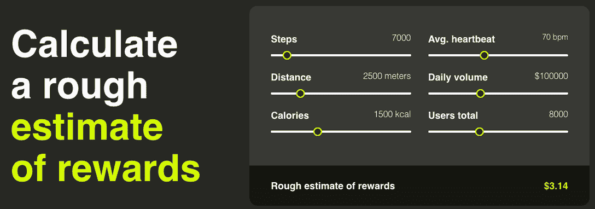
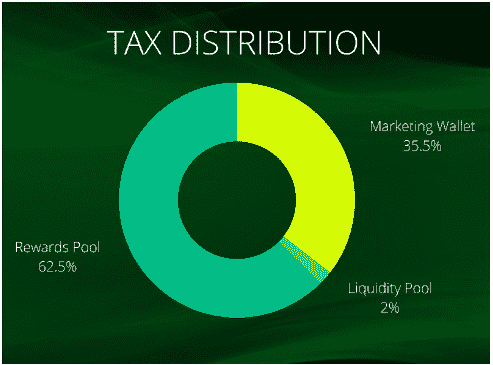
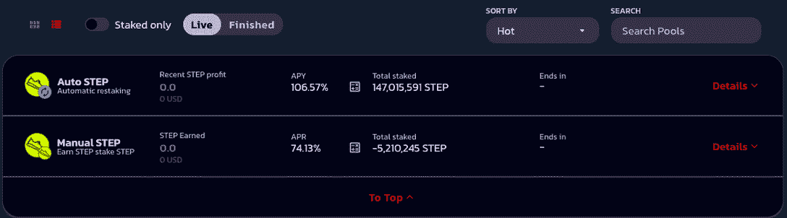

# 什么是 Step 及其 STEP Token？

> 原文：<https://web.archive.org/web/https://dappradar.com/blog/what-is-step-and-its-step-token>

## 获得密码的同时保持健康

[**Step**](https://web.archive.org/web/20221207222956/https://dappradar.com/multichain/social/step) **是一款健身应用，让你边走边赚加密货币，获得健康。用 STEP token 和 [BNB](https://web.archive.org/web/20221207222956/https://dappradar.com/hub/token/eth/BNB/ETH?from=0xb8c77482e45f1f44de1745f52c74426c631bdd52) 存款获得奖励，直接存入您的钱包。**

每天最多行走 30，000 步，有资格获得作为 BNB 存入您钱包的奖励。

[立即连接您的钱包，开始追踪您的资产。](https://web.archive.org/web/20221207222956/https://dappradar.com/hub/wallet/eth/0x0ed1e02164a2a9fad7a9f9b5b9e71694c3fad7f2)

[移动赚钱](https://web.archive.org/web/20221207222956/https://dappradar.com/blog/what-is-move-to-earn)是 Web 3.0 生态系统中一个快速发展的新兴领域。它激励用户参与体育活动(散步、跑步、跳舞、锻炼等)。)

基本上，你移动得越多，你赚得就越多。这种趋势类似于其他模式，如玩到赚。

像 Step 和 [Stepn](https://web.archive.org/web/20221207222956/https://dappradar.com/blog/how-to-get-crypto-on-move-to-earn-platform-stepn) 这样的移动赚钱应用程序让普通人在熟悉的环境中接触加密，并帮助推动采用。

## Step 是如何工作的？

由于移动赚钱应用程序奖励用户移动，他们的设计侧重于与其他健身应用程序协同工作。通过 GPS 和运动及健康传感器跟踪并记录用户的运动——用户可以通过自己的设备轻松访问和控制所有这些设备。

每个应用程序都有特定的机制，在[步骤](https://web.archive.org/web/20221207222956/https://dappradar.com/multichain/social/step)中，用户需要购买并在钱包中持有至少 18，000 个步骤代币或 1 个 NFT 才能开始。一旦完成，该应用程序开始跟踪用户的动作，并将其转换为游戏内的令牌。在写作的时候，18000 步代币[将花费 116 美元。](https://web.archive.org/web/20221207222956/https://www.coingecko.com/en/coins/step)

使用内置的计算器，用户可以计算出通过不同程度的锻炼他们一天可以挣多少钱。重要的是，这里我们看到，奖励不仅是根据单个用户的表现计算的，也是根据整个社区的表现计算的。在这种参与水平下，用户可以在大约 37 天内收回初始投资，每天赚取大约 3 美元。

STEP 令牌作为 BEP-20 部署在 BNB 链上。BNB 链是一个智能合同支持的高吞吐量区块链，每笔交易费用约为 0.15 美元。它提供快速和廉价的交易，同时具有安全和可扩展的网络，因此是 STEP 项目的一个好选择。这需要用户执行日常交易来收集奖励。

[将 BNB 链添加到 Metamask](https://web.archive.org/web/20221207222956/https://www.youtube.com/watch?v=acWrJt7GRGg) 中，然后使用 [DappRadar 投资组合跟踪器](https://web.archive.org/web/20221207222956/https://dappradar.com/hub/wallet)来跟踪您的 BNB 链资产。

[https://web.archive.org/web/20221207222956if_/https://www.youtube.com/embed/acWrJt7GRGg?feature=oembed](https://web.archive.org/web/20221207222956if_/https://www.youtube.com/embed/acWrJt7GRGg?feature=oembed)

## 分步记号组学

总共有 10 亿 Step 代币可供使用，重要的是，STEP 征收 5%的购买税和 15%的销售税。从下图中可以看出，所有税收的 2%进入了流动性池，而所有税收的 35.5%进入了营销，以继续项目的扩张计划。

## 我可以用代币做什么？

作为一个生态系统，Step 不仅仅是一个与健身相关的应用程序。值得注意的是，用户可以通过官方网站直接购买 [STEP 以及配套的 exchanges。除了步行、跑步或慢跑奖励，STEP 用户还可以在](https://web.archive.org/web/20221207222956/https://walkwithstep/)[赌注平台](https://web.archive.org/web/20221207222956/https://stake.walkwithstep.io/)上下注他们的 Step 代币，基本上是 Step DEX。

在写作时，赌注步骤自动复合池将奖励超过 106%的 APY，而手动池提供约 75%。在双边养殖池中提供流动性会有[奖励，在写的时候奖励在 11%到 225%之间。](https://web.archive.org/web/20221207222956/https://stake.walkwithstep.io/farms)

此外，Step 用户可以从[铸造](https://web.archive.org/web/20221207222956/https://mint.walkwithstep.io/) [dapp](https://web.archive.org/web/20221207222956/https://mint.walkwithstep.io/) 中铸造独特的 Step NFTs，然后在 [OpenSea 二级市场](https://web.archive.org/web/20221207222956/https://dappradar.com/ethereum/marketplaces/opensea)上转售它们，不收汽油费。那些想在现实世界中展示他们对 Step 的热爱的人可以从提供全球运输的[商店](https://web.archive.org/web/20221207222956/https://shop.walkwithstep.io/)买到 Step 商品。除了这个工具，用户可以简单地 HODL 步骤代币，并有可能获得更大的回报，随着公司的发展。

区块链空间不断发展，为服务提供商和消费者带来无限可能。 [Move-to-earn 是区块链发起的众多计划中的最新成员](https://web.archive.org/web/20221207222956/https://docs.google.com/document/d/1aDyau_9C1C1o2OzMsWRwZ0KqR-Qjft5q49cppS8QzoQ/edit#move-to-earn%20articles)，这些计划包括[“玩赚”(P2E)](https://web.archive.org/web/20221207222956/https://dappradar.com/blog/top-10-best-gamefi-projects-to-play-and-earn/) 和“学赚”(L2E)。

[访问他们的官方 Github 文档页面](https://web.archive.org/web/20221207222956/https://docs.walkwithstep.io/step-overview/what-is-step)获取 STEP 和 Step 令牌的完整概述和深入指南。

 NewsletterUnsubscribe at any time. [T&Cs](https://web.archive.org/web/20221207222956/https://dappradar.com/terms) and [Privacy Policy](https://web.archive.org/web/20221207222956/https://dappradar.com/privacy-policy)

***以上不构成投资建议。此处给出的信息仅供参考。请行使尽职调查，做你的研究。作者持有多种加密货币的头寸，包括 BTC、瑞士法郎和雷达。***