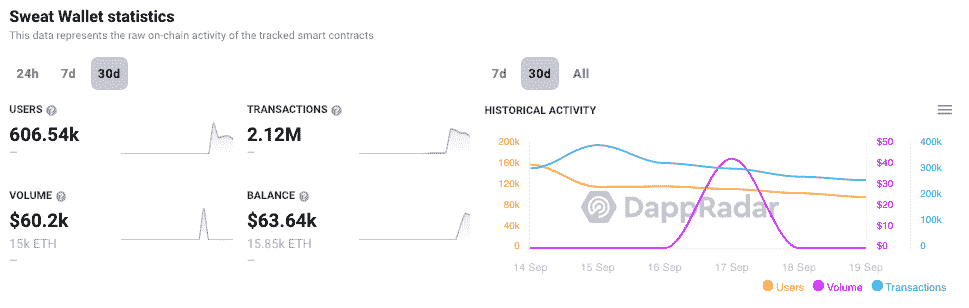
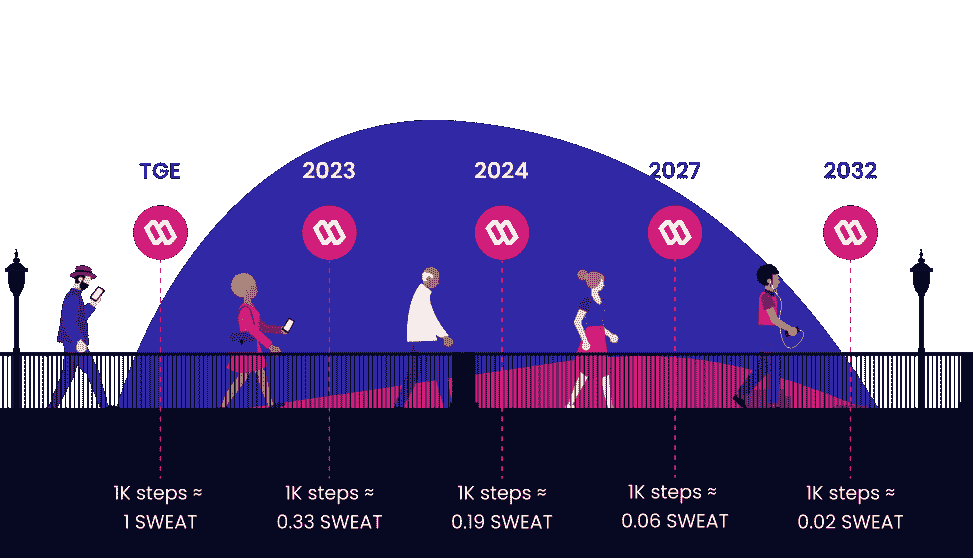
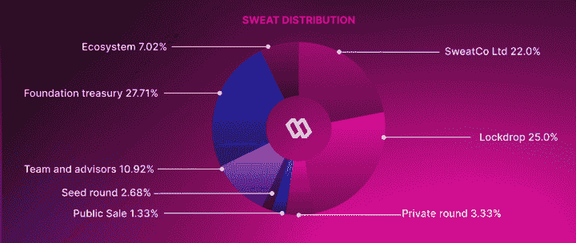
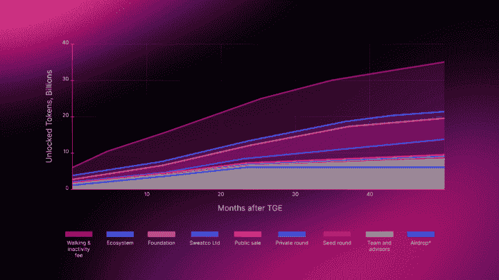
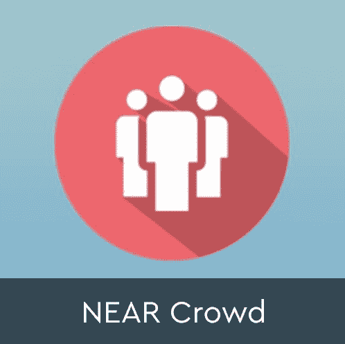
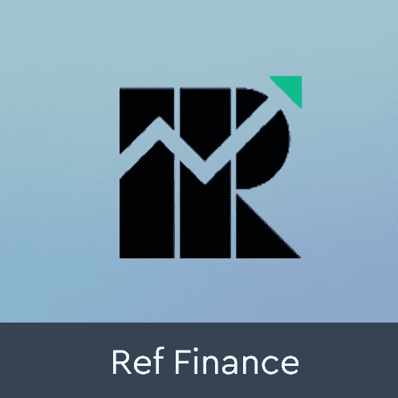

# 什么是 SweatWallet？四处走动赚取密码

> 原文：<https://web.archive.org/web/https://dappradar.com/blog/what-is-sweatwallet-earn-crypto-for-walking-around>

## 让下一个十亿用户进入加密领域

SWEAT 是 Sweatcoin 在区块链附近建造的一种新型加密货币。与其他移动赚取代币类似，用户在行走时铸造汗水代币。Sweatcoin 是一家制造代币、应用程序和汗水币钱包的公司，这些都是通过步行赚取汗水代币所必需的。

在大规模采用区块链技术的道路上，这些 dapps 将在入职中发挥关键作用。像 SweatWallet 这样的应用程序让任何人都可以在没有什么先验知识、投资或风险的情况下进入加密领域。将锻炼等日常活动作为挂钩，可以确保用户在互动后找到效用，而可靠的令牌组学可以鼓励日常使用和保持。

*   [什么是汗币？](https://web.archive.org/web/20221014121831/https://dappradar.com/blog/what-is-sweatwallet-earn-crypto-for-walking-around/#What-is-Sweatcoin?)
*   [什么是 SweatWallet？](https://web.archive.org/web/20221014121831/https://dappradar.com/blog/what-is-sweatwallet-earn-crypto-for-walking-around/#What-is-SweatWallet?-)
*   [四处走动挣钱](https://web.archive.org/web/20221014121831/https://dappradar.com/blog/what-is-sweatwallet-earn-crypto-for-walking-around/#Earn-money-walking-around)
*   [汗液标记组学](https://web.archive.org/web/20221014121831/https://dappradar.com/blog/what-is-sweatwallet-earn-crypto-for-walking-around/#SWEAT-tokenomics)
*   [汗水令牌使用案例](https://web.archive.org/web/20221014121831/https://dappradar.com/blog/what-is-sweatwallet-earn-crypto-for-walking-around/#SWEAT-use-cases)
*   [sweat coin 可持续吗？](https://web.archive.org/web/20221014121831/https://dappradar.com/blog/what-is-sweatwallet-earn-crypto-for-walking-around/#Is-Sweatcoin-sustainable?)
*   有什么好处？
*   [总结](https://web.archive.org/web/20221014121831/http://sweatcoin-in-summary-/)

NFT 的繁荣使各种 altcoin 项目进入牛市，游戏赚钱、GameFi 和元宇宙产品成为许多人的焦点。此外，过去 18 个月中一些表现最好的资产也属于这些类别。Move-to-earn 是《T2》的衍生游戏《玩赚游戏》(play-to-earn)，用户可以通过玩 Axie Infinity 等特定游戏[获得加密货币奖励。](/web/20221014121831/https://dappradar.com/blog/what-is-axie-infinity-and-how-does-it-work/)

Sweatcoin 旨在开发一整套基于 SWEAT 的应用程序，包括 [NFTs](https://web.archive.org/web/20221014121831/https://dappradar.com/nft) 、[游戏](https://web.archive.org/web/20221014121831/https://dappradar.com/rankings/category/games)、[市场](https://web.archive.org/web/20221014121831/https://dappradar.com/nft/marketplaces)和各种平台，为代币增加实用性和互操作性。该团队称之为汗水经济，其中汗水令牌对用户和公司本身都将发挥关键作用。

未来，该公司计划集成更多的跟踪工具，以便人们可以使用骑自行车或游泳等其他方法来记录他们的锻炼并获得奖励。

[https://web.archive.org/web/20221014121831if_/https://www.youtube.com/embed/xiN8LDqbuYQ?feature=oembed](https://web.archive.org/web/20221014121831if_/https://www.youtube.com/embed/xiN8LDqbuYQ?feature=oembed)

虽然 STEPN 和 Step App 在加密社区留下了深刻的印象，但随着新用户发现高昂的进入成本，它们逐渐消亡了。这两款应用都要求你[购买运动鞋 NFTs](https://web.archive.org/web/20221014121831/https://dappradar.com/multichain/social/stepn) 才能开始赚钱。Sweatcoin 有一种不同的方法——而且是免费的。

如果你在区块链寻找下一个 Spotify、谷歌或亚马逊， [DappRadar 可以帮助](https://web.archive.org/web/20221014121831/https://dappradar.com/blog/tag/dapp-trends)我们每周[的 Dapp 趋势文章](https://web.archive.org/web/20221014121831/https://dappradar.com/blog/tag/dapp-trends)。各种类别和垂直领域发生了如此多的事情，关键是要知道哪些[区块链](https://web.archive.org/web/20221014121831/https://dappradar.com/rankings/protocol/fuse)、[达普斯](https://web.archive.org/web/20221014121831/https://dappradar.com/rankings/protocol/fuse)和 [NFT 项目](https://web.archive.org/web/20221014121831/https://dappradar.com/blog/ten-things-everybody-should-know-about-nfts/)出于正确的原因创造了价值并吸引了观众。

## 什么是 Sweatcoin？

Sweatcoin 是 iOS 和 Android 上的一款免费移动应用，它用自己的原生货币 sweatcoins 奖励用户的日常步骤。汗水币可以转换成汗水代币，用于购买应用内产品、代金券和福利，或者捐赠慈善机构。

该应用程序会自动计算步数，并以每 1000 步 1 个硬币的比率向您发送汗币形式的每日奖励。对于那些曾经使用过脚步跟踪器的人来说，你会知道即使在风平浪静的日子里，你也可以达到几千步。

## 什么是 SweatWallet？

SweatWallet 是一款区块链钱包，旨在存储用户赚取的汗水加密货币。用户还可以在应用程序中下注，赚取收益。用户必须使用 Sweatcoin 应用程序中的菜单激活 SweatWallet。然后，在 AppStore 或者 Google PlayStore 下载 [SWEAT Wallet](https://web.archive.org/web/20221014121831/https://dappradar.com/multichain/games/sweat-wallet) ，安装到你的设备上。

**注意:在 Sweatcoin 应用中启用加密奖励应该会触发 SweatWallet 在您设备上的下载；不过这个也有被屏蔽的时候，所以有问题的话请直接用这个链接找** [**安卓**](https://web.archive.org/web/20221014121831/https://play.google.com/store/apps/details?id=com.sweatwallet) **和** [**这个找 iOS**](https://web.archive.org/web/20221014121831/https://apps.apple.com/tc/app/sweat-wallet/id1619316571) **。**

[DappRadar 从区块链](https://web.archive.org/web/20221014121831/https://dappradar.com/multichain/games/sweat-wallet)附近的[追踪 SweatWallet 的链上数据](/web/20221014121831/https://dappradar.com/blog/what-is-near-a-simple-explanation/)。显示电子钱包交互和交易的数量可以概述应用程序的性能。此外，它显示了有多少应用程序的日常用户选择收集汗水，而不仅仅是利用应用程序内的货币 Sweatcoin。

快速看一下数据就知道，Sweat Wallet 吸引并维持了它的受众。在过去的 30 天里，超过 600，000 名用户连接到 Sweat，完成了超过 200 万笔交易。在写作时，它最近的表现将 [SweatWallet](https://web.archive.org/web/20221014121831/https://dappradar.com/multichain/games/sweat-wallet) 推入了[在 DappRadar](https://web.archive.org/web/20221014121831/https://dappradar.com/rankings) 上的前十名。

## 四处走动挣钱

要使用 Sweatcoin 获得加密，请使用使用 Sweatcoin 登录选项登录 SweatWallet。这将带您进入 Sweatcoin 应用程序，您可以在其中授权访问钱包，自动将您的 Sweatcoin 计步器与钱包链接。

Sweatcoin 应用程序会计算你迈出的每一步，并在每天结束时，为你迈出的每 1000 步支付 1 汗水。每天前 5000 步可以获得汗水。所有进一步的步骤都有汗币奖励，汗币只能在 app 内消费，不能交易。

## 汗液标记组学

这种代币的供应量是无限的，对于寻求长期持有的投资者来说，这不是一个好的开始。解释是，Sweatcoin 旨在激励运动和永远锻炼，只有不断用代币奖励步数，他们才能做到这一点。此外，该应用程序似乎倾向于采用加密技术并简化用户登录。

然而，不可否认的是，该团队必须通过建立一个长期的情景来缓解通货膨胀，在这个情景中，铸造汗水的要求更高，使通货膨胀率接近于零。

查看白皮书中概述的初始令牌分配，我们看到分配有利于公司及其利益相关者。最初的代币供应中只有四分之一流向了公众，而 75%的汗水流向了公司、私人投资者和团队成员。

然而，关键的一点是，这种策略非常适合一个从根本上想要免费提供密码的项目。积极的一面是，分配给所有者、团队和利益相关者的令牌有最长 4 年的悬崖和归属期。

在非金融方面，这些持有人要到四年后才能收到全部股份。这防止团队在市场上倾销代币，破坏价格，并激励团队完成项目并实现其回报。

## 汗水用例

该平台为汗水令牌持有者提供了多种用途。首先，用户可以用代币换取收益并获得奖励，奖励是分层的。付出的汗水越多，回报越多。其次，Sweatcoin 也在开发一款基于 SWEAT token 的游戏，带来游戏化，并在未来提供额外的游戏赚取功能。

此外，用户可以获得额外的应用内优惠，如降低费用和提高每日薄荷限额。最后，你可以简单地拿着你挣来的汗水，立即在公开市场上卖掉，换成其他代币。

基于[今天汗水的市值](https://web.archive.org/web/20221014121831/https://www.coingecko.com/en/coins/sweat-economy)为 0.04 美元。每天走 5000 步可以让你流 5 次汗，每天大约 0.2 美元，或者每月大约 6 美元。代币价值越高，奖励价值也就越高。尽管如此，前提不是用户变得富有；它通过用户理解的媒介来介绍加密和[区块链钱包](/web/20221014121831/https://dappradar.com/blog/what-is-metamask/)的概念。

## Sweatcoin 可持续吗？

汗水经济最重要的方面，以及每一个试图带来回报的秘密项目，是可持续性。为了可持续发展，并向用户支付报酬或吸收汗水的通胀力量，Sweatcoin 必须产生一些收入。该公司声称通过几种方式做到这一点:

*   **从公司** (B2B)支付 Sweatcoin 以访问并向其用户群推广其产品和服务。

*   **来自用户** (B2C)通过在 Sweat Wallet 应用程序功能中收取交易费，包括 fiat on-ramp、off-ramp、crypto-crypto exchange、NFT 购买等。

为什么代币的收入如此重要？因为 Sweatcoin 承诺支付给用户的钱或价值必须来自某个地方。否则，奖励是基于排放的，这是不可持续的，也是为什么许多其他的“移动挣钱”项目在短时间内失败了。就 SWEAT 而言，收入旨在以三种方式支持代币:

*   **生态系统开发:**包括产品开发、社区发展和合作伙伴关系。这些旨在推动用户增长和令牌的进一步效用。

*   **回购和烧钱:** Sweatcoin 将投入一定比例的收入在市场上购买和烧钱代币，或将其作为赌注收益进行分配。减少代币供应量，在一定程度上缓解通货膨胀。

*   **奖励投资:**另一部分收入将用于人们要求的奖励，如积分、礼品卡和活动门票。这将进一步刺激人们持有代币，增加需求，降低抛售压力。

## 有什么条件？

正如所有的东西加密和区块链，这是必不可少的，看看远离标题和营销语言，以了解小字。下载一个应用程序，连接一个钱包，走来走去，赚取加密。简单吧？

然而，对于 SweatCoin，营销中概述的简单想法就是用户所获得的。一个优秀的，易于使用的 iOS 或 Android 应用程序和每天赚取汗水代币的能力。

好的一面是投机方面不存在，所以 dapp 没有吸引赏金猎人或产量农民。相反，它似乎正在实现其既定的使命，即让新用户加入 crypto，最重要的是留住他们。

前面概述的一个重要方面是，用户只能在每天的前 5000 步中获得汗水。所有进一步的步骤都有汗币奖励，汗币只能在 app 内消费，不能交易。一千步等于一个汗水，所以每天，收入上限为 5 个汗水。

## 总结一下

移动挣钱的概念为 Web3 应用和 dapps 的大规模采用打开了无数的大门。然而，它面临着一个巨大的障碍，因为用户太容易为四处走动赚取加密货币。此外，一些更精明的用户找到了游戏系统的方法，比如把他们的手机放在他们的狗身上。

这导致了绝大多数的移动赚钱项目没有达到宣传的效果。相反，他们设法飞了几个月，获得了很多关注，直到通货膨胀和销售压力接管并摧毁了这个项目。

Sweatcoin 有一种不同的方式来实现“移动到收入”的经济模式。他们的目标是将他们的代币整合到现实世界的经济中，而不是像[和其他项目](/web/20221014121831/https://dappradar.com/blog/what-is-step-and-its-step-token/)那样作为游戏中的货币。

此外，一切似乎都在继续添加更多功能和推进路线图的轨道上。虽然这给汗水代币带来了进一步的需求和效用，但该团队是否能提供足够的东西来抵消其通胀代币经济学，仍有待观察。Sweatcoin 似乎很乐意避开寻找快钱的投机人群。相反，专注于解决区块链用户入职之谜。

 NewsletterUnsubscribe at any time. [T&Cs](https://web.archive.org/web/20221014121831/https://dappradar.com/terms) and [Privacy Policy](https://web.archive.org/web/20221014121831/https://dappradar.com/privacy-policy)

***以上不构成投资建议。此处给出的信息仅供参考。请行使尽职调查，做你的研究。作者持有多种加密货币的头寸，包括 BTC、瑞士法郎和雷达。***

[<picture></picture>](https://web.archive.org/web/20221014121831/https://dappradar.com/near/other/near-crowd)[<picture></picture>](https://web.archive.org/web/20221014121831/https://dappradar.com/near/exchanges/ref-finance)[<picture></picture>](https://web.archive.org/web/20221014121831/https://dappradar.com/near/marketplaces/paras)