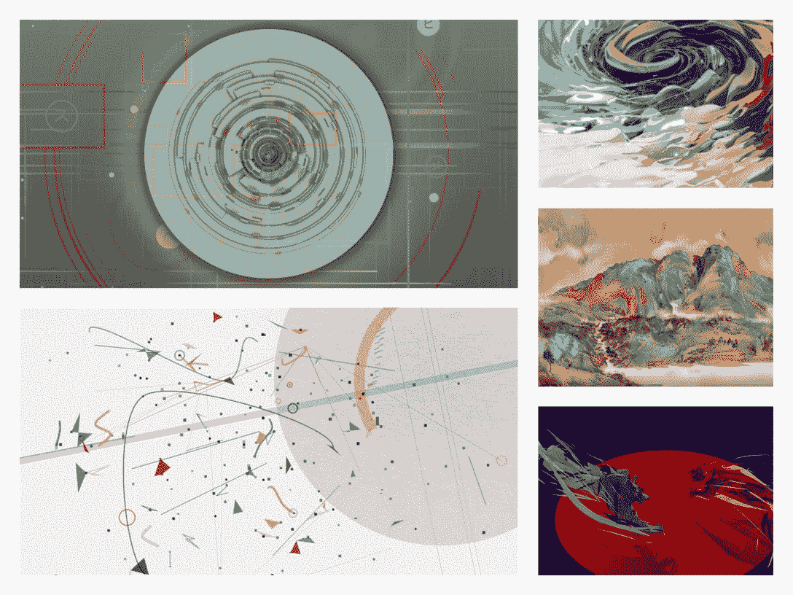

# 什么是 Tezos:权威指南

> 原文：<https://web.archive.org/web/https://dappradar.com/blog/what-is-tezos>

## 泰佐斯区块链和生态系统的权威指南

**Tezos 是一个开源的、自我修改的、生态友好的区块链协议，它利用了利益相关者共识模型的证据。Tezos 的本地加密货币是 XTZ，它使用户能够与 Tezos 区块链互动。经过多年的发展，Tezos 已经创建了一个由验证者、研究者、建设者和创造者组成的全球社区。**

经过多年的发展，[Tezos 网络](https://web.archive.org/web/20221209165320/https://dappradar.com/rankings/protocol/tezos)凭借其高性能和低成本，已经成为许多产品的区块链基础设施选择。[特佐斯的动态 NFT](https://web.archive.org/web/20221209165320/https://dappradar.com/nft/protocol/tezos) 生态系统尤其值得注意，[正在成为数字艺术的下一个前沿。](/web/20221209165320/https://dappradar.com/blog/tezos-digital-nft-art-immerses-the-public-on-nfts-at-art-basel/)

**内容:**

*   [Tezos 是什么？](https://web.archive.org/web/20221209165320/https://dappradar.com/blog/what-is-tezos/#what-is)
*   什么是 XTZ？
    *   [XTZ 的钱包](https://web.archive.org/web/20221209165320/https://dappradar.com/blog/what-is-tezos/#wallets)
*   【Tezos 是如何工作的？
    *   [自我修正](https://web.archive.org/web/20221209165320/https://dappradar.com/blog/what-is-tezos/#self-amendment)
    *   [智能合约&正式验证](https://web.archive.org/web/20221209165320/https://dappradar.com/blog/what-is-tezos/#smart-contract)
    *   [dpo](https://web.archive.org/web/20221209165320/https://dappradar.com/blog/what-is-tezos/#DPoS)
*   [Tezos 对 NFTs 好吗？](https://web.archive.org/web/20221209165320/https://dappradar.com/blog/what-is-tezos/#nfts)
    *   在 Tezos 的生态系统中，有哪些受欢迎的 NFT 市场？
*   [Tezos 对游戏 dapps 有好处吗？](https://web.archive.org/web/20221209165320/https://dappradar.com/blog/what-is-tezos/#gaming)
*   [如何使用 DappRadar 追踪 Tezos 上的 NFT 和 dapps？](https://web.archive.org/web/20221209165320/https://dappradar.com/blog/what-is-tezos/#track)

## Tezos 是什么？

Tezos 是一个开源的、可自我升级的区块链，可以执行点对点交易，并提供一个运行智能合约的平台。Tezos 于 2018 年 6 月推出了其 testnet，同年 9 月其 mainnet 上线。促进 Tezos 生态系统的本地加密货币是 XTZ。

Tezos 网络利用了一种利益验证共识机制，这种机制比工作验证模型更具成本效益，并且可以支持更大的交易吞吐量。要了解更多关于共识机制的基础知识，你可以阅读 DappRadar 的区块链终极指南。

Tezos 网络致力于推动 Web3 革命和大规模采用，其核心是用户参与和治理。值得注意的是，Tezos 采用了链上治理模型，允许其社区投票支持修改其协议的升级提案。

社区驱动、高能效、无分叉升级和强大的可扩展性是 Tezos 的最大优势。

## 什么是 XTZ？

XTZ 是 Tezos 的本土代币，其活跃市值为 1，724，662，378 美元，流通代币供应量为 904，637，050 枚。XTZ 作为使用 Tezos 的交换媒介，授予持有者参与平台链上治理的权利。

这里值得强调的是，如果开发者的升级或修改建议被接受，Tezos 的社区驱动治理模型会奖励开发者 XTZ 令牌。

### XTZ 的钱包

各种钱包可用于存储和使用 XTZ，如 Kukai、Temple 和 ZenGo。此外，每个都至少经过了一次独立的外部安全审计。下面的钱包列在 Tezos 官方网站上。

如果你是一个初学加密的人，不知道该用什么钱包，[这篇 DappRadar 文章](/web/20221209165320/https://dappradar.com/blog/best-cryptocurrency-wallets-for-2022/)为你提供了最受欢迎的加密货币钱包列表。如果你想了解 ZenGo，Ledger，Trezor，和 Temple，适合 XTZ，[的钱包这篇文章](/web/20221209165320/https://dappradar.com/blog/best-cryptocurrency-wallets-for-2022/)也能帮到你。

## Tezos 是如何工作的？

Tezos 通过采用以社区为中心的治理系统，将自己与比特币和以太坊区分开来。此外，它可以通过自我升级来进化，这是一种排除硬分叉的机制。此外，Tezos 使用了一种区块链验证的股权证明模型，这比比特币和[以太坊](https://web.archive.org/web/20221209165320/https://dappradar.com/rankings/protocol/ethereum)消耗的能量更少。

现在我们来仔细看看 Tezos 的技术优势。

### 自我修正

自我修正允许 Tezos 升级其网络，而不必将网络分成两个不同的区块链。传统的区块链，如以太坊或比特币，通常会在做出重大改变时执行硬分叉。为什么这个特性让 Tezos 与众不同？

这最终分裂了社区，改变了利益相关者的动机，并破坏了网络的长期稳定性。然而，有了 Tezos，开发人员可以确信网络不会分裂，他们的计划可以不间断地实施。

### 智能合同和正式验证

开发者可以在 Tezos 上构建智能合约和创建 dapps。此外，Tezos 采用了[形式验证](https://web.archive.org/web/20221209165320/https://wiki.tezosagora.org/learn/smartcontracts/michelsonandcoq#intro)，这是一个用于验证程序是否符合特定规范的过程。简单地说，它用数学来回答这个问题，“我们已经做出了我们想要做出的东西了吗？”

如果使用得当，这种技术可以帮助避免代价高昂的错误和随之而来的争论。

### DPoS

Tezos 已经实施了一个委托利益证明(DPoS)模型。在这种模式下，XTZ 持有者必须将他们的代币放在智能合约中，以保持区块链的完整性。不想直接参与共识协议的用户可以简单地将他们的权利委托给其他用户。这就是所谓的 DPoS 模式。

## Tezos 对 NFTs 好吗？

以太的可扩展性问题已经导致许多开发者和创造者离开去寻找替代品。Tezos 以其快速的交易速度和低廉的费用，迅速引起了他们的注意。

在区块链最受欢迎的 NFT 市场 Objkt 上铸造一个完整的 NFT 收藏，用户只需花费大约 1 XTZ。这使得 Tezos 迅速成为数字艺术家最受欢迎的区块链之一。

更值得注意的是，Tezos 还投入了大量精力来支持数字艺术社区。例如，它在多个艺术博览会上策划了几次互动艺术体验，向公众宣传秘密艺术。

### 在 Tezos 的生态系统中，有哪些受欢迎的 NFT 市场？

Tezos 上有各种各样的市场供 NFT 爱好者铸造、收集和交易 NFT。根据 DappRadar 的 NFT 追踪数据，Objkt 是 Tezos 上最大、最受欢迎的市场。下面列出了 Tezos 上最受欢迎的市场。

*   [Objkt](https://web.archive.org/web/20221209165320/https://dappradar.com/tezos/marketplaces/objkt-com)
*   [Fxhash](https://web.archive.org/web/20221209165320/https://dappradar.com/tezos/marketplaces/fxhash)
*   [鱼塘](https://web.archive.org/web/20221209165320/https://dappradar.com/tezos/marketplaces/kalamint)
*   [泰亚](https://web.archive.org/web/20221209165320/https://dappradar.com/tezos/marketplaces/teia)
*   [总和](https://web.archive.org/web/20221209165320/https://dappradar.com/tezos/marketplaces/versum)

## Tezos 对游戏 dapps 好吗？

游戏已经成为 Tezos 上增长最快的领域之一。利用区块链和 Web3 技术的游戏工作室和发行商正在加入这个生态系统。例如，ELEET GAMES 将以 Tezos 为基础，为其社区带来一个可扩展、用户友好且节能的欢乐游乐场。

此外，游戏极客(Game Geeks)是一个为游戏玩家和开发者提供支持的分散式游戏中心，它也建立在 Tezos 之上。该平台将使游戏开发者更容易在 Tezos 区块链上创建和托管他们的游戏。至于游戏玩家，他们可以玩这些游戏，收集 NFT，相互竞争，在获得丰厚奖励的同时获得乐趣。

## 如何使用 DappRadar 追踪 Tezos 上的 NFT 和 dapps？

该网络的社区驱动的治理和对区块链福克斯的保护为 Tezos 赢得了开发者的大量支持。此外，泰佐斯的数字艺术景观极具特色，孵化了几位新兴的密码艺术家，包括 [Shvembldr](https://web.archive.org/web/20221209165320/https://teia.art/Shvembldr) 、[亚兹德](https://web.archive.org/web/20221209165320/https://www.fxhash.xyz/u/Yazid)、[白薇](https://web.archive.org/web/20221209165320/https://objkt.com/profile/tz1ZuNutHuD7YH6okGoH6ginvHNQr4hiW1PW/created)、[列瓦](https://web.archive.org/web/20221209165320/https://objkt.com/profile/revafyw/created)、 [Niq](https://web.archive.org/web/20221209165320/https://objkt.com/profile/tz1f1wcUXLpyihxkHMS5o5SqrShDE6N68gGW/created) 等等。

随着 Tezos 生态系统变得更加活跃和多样化，有没有一种好的方法来跟踪 Tezos 上发生的事情？DappRadar 可以为 Tezos 用户或任何想要了解 Tezos dapps 的人提供丰富的数据驱动信息。查看下面这些有用的跟踪工具，跟踪 Tezos 上 dapps 的最新发展。

*   [泰索斯达普斯](https://web.archive.org/web/20221209165320/https://dappradar.com/rankings/protocol/tezos)
*   [Tezos 上的 NFTs](https://web.archive.org/web/20221209165320/https://dappradar.com/nft/protocol/tezos)
*   [泰佐斯·迪菲](https://web.archive.org/web/20221209165320/https://dappradar.com/defi/protocol/tezos)

DappRadar 将继续监测和报告 Tezos 及其生态系统的演变。在 [Twitter](https://web.archive.org/web/20221209165320/https://twitter.com/dappradar) 、 [Discord](https://web.archive.org/web/20221209165320/https://discord.gg/4ybbssrHkm) 和 [Youtube](https://web.archive.org/web/20221209165320/https://www.youtube.com/c/DappRadar) 上关注我们，跟上区块链世界的动态。

 NewsletterUnsubscribe at any time. [T&Cs](https://web.archive.org/web/20221209165320/https://dappradar.com/terms) and [Privacy Policy](https://web.archive.org/web/20221209165320/https://dappradar.com/privacy-policy)