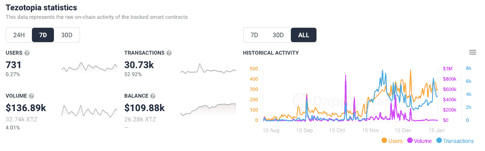
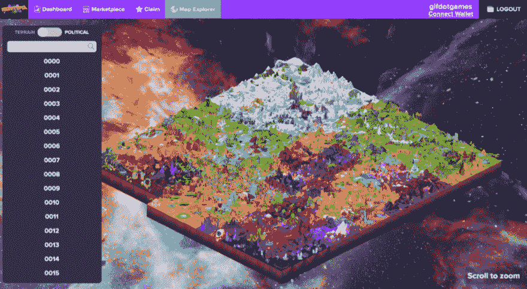
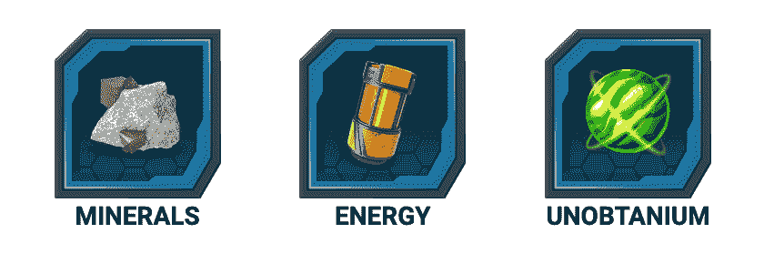
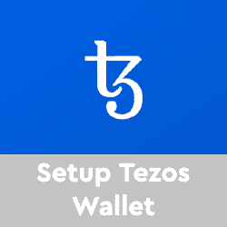
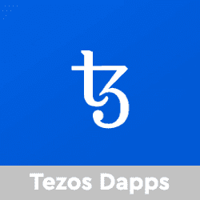

# 什么是 Tezotopia:它会把 Tezos 上的游戏放到地图上吗？

> 原文：<https://web.archive.org/web/https://dappradar.com/blog/what-is-tezotopia-will-it-put-gaming-on-tezos-on-the-map>

## 购买、销售和交易数字领域&构建独特的虚拟资产

Tezotopia 是 Tezos 区块链上的一款新的 [NFT 游戏，玩家可以通过种植 NFT 或与其他玩家战斗来获得收入。在过去的七天里，与该游戏相关的独特活动钱包数量有所增加，交易量增加了 50%以上。](https://web.archive.org/web/20221002000711/https://dappradar.com/tezos/games/tezotopia)

Tezotopia 的盈利机制允许玩家种植 Tezotops，这是一种 NFT，是游戏化生态系统的一部分。如上所述，玩家也可以使用他们的 NFT 与其他玩家战斗。这将允许他们赚取战利品箱。对于那些不知道的人来说，战利品盒子是一个神秘的包裹，里面有一定的奖励。这是一种由游戏行业的大公司流行的游戏机制，如电子艺界和动视暴雪。

## 什么是 Tezotopia？

Tezotopia 是一款以未来世界为背景的游戏化农业游戏。玩家可以是地主，也可以是军阀，说明他们是在积极的种植资源，还是在争夺资源。Tezotops NFTs 至关重要，因为它们使用户能够参与高产农业。这些资产可以在[开放的 NFT 市场](https://web.archive.org/web/20221002000711/https://app.tezotopia.com/)上找到。

玩家可以在他们的土地上放置建筑来产生资源。这些资源需要用来建造更多的建筑和军队，但是玩家也可以在市场上出售。在这个市场上，玩家可以出售他们的资产来换取 XTZ 代币，或者在军阀 PVP 游戏模式中购买帮助他们战斗的雇佣兵。

对于军阀模式，可以装配各种具有独特属性的机器人，与飞机部队和炮兵坦克等支援部队进行 9 对 9 的战斗。而且，玩家并不局限于一种模式。他们可以选择两者兼而有之:首先利用资源制造泰佐托普单位，然后发动对敌人的战争。这将为他们赢得宝贵的资源，独特的非功能性食物，并赢得 XTZ 代币。

## 如何在 Tezotopia 生产农场资源

地形图上覆盖着一块块的陆地，这些陆地就是地台。每一个 Tezotop 都从 0000 开始编号，从创世纪开始，一直到无穷大。Tezotopia 的创建者 Gif Games 铸造了第一批 300 个积木 000–299，此后，该社区已经掌握了地图，开始建造下一批 Tezotops。玩家可以使用地形图在不断演变的地形中滚动，看到每一块土地的资源乘数，并直接前往市场查看。

Tezotopia 的三种自然资源是矿物、能源和 Unobtanium。每个 Tezotop(地块)都生产这些，在各种地形中，有些资源比其他资源更丰富。Unobtanium 是 Tezotopia 上最稀有和最有价值的材料，是一种反重力材料，通过吸收热量和压力并将它们转化为能量而变得更强。这是创造新技术的必要组成部分。它以 0.0005/小时的速度生产。开发 Unobtanium 矿可以加快这种资源的交付。

矿物以 0.5/小时的速度生产，用于建造建筑物和生产机械。矿物是发展 Tezotops 的重要基石。能量来自位于火山顶下面的间歇泉，以每小时 0.75 英镑的速度储存。大多数生产任务都需要能源，包括建造新的建筑、生产机械、战斗以及开发新的 Tezotops 的地形改造过程。

## 如何在 Tezotopia NFT 市场交易和交易什么

Tezotopia 上的 [Marketplace](https://web.archive.org/web/20221002000711/https://app.tezotopia.com/marketplace/tezotops) 分为五个不同的标签，其中四个是游戏内资产。最后一个是 Raffletopia，预定的 raffles 在这里进行，你可以赢得独特的物品。Tezotops 是生产象征性资源的地块:Unobtanium、矿物、能源和机械。您可以在 Tezos exchange QuipuSwap 上购买这些资源。[神器](https://web.archive.org/web/20221002000711/https://app.tezotopia.com/marketplace/artifacts)是带有乘数的装饰品，可以提高你的陀螺的属性。有关购买资源的更多信息，请参见[令牌](https://web.archive.org/web/20221002000711/https://docs.gif.games/our-tokens)页面。​

你可以在市场上找到神器，玩家至少需要两个来制造一个 Tezotop。在构建器中有没有可用乘数的库存工件。尽管如此，如果你想提高一个泰索托普的属性并产生更多的资源，建议你获得具有强大乘数的神器。单位也可以在市场上买到，玩家至少需要三个单位来战斗。

## 薄荷乐园的门票

Tezotop builder 允许玩家在 Tezotopia 内创建他们的地块。制造一个泰索托需要 0.50 乌诺，50 ENR 和 2 件神器。然而，要制作一个 Tezotop，玩家首先需要获得一张“造币厂门票”。

要获得彩票，玩家必须参加抽奖并赢得一张彩票。这种彩票的工作原理和莱佛士一样。铸币厂的门票将被放在[星际基地](https://web.archive.org/web/20221002000711/https://app.tezotopia.com/starbase/tickets)标签中，你支付 0.50 乌诺+ 50 ENR 进入抽奖。彩票一天三次，持续 15 分钟。

至关重要的是，玩家可以多次输入，以赢得多张门票。一旦抽奖结束，智能合同会自动从每次抽奖中选择获胜者。玩家可以申请门票，然后解锁 Tezotop builder，烧毁门票。有趣的是，如果中奖，中奖者还可以转售一张门票。

## Tezotopia 入门

你需要一个 Tezos 钱包来开始。我们推荐[酷开钱包](https://web.archive.org/web/20221002000711/https://wallet.kukai.app/)或者[神庙钱包](https://web.archive.org/web/20221002000711/https://templewallet.com/)。

接下来，你需要一些 Tezos:你可以在这里买一些:[https://tzkt.io/buy-tezos](https://web.archive.org/web/20221002000711/https://tzkt.io/buy-tezos)或[https://changelly.com/](https://web.archive.org/web/20221002000711/https://changelly.com/)——关于如何开始使用 Tezos 区块链的完整指南，[请阅读这里](https://web.archive.org/web/20221002000711/https://dappradar.com/blog/how-to-get-started-on-tezos)。

[<picture></picture>](https://web.archive.org/web/20221002000711/https://dappradar.com/blog/guide-on-how-to-create-a-wallet-for-tezos)[<picture></picture>](https://web.archive.org/web/20221002000711/https://dappradar.com/blog/category/games)[<picture></picture>](https://web.archive.org/web/20221002000711/https://dappradar.com/rankings/protocol/tezos)

***以上不构成投资建议。此处给出的信息仅供参考。请行使尽职调查，做你的研究。作者持有 ETH、BTC、AGIX、HEX、LINK、GRT、CRO、OMI、不变 X、ENS、GALA、AVASTR、GMEE、CUBE、RADAR、FLOW、FTM、BNB、SPS、WRLD、ATOM 和 ADA。***

 NewsletterUnsubscribe at any time. [T&Cs](https://web.archive.org/web/20221002000711/https://dappradar.com/terms) and [Privacy Policy](https://web.archive.org/web/20221002000711/https://dappradar.com/privacy-policy)