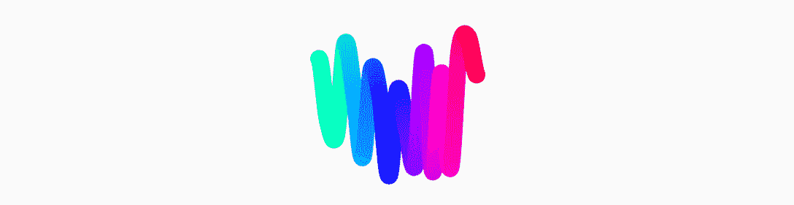
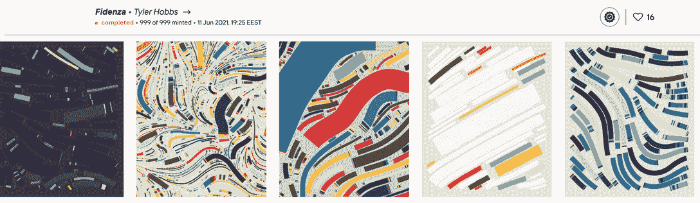
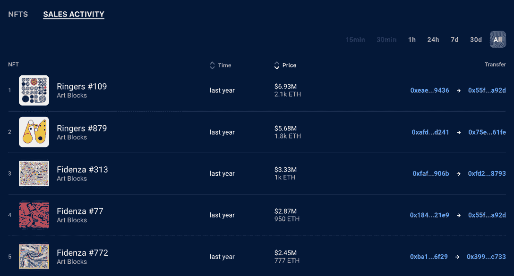
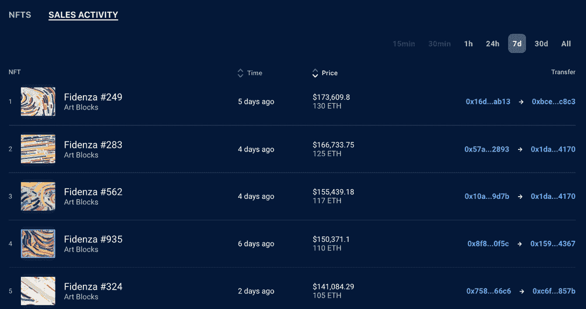
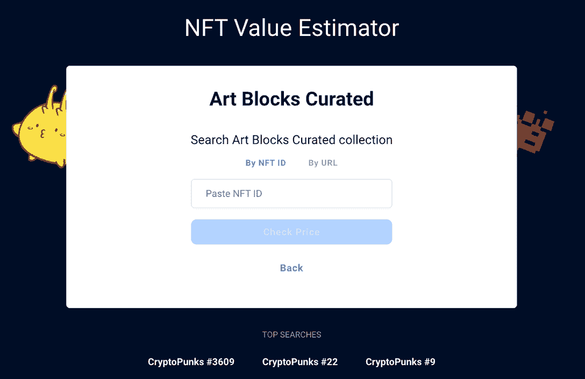

# 什么是 NFT 艺术街区市场？

> 原文：<https://web.archive.org/web/https://dappradar.com/blog/what-is-the-art-blocks-nft-marketplace>

## 欢迎来到秘密艺术的世界

Art Blocks 是一个位于区块链以太坊的 NFT 艺术市场。它托管经过策划和挑选的生成性数字艺术收藏，这些收藏作为不可替代的代币出售和交付——赋予所有者可核实的艺术所有权

Art Blocks 已经成为 Web3 中的领先平台，迄今为止，已经在 NFT 产生了超过 10 亿美元的交易量。但是什么是秘密艺术呢？生成是什么意思，为什么人们对区块链的数字艺术感兴趣？这艺术块的最终指南将回答所有这些问题，甚至更多。

*   [什么是艺术街区？](https://web.archive.org/web/20221207025654/https://dappradar.com/blog/what-is-the-art-blocks-nft-marketplace/#What-is-Art-Blocks-)
*   艺术街区市场是如何运作的？
*   [什么是艺术街区策划项目？](https://web.archive.org/web/20221207025654/https://dappradar.com/blog/what-is-the-art-blocks-nft-marketplace/#What-are-Art-Blocks-curated-projects?)
*   [什么是工厂项目？](https://web.archive.org/web/20221207025654/https://dappradar.com/blog/what-is-the-art-blocks-nft-marketplace/#What-is-a-factory-project?-)
*   什么是艺术块 x 合作？
*   我如何获得我的艺术块项目？
*   [创作者的申请流程是怎样的？](https://web.archive.org/web/20221207025654/https://dappradar.com/blog/what-is-the-art-blocks-nft-marketplace/#What’s-the-application-process-for-creators?)
*   [如何在艺术街区购买艺术品](https://web.archive.org/web/20221207025654/https://dappradar.com/blog/what-is-the-art-blocks-nft-marketplace/#How-to-buy-art-on-Art-Blocks)
*   [有平台费吗？](https://web.archive.org/web/20221207025654/http://are-there-platform-fees/?-)
*   如何在艺术块上铸造 NFT？
*   [我是否拥有艺术品的知识产权](https://web.archive.org/web/20221207025654/https://dappradar.com/blog/what-is-the-art-blocks-nft-marketplace/#Do-I-own-the-intellectual-property-of-the-art?-)
*   [在艺术街区保持安全](https://web.archive.org/web/20221207025654/https://dappradar.com/blog/what-is-the-art-blocks-nft-marketplace/#Stay-safe-on-Art-Blocks-)
*   艺术街区上有哪些数字艺术家？
*   [总结](https://web.archive.org/web/20221207025654/https://dappradar.com/blog/what-is-the-art-blocks-nft-marketplace/#Art-Blocks-in-summary-)

人们说情人眼里出西施。这一点在艺术界最为真实。另一个人，反之亦然，可能会讨厌一个人最喜欢的艺术作品。需要考虑一些基本因素，比如艺术家是谁，他生活在哪个区块链，以及除了拥有数字 NFT 艺术作品之外，它是否还能提供更多好处。

反对者提出的另一个强有力的论点是，“我为什么想要一件数字艺术品？我不能挂在我的墙上？”此外，这种说法在两方面都是错误的。首先，没有什么能阻止购买者打印购买的图像并挂在家里。其次，随着人们越来越倾向于数字生活和元宇宙生活，数字艺术将在我们的日常生活中扮演更加重要的角色。

## 什么是艺术街区

该市场引领着新一代艺术家，并拥有当今最具创新性的数字艺术家的作品。Web3 艺术平台将创意编码与区块链技术相结合，为艺术创作和所有权建立了一种新的范式

Art Blocks 专注于以太坊区块链上不变存储的可编程生成内容。用户选择他们喜欢的风格，为作品付费，内容的随机生成版本由算法创建并发送到你的以太坊账户。最终的作品可能是静态图像、3D 模型或交互式体验。每个输出都是不同的，平台上可以创建的内容类型有无限的可能性。

## 艺术街区市场是如何运作的？

艺术块平台托管生成项目，以产生可验证的输出。例如，一个生产性的脚本(使用 p5js)不变地存储在以太坊区块链上，用于每个项目。

当用户想要购买平台上托管的项目的迭代时，他们购买符合 ERC721 的 NFT，它也存储在以太坊区块链上，并在生成脚本中包含可证明唯一的种子控制变量。这些变量反过来控制输出的外观和操作方式。作为一个例子，让我们看看 Chromie Squiggle 项目。

*Chromie Squiggle #0*
*Token seed is0x722899b10c66da3b72fb60a8e71df442ee1c004547ba2227d76bed357469b4ea*

每个种子也称为哈希字符串，是在令牌生成时伪随机生成的十六进制字符串。每个字符(0-9，a-f)代表 0-15 之间的值，每对字符(“aa”或“f2”)代表 0-255 之间的值。

例如，波形曲线中每个点的 y 坐标由种子中十六进制对的值决定。种子中的十六进制对还控制起始颜色、渐变的变化率、每个曲线中的点数，加上一些令人惊讶的功能，使一些曲线比其他曲线更罕见。

每次使用特定的种子绘制曲线，结果都是一样的。这意味着项目是确定的。艺术街区项目需要有一个确定的初始状态。因此，您的令牌(代表为该特定项目存储的算法的特定输出)保证是唯一的。

艺术家可以调整和修改脚本和设置，直到舒适，他们准备锁定项目。一旦项目被锁定，它将永久冻结最大迭代次数(允许生成的最大迭代次数)、脚本、项目名称、艺术家姓名和生成的哈希数等属性。

艺术家不能改变项目的状态，因此您可以保证从令牌的存储种子中获得相同的结果输出。项目锁定后，如果艺术家想要调整其作品的价格以适应以太坊的价格变动，他们仍然可以修改描述和每次迭代的价格。

## 什么是艺术街区策划项目？

艺术街区建立了一个策展委员会，在策展收藏中挑选项目。策展系列是一组项目，在技术创新和美学美感方面推动了生成艺术的边界。

策展系列最能代表 Art Blocks 作为一个平台的愿景，新系列会定期推出。策展收藏中包含的艺术家可以在游乐场中部署后续项目。像所有的艺术块发布一样，这些项目必须符合质量标准，但鼓励在操场上进行实验。

## 什么是工厂项目？

艺术块工厂是为那些不想等待策展委员会批准或没有被选中的艺术家而创建的。这使得艺术家可以有一个艺术块的项目，并加入策划生殖艺术家的社区。虽然要求比策划收藏更宽松，但工厂项目仍然需要反映通常与艺术块相关的创新、创意和艺术美。

## 什么是艺术块 x 合作？

艺术块 x 合作是与选定的合作伙伴的联合品牌收藏。因为合作伙伴项目直接存在于艺术街区生态系统中，它们将与任何其他艺术街区项目一样接受相同的质量审查和进度安排。

## 我如何得到我的艺术块项目？

您可以使用[申请表](https://web.archive.org/web/20221207025654/https://mpphuqcai14.typeform.com/apply-ab-artist)进行申请，申请将无限期开放。我们期望艺术家有创作历史和提供原创剧本的能力。艺术块不提供项目编码的帮助。要么你自己编写项目代码，要么请人帮忙。

部署一个艺术块项目是复杂的，所以对你的技术能力要诚实。如果你计划合作，为所有贡献者提供完整的信息。所有提交的作品必须是原创的。Art Blocks 不会发布使用许可、购买或回收内容的项目。最重要的是，该平台希望为艺术街区带来一个独特的项目。

## 创作者的申请流程是怎样的？

Art Blocks 最初是一个开放平台，但后来演变成了世界上一些最佳生殖艺术的策展人之家。因此，艺术街区变得越来越有选择性，接受大约 15%的申请。

按照时间顺序，提交的申请以每周 20 份左右的速度通过，优先考虑有原型的申请。Art Blocks 可能需要几个月的时间来接触和审查新的应用程序，所以耐心是至关重要的。

一旦申请被审查，一个艺术协调员将接触检查进一步的信息，并确保一个项目准备进入筛选阶段。最好在接近完成时提交一个原型脚本。一个项目提交后，会经过两次筛选。

第一次筛选决定作品是否被平台接受。这个筛选是由艺术街区的工作人员和生殖艺术专家组成的委员会进行的。这篇评论集中在整体美学，新品种，以及项目在技术上，视觉上和概念上探索新领域的程度。

Art Blocks 的使命是突出精英中的精英，这意味着一个项目可能是使用生成艺术媒介的数字作品的一个极好的例子，但仍然没有成功。艺术块在普通的生成风格和类别中寻找创新，为收藏家提供最大的多样性。

第二次筛选是针对被接受在艺术街区开展的项目。这种筛选是由国际艺术界成员指定的策展委员会完成的。策展委员会将决定是否将一个项目作为艺术块策展发布，这表明了最高水平的技术熟练程度，创新，多样性和长期价值。

更多问题和要求，请查看[艺术块文档:创作者艺术块 101](https://web.archive.org/web/20221207025654/https://docs.artblocks.io/creator-docs/creator-onboarding/readme)。

## 如何在艺术街区购买艺术品

线性荷兰拍卖规定了起拍价、开始时间、结束时间和结束价格，价格将随着时间的推移而线性下降。在指数荷兰拍卖中，艺术家指定起始价、终止价和价格下降的半衰期。

例如，假设一个指数荷兰拍卖从 1 ETH 开始，在 30 分钟内下降到 0.1 ETH。在这种情况下，半衰期是 9 分钟，这意味着每 9 分钟，价格会逐渐减半。所以 9 分钟后，DA 会达到 0.5，18 分钟后，荷兰式拍卖会达到 0.25。在这些半衰期步骤内的价格下降将逐渐降低每个区块。

## 有平台费吗？

艺术街区平台对平台上列出的项目收取 10%的费用。当购买艺术品时，购买价格的 10%被转移到艺术块，其余的立即转移到项目创作者。

这种高效的流程是许多艺术家被 NFT 艺术所吸引的原因。创作者无需等待，几乎可以立即获得报酬。

## 你如何在艺术块上铸造 NFT？

如果你在艺术块上找到你喜欢的东西，你可以创造一个独特的迭代。作品是铸造的，这意味着它是按需生成的，所以你不知道具体的作品是什么。

为了造币，当你使用诸如 Metamask 的区块链钱包连接到艺术块时，访问一个项目。如果你还没有安装 Metamask，你需要访问[https://metamask.io/](https://web.archive.org/web/20221207025654/https://metamask.io/)在你的浏览器中安装扩展。查看下面的视频，获得一步一步的指导。

连接钱包后，您会在每个项目的描述区域看到一个购买按钮。注意，每个项目都有一个设定的最大迭代限制；如果达到这个限制，你将无法铸造新的作品。

当你点击购买按钮时，你会看到一个 Metamask 窗口来确认购买。它将显示薄荷的价格和执行购买的气体成本。点击确认开始购买。

确认购买后，您将看到您的创成式加密艺术内容。这是由项目算法生成的独一无二的迭代。由此产生的作品在以太网上由一个令牌表示，该令牌是一个 ERC721 兼容的 NFT 令牌。你可以在各种市场平台，如 [OpenSea](https://web.archive.org/web/20221207025654/https://www.opensea.io/) 的账户中立即看到它。你也会在[DappRadar](https://web.archive.org/web/20221207025654/https://dappradar.com/hub/wallet/)上的作品集里看到它。

一旦 mint 完成并同步到分散索引网络，您将能够使用[generator . artblocks . io](https://web.archive.org/web/20221207025654/https://generator.artblocks.io/)API 或 Art Blocks 网站内的实时视图在实时视图中查看您的 mint。

对于静态图像，渲染管道以高分辨率和艺术家指定的延迟拍摄相同的实时视图体验，以确保作品已被渲染。有些片段需要很长的渲染时间才能为快照做好准备，因此渲染时间因项目而异。

## 我拥有艺术的知识产权吗？

购买艺术块上的艺术并不给予收藏家对存储在链上的底层代码的知识产权。艺术家的项目许可证是相关项目输出的许可证。

如果您对艺术作品的适当使用有疑问，最好直接联系艺术家以获得许可或澄清。到目前为止，艺术块上的所有项目输出都包含在 NFT 许可证 2.0 或 CCBY-NC 4.0 中。

NFT 牌照 2.0[:https://www.niftylicense.org/](https://web.archive.org/web/20221207025654/https://www.niftylicense.org/)
CCBY-NC 4.0:[https://creativecommons.org/licenses/by-nc/4.0/](https://web.archive.org/web/20221207025654/https://creativecommons.org/licenses/by-nc/4.0/)

## 在艺术街区保持安全

*   确保你从一个真实的艺术块智能合同地址购买一件作品。
*   不要回复不请自来的直接信息
*   不要参与基于信任的/P2P 交易
*   运用常识。如果它好得令人难以置信，那它很可能就是真的。

如果你不确定藏品的真实性，我们建议在 OpenSea URL 中查看合同地址。所有艺术街区项目都连接到以下智能合同地址之一:

*   0x 059 edd 72 CD 353 df 5106 D2 b 9 cc 5 ab 83 a 52287 ac3a(铬曲线、起源和构造标记)
*   0xa 7d 8d 9 ef 8d 8 ce 8992 df 33 D8 b 8 cf 4 aebabd 5 BD 270(所有其他艺术块项目)

OpenSea URLs 使用以下格式:[https://opensea.io/assets/](https://web.archive.org/web/20221207025654/https://opensea.io/assets/)合同地址> / < token_id >

如果你花时间在不和谐或电报上，你可能有一个陌生人通过直接信息联系你。它通常是无害的，但是任何不请自来的消息都应该受到怀疑。

为了避免这些类型的攻击，我们建议两个选项:

1.  关闭陌生人的直接信息。
2.  不要单击来自不可信来源的链接。如果有人与你分享一些东西，我们建议你先用谷歌搜索来找到它。不良行为者可以创建看起来与真实网站一样的有说服力的网络钓鱼网站。

确保您访问并连接到官方网站的一种方法是使用 [DappRadar dapp 页面](https://web.archive.org/web/20221207025654/https://dappradar.com/ethereum/collectibles/art-blocks)。dapps 提供这些链接；它们是定期检查的，并且是 DappRadar 特有的。

加密生态系统旨在消除交易过程中的信任。区块链的规则是结构化的，因此中介大多被排除在外，人们对自己的资产拥有最终控制权。然而，两个人之间的私人贸易协议为这一过程注入了信任，增加了被诈骗的可能性。

为了避免在交易中成为受害者，我们建议永远不要发送一件商品并期望得到回报。相反，使用交换网站。艺术街区社区成员使用的三个网站是:

*   [swap.kiwi](https://web.archive.org/web/20221207025654/https://swap.kiwi/)
*   [sudoswap.xyz](https://web.archive.org/web/20221207025654/https://sudoswap.xyz/)
*   [nfttrader.io](https://web.archive.org/web/20221207025654/https://nfttrader.io/)

此外，防范网络诈骗的最佳方法是运用常识，假设任何人私下接触都是有目的的。当然，骗子们不断发展他们的策略，但是用怀疑的态度对待每一次网上互动将会减少你的暴露，并且记住:如果听起来好得不像真的，它通常就是真的。

## 艺术街区上有哪些数字艺术家？

艺术街区有专门的[页面](https://web.archive.org/web/20221207025654/https://www.artblocks.io/artists)来探索艺术家的项目。有许多事情要经历；每幅画都和一件艺术品一起展出，给观众一种强烈的艺术家风格的暗示。如果你喜欢你所看到的，点击它，进入艺术家的文件夹和作品。

正如开始提到的，艺术是主观的，此外，那些没有深入数字艺术世界的人可能从来没有听说过任何艺术家。由于高需求和底价，最突出的系列可以说是 Dmitri Cherniak 的 Ringers、Tyler Hobbs 的 Fidenza 和 Snowfro 的 Chromie Squiggle。更多的系列发布，每周都有新的明星诞生，所以[了解最新的](https://web.archive.org/web/20221207025654/https://dappradar.com/ethereum/collectibles/art-blocks)铸造日期和系列发布是至关重要的。

使用 DappRadar NFT 浏览器，我们可以放大自艺术块平台诞生以来的标志性销售。有史以来最高的成交价是《第 109 号响尾蛇》( T1 ),成交价为 2100 ETH，约合 690 万美元。

在这笔交易背后，我们看到了更多超过 200 万美元的交易。有趣的是，我们还可以看到前五名销售中的三名属于同一个钱包地址[结尾 a92d](https://web.archive.org/web/20221207025654/https://dappradar.com/hub/wallet/eth/0x55faf0e5e6e532b1c5799bdeec1a0f193e54a92d/nfts/1/art-blocks-curated) 。

[进一步探究那个钱包](https://web.archive.org/web/20221207025654/https://dappradar.com/hub/wallet/eth/0x55faf0e5e6e532b1c5799bdeec1a0f193e54a92d/nfts)发现一个膨胀的收藏[475 NFT](https://web.archive.org/web/20221207025654/https://dappradar.com/hub/wallet/eth/0x55faf0e5e6e532b1c5799bdeec1a0f193e54a92d/nfts)在写作时价值超过 1750 万美元。145 件 NFT 是来自艺术街区的[秘密艺术品，也是估价的最大部分。](https://web.archive.org/web/20221207025654/https://dappradar.com/hub/wallet/eth/0x55faf0e5e6e532b1c5799bdeec1a0f193e54a92d/nfts/1/art-blocks-curated)

值得一提的是，上述里程碑式的销售发生在 2021 年，牛市的顶峰，NFT 热也达到了顶峰。查看最近的数据，我们可以看到 Fidenza 系列的作品在 2022 年以大约 110 ETH 的价格易手，约合 15 万美元。

同样重要的是要注意，这些不是铸造价格。这些是市场价值，现在这些收藏品已经被铸造出来，并在像 OpenSea 这样的二级市场上交易。薄荷的价格各不相同，但通常在 1 英镑左右。

假设你已经拥有一件来自 Art Blocks 的数字艺术品，或者有兴趣在 OpenSea 或 Gem 等二级市场上购买一件。在这种情况下，您可以通过输入 ID 在 DappRadar 上获得一个估计的 NFT 值。

## 艺术块汇总

建议探索[市场](https://web.archive.org/web/20221207025654/https://dappradar.com/ethereum/collectibles/art-blocks)，然后使用 DappRadar 浏览 [NFT 销售](https://web.archive.org/web/20221207025654/https://dappradar.com/hub/nft-explorer/collection/art-blocks-curated)和[价格评估](https://web.archive.org/web/20221207025654/https://dappradar.com/hub/nft-value-estimator/art-blocks-curated)，以更好地感受一个系列。需要检查的一个重要事项是一件物品的交易历史，因为它提供了该物品以前交易活动的快照，并提供了一种查看任何可能夸大价值的可疑交易活动的方法。

例如，对许多人来说，现代艺术(1870 年至今)是难以企及的，因为价格远远超出了普通人的预算。通常，一件艺术品越贵，它的历史意义就越大。以丢失的达芬奇画作《萨尔瓦托尔·芒迪:2017 年以 4.5 亿美元的价格售出为例。

这幅画打破了记录，因为它既是阿达·芬奇的作品，又是新发现的。数字艺术是一个新的开始，也是希望在网络 3 中积累个人财富的下一代参与进来的机会。

 NewsletterUnsubscribe at any time. [T&Cs](https://web.archive.org/web/20221207025654/https://dappradar.com/terms) and [Privacy Policy](https://web.archive.org/web/20221207025654/https://dappradar.com/privacy-policy)