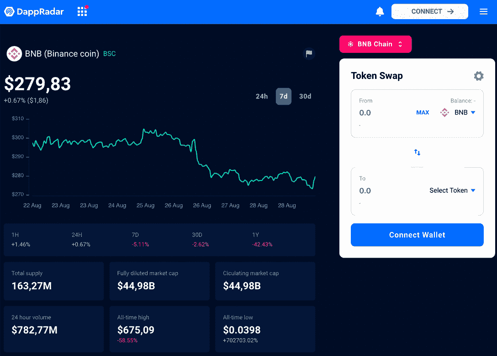
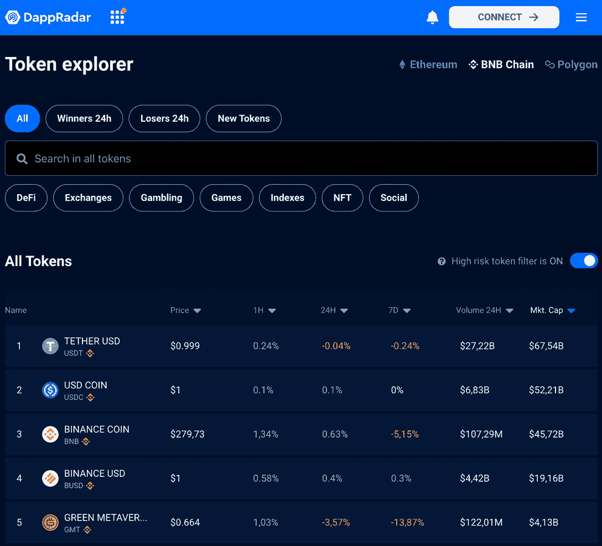

# 什么是 BNB 代币？了解所有关于币安硬币

> 原文：<https://web.archive.org/web/https://dappradar.com/blog/what-is-the-bnb-token>

## 关于币安品牌加密货币你需要知道的一切

你可能听说过 dapp 空间的 BNB 令牌，毕竟它无处不在。但这种币安加密货币超越了交易所，触及了整个生态系统的著名项目。在本指南中，你将获得关于 BNB 硬币的最常见问题的答案——你甚至会知道如何为自己的研究追踪和分析它。让我们开始吧！

## 什么是 BNB 代币？

[BNB](https://web.archive.org/web/20221208162729/https://dappradar.com/hub/token/bsc/BNB) 是币安在 2017 年创造的一种加密货币代币。它是在区块链以太坊的首次硬币发行(ICO)中作为 ERC-20 代币首次发行和推出的。然而，它作为 BEP-20 很快被转移到币安主链。

虽然 BNB 最初的总供应量被定义为 200，000，000 枚硬币，但由于定期的硬币焚烧事件，供应量逐渐减少。

[Visit DappRadar’s Token Explorer to see stats for the BNB token](https://web.archive.org/web/20221208162729/https://dappradar.com/hub/token/bsc/BNB)

正如你在 DappRadar Token Explorer 中看到的，在 2022 年 8 月，BNB token 的总供应量为 1.6327 亿美元，即使在普通的熊市中也是如此。这是市场上最重要的加密货币之一。

## 我能在哪里购买 BNB 代币？

由于这种加密货币被整合到 BNB 链中，你可以在这个网络的市场上购买它。可以推断，[币安交易所](https://web.archive.org/web/20221208162729/https://www.binance.com/en)是首选，但你也可以通过 [DappRadar 代币掉期](https://web.archive.org/web/20221208162729/https://dappradar.com/hub/swap/bsc)交易你的 bnb。

我们建议在使用任何加密货币交易所和投资市场时要谨慎。如果你很好奇，请阅读文章[区块链网络安全的 4 个技巧:在加密中保持安全。](https://web.archive.org/web/20221208162729/https://dappradar.com/blog/4-tips-on-blockchain-cybersecurity-stay-safe-in-crypto)

## BNB 币是用来做什么的？

BNB 有多种用途，但在币安交易所的生态系统中，它被用作公用令牌，允许用户在支付交易费时获得折扣。

此外，在 BNB 连锁店或币安分散交易所(DEX)进行交易时，您需要 BNB 支付汽油费。

此外，费用结构还根据交易量和账户层级而变化，因此是动态的，可以每天检查。然而，值得一提的是，它总是比在以太坊上交易便宜得多。

Crypto 用户还可以使用 BNB 支付一些现实世界的服务和项目，如 HTC 移动设备、酒店和航班，或者虚拟礼物。点击，您可以找到 BNB 目前支持[支付的所有商店列表。](https://web.archive.org/web/20221208162729/https://www.binance.com/en/bnb)

此外，持有人可以通过[币安慈善基金会](https://web.archive.org/web/20221208162729/https://www.binance.charity/) (BCF)项目向慈善机构捐款，在乌克兰危机中，该项目在 2022 年变得比以往任何时候都更加重要。

## 了解金融生态系统

最引人注目的是，币安[于 2022 年 2 月合并了币安智能连锁(BSC)和币安连锁](https://web.archive.org/web/20221208162729/https://dappradar.com/blog/binance-chain-and-binance-smart-chain-become-bnb-chain)，组建了新的 [BNB 连锁](https://web.archive.org/web/20221208162729/https://dappradar.com/rankings/protocol/binance-smart-chain)。

它是 EVM 兼容的，并有多个共识层和枢纽多链。

与此同时，土生土长的 BNB 代币也改了名字。它现在代表“建设和建设”，而他们以前只是称之为币安硬币。

所有这些都将在 BNB 连锁酒店的保护伞下实现。

*   **进一步阅读** : [什么是 BNB 链，它是如何工作的？](https://web.archive.org/web/20221208162729/https://dappradar.com/blog/what-is-bnb-chain-and-how-does-it-work)

### 用户在 BNB 链上做什么？

首先，值得一提的是，BNB 连锁店是整个行业中一些最常用的 dapps 的所在地，吸引了最多的用户钱包。

此外，BNB 连锁店在吸引用户方面处于领先地位，每天有超过 50 万个钱包连接到它的 dapps，而以太坊 dapps 大约有 75，000 个。

尽管如此，[以太坊与 BNB 链](https://web.archive.org/web/20221208162729/https://dappradar.com/blog/ethereum-vs-bnb-chain-key-differences-explained)的讨论是一场量大于质的争论。毕竟，以太坊仍然[主导着区块链空间](https://web.archive.org/web/20221208162729/https://defillama.com/chains)的资金流动。

[在 2020 年花了很多时间在 DeFi 开拓了一个稳固的利基市场后，](/web/20221208162729/https://dappradar.com/blog/binance-smart-chain-completed-14-7-million-transactions-in-one-day/) BNB 连锁店在 2021 年年中转向专注于 GameFi，Play-to-Earn 游戏和 NFT 收藏品，吸引了提供这些服务的 dapps，并迅速崛起。

PancakeSwap 等 Dapps 提供与以太坊的 Uniswap 相同的好处，而币安有自己的[品牌的 NFT 市场](https://web.archive.org/web/20221208162729/https://dappradar.com/rankings/protocol/binance-smart-chain)来经营收藏品和其他几个市场。而领先的 GameFi 平台如 [Mobox](https://web.archive.org/web/20221208162729/https://dappradar.com/binance-smart-chain/games/mobox-nft-farmer) 和 [BombCrypto](https://web.archive.org/web/20221208162729/https://dappradar.com/binance-smart-chain/games/bomb-crypto) 支撑着游戏类别。

[<picture></picture>](https://web.archive.org/web/20221208162729/https://dappradar.com/rankings/protocol/binance-smart-chain)[<picture></picture>](https://web.archive.org/web/20221208162729/https://dappradar.com/binance-smart-chain/defi/pancakeswap)[<picture></picture>](https://web.archive.org/web/20221208162729/https://dappradar.com/binance-smart-chain/defi/apeswap)

## BNB 代币性价比

正如所料，BNB 代币的价值与 BNB 生态系统中活跃钱包的数量直接相关。

今天，BNB 连锁店是区块链市场的主要参与者，在其魅力四射的领导者 CZ T1 的带领下，他成功地使网络多元化并不断吸引用户。

在 2022 年 Terra 崩溃后，BNB 链成为了第二大 DeFi 区块链。正如你在[达普拉达的 BNB 连锁报道 Q2 2022](https://web.archive.org/web/20221208162729/https://dappradar.com/blog/bnb-chain-report-q2-2022) 中读到的:

> 与其他规模较小的连锁企业相比，BNB 具有这样的弹性，这使它处于优势地位，因为它比遭受了更大打击的竞争对手更有可能恢复，而且恢复得更快。
> 
> Sara Gherghelas, analyst at DappRadar

尽管自 2022 年初以来，BNB 代币交易的数量有所减少，但我们的报告显示，该连锁店在此次熊市中是最好的之一。

## 我如何能追踪 BNB 代币？

在 web3 领域寻找机会时，了解 BNB 等代币的最新价值非常重要。

由于我们出色的 [DappRadar 代币浏览器](https://web.archive.org/web/20221208162729/https://dappradar.com/hub/tokens/bsc/all/1)，您可以跟踪 BNB 代币的价格发展，以及区块链上的其他重要代币。

[DappRadar’s Token Explorer Ranking allows you to compare tokens on the BNB Chain](https://web.archive.org/web/20221208162729/https://dappradar.com/hub/tokens/bsc/all/1)

此外，如果你对管理你在 BNB 的加密和 NFTs 感兴趣，你会很想知道 [DappRadar 投资组合跟踪器](https://web.archive.org/web/20221208162729/https://dappradar.com/hub/wallet)。

您还可以使用 [BNB 连锁排名](https://web.archive.org/web/20221208162729/https://dappradar.com/rankings/protocol/binance-smart-chain)分析 BNB 连锁的最佳 dapps 机会。

## 通过 DappRadar 继续了解 BNB 令牌

现在你更好地了解了 BNB 令牌所涉及的内容，以及它是如何与 BNB 连锁项目联系在一起的。我们 DappRadar 始终关注加密货币市场，并提供最好的教育内容。

如果你想第一个听到 [BNB 的顶级新闻和教程](https://web.archive.org/web/20221208162729/https://dappradar.com/blog/tag/bnb-chain)，请关注我们的[博客](https://web.archive.org/web/20221208162729/https://dappradar.com/blog/)、 [Youtube](https://web.archive.org/web/20221208162729/https://www.youtube.com/c/DappRadar) 频道和 [Twitter](https://web.archive.org/web/20221208162729/https://twitter.com/DappRadar) 账号。我们希望您喜欢更多地了解这种重要的加密货币，并希望您能与我们一起继续您的学习之旅！

***以上不构成投资建议。此处给出的信息仅供参考。请尽职调查并自行研究。***

 NewsletterUnsubscribe at any time. [T&Cs](https://web.archive.org/web/20221208162729/https://dappradar.com/terms) and [Privacy Policy](https://web.archive.org/web/20221208162729/https://dappradar.com/privacy-policy)