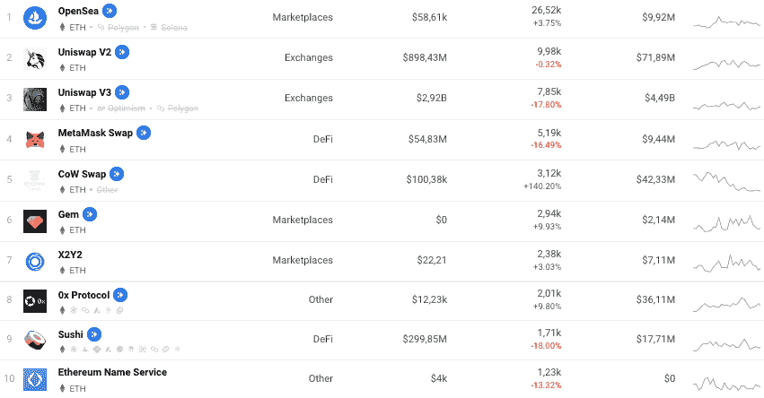

# 以太坊和比特币——有什么区别？

> 原文：<https://web.archive.org/web/https://dappradar.com/blog/what-is-the-difference-between-ethereum-and-bitcoin>

## 了解关于两种最著名的加密货币的更多信息

按市值计算，以太坊和比特币是最受欢迎的加密货币。以太坊是一种强大的分类帐技术，公司用它来构建新的程序。另一方面，比特币是一种价值储存手段，设计用于在没有银行的情况下发送和接收支付。

本文将深入探讨以太坊和比特币之间的主要区别，并简要介绍以太坊在最近的合并中从 PoW 到 PoS 的转变。让我们开始吧！

[Check ETH Price](https://web.archive.org/web/20230120062750/https://dappradar.com/hub/token/eth/ETH)

## 什么是以太坊智能合约？

以太坊智能合约在满足一定条件的情况下自动执行交易，从而省去中间人。

智能合约支持 dapps(分散式应用程序)。以太坊为运行分散的软件程序提供了基础，并且它是具有最大 dapp 生态系统的协议。

[<picture></picture>](https://web.archive.org/web/20230120062750/https://dappradar.com/rankings/protocol/ethereum)

**Source:** DappRadar´s Ethereum Dapp Rankings

以太坊平台为运行去中心化软件程序提供了基础，这些程序被称为智能合同和去中心化应用程序(dapps)。

[Discover Ethereum dapps](https://web.archive.org/web/20230120062750/https://dappradar.com/rankings/protocol/ethereum)

## 以太坊和比特币有什么不同？

以太坊和比特币在操作上有很多功能和结构上的区别。其中包括:

### 以太坊实现更快的交易

以太坊平均阻断时间 12 秒，比特币平均 10 分钟。因此，以太坊区块链实现了更快的交易。

### 比特币稀缺，以太不稀缺

比特币本质上是一种稀缺的经济模式，因为大宗奖励每四年减半。对于以太坊来说，就不一样了，因为网络每年释放的以太量是一样的。

以太坊将使用股权证明(PoS)挖掘，而比特币保留工作证明(PoW)。

### 采矿不再是以太坊的事情，而是比特币的核心

在合并之前，由于网络的 Ghost 协议和 Ethash 算法，以太坊在池挖掘方面没有优势。这种制度本质上不鼓励集中开采。

现在，在以太坊合并后，将不再有以太坊(ETH)的挖掘，因为网络已经切换到利益证明(PoS)，从而使加密矿工成为多余的。

*   阅读更多关于以太坊合并的信息

另一方面，对于比特币来说，你的设备越强大，你的挖矿操作就越有竞争力。

### 以太坊是 dapps 之王

Dapps 是加密货币行业的游戏规则改变者。它们为人们使用加密货币提供了一种实用的方式。大多数 dapps 都是用以太坊建造的。

*   了解[以太坊合并将如何影响 dapps](https://web.archive.org/web/20230120062750/https://dappradar.com/blog/how-the-ethereum-merge-will-affect-dapps)

这些平台不仅仅提供公用事业服务，也是开发者以民主的方式控制和货币化他们的创造性内容的一种方式。

因此，dapps 可以扰乱许多部门。下面是一个快速概述:

#### 赌博

以太坊游戏 dapps 每天都会吸引很多用户。许多这类游戏使用对许多人有吸引力的代币。

[Discover more](https://web.archive.org/web/20230120062750/https://dappradar.com/rankings/protocol/ethereum/category/games)

#### 投机

这些是你通常的赌博应用，并加入了区块链元素。它们运行在以太坊的分散网络上，而不是中央服务器上。

[Discover more](https://web.archive.org/web/20230120062750/https://dappradar.com/rankings/protocol/ethereum/category/gambling)

#### 挑战

分散金融(DeFi)将旧的金融产品转变为不可信的透明协议。以太坊是这场去中心化金融革命的核心，任何有互联网连接的人都可以进入。

[Discover more](https://web.archive.org/web/20230120062750/https://dappradar.com/rankings/protocol/ethereum/category/defi)

#### 交换

像流行的 uni swap 这样的分散式交易所(DEX)是建立在以太坊之上的。分散交易是开源的，允许世界上任何地方的用户在没有中间人的情况下交易密码。

[Discover more](https://web.archive.org/web/20230120062750/https://dappradar.com/rankings/protocol/ethereum/category/exchanges)

#### 收藏品

以太坊网络使得收藏品成为可能，当时该团队创建了一个名为 ERC-721 的令牌标准，特别是针对它们的铸造。他们的主要用例是 IP 所有权和资产的令牌化。

[Discover more](https://web.archive.org/web/20230120062750/https://dappradar.com/nft/protocol/ethereum)

#### 市场

市场是允许用户买卖 NFT 的平台。目前建立在以太坊上的最主要的 NFT 市场是 OpenSea。

[Discover more](https://web.archive.org/web/20230120062750/https://dappradar.com/rankings/protocol/ethereum/category/marketplaces)

#### 社会的

以太坊网络是开发者在构建去中心化社交媒体时的宠儿。这是由于它的受欢迎程度和庞大的用户群。

[Discover more](https://web.archive.org/web/20230120062750/https://dappradar.com/rankings/protocol/ethereum/category/social)

## 以太坊和比特币哪个好？

以太坊的关键优势是 dapps 给这个行业带来的多功能性。Dapps 允许不使用加密的人进入这个领域，从而推动更多的采用。

尽管比特币仍然是占主导地位的货币，并成为一种更具储值性/投机性的资产，但以太坊 dapps 的实用价值有着光明的未来。

## 随身携带您的 Web3 之旅

使用 DappRadar 移动应用程序，再也不会错过 Web3。查看最受欢迎的 dapps 的性能，并关注您投资组合中的 NFT。您在 DappRadar 上的帐户会与我们的移动应用程序同步，这样您很快就可以选择实时接收提醒。

[Download the DappRadar app now](https://web.archive.org/web/20230120062750/https://dappradar.app.link/blog)[<picture></picture>](https://web.archive.org/web/20230120062750/https://play.google.com/store/apps/details?id=com.portfolio.dappradar)