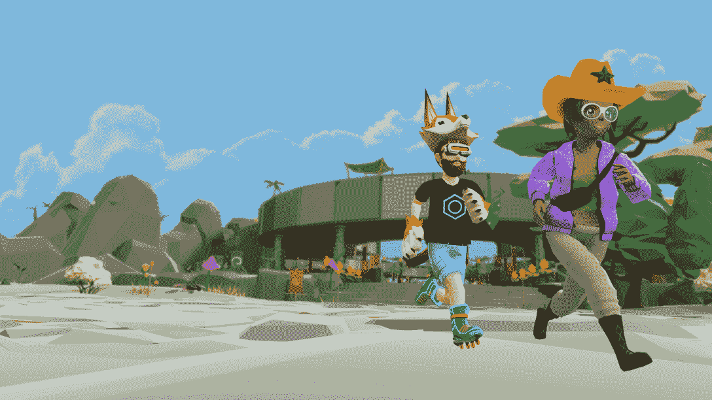
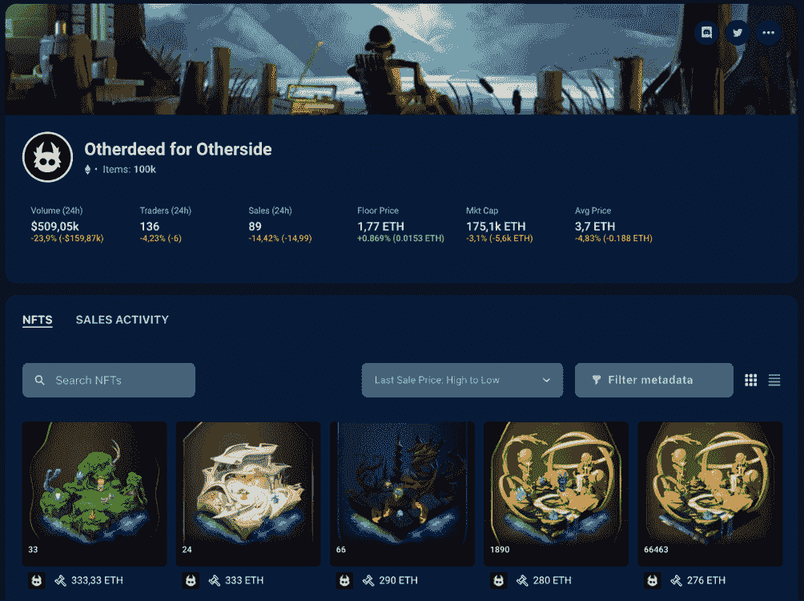

# 什么是元宇宙:下一代虚拟世界

> 原文：<https://web.archive.org/web/https://dappradar.com/blog/what-is-the-metaverse>

## 通过这本由 DappRadar 编写的终极指南，了解你需要了解的关于元宇宙的一切

元宇宙是 Web3 新世界中最令人兴奋的景观之一。大多数人都知道玩即赚游戏和****。几乎每个人都听说过加密货币和** [**DeFi**](https://web.archive.org/web/20221209152823/https://dappradar.com/defi) **。元宇宙包含所有这些部门，甚至更多。令人兴奋的是，这才刚刚开始。****

 **区块链技术使人们能够创造互联网的下一次迭代。有人称之为 Web3，也有人称之为元宇宙。这种新形式的不同之处在于，普通人会为它的发展贡献多少。

**内容**

*   **[什么是元宇宙？](https://web.archive.org/web/20221209152823/https://dappradar.com/blog/what-is-the-metaverse/#what-is)**
*   **[谁拥有元宇宙？](https://web.archive.org/web/20221209152823/https://dappradar.com/blog/what-is-the-metaverse/#who-owns)**
*   **[你怎么能访问元宇宙？](https://web.archive.org/web/20221209152823/https://dappradar.com/blog/what-is-the-metaverse/#access-metaverse)**
*   **[最好的元宇宙虚拟世界有哪些？](https://web.archive.org/web/20221209152823/https://dappradar.com/blog/what-is-the-metaverse/#What-are-the-best-Metaverse-virtual-lands?)**
*   **[入多少钱？](https://web.archive.org/web/20221209152823/https://dappradar.com/blog/what-is-the-metaverse/#cost-enter)**
*   在元宇宙你能做什么？
*   **[知名品牌跃入元宇宙](https://web.archive.org/web/20221209152823/https://dappradar.com/blog/what-is-the-metaverse/#Famous-brands-jumping-into-the-Metaverse)**
*   元宇宙有自己的加密货币吗？
*   **[元宇宙为什么建在区块链上？](https://web.archive.org/web/20221209152823/https://dappradar.com/blog/what-is-the-metaverse/#why-blockchain)**
*   **[DappRadar 具体有哪些关于元宇宙的内容？](https://web.archive.org/web/20221209152823/https://dappradar.com/blog/what-is-the-metaverse/#dappradar-content)**

## 什么是元宇宙？

元宇宙是所有使用区块链技术建造的虚拟世界的集合。它们可以是游戏星球、NFT 画廊、T2 博物馆或数字街道。

当你想到元宇宙时，要记住的主要事情是它不是一个地方。它是新数字空间的集合，人们称之为下一代互联网。

[媒体公司](https://web.archive.org/web/20221209152823/https://dappradar.com/blog/vice-media-group-unveils-hq-in-decentraland)、[音乐出版商](https://web.archive.org/web/20221209152823/https://dappradar.com/blog/the-sandbox-welcomes-warner-music-group)、[运动服装品牌](https://web.archive.org/web/20221209152823/https://dappradar.com/blog/adidas-enters-the-metaverse-joins-the-sandbox)和[加密货币分析平台](https://web.archive.org/web/20221209152823/https://dappradar.com/hub/assets/eth/0x5cc5b05a8a13e3fbdb0bb9fccd98d38e50f90c38/127656)都在元宇宙有业务。同样如此的还有[摇滚明星](https://web.archive.org/web/20221209152823/https://dappradar.com/blog/game-company-ubisoft-brings-raving-rabbids-into-the-sandbox)、[说唱歌手](https://web.archive.org/web/20221209152823/https://dappradar.com/blog/snoop-dogg-launching-nft-avatars-in-the-sandbox/)、[爱心熊](https://web.archive.org/web/20221209152823/https://dappradar.com/blog/the-sandbox-land-valuation-report)和[蓝精灵](https://web.archive.org/web/20221209152823/https://dappradar.com/blog/10-big-brands-that-recently-joined-the-nft-space)。所以这是一个宽敞的教堂，每个人都有空间。

元宇宙与“第二人生”和“《我的世界》”等在线社交平台的不同之处在于集权和分权之间的空间。

这些早期的数字空间被一家公司从他们自己的服务器上严格控制。每次你离开他们的世界去一个不同的世界，你都需要注册一个新的身份。

元宇宙允许你使用一个单一的身份穿越和穿越不断增长的虚拟景观网络。这使得它更像真实世界的一面镜子。当你去一个新的城镇、城市和国家旅行时，你不需要每次到达一个新的目的地都需要一本新护照。

## 谁拥有元宇宙？

问谁拥有元宇宙有点像问谁拥有互联网。没有一个人或组织能完全控制元宇宙。相反，有多个利益相关者和开发人员，他们一起创建了元宇宙。

也就是说，一些平台不可避免地要成为通往元宇宙的门户。通过区块链技术，这些平台赋予用户在元宇宙内化身的能力。

但是，尽管像沙盒和 T2 这样的地方作为虚拟生态系统存在，T4 的创造者可以建立和管理他们自己的部分。如果一个人或一家公司创造了一个人们想去的娱乐场所，他们可以从中获利并保持收入。

因此，尽管一些公司充当某些虚拟世界的看门人，但在那个世界里，每个人都是所有者。无论你拥有土地、游戏内资产、头像还是数码时尚物品，区块链科技都会给你最终的所有权。

此外，元宇宙平台拥有[治理令牌](https://web.archive.org/web/20221209152823/https://dappradar.com/blog/illuvium-governance-token-and-staking-opportunities)，赋予持有者决策权。取决于一个人拥有多少代币，他们将在平台如何发展上有更多或更少的[发言权。](https://web.archive.org/web/20221209152823/https://dappradar.com/blog/the-curve-wars-explained-when-defi-becomes-aggressive)

## 你怎样才能到达元宇宙？

首先，你需要知道你想进入哪个元宇宙平台。有数百个这样的虚拟世界，而且每天都有更多的虚拟世界被开发出来。

正如我们已经看到的，进入元宇宙通常会有相关的成本。你可能需要铸造一个新的头像，在二级市场上找一个，或者买一个[游戏中的物品](https://web.archive.org/web/20221209152823/https://dappradar.com/hub/nft-explorer/collection/revv-motorsport)作为 NFT 来凑热闹。

另一种进入元宇宙的方法是购买工具，这些工具允许你通过自己的协议进入。 [Metakey](https://web.archive.org/web/20221209152823/https://dappradar.com/blog/metakey-introduce-new-virtual-world-new-ganymede) 比如在多个虚拟世界拥有土地的平台。他们有一张 [NFT](https://web.archive.org/web/20221209152823/https://dappradar.com/hub/assets/eth/0x10daa9f4c0f985430fde4959adb2c791ef2ccf83/2) ，持有者可以使用 Metakey 的元宇宙土地。

Metakey 也有自己的虚拟世界，名为 New Ganymede，它是“品牌和社区的家园，愿景的证明，以及通往元宇宙最明亮世界的桥梁”。

## 元宇宙最好的虚拟世界是什么？

如你所知，有许多不同的虚拟世界适合元宇宙。因为它们都是不同的，你可以[使用 DappRadar 来研究这些虚拟世界](https://web.archive.org/web/20221209152823/https://dappradar.com/rankings/category/games)来发现适合你的那个。

以下是目前构建下一代互联网的一些最受欢迎和最大的虚拟世界:

### 沙盒

沙盒是领先的游戏化虚拟世界之一，无论是在强大的合作伙伴关系还是活跃用户数量方面。它由[多边形区块链](https://web.archive.org/web/20221209152823/https://dappradar.com/rankings/protocol/polygon)驱动，允许玩家创建、实验 3D 体素资产和土地，并从中获得乐趣。

> 沙盒直播特邀嘉宾:塞巴斯蒂安·博格特[https://t.co/MxRmtKffst](https://web.archive.org/web/20221209152823/https://t.co/MxRmtKffst)
> 
> — DappRadar (@DappRadar) [September 1, 2022](https://web.archive.org/web/20221209152823/https://twitter.com/DappRadar/status/1565369077195210752?ref_src=twsrc%5Etfw)

*   **阅读了解更多** : [什么是沙盒&如何加入元宇宙](https://web.archive.org/web/20221209152823/https://dappradar.com/blog/what-is-the-sandbox-how-to-join-the-metaverse)

### 分散土地

在所有开放世界和经济的元对比中，[去中心化](https://web.archive.org/web/20221209152823/https://dappradar.com/ethereum/games/decentraland)一直处于最前沿。虽然杜嘉班纳和可口可乐已经加入进来，但也有成千上万的人购买了他们在 NFT 的虚拟土地。

Source: Decentraland

拥有生态系统的[法力令牌](https://web.archive.org/web/20221209152823/https://dappradar.com/hub/token/eth/MANA)的玩家也可以参与项目的治理。这只是对这个领先的元宇宙的介绍，但如果你想了解更多，我们建议阅读[什么是分散化的土地，元宇宙的开放世界经济](https://web.archive.org/web/20221209152823/https://dappradar.com/blog/what-is-decentraland-an-open-world-economy-in-the-metaverse)。

### 对方当事人

仍在开发中，但已经是有史以来最令人期待的元宇宙世界之一，的另一边是另一个宇迦实验室的创造——如[无聊猿游艇俱乐部](https://web.archive.org/web/20221209152823/https://dappradar.com/hub/nft-explorer/collection/bored-ape-yacht-club)。虽然另一边没有推出，但其名为 [Otherdeed](https://web.archive.org/web/20221209152823/https://dappradar.com/hub/nft-explorer/collection/otherdeed-for-otherside) 的动态土地 NFTs 在几分钟内就销售一空，尽管汽油费飙升。

> “我们可以建造一个数千人互动的城市——这就像《侠盗猎车手》的水平，但却是与真正的玩家实时互动。”
> 
> Bored Apes co-founder Gordon Goner to TechCrunch

虽然另一边会带来什么仍然是一个谜，但众所周知，NFT 和土地所有者将在这个元宇宙拥有最大的发言权。

### 其他需要了解的虚拟世界

虽然上面三个可能是 2022 年最著名的虚拟世界，元宇宙是巨大的，拥有许多秘密。其他值得了解的元宇宙世界包括:

*   [体素](https://web.archive.org/web/20221209152823/https://dappradar.com/ethereum/collectibles/voxels)
*   第二
*   [Bloktopia](https://web.archive.org/web/20221209152823/https://dappradar.com/polygon/games/bloktopia)
*   [Mirandus](https://web.archive.org/web/20221209152823/https://dappradar.com/ethereum/games/mirandus)
*   [全球韦伯](https://web.archive.org/web/20221209152823/https://dappradar.com/ethereum/collectibles/worldwide-webb-land)
*   [幽灵星系](https://web.archive.org/web/20221209152823/https://dappradar.com/polygon/collectibles/phantom-galaxies-origin)
*   [等值](https://web.archive.org/web/20221209152823/https://dappradar.com/blog/meet-isotile-the-cutest-virtual-room-in-the-metaverse)
*   [索姆空间](https://web.archive.org/web/20221209152823/https://dappradar.com/ethereum/games/somnium-space)
*   [俏皮岛](https://web.archive.org/web/20221209152823/https://dappradar.com/hub/nft-explorer/collection/nifty-island-legendary-palms)
*   [星图](https://web.archive.org/web/20221209152823/https://dappradar.com/solana/games/star-atlas)

## 入场费是多少？

这取决于你在哪个平台上，当你在那里的时候你想做什么。有些虚拟世界可以自由走动。但是如果你想[参与活动](https://web.archive.org/web/20221209152823/https://www.vogue.co.uk/fashion/article/metaverse-fashion-week-takeaways)，拥有一块[数字土地](https://web.archive.org/web/20221209152823/https://dappradar.com/hub/nft-explorer/collection/worldwidewebbland)，或者继续[游戏内任务](https://web.archive.org/web/20221209152823/https://dappradar.com/blog/the-sandbox-to-launch-second-play-to-earn-alpha-season/)，你可能需要放弃一些现金。

要在虚拟世界中四处走动并与其他人互动，你通常需要一个虚拟角色。这些将花费你钱去造币厂——你最少要付的是汽油费。一个[分散的](https://web.archive.org/web/20221209152823/https://dappradar.com/ethereum/games/decentraland)化身消耗 100 [法力](https://web.archive.org/web/20221209152823/https://dappradar.com/hub/token/eth/MANA?from=0x0f5d2fb29fb7d3cfee444a200298f468908cc942)加毒气。对于 [NFT 世界](https://web.archive.org/web/20221209152823/https://dappradar.com/ethereum/games/nft-worlds)，你需要花费 0.4 ETH 来铸造你的头像。

在底特律买一块地要花 100 多万美元。一个用户花了 862，998.42 美元在沙箱里买了一个 [24×24 的庄园。即使加密货币的价值最近暴跌，](https://web.archive.org/web/20221209152823/https://dappradar.com/hub/assets/eth/0xf17131a4c85e8a75ba52b3f91ce8c32f6f163924/68)[元宇宙的土地仍然昂贵](https://web.archive.org/web/20221209152823/https://dappradar.com/blog/dappradar-metaverse-report-1-virtual-worlds-soulbound-tokens-and-more/)。

在虚拟世界中购买一块土地的好处是，它将永远属于你。它以 [NFT](https://web.archive.org/web/20221209152823/https://dappradar.com/nft) 的形式出现，所以它不能被复制或窃取(除非你是漏洞利用的受害者)。

一旦你在元宇宙拥有了一些土地，你就可以创造自己的小世界供人们参观。作为一名创作者，如果人们买你卖的东西，你甚至可以赚钱。

## 在元宇宙你能做什么？

所有的元宇宙平台都略有不同。有些是为游戏而建，有些则专注于教育。元宇宙的一些地方是公司做广告和销售产品的数字店面。

你可以在元宇宙参加会议、[时装秀](https://web.archive.org/web/20221209152823/https://dappradar.com/blog/three-fashion-nft-collections-generate-137-5-million-in-three-months)、[工作会议](https://web.archive.org/web/20221209152823/https://dappradar.com/blog/into-the-metaverse-visa-facebook-steve-aoki-and-lionel-messi/)、[体育赛事](https://web.archive.org/web/20221209152823/https://dappradar.com/blog/esport-platform-chain-games-brings-ecosystem-into-the-sandbox)和[象棋比赛](https://web.archive.org/web/20221209152823/https://dappradar.com/blog/magnus-carlsen-and-the-sandbox-move-chess-into-the-metaverse)。2022 年，一对生活在阿联酋的夫妇决定在分散的土地上举行他们的婚礼，并邀请来自世界各地的客人参加。

除了用户不在现场带来的明显限制，似乎人们在元宇宙所能做的唯一限制是我们的集体想象力。

可能性几乎是无限的，未来五到十年将是一个令人兴奋的时期，因为人们会尝试这种形式。

所有虚拟世界都有一个共同点，那就是它们试图吸引观众。最好的方法是提供娱乐。因此，理论上，元宇宙应该是一个有趣而充满活力的地方，每个人都可以在那里找到自己的位置。

## 知名品牌跃入元宇宙

然而，元宇宙的对话并不局限于 Web3 项目。事实上，元宇宙虚拟世界是这个泡沫之外最受欢迎的区块链项目。

许多著名的传统或网络品牌已经公开表示支持这项技术，甚至建立自己的元宇宙。

最令人期待的是迪士尼公司本身，该公司一直在与一个团队合作开发一个与元宇宙相关的项目。

育碧、环球音乐集团、阿迪达斯、苏富比、三星和许多其他公司也追随元宇宙的潮流，与虚拟世界成功合作。

## 元宇宙有自己的加密货币吗？

是的，元宇宙有加密货币。但是每个虚拟世界都有自己的一个，它们的价值都不一样。

DappRadar 列出了 5 种最好的元宇宙硬币，当你想知道哪些代表了潜在的投资机会时，这是一个很好的开始。

与所有加密货币一样，虚拟世界中的本地代币的价值[可能会上下波动](https://web.archive.org/web/20221209152823/https://dappradar.com/blog/like-the-internet-the-metaverse-cant-die)。在 2021 年 11 月牛市高峰期间，分散地和沙盒的代币价格分别为 5.85 美元和 8.40 美元。

*   现在查看一下[法力](https://web.archive.org/web/20221209152823/https://dappradar.com/hub/token/eth/MANA?from=0x0f5d2fb29fb7d3cfee444a200298f468908cc942)和[沙子](https://web.archive.org/web/20221209152823/https://dappradar.com/hub/token/eth/SAND?from=0x3845badade8e6dff049820680d1f14bd3903a5d0)的价格，你会看到它们下降了多少。

## 为什么元宇宙建在区块链上？

为了让一个真正去中心化的元宇宙存在，我们需要一个开放的网络来共同确认每个人拥有、出售、购买和交换的东西。

这就是区块链发挥作用的地方。这是一个分布式的记录分类账，没有一个实体可以控制，也没有人可以单方面重写。每个人加在一起，就是一个验证者的网络。

这个系统不依赖于信任，而是依赖于数学确定性。它是成千上万开发人员创建各种应用程序的基础，这些应用程序共同构成了元宇宙。

元宇宙的伟大之处在于，你只需要一个 Web3 钱包，也就是你的数字身份，就可以在成千上万个不同的虚拟世界中玩游戏。[了解如何获得一个 Web3 钱包](https://web.archive.org/web/20221209152823/https://dappradar.com/blog/best-cryptocurrency-wallets-for-2022)并把它作为自己的元宇宙护照。

## 达普拉达有哪些关于元宇宙的具体内容？

DappRadar 是世界上的 Dapp 商店，因此我们跟踪数据并记录有关数千个分散平台的信息。作为 Web3 领域的重要组成部分，元宇宙是我们的重点关注领域。

[https://web.archive.org/web/20221209152823if_/https://www.youtube.com/embed/G1r8q0tq1_0?feature=oembed](https://web.archive.org/web/20221209152823if_/https://www.youtube.com/embed/G1r8q0tq1_0?feature=oembed)

What is the Metaverse?

你可以通过访问我们的 [dapps 排名页面](https://web.archive.org/web/20221209152823/https://dappradar.com/rankings)来了解元宇宙平台的表现。

我们博客的[元宇宙版块有数百篇关于该行业的见解、新闻和教育的文章。我们还提供了一份](https://web.archive.org/web/20221209152823/https://dappradar.com/blog/category/metaverse)[元宇宙报告](https://web.archive.org/web/20221209152823/https://dappradar.com/blog/dappradar-metaverse-report-1-virtual-worlds-soulbound-tokens-and-more)，其中我们强调了该领域的趋势并跟踪了其发展。

### 使用 DappRadar 追踪元宇宙土地 NFTs

如果你对元宇宙的虚拟房地产感兴趣，你会很高兴地知道 [DappRadar 的 NFT 收藏浏览器](https://web.archive.org/web/20221209152823/https://dappradar.com/hub/nft-explorer)为你提供了极好的见解。

例如，你可以使用各种过滤器来发现在元宇宙另一边给自己买一个 [Otherdeed](https://web.archive.org/web/20221209152823/https://dappradar.com/hub/nft-explorer/collection/otherdeed-for-otherside) 的最佳交易。

[DappRadar’s NFT Collection Explorer](https://web.archive.org/web/20221209152823/https://dappradar.com/hub/nft-explorer)

如果你想在[分散土地](https://web.archive.org/web/20221209152823/https://dappradar.com/hub/nft-explorer/collection/decentraland)和[沙盒](https://web.archive.org/web/20221209152823/https://dappradar.com/hub/nft-explorer/collection/the-sandbox)上探索土地 NFT，情况也是如此。此外，您还可以使用我们的 [NFT 浏览器](https://web.archive.org/web/20221209152823/https://dappradar.com/hub/nft-explorer)来研究元宇宙最佳平台的最新销售活动。

## 随身携带您的 Web3 之旅

使用 DappRadar 移动应用程序，再也不会错过 Web3。查看最受欢迎的 dapps 的性能，并关注您投资组合中的 NFT。您在 DappRadar 上的帐户会与我们的移动应用程序同步，这样您很快就可以选择实时接收提醒。

[Download the DappRadar app now](https://web.archive.org/web/20221209152823/https://dappradar.app.link/blog)[<picture></picture>](https://web.archive.org/web/20221209152823/https://play.google.com/store/apps/details?id=com.portfolio.dappradar)**