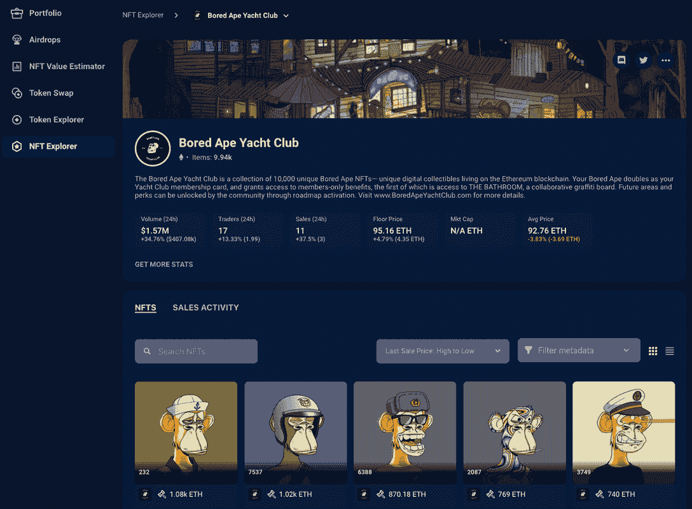
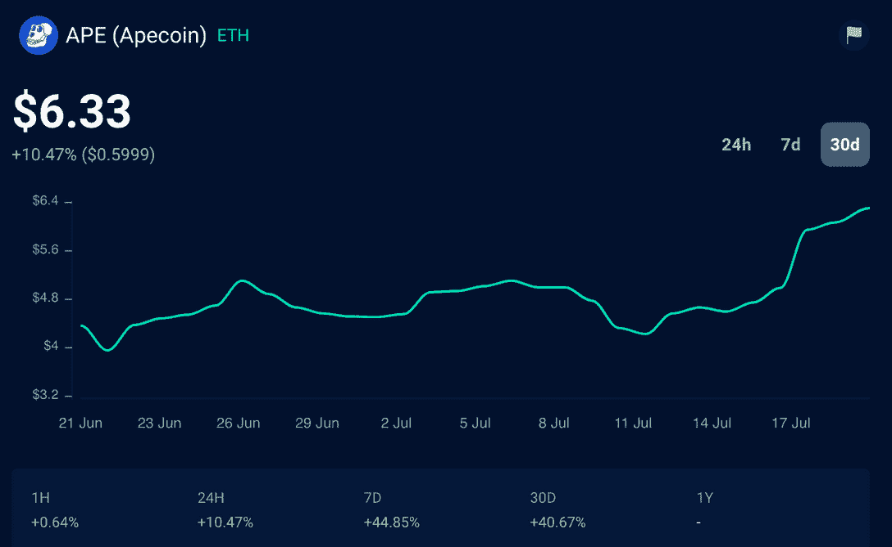
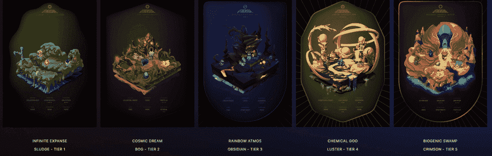
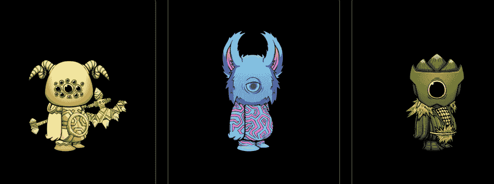

# 元宇宙的另一面是什么&它是如何工作的？

> 原文：<https://web.archive.org/web/https://dappradar.com/blog/what-is-the-otherside-metaverse-how-does-it-work>

## 了解你需要的关于宇迦实验室的“彼岸元宇宙”项目的一切，该实验室是无聊猿游艇俱乐部 NFT 收藏的创造者

宇迦实验室的另一个项目想成为所有元对 T2 的元宇宙。一个无缝链接，将数字资产的互操作性推向前台，并将[宇迦实验室](/web/20220813162600/https://dappradar.com/blog/how-yuga-labs-nfts-became-a-dominant-force-with-an-8-1b-market-cap/) [NFT 收藏](https://web.archive.org/web/20220813162600/https://dappradar.com/blog/what-are-non-fungible-tokens-nfts)社区聚集在一个屋檐下，参与数字经济和人类互动的新领域。

7 月 16 日星期六，4500 多名其他 NFT 地主第一次突破到另一边。更重要的是，在完成第一次旅行后，[宇迦实验室](/web/20220813162600/https://dappradar.com/blog/how-yuga-labs-nfts-became-a-dominant-force-with-an-8-1b-market-cap/)发布了一份由九部分组成的简装论文，解释了第一次旅行在更大的彼岸叙事中的位置。这进一步揭示了第一次旅行标志着一个 11 部分故事情节的开始。

[https://web.archive.org/web/20220813162600if_/https://www.youtube.com/embed/qt1equGhkQE?feature=oembed](https://web.archive.org/web/20220813162600if_/https://www.youtube.com/embed/qt1equGhkQE?feature=oembed)

除此之外，关于这个项目的信息很少被披露，就像所有的新技术一样，人们有疑问是很自然的。[幸运的是，DappRadar 已经覆盖了你的](https://web.archive.org/web/20220813162600/https://dappradar.com/blog/what-is-the-metaverse)。

在这篇文章中，我们回答了关于另一面的最常见的问题。更重要的是，随着发布日期的临近和更多信息的披露，本文将不断更新。

*   元宇宙的另一边是什么？
*   谁是宇迦实验室？
*   [什么是无聊猿游艇俱乐部(BAYC)？](https://web.archive.org/web/20220813162600/https://dappradar.com/blog/what-is-the-otherside-metaverse-how-does-it-work/#What-is-the-Bored-Ape-Yacht-Club-(BAYC)?-)
*   [APE coin(猿)是什么？](https://web.archive.org/web/20220813162600/https://dappradar.com/blog/what-is-the-otherside-metaverse-how-does-it-work/#What-is-ApeCoin-(APE)?-)
*   什么是其他行为？
*   Otherdeeds 地块的新价格是多少？
*   什么是 Koda？
*   什么是彼岸市场？
*   哪些 NFT 系列将与另一边兼容？
*   谁在建设元宇宙的另一边？
*   在另一边人们会做什么？
*   另一边的未来会怎样？
*   我怎样才能参与到另一方呢？

## 元宇宙的另一边是什么？

由于其游戏化计划和与 Animoca 品牌的联系，Otherside 是最受期待的[元宇宙项目](https://web.archive.org/web/20220813162600/https://dappradar.com/blog/what-is-the-metaverse)之一。此外，宇迦实验室打算让他们无聊的猿元宇宙成为 MMORPG，连接更广阔的 NFT 宇宙。

该平台将把 NFTs 转变成可玩的角色，而收集者可以在这个开放世界的游戏中拥有土地，并参与各种生态系统。

宇迦实验室正在寻求建立一个统治所有这些实验室的元宇宙，并且已经通过其精明的收购和市场行动开始塑造 Web3。从购买知识产权到[密码朋克和 Meebits](/web/20220813162600/https://dappradar.com/blog/yuga-labs-takeover-pushes-cryptopunk-meebit-sales-1000/) 到 ApeCoin drop。

现在，宇迦希望将这一切融入另一面，为用户提供一种可互操作的体验，让他们能够在元和元之间移动。

## 谁是宇迦实验室？

宇迦实验室是一家区块链的技术公司，开发 NFT 和数字收藏品。它由 Wylie Aronow 和 Greg Solano 于 2021 年创立，总部位于佛罗里达州迈阿密。

2021 年 4 月 28 日，宇迦实验室推出了 [Bored Ape 游艇俱乐部](https://web.archive.org/web/20220813162600/https://dappradar.com/ethereum/collectibles/bored-ape-yacht-club) (BAYC)，成为 NFTs 历史上最重大的项目之一。与 [CryptoPunks](https://web.archive.org/web/20220813162600/https://dappradar.com/ethereum/collectibles/cryptopunks) 一起，它引领了 NFT 的炒作，在 2021 年看到了创纪录的交易量。

因此，当宇迦实验室宣布获得 CryptoPunks 和 Meebits 的知识产权时，整个密码社区陷入了狂热。

宇迦实验室在披露其元宇宙计划后再次成为头条新闻。包括 ApeCoin 和 Otherside，BAYC 生态系统的元宇宙项目。2022 年 3 月下旬，宇迦实验室完成了一轮融资，筹集了 4.5 亿美元，估值为 40 亿美元。安德森·霍洛维茨在这一轮中领先。其他投资者包括 CoinBase、 [Animoca Brands](/web/20220813162600/https://dappradar.com/blog/bored-ape-yacht-club-teams-up-with-animoca-brands-on-p2e-game/) 、三星和谷歌风投。

宇迦实验室在一年多一点的时间里，从推出薄荷价为 0.08 ETH 或 210 美元的 NFT 系列，发展成为价值 40 亿美元的领先 Web3 品牌。换句话说，宇迦实验室是一个强大而有影响力的组织，与加密和 NFT 领域几乎所有最大的公司都有联系。

## 什么是无聊猿游艇俱乐部(BAYC)？

[无聊猿游艇俱乐部(BAYC)](https://web.archive.org/web/20220813162600/https://dappradar.com/hub/nft-explorer/collection/bored-ape-yacht-club) 是一万个独特的无聊猿 NFT 的集合。4 月 23 日，宇迦实验室推出了 BAYC mint，最终销售定于 5 月 1 日。

最初的底价是 0.08 ETH(约合 240 美元)。几个月后，2021 年 8 月，地板破了 44 ETH(约合 13.7 万美元)。如今，这个项目价值数十亿美元。

然而，BAYC 只是一个起点。2021 年 6 月 18 日，宇迦实验室为无聊猿持有者推出了一个名为无聊猿养狗俱乐部(BAKC)的衍生系列。

然后他们在 2021 年 8 月 28 日成立了变异猿游艇俱乐部(MAYC)。来自这两个收藏的 NFT 很快在二级市场上以数万美元的价格售出，一些世界上最有影响力的人开始购买它们。

[Discover, track and get BAYC NFTs on DappRadar](https://web.archive.org/web/20220813162600/https://dappradar.com/hub/nft-explorer/collection/bored-ape-yacht-club)

## ApeCoin(猿)是什么？

猿币(Ape)是一种 ERC-20 代币，创建于区块链以太坊，将作为 BAYC 生态系统的本地公用事业和治理货币。重要的是，那些想在另一边元宇宙购买土地的人必须用猿币支付。

然而，在写作时，没有明确的迹象表明 APE 将在元宇宙扮演什么角色。

在更广泛的 BAYC 生态系统中，持有 Ape 币使持有者能够参与 DAO 的管理，并独家访问生态系统的功能，如游戏、活动、商品和服务。

[Track APE on DappRadar](https://web.archive.org/web/20220813162600/https://dappradar.com/hub/token/eth/APE?from=0x4d224452801aced8b2f0aebe155379bb5d594381)

## 什么是其他行为？

Otherdeeds 是元宇宙另一边的一块土地的名字。它们是作为游戏元素的集合而构建的动态 NFT。每个其他的行为都有一系列的资源；一些 Koda，我们将在这里详细介绍。

关于 Otherdeeds 的一个值得注意的事情是，它们被认为是动态的 NFT。这意味着另一个角色的特征可以根据你在游戏中的表现而改变。拥有可互换的特征意味着增加或减少土地资源的机会，从而为每种物品创造一个二级市场。

在其他地块上可以发现五个主要特征:

1.  环境
2.  沉淀物
3.  资源(动态)
4.  工件(动态)
5.  柯达(动态)

每个 Otherdeed 地块都有一个环境和沉积物，资源、神器和 Kodas 是可互换的特征。关于稀有性，科达和人工制品是在这片土地上发现的最意想不到的东西，科达是在 10%的 Otherdeeds 地块上发现的生物。

## Otherdeeds 地块的新价格是多少？

每份契约的费用定在 305 便士。在铸造过程中，APE 的价值约为 20 美元，而其他每一个在发行时的价格约为 6100 美元。这个过高的价格点并没有阻止任何人购买，以太坊网络天然气价格未能跌至 1 ETH 以下，当时为 2750 美元。

## Koda 是什么？

在由其他生物组成的生态系统中生活着科达。宇迦实验室称他们是“引领我们进入另一个世界”的生物此外，围绕科达的叙述故意含糊不清，因为用户不应该确切知道他们是什么或他们为什么存在——除此之外，他们与另一边的土地有联系。

该公司表示，任何遇到 Koda 的人都应该小心。“我们不知道他们为什么把我们带到这里，也不知道他们对这片土地的感情。”宇迦说:“如果你有幸遇到科达，小心行事。”。

## 什么是彼岸市场？

彼岸市场是买卖游戏内资产的中心枢纽。猿币将是唯一用于交易的货币，开发者可以使用 [SDK](https://web.archive.org/web/20220813162600/https://otherside.xyz/sdk) 来创建角色、装备、工具、建筑和游戏。这些也可以在市场上买卖。

## 哪些 NFT 系列将与另一边兼容？

上市的系列将会有 3D 模型在发布时作为可玩的角色。其他未列出但属于更广泛的宇迦家族的集合，如 World of Women、Toadz 等，可以使用 Otherside SDK 导入或创建。

*   无聊猿游艇俱乐部
*   变异猿游艇俱乐部
*   无聊猿养狗俱乐部
*   密码朋克
*   米比特

## 谁在建造元宇宙的另一边？

虽然许多猜测和炒作都集中在土地和 NFT 收藏在彼岸生态系统中的潜在价值，但将这一切联系在一起的一个关键因素是实际的游戏性。更值得注意的是，创建了一个元宇宙平台，可以同时处理数千名玩家，并以足够快的帧速率让任何人都不会掉队。

为此，[宇迦正在与一家英国元宇宙技术公司 impossible](https://web.archive.org/web/20220813162600/https://www.improbable.io/blog/otherside-metaverse-game-is-coming-normal-rules-do-not-apply)合作，该公司帮助合作伙伴实现丰富、强大的虚拟世界，同时也是 M squared 的创始人。在游戏中超过十年，超过 10，000 名工人，相当于超过 5 亿美元的加薪，[不可能是被选中的合作伙伴，以促进另一边元宇宙](https://web.archive.org/web/20220813162600/https://twitter.com/DCLBlogger/status/1548841347523952641)。

除了 Animoca Brand 在将项目推向市场方面的广博知识和 a16z 的财务支持。这个队看起来相当健壮。

同样值得一提的是，2016 年，implementable 与 Google 合作，2017 年，他们发布了 SpatialOS 开放测试。基于这项技术的第一款游戏是《世界漂流》和《替罪羊》。

《Fall Guys》在 Steam 上销量超过 700 万部，成为 Playstation 上下载量最高的游戏。随着 4500 多名玩家来到元宇宙测试其功能，早期的游戏结果对另一方来说看起来棒极了

> 关于 [@OthersideMeta](https://web.archive.org/web/20220813162600/https://twitter.com/OthersideMeta?ref_src=twsrc%5Etfw) 的喋喋不休，关于[@ implebable io](https://web.archive.org/web/20220813162600/https://twitter.com/Improbableio?ref_src=twsrc%5Etfw)，
> 
> 1000 多名员工，从 2012 年开始，筹集了 5 亿多美元，
> 
> 让我们深入了解这个巨人，
> 
> 1/[pic.twitter.com/B2443wYv4P](https://web.archive.org/web/20220813162600/https://t.co/B2443wYv4P)
> 
> — Matty (@DCLBlogger) [July 18, 2022](https://web.archive.org/web/20220813162600/https://twitter.com/DCLBlogger/status/1548841270579445760?ref_src=twsrc%5Etfw)

## 在另一边人们会做什么？

这可能是最大的未解之谜，因为事实上，没人知道人们在另一边会做些什么。当然，团队会列出挑战、游戏性和引导体验的叙述。尽管如此，这块土地和 NFT 的所有者将塑造另一边元宇宙的未来。

在这方面，NFT 收藏家可以在这个开放世界的游戏中拥有土地，收获资源，并探索文物和稀有人物。

我们知道《另一边的元宇宙》游戏遵循一个故事情节，在这个故事情节中，一场宇宙地震震动了整个宇宙，带来了一个关于科达的过去的景象，事情开始变得有趣起来。

不可思议将在 M 网络上开发另一面，创造一个开放的元宇宙，社区可以在其上建立和拥有独特的角色和经历。另一边元宇宙项目背后的团队还声称，超过 10，000 人将能够同时一起玩游戏，并通过语音聊天进行互动。

总结它可能会变成什么样，最直接的方法是将它与欧内斯特·克莱恩(Ernest Cline)的畅销书《一号玩家》(Ready Player One)中描绘的元宇宙世界进行比较。

## 另一边的未来会怎样？

考虑到宇迦实验室在如此短的时间内声名鹊起，彼岸项目最令人兴奋的方面将是未来会发生什么。宇迦及其合作伙伴对 Otherdeeds 和 Kodas 一直讳莫如深，因此目前看来，Animoca 和 Improbable 的潜力似乎是无限的——尤其是在与 Andreessen Horowitz 的雄厚财力相结合的情况下。

虽然我们没有所有的细节，但有一点是清楚的。宇迦实验室想把它的 BAYC 收藏的伦理和社区感觉注入到元宇宙的另一边，并明确表示

通过这一切，有一点是显而易见的:宇迦仍然重视无聊猿和更广泛的 NFT 社区，并将持有者视为彼岸世界的重要建设者。

## 我怎样才能参与到另一边呢？

要参与另一边元宇宙，你必须先购买或铸造 NFT 土地的其他契约。第一次造币浪潮发生在 2022 年 4 月 30 日，当时 20 万块 NFT 土地中的 10 万块被拍卖。剩余的 100，000 个其他契约将根据游戏测试阶段的贡献分配给其他契约持有人。

你可以从像 open sea 这样的二级市场购买其他物品，如果你在[open sea](https://web.archive.org/web/20220813162600/https://dappradar.com/multichain/marketplaces/opensea)或其他任何地方看到出售单个 Kodas、资源或文物的 NFT，请注意这是一个骗局。你不能单独购买柯达、资源、神器或其他游戏元素。

重要的是，购买或铸造其他物品并不是参与元宇宙另一面的唯一方式。你可以直接加入 SDK 计划,该计划为开发者提供了构建角色、角色皮肤、结构、游戏内物品和其他游戏的工具。

 NewsletterUnsubscribe at any time. [T&Cs](https://web.archive.org/web/20220813162600/https://dappradar.com/terms) and [Privacy Policy](https://web.archive.org/web/20220813162600/https://dappradar.com/privacy-policy)

***以上不构成投资建议。此处给出的信息仅供参考。请行使尽职调查，做你的研究。作者持有多种加密货币的头寸，包括 BTC、瑞士法郎和雷达。***