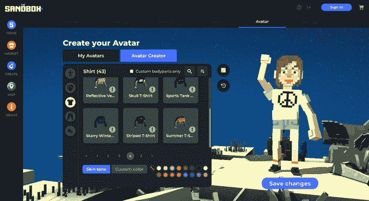
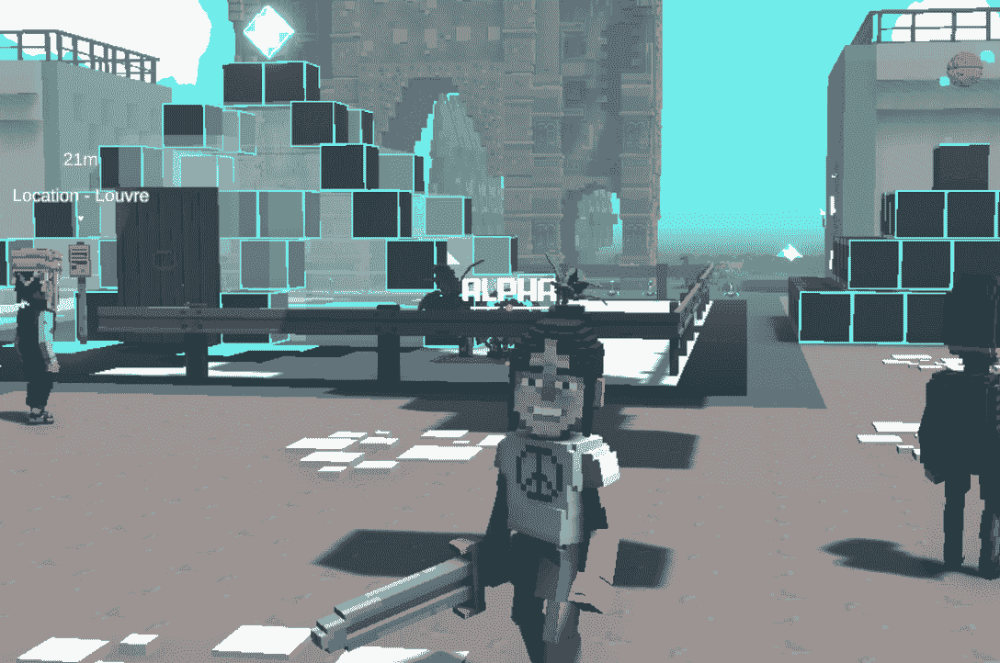
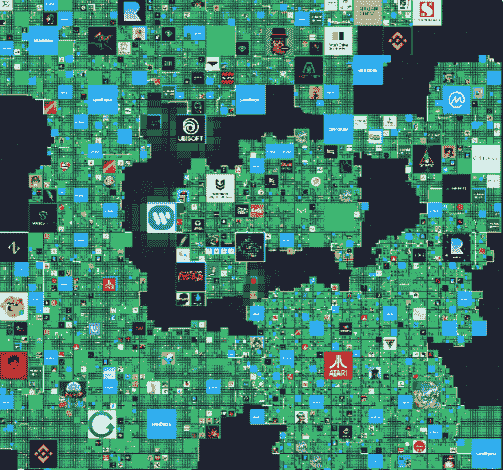
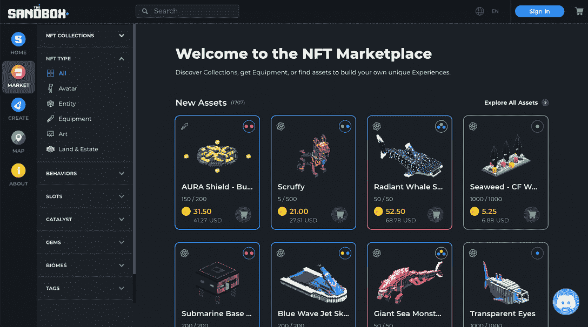

# 什么是沙盒&如何加入元宇宙

> 原文：<https://web.archive.org/web/https://dappradar.com/blog/what-is-the-sandbox-how-to-join-the-metaverse>

## 了解元宇宙最大的虚拟世界之一

元宇宙改变了我们看待游戏的方式，而在这种新一代游戏的最前沿是虚拟世界，即沙盒。

你有没有想过成为元宇宙的一员，通过玩游戏和建立游戏体验来获得经济奖励？有了沙盒，这是可能的。在本文中，我们将探索什么是沙盒，以及开始使用沙盒需要知道的一切。

## 目录

*   [沙盒是什么？](https://web.archive.org/web/20230127045949/https://dappradar.com/blog/what-is-the-sandbox-how-to-join-the-metaverse/#What-is-The-Sandbox?)
    *   什么是元宇宙？
    *   什么是区块链？
    *   这个游戏是如何运作的？
    *   [沙盒游戏经济是如何运作的？](https://web.archive.org/web/20230127045949/https://dappradar.com/blog/what-is-the-sandbox-how-to-join-the-metaverse/#How-does-the-Sandbox-game-economy-work?)
    *   [了解沙盒令牌](https://web.archive.org/web/20230127045949/https://dappradar.com/blog/what-is-the-sandbox-how-to-join-the-metaverse/#Get-to-know-the-Sandbox-tokens)
*   [沙盒怎么玩？](https://web.archive.org/web/20230127045949/https://dappradar.com/blog/what-is-the-sandbox-how-to-join-the-metaverse/#How-to-play-The-Sandbox?)
    *   [创建你的头像](https://web.archive.org/web/20230127045949/https://dappradar.com/blog/what-is-the-sandbox-how-to-join-the-metaverse/#Create-your-Avatar)
    *   [连接您的钱包登录](https://web.archive.org/web/20230127045949/https://dappradar.com/blog/what-is-the-sandbox-how-to-join-the-metaverse/#Connect-your-wallet-to-sign-in)
    *   [下载游戏制作工具并开始探索](https://web.archive.org/web/20230127045949/https://dappradar.com/blog/what-is-the-sandbox-how-to-join-the-metaverse/#Download-the-Game-Maker-and-start-exploring)
    *   沙盒是什么样子的？
    *   [你能在沙盒里找到什么体验？](https://web.archive.org/web/20230127045949/https://dappradar.com/blog/what-is-the-sandbox-how-to-join-the-metaverse/#What-experiences-can-you-find-in-The-Sandbox?)
    *   [你是如何爬上游戏排行榜的？](https://web.archive.org/web/20230127045949/https://dappradar.com/blog/what-is-the-sandbox-how-to-join-the-metaverse/#How-do-you-climb-up-the-game-leaderboard?)
    *   游戏玩家如何在沙盒中创造资产？
*   我可以免费玩沙盒吗？
*   [如何在沙盒中购买资产和土地？](https://web.archive.org/web/20230127045949/https://dappradar.com/blog/what-is-the-sandbox-how-to-join-the-metaverse/#How-to-buy-assets-and-land-in-The-Sandbox?)
*   沙盒和《我的世界》有什么不同？
*   [沙盒值得玩吗？](https://web.archive.org/web/20230127045949/https://dappradar.com/blog/what-is-the-sandbox-how-to-join-the-metaverse/#Is-The-Sandbox-worth-playing?)
*   有哪些沙盒元宇宙可供选择？
*   [沙盒 Alpha 的下一步是什么](https://web.archive.org/web/20230127045949/https://dappradar.com/blog/what-is-the-sandbox-how-to-join-the-metaverse/#What's-next-in-The-Sandbox-Alpha)
*   [用 DappRadar 继续跟踪沙盒](https://web.archive.org/web/20230127045949/https://dappradar.com/blog/what-is-the-sandbox-how-to-join-the-metaverse/#Keep-tracking-The-Sandbox-with-DappRadar)

## 沙盒是什么？

[沙盒](https://web.archive.org/web/20230127045949/https://dappradar.com/ethereum/games/the-sandbox)是一个由多边形区块链驱动的虚拟世界，在这里你可以创建、实验和玩 3D 体素资产。这款游戏允许完全的资产所有权，并通过其整合的市场实现货币化。

[https://web.archive.org/web/20230127045949if_/https://www.youtube.com/embed/ppQjD0R6piI?feature=oembed](https://web.archive.org/web/20230127045949if_/https://www.youtube.com/embed/ppQjD0R6piI?feature=oembed)

此外，沙盒也有自己的加密货币，称为 [SAND](https://web.archive.org/web/20230127045949/https://dappradar.com/hub/token/eth/SAND) ，社区可以使用它来购买平台内的资产、土地和游戏。

[Discover The Sandbox](https://web.archive.org/web/20230127045949/https://dappradar.com/multichain/games/the-sandbox)

但是在我们继续之前，这里有几个你可能想要答案的问题。

### 什么是元宇宙？

元宇宙是一个共享的虚拟空间，人们可以在这里相互交流，创造体验。元宇宙是互联网发展的下一个自然步骤，用户将拥有自己的虚拟形象，并能够自由移动。

[https://web.archive.org/web/20230127045949if_/https://www.youtube.com/embed/G1r8q0tq1_0?feature=oembed](https://web.archive.org/web/20230127045949if_/https://www.youtube.com/embed/G1r8q0tq1_0?feature=oembed)

### 什么是区块链？

区块链是一个记录所有加密货币交易的数字账本。它是一个分散在计算机网络中的数据库。区块链是安全的，因为它们使用加密技术来验证每笔交易。

## 游戏是如何运作的？

沙盒游戏基于体素，体素是构成游戏中的环境和资产的 3D 立方体。这有点类似于《我的世界》。

玩家可以使用沙盒的 VoxEdit 工具创建自己的资产，或者从游戏内市场购买资产。

一旦你有了你的资产，你就可以用它们在沙盒游戏制作程序中创建游戏和体验。游戏制作工具也是免费的。

这些游戏可以被其他玩家玩，如果它们很受欢迎，你可以从它们那里赚取沙币。很酷吧。

[https://web.archive.org/web/20230127045949if_/https://www.youtube.com/embed/azQ_VOSSH5E?feature=oembed](https://web.archive.org/web/20230127045949if_/https://www.youtube.com/embed/azQ_VOSSH5E?feature=oembed)

## 沙盒游戏经济是如何运作的？

玩赚游戏往往被传统游戏玩家低估，但沙盒游戏经济实际上相当复杂。游戏中的资产具有真正的价值，因为它们可以在市场上出售或交易。此外，玩家可以从他们创造的游戏中获得收入。

### 了解沙盒令牌

游戏内货币名为 [SAND(一种 ERC-20 代币)](https://web.archive.org/web/20230127045949/https://dappradar.com/blog/explained-the-sandbox-sand-token)，用于购买平台内的资产和土地。

[Check SAND price](https://web.archive.org/web/20230127045949/https://dappradar.com/hub/token/eth/SAND?from=0x3845badade8e6dff049820680d1f14bd3903a5d0)

它是游戏的主要效用令牌，你可以通过玩游戏、参加社区或出售资产来获得。

观看下面的视频，了解完整的解释:

[https://web.archive.org/web/20230127045949if_/https://www.youtube.com/embed/6gkPOOUs-UY?feature=oembed](https://web.archive.org/web/20230127045949if_/https://www.youtube.com/embed/6gkPOOUs-UY?feature=oembed)

此外，沙盒元宇宙中还有不可替换的令牌:

*   土地(ERC-721 令牌):代表这个元宇宙的每一块土地；
*   游戏(ERC-1155 令牌):代表独特的用户生成的体验；
*   资产(ERC-1155 令牌):代表游戏中使用的用户生成的资产。

每个代币在游戏经济中都扮演着重要的角色，它们都可以用来提高你的游戏性。

## 沙盒怎么玩？

如果你对玩沙盒感兴趣，你需要做的第一件事就是访问他们的官方网站。您还需要知道沙盒仍处于早期开发阶段。

对于阿尔法第三季，任何人都可以玩 10 周，但收入机制只适用于那些持有特定 NFT 的人。

*   通过我们最新的游戏回顾，了解更多关于如何玩沙盒游戏第三季的信息。

### 创建你的头像

你可以从创建你的虚拟角色开始，让它看起来就像你——或者你想在这个虚拟世界中看到的任何版本。

You can create your Avatar for free or buy assets for them.

沙盒还允许你购买衣服和配饰等资产，让你的角色看起来像你想要的样子。

如果你想更进一步，你可以得到名人头像并扮演他们！史蒂夫·青木和 T2【史努比狗狗是一些加入元宇宙沙盒的名人。

沙盒中化身的另一个很酷的事情是，你也可以在游戏之外使用你的 NFTs。例如，持有一个[女性世界的 NFT](https://web.archive.org/web/20230127045949/https://dappradar.com/hub/nft-explorer/collection/world-of-women-nft) 或梅塔克罗·NFT 角色将允许你在沙盒中使用它，只需在你的钱包中持有该特定资产。

### 连接你的钱包以登录

然后，您就可以将您的 web3 钱包连接到游戏了。如果你不习惯玩区块链游戏，这时候你可能会有点困惑。但这是一个非常简单的过程，你可以观看我们的视频[什么是 web3 钱包](https://web.archive.org/web/20230127045949/https://docs.google.com/document/d/1wYQCp34GmRnrl8pYaxsHS8YogxEQXtCDOn-D2bAW1cs/edit?usp=sharing)来获得一些关于它们的见解。

沙盒连接到不同的钱包服务，你可以在 MetaMask、Bitski、WalletConnect 和比特币基地钱包之间进行选择。

### 下载游戏制作工具并开始探索

一旦你全部登录，你的头像准备好了，你就可以开始玩沙盒了。下一步是[下载游戏制造商](https://web.archive.org/web/20230127045949/https://www.sandbox.game/en/create/game-maker/)的应用程序，所有的神奇都在这里发生。

这款游戏在 Windows 和 macOS 的桌面上都有，而且非常简单易懂。

一旦你完成了游戏的安装，你就可以创造你自己的世界或者在别人的作品上玩。在这里，天空是无限的。沙盒里有成千上万个不同的虚拟世界，有不同的玩法，在这里你可以和你的朋友互动。

Taking my Avatar to The Sandbox’s Louvre Museum.

如果你觉得有创意，想尝试一些新的东西，你也可以从头开始创造你的世界，或者使用其中一个模板。但要做到这一点，你需要拥有土地。

### 沙盒是什么样子的？

游戏地图现在扩展到 15，000 虚拟平方公里，使其成为现存最大的元宇宙房地产。

它由小方块、大方块和巨大方块(总共 166，464 块土地)组成，每个方块都可供玩家玩、购买或出租。这些方块中的每一个都被称为陆地。

你会认出非常熟悉的标识，它们属于各自的土地。那里的每个品牌都在打造自己的体验、使命、福利和表演。

玩家可以根据亲和力决定从哪一个开始，或者简单地进入众多入口中的一个，加入一个“独立”的体验。

### 你能在沙盒里找到哪些体验？

不同的土地也带来了不同的经历。在我们的游戏过程中，每隔 45 分钟左右，我们会玩不同的谜题和任务(寻找、杀死、解决、拜访)。多样性使游戏引人入胜，尽管不是每个人都喜欢清晰而像素化的图形。

此外，鉴于许多经验和任务可能不是由专业游戏开发商完成的，预计其中一些会比预期的更难，或者没有完全设计好。

### 你是如何爬上游戏排行榜的？

你在每个区域完成任务的次数越多，速度越快，你在游戏排行榜上的位置就越高，游戏排行榜奖励表现最好的玩家[$ SAD](https://web.archive.org/web/20230127045949/https://dappradar.com/hub/token/eth/SAND?from=0x3845badade8e6dff049820680d1f14bd3903a5d0)(游戏货币)，用来购买游戏资产，定制你的头像或者玩特殊体验。

记住每个区域的任务都必须在一次游戏中完成。否则，你必须重新启动它们，同时你可以重新播放它们以在排行榜上排名(在帐户验证后)。

此外，我们在沙盒上尝试的所有任务都是免费的，但个人创作者可以放置一个“付费墙”，以便能够在他们的土地上玩。

### 游戏玩家如何在沙盒中创建资产？

沙盒是最先进的开放元宇宙，支持创造者经济并分散其收入。基于体素的图形和工具允许无代码的构建体验，即使是初学者也能做出贡献并将其成果货币化。

有三个主要的工具来创建、销售和货币化游戏资产和体验:

#### **附庸风雅**

一个免费使用的 3D 建模和动画程序，旨在为沙盒创建基于体素的资产。

#### **Th** e 游戏制作人

一个简单易用的工具，允许你在沙盒的元宇宙中设计、测试和分享游戏等体验。

游戏制造商是一个界面和基金，奖励那些证明了游戏设计/数字世界设计技能的人，帮助他们制作和发布优秀的游戏和体验，供沙盒的玩家玩。

#### 市场

在这里，您可以将在 VoxEdit 中创建的体素资产货币化，并购买土地。它允许交易玩家拥有或创造的资产，这些资产在不同的游戏和不同的平台之间是可互操作的(例如，你可以通过 Snoop Dog、BAYC、Moonbirds 和许多其他平台购买头像)。

## 我可以免费玩沙盒吗？

**是**、**你可以免费体验沙盒，用一个免费的头像探索别人的创作。**

然而，如果你想创造自己的经历，你需要购买土地。虽然你也可以免费制造资产，但你需要一些宝石(可购买的代币)来铸造它们。因此，所有关于从玩到赚方面的事情都需要预先投资。

如果你只是想玩玩，你可以免费享受沙盒。盈利机制的具体运作方式仍有待确定。但是，从 Alpha 测试赛季来看，某些 NFT 可能会提高玩家的收入潜力。

## 如何在沙盒中购买资产和土地？

你可以在沙盒官方市场上找到这些 NFT 出售，但也可以在像 [OpenSea](https://web.archive.org/web/20230127045949/https://opensea.io/assets/sandbox?search[sortAscending]=true&search[sortBy]=PRICE&[%E2%80%A6]rch[stringTraits][0][values][0]=Land&search[toggles][0]=BUY_NOW) 这样的分散交易中找到。

沙盒元宇宙由 166，446 块土地组成，你可以做任何你想做的事情。你可以建立你自己的游戏，一个社交聚会点，一个私人宅邸，或者创造一个让其他玩家享受的体验。

但是在你选择购买任何土地之前，考虑一下在地图上查看它的位置。例如，你可能会成为[史努比·道格的邻居](https://web.archive.org/web/20230127045949/https://dappradar.com/blog/snoop-dogg-moves-into-the-sandbox)。

在我们的报道中，使用[达普拉达 NFT 收藏探索者](https://web.archive.org/web/20230127045949/https://dappradar.com/hub/nft-explorer)和 f [i](https://web.archive.org/web/20230127045949/https://dappradar.com/blog/the-sandbox-land-valuation-report) 找出[如何评估沙盒土地](https://web.archive.org/web/20230127045949/https://dappradar.com/blog/the-sandbox-land-valuation-report)来追踪它们的价格。

## 沙盒和《我的世界》有什么区别？

沙盒和《我的世界》都依赖于用户生成的内容，但只有其中一个可以奖励玩家和创作者的贡献。由于 NFTs 和加密硬币的实现，沙盒已经吸引了在线社区、公司和大品牌。

更重要的是，在沙盒中，玩家可以从他们创造的经历中获得收入，而在《我的世界》却不能。

诚然，沙盒的灵感来自《我的世界》和 Roblox 等游戏，但它通过奖励参与者，将用户生成内容的概念提升到了一个全新的水平。

## 沙盒值得玩吗？

如果你对用户生成的内容感兴趣，并从你的创作中获得收入，那么沙盒可能值得一试。

然而，决定是否玩一个游戏是个人的选择，所以你是唯一一个能知道对你来说是否值得的人。

## 沙盒元宇宙的替代品是什么？

除了沙盒之外，还有一些其他有趣的[元宇宙虚拟世界和陆地 NFT](https://web.archive.org/web/20230127045949/https://dappradar.com/blog/top-10-best-metaverse-virtual-worlds-with-land-nfts)，比如:

*   [高地](https://web.archive.org/web/20230127045949/https://dappradar.com/eos/games/upland)；
*   [分散式国家](https://web.archive.org/web/20230127045949/https://dappradar.com/ethereum/games/decentraland)
*   [索姆空间](https://web.archive.org/web/20230127045949/https://dappradar.com/ethereum/games/somnium-space)；
*   环球韦布。

一些公司比其他公司提供更多的功能，并且在他们的路线图上也更先进。值得记住的是，这种类型的游戏属于一个变革性的时代，这个时代的事物变化很快。

因此，如果你有兴趣加入元宇宙并在 web3 中玩游戏，请准备好接受对你所知的游戏的质疑。这是一个有趣的旅程！

## 沙盒中的下一个是什么阿尔法

为了促进元宇宙的创作和游戏性，沙盒创建了名为 Alpha 的公共事件。第一个阿尔法赛季于 2021 年 12 月举行，第二个阿尔法赛季于 2022 年 3 月在 T2 举行，第三个也是最大的一个将于今年夏天举行。

《阿尔法狼》第三季仍然忠实于它的预告片，为它的社区带来了大量新内容和新的盈利机制。

[https://web.archive.org/web/20230127045949if_/https://www.youtube.com/embed/w2p4kvjuviQ?feature=oembed](https://web.archive.org/web/20230127045949if_/https://www.youtube.com/embed/w2p4kvjuviQ?feature=oembed)

Alpha Season 3 是一个为期 10 周的活动，对所有人开放，由玩家、品牌和工作室创造了 90 多种游戏体验。

要加入，你必须[免费注册](https://web.archive.org/web/20230127045949/https://www.sandbox.game/en/)并升级以赢得 10，000 张阿尔法通行证中的一张——有机会赢得高达 500 张的沙石并达到 5 级，持有土地、头像或 NFT 的玩家将获得额外奖励。

随着更多的细节将很快公布，你最好关注该项目的官方推特。

## 随身携带您的 Web3 之旅

使用 DappRadar 移动应用程序，再也不会错过 Web3。查看最受欢迎的 dapps 的性能，并关注您投资组合中的 NFT。您在 DappRadar 上的帐户会与我们的移动应用程序同步，这样您很快就可以选择实时接收提醒。

[Download the DappRadar app now](https://web.archive.org/web/20230127045949/https://dappradar.app.link/blog)[<picture></picture>](https://web.archive.org/web/20230127045949/https://play.google.com/store/apps/details?id=com.portfolio.dappradar)

## 继续用 DappRadar 跟踪沙盒

作为游戏玩家，我们发现沙盒 Alpha 不仅是一个吸引人的、多样的、不断发展的元宇宙体验，更是一个内容消费者和创作者的平台，我们可以在其中扮演积极的角色。

我们发现有相当数量的知名品牌和游戏玩家相信这个项目并一直支持它。无论你是在寻找下一个有价值的区块链游戏还是一个好机会，都值得在沙盒上保持更新。

通过 [NFT 浏览器](https://web.archive.org/web/20230127045949/https://dappradar.com/hub/nft-explorer)，你可以看到所有最新的销售情况，而沙盒 dapp 页面会给你额外的信息。

DappRadar 将继续沿着元宇宙的道路前进，为您带来最好的数据和内容。然后一定要关注我们的[博客](https://web.archive.org/web/20230127045949/https://dappradar.com/blog/)和[推特](https://web.archive.org/web/20230127045949/https://twitter.com/dappradar)，并加入我们的[不和谐](https://web.archive.org/web/20230127045949/https://discord.gg/4ybbssrHkm)服务器。

***以上不构成投资建议。此处给出的信息仅供参考。请尽职调查并自行研究。***

[<picture></picture>](https://web.archive.org/web/20230127045949/https://dappradar.com/ethereum/games/the-sandbox)[<picture></picture>](https://web.archive.org/web/20230127045949/https://dappradar.com/hub/token/eth?to=0x3845badade8e6dff049820680d1f14bd3903a5d0)[<picture></picture>](https://web.archive.org/web/20230127045949/https://dappradar.com/blog/the-sandbox-land-valuation-report) NewsletterUnsubscribe at any time. [T&Cs](https://web.archive.org/web/20230127045949/https://dappradar.com/terms) and [Privacy Policy](https://web.archive.org/web/20230127045949/https://dappradar.com/privacy-policy)