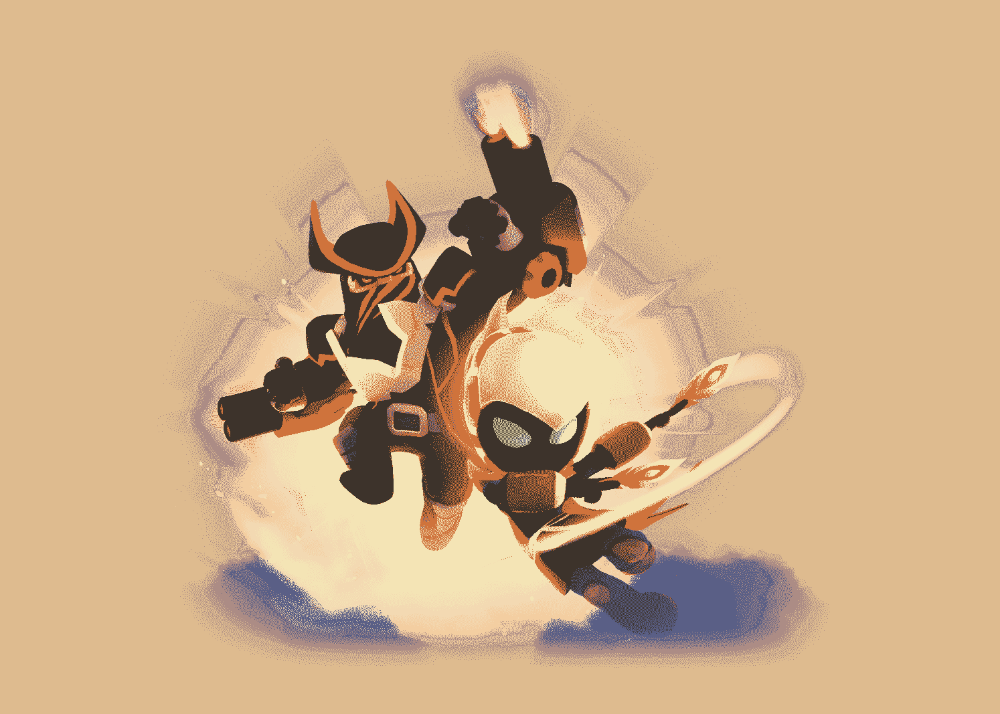

# 什么是 Thetan 竞技场，如何玩和赚取

> 原文：<https://web.archive.org/web/https://dappradar.com/blog/what-is-thetan-arena-and-how-to-play-and-earn>

## 一款赢得数百万人芳心的游戏

《Thetan Arena》于 2021 年 11 月正式发布，已经俘获了全球数百万玩家的心。由于游戏典型的上瘾机制和奖励玩家参与的高度激励前提，游戏赚钱现象席卷了世界。

这篇文章着眼于 Thetan 竞技场，并探索它带来了什么样的游戏赚钱机制。请继续阅读，了解你需要了解的关于风靡全球的游戏竞技场的一切。

## 什么是 Thetan 竞技场

由游戏开发工作室 WolfFun 创建的 [Thetan Arena](https://web.archive.org/web/20221206101103/https://dappradar.com/binance-smart-chain/games/thetan-arena) 是一款基于区块链的多人在线竞技场游戏，可在 PC、Android 和 iOS 设备上运行。Thetan Arena 也是一款玩赚游戏，玩家只需与平台互动就能获得奖励。Thetan Arena 是 WolfFun 的第二款热门游戏。工作室最初发布了英雄打击，许多注册了它的玩家也蜂拥而至，想看看 Thetan Arena 能提供什么。

Thetan 竞技场中使用的 NFT 赋予玩家对游戏角色和其他物品的所有权，例如皮肤和武器。这款游戏也可以在没有 NFT 方面的情况下免费玩，尽管通过这种方式盈利需要相当多的技巧。

有趣的是，这是迄今为止唯一一款被购买的 NFT 角色拥有有限生命周期的游戏。换句话说，在有限的比赛中，每个 NFT 物品都可以获得游戏内货币。达到这个数字后，玩家将不再获得奖励，并购买一个新的 NFT 角色。

## 怎么玩

由于游戏注重玩家的技能和团队合作，Thetan Arena 提供了几种游戏模式，包括:

*   死亡竞赛:在死亡竞赛决赛中，游戏玩家四人一组，与其他组对抗。获胜的队伍是杀死最多猎物的队伍。

*   **超级明星:**这种快节奏的模式需要防守你的队伍，在对手之前捕捉超级明星，并收集积分。

*   受传统 MOBA 游戏的启发,《摧毁之塔》让你和你的团队冲向敌人的基地，在他们对你做同样的事情之前摧毁他们的关系网。

*   皇家战役(单人/双人):这种模式需要 42 名玩家或 21 名双人玩家之间的大规模战斗，所以你要么是最后一名玩家，要么在你的伙伴的帮助下生存。

当你第一次加入生态系统时，你会收到一个名为雷电的免费英雄，从 1 级开始。在比赛中，英雄可以升级，他们的属性会增加。有三种类型的英雄-坦克，射手和刺客。英雄也有不同的稀有程度:普通，史诗和传奇。他们的皮肤也有不同的稀有等级，包括默认、稀有和神话。玩家可以在游戏内的[市场](https://web.archive.org/web/20221206101103/https://marketplace.thetanarena.com/?batPercentMin=60&page=1&sort=PPB)上购买一些 NFT，或者通过玩竞技场来获得它们，然后出售它们来获利。

[https://web.archive.org/web/20221206101103if_/https://www.youtube.com/embed/nFFI671jKlI?feature=oembed](https://web.archive.org/web/20221206101103if_/https://www.youtube.com/embed/nFFI671jKlI?feature=oembed)

## 赚取 THC 和 THG 代币

Thetan 竞技场使用两种不同的代币，玩家可以获得 THC 和 THG 代币。主要的游戏内货币是 **Thetan Coin (THC)** ，用户通过玩游戏模式和参与各种其他活动来聚集这些货币。一旦玩家赢得这些 THC 代币，他们就可以将它们放入自己的钱包。玩家有三种方式赚取 THC:

*   **战斗:**在 THC 中获得战斗奖励，取决于英雄稀有度和战利品等级。

*   **任务:**玩家积累完成任务获得的足够任务点数后，可以兑换 THC。

*   **排名奖励:**玩家在排名上升时获得 THC。

THC 可以用来购买 NFTs 或者 Thetan 盒子——整个 Thetan 竞技场系统英雄角色的来源。这个代币也计划在玩家发布游戏流时作为奖励。

除了 THC 之外，游戏还有一个名为 **Thetan Gem (THG)** 的二级代币。这是一个工具和治理令牌，以分散的方式充当参与者之间的交换媒介。它的目标是为玩家之间提供一种便捷安全的支付和结算方式。它不是为了公共目的的交换媒介。

THG 可以通过三种方式获得:

*   特别活动:由 Thetan Arena 组织，玩家可以在其中获得 THG 和 NFT。

*   **锦标赛:**一旦锦标赛开始，玩家就可以参加比赛并赢得 THG。

*   在 Thetan Arena Marketplace 上进行交易也可以让用户获得 THG。

一旦他们获得了 THG 奖励，玩家可以用它们来进化他们的西坦英雄。THG 还允许持有人创建和投票链上治理提案的未来特征和参数的 Thetan 舞台。

尽管最初取得了成功，但随着时间的推移，THC 和 THG 的价值都有所下降，在撰写本文时，THC 和 THG 的价格都徘徊在 0.074 美元和 4.86 美元左右。尽管如此，作为游戏代币，随着更多玩家加入 Thetan Arena 社区，两者都有升值的潜力。

## 只有天空才是极限？

Thetan Arena 于 2021 年 11 月 27 日正式上线，仅第一周就积累了超过 300 万注册用户。对于未来，开发者团队已经宣布了引入英雄赌注、化妆品、公会任务、合作模式、宠物、租赁系统和许多其他功能的计划。看起来西坦竞技场的经济才刚刚开始。

随着“游戏赚钱”运动继续保持上升势头，更多的玩家将涌向区块链的游戏。尤其是为了有机会在玩的时候赚取被动收入。DappRadar 很高兴成为这个行业的一部分，并将继续关注区块链的游戏空间。要了解关于 Thetan Arena 和其他玩赚游戏的最新消息，请在 [Twitter](https://web.archive.org/web/20221206101103/https://twitter.com/dappradar) 上关注 DappRadar。或者，加入 [DappRadar PRO](https://web.archive.org/web/20221206101103/https://dappradar.com/token/pro) 进行独家 [Discord](https://web.archive.org/web/20221206101103/https://discord.gg/4ybbssrHkm) 聊天。

 NewsletterUnsubscribe at any time. [T&Cs](https://web.archive.org/web/20221206101103/https://dappradar.com/terms) and [Privacy Policy](https://web.archive.org/web/20221206101103/https://dappradar.com/privacy-policy)