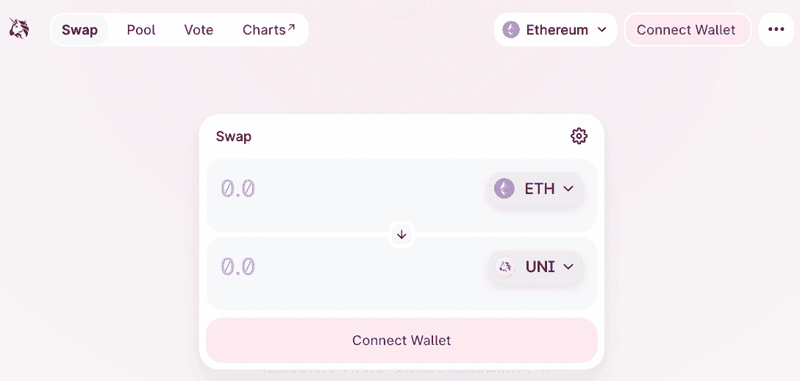
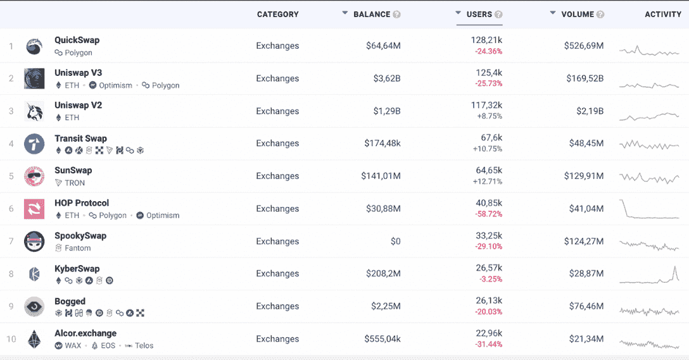
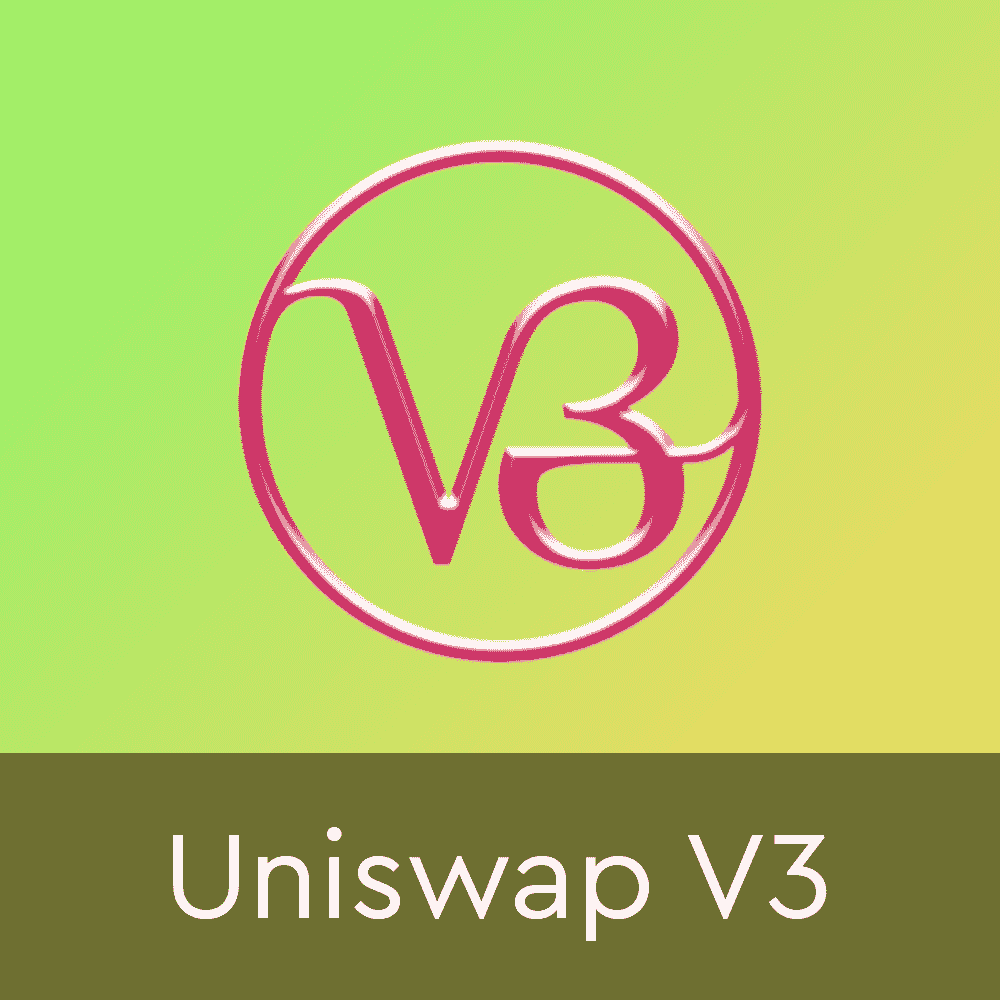
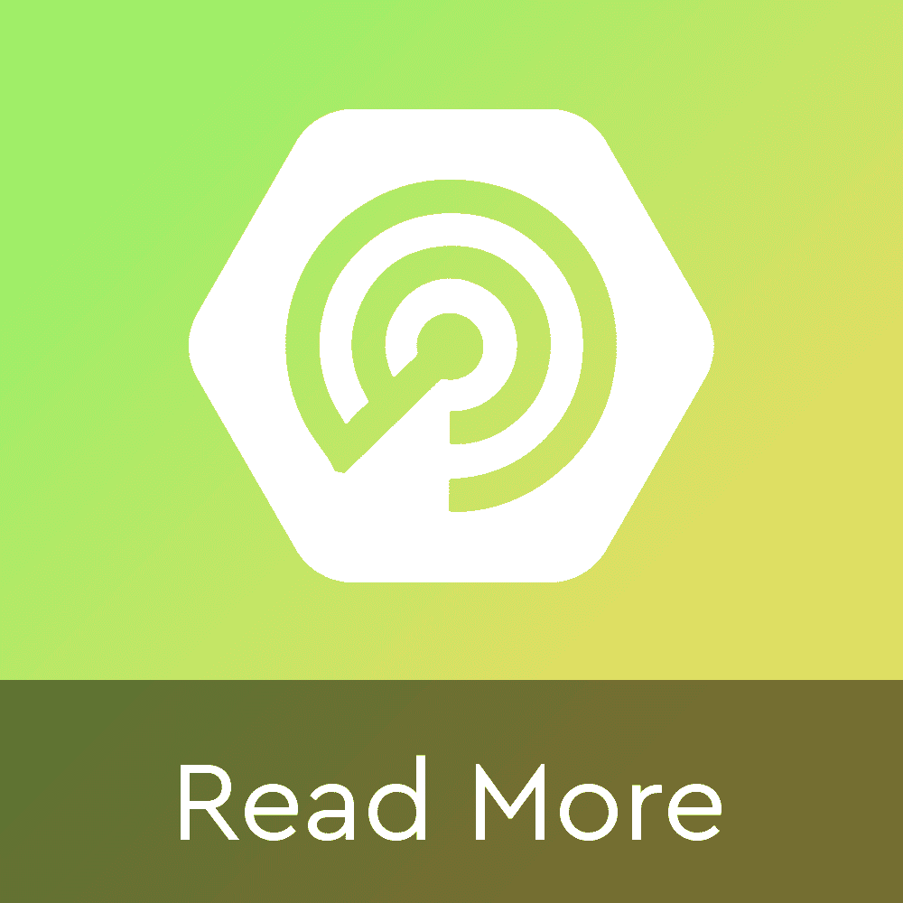

# 什么是 Uniswap 以及如何使用它

> 原文：<https://web.archive.org/web/https://dappradar.com/blog/what-is-uniswap-and-how-to-use-it>

## 一个完整的和最新的指南 DeFi 巨人

通过深入 DeFi 和各种交易所的世界，Uniswap 占据了突出的位置。它不仅是该地区最大的项目之一，也是分散自治组织的一个例子。**什么是 Uniswap？**怎么用？哪个 Uniswap 版本最好，它将如何将 NFTs 整合到生态系统中？这正是本文所要探讨的。因此，请继续阅读，并准备好了解有关 Uniswap 的一切。

## 什么是 Uniswap？

Uniswap 是建立在以太坊区块链上的一种协议，它采用点对点系统，允许您交易加密货币。

它不仅是以太坊上第一个也是最常用的分散式交易所 (DEX ),锁定的总价值(TVL)超过 47.7 亿美元。

Uniswap 由运行在以太坊区块链上的[智能合约](https://web.archive.org/web/20221208153744/https://dappradar.com/blog/what-is-a-smart-contract)提供支持。由于这项技术，每一笔交易都是完全安全、透明和不可改变的。最重要的是，Uniswap 的代码是开源的，因此任何人都可以检查它并为其开发做出贡献。

## Uniswap 是如何工作的？

为了理解 Uniswap 交换协议是如何工作的，我们需要看看它是如何创造流动性的。在传统的集中交易中，当你想购买或出售一项资产时，交易所会在交易的另一方找到人来匹配你的订单。这个交易可能需要几秒或几天，或者根本不会发生。

在 Uniswap 上，没有订单簿。相反，该协议使用所谓的**自动做市商(AMM)** 来提供流动性，并作为所有交易的对手方。AMM 是一种智能合约，持有一个资产池，用户可以在不需要第三方的情况下进行交易。

不过，需要注意的是，Uniswap DEX 一直在不断发展。直到 2022 年，该协议已经推出了带有关键更新的 **3 个版本**。它们中的每一个都改变了整个行业与 DeFi 交易的互动方式，并将永远继续下去——只要以太坊存在。请继续阅读，了解每个 Uniswap 版本的更多信息。

### Uniswap v1

2018 年推出的 [Uniswap v1](https://web.archive.org/web/20221208153744/https://dappradar.com/ethereum/exchanges/uniswap-v1) 是以太坊上第一个去中心化的交易所。用户第一次可以在不需要第三方的情况下相互交易 ETH 和 ERC20 令牌。

尽管 Uniswap v1 不再是最常用的版本，但它却是 DeFi 行业的游戏规则改变者。它证明分散交流是可能的，并为 Uniswap 的发展奠定了基础。

### Uniswap v2

在对原始交易所的彻底重新设计中， [Uniswap v2](https://web.archive.org/web/20221208153744/https://dappradar.com/ethereum/exchanges/uniswap-v2) 于 2020 年推出。它在许多方面改进了协议，比如增加了对多种资产、快速贷款和赌注的支持。

#### Uniswap v2 上的流动性池

[流动性池是 v2 中的关键变化之一](/web/20221208153744/https://dappradar.com/blog/the-best-yield-farming-pools-and-apy-providers/)。虽然听起来可能很复杂，但一个[流动性池](https://web.archive.org/web/20221208153744/https://dappradar.com/blog/what-is-liquidity-pool-and-liquidity-provider)只是用户放入 Uniswap 智能合约的一些代币，使其能够工作。

例如，如果您想用一些以太网交换一些 MKR，那么需要有人将一些以太网和一些 MKR 锁定到 Uniswap 中才能实现这一点。人们这样做的原因是为了赚取最少的交易费。然后，这些费用在增加流动性的每个人之间分摊，[为那些流动性提供者产生被动收入](https://web.archive.org/web/20221208153744/https://dappradar.com/blog/make-a-passive-income-from-your-cryptocurrency)。

在 Uniswap v1 中，添加流动性的用户必须提供 ETH 和另一个 ERC20 令牌，但在 v2 中，您可以使用两个 ERC20 令牌来提供流动性，不再需要 ETH。这似乎是一个小变化，但提供了更多的灵活性。

#### Uniswap v2 上的快速贷款

其他变化包括能够利用流动性池创造快速贷款。由于 Aave 协议的普及，闪贷意味着用户可以在 Uniswap 中以低廉的价格获得任何 ERC20 代币的高价值，只要他们立即偿还。同样，这看起来很模糊，但在更广泛的 [DeFi 生态系统](https://web.archive.org/web/20221208153744/https://dappradar.com/rankings/category/defi)中实现更大的功能是很重要的。

#### Uniswap v2 上的价格预测

最后，v2 有更好的价格预测，这确保了 Uniswap 中令牌的价格更准确，更难操纵。

还有其他一些小的改进，你可以在 Uniswap 博客上读到。

### Uniswap v3

于 2021 年推出的 [Uniswap v3](https://web.archive.org/web/20221208153744/https://dappradar.com/ethereum/exchanges/uniswap-v3) 是该协议的最新版本，也是目前使用最多的版本。

它建立在 v2 的基础之上，并为该表带来了新的改进，包括:

#### Uniswap v3 的集中流动性

这个版本的一个主要特点是引入了集中流动性，允许流动性提供者(LP)在特定的价格范围内提供资金。因此，用户可以提交订单，这也提高了资金效率。

#### Uniswap v3 上的多个费用层

另一个重要的变化是，现在有限合伙人可以为其流动性池指定不同的费用等级——0.05%、0.30%和 1.00%。这意味着他们可以根据预期的货币对波动性来设定保证金。

#### v3 的不可替代流动性

此外，这个版本的协议是将 DeFi 和[不可替代令牌(NFTs)](https://web.archive.org/web/20221208153744/https://dappradar.com/blog/what-are-non-fungible-tokens-nfts) 结合在一起的先驱。换句话说，你持有的每个流动性池头寸都成为一个 NFT。

乘着 NFTs 的浪潮，Uniswap 于 2022 年 6 月宣布[收购 NFT 市场聚合器 Genie](https://web.archive.org/web/20221208153744/https://dappradar.com/blog/uniswap-nfts-will-change-crypto)——这是整个区块链行业的一个改变游戏规则的举措。

> Uniswap 的世界正在扩大🦄
> 
> — Uniswap Labs 🦄 (@Uniswap) [June 21, 2022](https://web.archive.org/web/20221208153744/https://twitter.com/Uniswap/status/1539306956002820096?ref_src=twsrc%5Etfw)

#### Uniswap v3 在其他网络上启动

在此之前，Uniswap v3 一直是一个完全基于以太坊的交换协议，它的创新之处在于[在 Polygon 网络](https://web.archive.org/web/20221208153744/https://dappradar.com/blog/uniswap-v3-to-launch-on-polygon-after-community-vote)和[乐观网络](https://web.archive.org/web/20221208153744/https://dappradar.com/blog/uniswap-v3-launched-on-optimism-blockchain-scaling-solution)上发布了自己的产品，这是以太坊的第二层解决方案。这些是由 Uniswap 社区做出的决定，将为该协议的未来带来许多好处。

Uniswap v3 仍在开发中，新功能一直在增加。您可以在 [Uniswap 博客](https://web.archive.org/web/20221208153744/https://uniswap.org/blog/uniswap-v3)上了解最新消息。

## Uniswap 的 UNI 令牌

[UNI 令牌](https://web.archive.org/web/20221208153744/https://dappradar.com/ethereum/defi/uni)是 Uniswap 协议的本地令牌。它的创建是为了将协议的管理权力下放，并将权力交还给社区。尽管该协议于 2018 年推出，但 UNI token only [于 2020 年 9 月](https://web.archive.org/web/20221208153744/https://dappradar.com/blog/exchange-protocol-uniswap-launches-uni-governance-token)随 Uniswap v2 一起出现。

根据 [DappRadar Token Explorer](https://web.archive.org/web/20221208153744/https://dappradar.com/hub/tokens/ethereum/all/1) 显示，UNI 的历史最高价在 2021 年 5 月达到**44 美元**，在 2020 年 9 月达到**1.03 美元**的历史最低点。

任何持有 UNI 的人都可以投票或提交自己的提案，并参与协议的[治理](https://web.archive.org/web/20221208153744/https://uniswap.org/governance)。

此外，UNI token 的持有者可以享受交易费折扣。持有的 UNI 越多，折扣就越大。最后，UNI 令牌可以在其他流行的协议(如 Compound)中下注以获得收益。

### 我如何能得到统一令牌？

如果你想得到一些 UNI 代币，有几种方法可以做到。然而，第一步是创建一个类似于 [MetaMask](https://web.archive.org/web/20221208153744/https://dappradar.com/blog/what-is-metamask) 的 web3 钱包。

[https://web.archive.org/web/20221208153744if_/https://www.youtube.com/embed/Odixm1ehnfw?feature=oembed](https://web.archive.org/web/20221208153744if_/https://www.youtube.com/embed/Odixm1ehnfw?feature=oembed)

第一种方式是在交易所用法币(现实世界的货币)或加密货币直接购买 UNI。你可以在 Uniswap 上购买 UNI，或者使用 [DappRadar Token Swap](https://web.archive.org/web/20221208153744/https://dappradar.com/hub/swap) 购买 UNI。

获取 UNI 的第二种方法是为 Uniswap 协议提供流动性。这样做，你将获得一部分交易费作为奖励。最后，你还可以通过[空投](https://web.archive.org/web/20221208153744/https://dappradar.com/blog/explained-cryptocurrency-crypto-airdrops)获得 UNI 代币。

## 我如何开始使用 Uniswap？

一旦你设置好你的 [web3 钱包](https://web.archive.org/web/20221208153744/https://dappradar.com/blog/best-cryptocurrency-wallets-for-2022)，你需要将它连接到 Uniswap。为此，只需访问 Uniswap 网站，点击“连接钱包”按钮。连接后，您可以开始在平台上进行交易，或将资产添加到流动性池中。

无论您选择使用 Uniswap v1、v2 还是 v3，过程都是非常相似的。主要的区别是 v2 和 v3 提供了比原始版本更多的特性——这也解释了为什么它们是最常用的版本。

### 如何在 Uniswap 上兑换代币？

自从首次推出以来， [Uniswap](https://web.archive.org/web/20221208153744/https://app.uniswap.org/) 提供了最简单的交换以太币的方法。

连界面都简单。只需连接您的钱包，然后选择您想要交换哪些代币和多少代币。

如果您想知道，Uniswap 现在默认使用 v3 接口进行所有的互换和流动性操作。不过，如果你还想使用[之前的界面](https://web.archive.org/web/20221208153744/https://app.uniswap.org/#/swap?use=V2&chain=mainnet)，也是可以的。

与大多数分散式交易所提供的图形意大利面相比，Uniswap 迅速成为最受欢迎的[以太坊 dapp](https://web.archive.org/web/20221208153744/https://dappradar.com/rankings/protocol/eth)也就不足为奇了。

### 如何在 Uniswap 上提供流动性？

如果你想赚取一些 UNI 代币或者只是帮助社区，你可以给 Uniswap 增加流动性。提供流动性就像交换代币一样简单。以下是如何在 Uniswap 上提供流动性的分步指南:

1.  转到[uni swap](https://web.archive.org/web/20221208153744/https://app.uniswap.org/#/pool?chain=mainnet)；
2.  使用右上角的按钮连接您的 Web3 钱包；
3.  单击屏幕顶部的“Pool ”;
4.  点击高亮显示的“添加流动性”按钮；
5.  选择您想要提供的两个令牌输入，即 ETH 和，或 DAI 和 SAND。
6.  表明你想提供多少。一个输入的值总是等于第二个输入的值。也就是说，你在瑞士提供了 100 美元，因此在 MKR 也提供了 100 美元。
7.  点击“供应”
    1.  流动性提供商需要支付确认费，以允许 Uniswap 使用 ir 令牌。这是一次性费用。
    2.  提供令牌需要一个事务。基本上是两笔交易。而且这些都附带一定的交易费用。

记住，所有的[DeFi dapp](https://web.archive.org/web/20221208153744/https://dappradar.com/rankings/category/defi)都是实验性的，都有风险。如果出现问题，不要锁定超过你准备损失的价值。

## Uniswap 安全吗？

简单的回答是肯定的。Uniswap 由以太坊上的智能合约提供支持，这使它成为一个非常安全的平台，因为所有的交易都是透明和不可改变的。与其他交易所和 DeFi 平台相比，Uniswap 也不太可能被黑客攻击或审查。

然而，这并不意味着在那里交易是容易的或不受损害的。和其他任何去中心化的加密货币项目一样，你要对自己的安全和资金负责。因此，你不应该交易超过你能承受的损失，并且总是把你的代币存放在一个安全的钱包里。

更不用说，你应该始终[警惕恶意利用 Uniswap 的名义诈骗受害者的骗局](https://web.archive.org/web/20221208153744/https://dappradar.com/blog/how-to-prevent-scammers-from-draining-your-wallet)。例如，在 2022 年，有一个[网络钓鱼骗局，从认为在竞争 UNI airdrops 的人那里拿走了近 800 万美元](https://web.archive.org/web/20221208153744/https://dappradar.com/blog/8m-taken-in-uniswap-phishing-attack)的资产。

*   **阅读更多:** [如何避免在 Crypto 中获得 REKT&DeFi](https://web.archive.org/web/20221208153744/https://dappradar.com/blog/how-to-avoid-getting-rekt-in-crypto-defi)

## Uniswap 的替代方案是什么？

Uniswap forks 如 [SushiSwap](/web/20221208153744/https://dappradar.com/blog/sushiswap-doubles-total-value-locked-in-past-30-days/) 已经在以太坊上崭露头角。与此同时， [PancakeSwap 和 BakerySwap](/web/20221208153744/https://dappradar.com/blog/pancakeswap-closes-in-on-uniswap-with-36-growth/) 等复制粘贴应用已经出现在币安智能连锁上，为用户提供更低的费用和更快的交易。

以太坊燃气费很贵，所以用户看到了使用建立在其他网络上的 DEX 的许多优势，如[索拉纳](https://web.archive.org/web/20221208153744/https://dappradar.com/rankings/protocol/solana)、[多边形](https://web.archive.org/web/20221208153744/https://dappradar.com/rankings/protocol/polygon)和 [BNB 链](https://web.archive.org/web/20221208153744/https://dappradar.com/rankings/protocol/binance-smart-chain)。

然而，Uniswap 仍然是 DeFi 领域最知名的品牌之一，每天有超过 25，000 名交易者，TVL 超过 47 亿美元。

通过 [DappRadar 排名](https://web.archive.org/web/20221208153744/https://dappradar.com/rankings/category/exchanges)了解顶级分散交易所的最新情况。

## 通过 DappRadar 继续了解 Uniswap

对于密码世界中的任何人来说，保持对最大的分散式金融项目的了解是至关重要的。现在你知道 Uniswap 是什么了，它是如何工作的。

如何在你自己的轨迹中使用这些知识取决于你自己，永远保持谨慎和研究。

DappRadar 将继续密切监视 Uniswap 等顶级协议。如果你想进一步了解令人兴奋的去中心化应用世界中的最佳项目，请关注我们的[博客](https://web.archive.org/web/20221208153744/https://dappradar.com/blog/)、 [YouTube](https://web.archive.org/web/20221208153744/https://www.youtube.com/c/DappRadar) 频道和 [Twitter](https://web.archive.org/web/20221208153744/https://twitter.com/dappradar) 。

[<picture></picture>](https://web.archive.org/web/20221208153744/https://dappradar.com/ethereum/defi/uniswap-v3)[<picture></picture>](https://web.archive.org/web/20221208153744/https://dappradar.com/blog/tag/uniswap)[<picture></picture>](https://web.archive.org/web/20221208153744/https://dappradar.com/hub/swap)

***以上不构成投资建议。此处给出的信息仅供参考。请行使尽职调查，做你的研究。***

 NewsletterUnsubscribe at any time. [T&Cs](https://web.archive.org/web/20221208153744/https://dappradar.com/terms) and [Privacy Policy](https://web.archive.org/web/20221208153744/https://dappradar.com/privacy-policy)